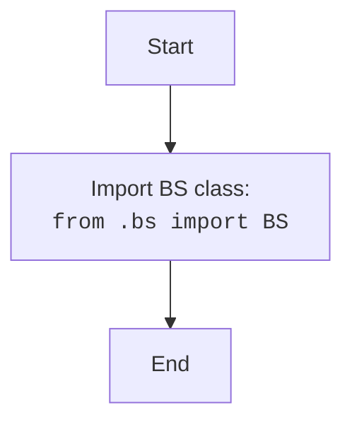

## <algorithm>

### Workflow of the `__init__.py` Module

This `__init__.py` file is a simple module that makes the `BS` class available for import from the `src.webdriver.bs` package.

1.  **Import Statement**:
    *   The module imports the `BS` class from the `src.webdriver.bs.bs` module.
    *   **Example**: `from .bs import BS`
    *   This import statement makes the `BS` class directly accessible when importing the `src.webdriver.bs` package.

## <mermaid>

### Dependencies Analysis:

1.  **`BS Class`**: Represents the class imported from the `bs.py` module.

## <explanation>

### Detailed Explanation

**Imports:**

*   **`from .bs import BS`**: Imports the `BS` class from the `bs.py` module in the same directory. This makes the `BS` class directly accessible when importing the `src.webdriver.bs` package.

**Classes:**

*   This module does not define any new classes.

**Functions:**

*   This module does not define any new functions.

**Variables:**

*   This module does not define any variables.

**Potential Errors and Areas for Improvement:**

*   **No Functionality**: The module is very basic and only imports a class from another module. There is no functionality in the module itself, so there are no errors or improvements.

**Relationship Chain with Other Parts of Project:**

*   This module is a part of the `src.webdriver.bs` package.
*   It exports the `BS` class, making it available to other parts of the project that use the `src.webdriver.bs` package.

This detailed analysis provides a comprehensive understanding of the `__init__.py` module, which acts as an entry point for the `src.webdriver.bs` package.