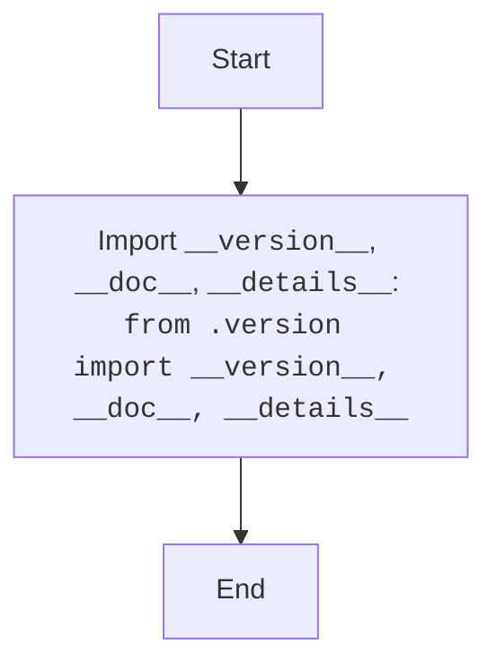

## <algorithm>

### Workflow of the `__init__.py` Module

This `__init__.py` file serves as the entry point for the `src.webdriver.chrome.extentions` package, making specific variables from `version.py` available.

1.  **Import Statement**:
    *   The module imports variables `__version__`, `__doc__`, and `__details__` from the `src.webdriver.chrome.extentions.version` module.
    *    **Example**: `from .version import __version__, __doc__, __details__`
    *   This makes those variables accessible when importing the `src.webdriver.chrome.extentions` package.

## <mermaid>

### Dependencies Analysis:

1.  **`version.py`**:  Represents the module from which `__version__`, `__doc__`, and `__details__` variables are imported.

## <explanation>

### Detailed Explanation

**Imports:**

*   **`from .version import __version__, __doc__, __details__`**: Imports specific variables (`__version__`, `__doc__`, and `__details__`) from the `version.py` module located in the same directory.

**Classes:**

*   This module does not define any classes.

**Functions:**

*   This module does not define any functions.

**Variables:**

*   This module does not define any variables.

**Potential Errors and Areas for Improvement:**

*   **No Functionality**: The module is very basic and only imports variables from another module. There is no functionality in the module itself.
*   **Redundant Docstrings**: There are many redundant docstrings in the code, they should be removed or properly used as module docstring using `""" ... """` syntax.

**Relationship Chain with Other Parts of Project:**

*   This module is a part of the `src.webdriver.chrome.extentions` package.
*   It exposes the `__version__`, `__doc__`, and `__details__` variables from the `version.py` module.

This detailed explanation provides a comprehensive understanding of the `__init__.py` module and its function within the `src.webdriver.chrome.extentions` package.