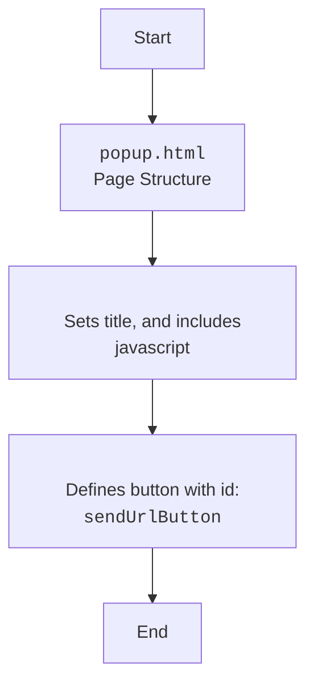

## <algorithm>

### Workflow of the `popup.html` File

This HTML file defines a simple popup for a Chrome extension. It includes a button that, when clicked, triggers an action via JavaScript.

1.  **HTML Structure**:
    *   The file starts with the `<!DOCTYPE html>` declaration, which specifies the HTML5 document type.
    *   It contains an `<html>` tag, which is the root element of an HTML page.
    *   Inside the `<html>` tag there is `<head>` tag that defines the head section of the HTML document:
        *  The `<head>` contains a `<title>` tag which sets title of the page to `URL Sender`.
        *   It includes the JavaScript file `popup.js` using the ``.
    *   The `<body>` tag contains the visible content of the page:
         *  It has a button element (`<button>`) with the `id` set to `"sendUrlButton"` and a text label of "Send URL".

2.  **JavaScript Interaction**:
    * The button click will trigger javascript from `popup.js` which is not included here.

## <mermaid>

### Dependencies Analysis:

This HTML file has one dependency on javascript file `popup.js`, which handles all interactions with the page, and triggers actions.

## <explanation>

### Detailed Explanation

**Imports:**

*   This file doesn't use any imports, as it is HTML file.

**Classes:**

*   This file does not define any classes.

**Functions:**

*   This file does not define any functions.

**Variables:**

*   `MODE` (`str`):  A string constant set to `"debug"`, used probably for development purposes.

**Potential Errors and Areas for Improvement:**

*   **Hardcoded `MODE`**: The `MODE` variable is hardcoded, and not used in the current code, it would be better to remove it or use it as configuration variable that is loaded from an external file.
*   **Missing JavaScript**:  The functionality of the button depends on a linked `popup.js` file, which is not provided here.
*   **No Specific Functionality**: HTML file doesn't contain any functionality except default html page markup, it's behavior is entirely defined in the linked javascript file, which is external to this file.

**Relationship Chain with Other Parts of Project:**

*   This module is part of the chrome extension, specifically it's popup and it is used to trigger actions on page by using `popup.js`.
*   It depends on `popup.js` to function correctly.

This detailed explanation provides a comprehensive understanding of the `popup.html` file and its limited role within a Chrome extension.