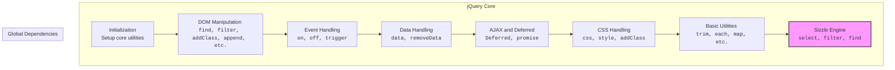

## <algorithm>

### Workflow of the `angular.min.js` File

This JavaScript code is a minified version of the jQuery library (v3.5.1). It provides functionality for DOM manipulation, event handling, AJAX requests, and other utilities commonly used in web development.

Since the code is heavily minified and optimized, the workflow is a complex interplay between different methods and internal processes. Here's a breakdown of the key aspects and how data flows through them:

1.  **Initialization and Core Utilities**:
    *   The code starts with an IIFE that defines the structure of the library, setting up core utilities such as `extend`, `each`, `merge`, `map`, etc.
     * It checks for presence of module and export functionality to handle different module loaders.
    *   It also defines type checking methods, such as `isPlainObject`, `isFunction`, `isArray` etc.
    *   It sets up core variables for DOM interactions, regular expressions, and internal bookkeeping.
2.  **DOM Manipulation**:
    *   The core jQuery object `E` is created, which provides methods to select, traverse, create, and manipulate DOM elements:
        *    Methods like `find`, `filter`, `has`, `closest` ,`is`, `map`, `slice`, `eq`, `end`, `add`, `addBack`, `children`, `contents`, `next`, `prev`, `siblings`, `parent`, `parents`, `parentsUntil`, `nextAll`, `prevAll`, `nextUntil`, `prevUntil` are used for traversing and filtering DOM elements.
        *   Methods such as `addClass`, `removeClass`, `toggleClass`, `attr`, `removeAttr`, `prop`, `removeProp`, `css`, `html`, `text`, `val`, `empty`, `clone`, `replaceWith`, `detach`, `remove`, `append`, `prepend`, `before`, `after`, `wrap`, `wrapAll`, `wrapInner`, `unwrap` are used for DOM element manipulation.
    *   Methods like `offset`, `position`, and `offsetParent` are used to measure and get relative positioning of elements on page.

3. **Event Handling:**
    *   The code sets up an event handling system using `E.event` with methods such as `add`, `remove`, and `trigger`.
        *   Provides functions for handling global events and also attaching data to event listeners using `Y.set()`
    *   It defines special handling for `mouseenter`, `mouseleave`, `focusin`, and `focusout` events using `E.event.special`.
    *   Methods `on`, `off`, `bind`, `unbind`, `delegate`, `undelegate`, `trigger`, and `triggerHandler` provide a unified API for handling events.
    * `E.event.simulate` is used to trigger events manually.

4.  **Data Handling**:
    *   Provides methods to set, get and remove data from elements using `data`, `removeData`, `_data`, and `_removeData` functions.
    * Data is stored using expando properties on DOM elements, and using local caches.

5.  **AJAX and Deferred Operations**:
    *   The code implements a `Deferred` object for handling asynchronous operations, with methods like `then`, `catch`, `finally` and `pipe`.
    *  It provides `jQuery.ajax` (not included in the build) and `jQuery.ajaxSettings` (defaults for AJAX requests).
    *  Implements mechanisms for handling JSONP callbacks and XHR requests.
    * It uses `setTimeout` and `clearTimeout` to implement delay functionality for animations.

6. **CSS Handling:**
    * The library handles CSS by using `cssHooks` and `cssProps` to define how to access different style properties with `E.style`, and `E.css` functions.
    * It includes logic for working with CSS values, parsing them, setting them and normalizing them.
    * Uses methods for adding and removing classes to DOM elements.
    * Handles `box-sizing` in a correct way.

7.  **Utilities**:
    *   Provides utility functions such as `trim` to remove spaces, `makeArray` to convert arguments into array, `inArray` to check if array includes an element, and `uniqueSort` to sort and remove duplicate elements.
     * Provides helper functions `isPlainObject`, `isEmptyObject`, `globalEval`, `noop`, `camelCase`, `type`, `now`, `isNumeric` to provide type checks, and other helper functionality.
    * Includes functions to handle whitespace, regular expressions and data conversions.
8.   **Selectors Engine (`Sizzle`)**:
    * Includes a custom selector engine that utilizes DOM methods like `getElementsByTagName`, `getElementsByClassName`, and `querySelectorAll`, also implements specific logic for different types of locators like `ID`, `CLASS`, `TAG`, `ATTR`, `PSEUDO` and `CHILD`.
     * Also implements logic for relative selectors, like `>` and `+` etc.
    *  Uses custom methods for handling each specific type of selector.
    * Implements methods for compiling selectors and for filtering results.

9.  **Callbacks:**
     *   Provides a custom callback system for handling various events and for deferred tasks.

10. **Other functionalities:**
    *   Provides specific methods for handling attributes of specific tags like `<input>`, `select` and others, also handles checked, selected and disabled states of the elements.
     *  Implements some logic for handling dates and locale settings.
     *  Implements logic for handling different types of exceptions.

## <mermaid>

### Dependencies Analysis:

1.  **`jQuery Core`**:
    * The core of the library, responsible for DOM manipulation, event handling, and data management and provides core functionality for working with JavaScript.
2. **Global Dependencies**: Represents the output of all core jQuery logic:
     *  **`H`**:  Represents a compiled selector, which can be used for finding elements on the page, is a return of `E.select()` function.

## <explanation>

### Detailed Explanation

**Imports:**

*   This JavaScript file does not use any import statements, as it defines a standalone library meant to be used directly within a browser environment.

**Classes:**

*   The code defines several internal classes and prototype extensions used for implementing the library’s functionality:
    *   `E.fn.init`: The main constructor for creating jQuery objects.
    *   `E.Deferred`: A custom deferred implementation used for managing asynchronous tasks.
    *   `Q`: Internal class for managing data and caching for DOM elements.
    *  `U`: Class used as jQuery object to provide functionality for DOM manipulations.
     *  `Ib`: Class used to provide a caching mechanism.
      *   `Nb`: Class for parsing expressions.
      *   `Qb`: A class used as a controller for `ngForm` and manages the state of the forms.
      *  `Mc`: A class for creating options objects for directives.
      *   `Sb`: A class that represent `ngModel` controller and implements the logic of how data binding works, and handling form state.
      *   `Yg`: Class for task tracking.

**Functions:**

*   The code defines many local functions, which are used by the jQuery core and are used internally to perform specific tasks:
    *    `d(e)`: Used to determine if variable is array-like.
    *  `C(e, t, n)`: Used for creating and appending a script tag to the page.
    *   `T(e)`: Used to get type of the variable as a string.
    * `F(a, b)`: A function for creating error messages.
    *   `$(e, t, n, r, i, o, a)`: Core method for handling css, data, attr, text and others properties with set and get methods.
      *  `ue(e, t)`: A function that is used for setting or getting display style of an element
       * `se(e, t, n, r)`: Function for selecting elements from the DOM by using the provided selector, also acts as jQuery selector engine.
        *   `we()`: A counter which returns a unique number.
        *    `le(e)`: Used for creating a wrapper for `Sizzle` pseudo selectors.
        *    `ce(e)`:  Helper method to determine if feature is supported.
        *   `fe(e, t)`:  Used to set attribute hooks.
        *    `de(e, t)`: Used to check the position of two elements in the DOM.
        *   `pe(t)`: Creates a function to filter elements based on their type attribute.
         *  `he(t)`: Creates a function to filter disabled/enabled state of the element.
        *   `ge(t)`: Used to select elements with getElementsByTagName, querySelectorAll or using custom logic.
         *  `ve(e, t)`: Used to set value of `globalEval` property on a web element.
        *  `Ae(e, t, n, r, i, o)`:  Adds event listeners to DOM elements.
        *  `Ne(e, i, o)`:  Used to setup event listener.
        *   `we(i)`: Used to create a wrapper function that combines several filter functions.
        *  `Ce(e, t, n, r, i)`:  Used to iterate through elements using filter methods.
        *   `Te(p, h, g, v, y, e)`: Used for combining different filter methods with logic for handling groups of elements and for single elements.
        *   `Ee(e)`:  Used for composing filter functions.
        *  `se.matches()`: Used to filter elements by specific selector expression.
        * `se.matchesSelector()`: Checks if an element matches a specific CSS selector expression.
        * `se.contains()`:  Used to check if an element contains another element.
         * `se.attr()`:  Used to get or set attribute value of DOM element.
         * `se.escape()`:  Used to escape string value.
        *  `se.error()`: Throws a syntax error, when error appears.
         * `se.uniqueSort()`: Sorts elements and returns a unique list of them.
         * `o()`: Implementation for `getText()` method, to retrieve text from DOM element.
         * All functions defined inside of `E.fn.extend` for creating instance methods.
           * Functions to handle setting up event listeners using `E.event.add`, and to remove them with `E.event.remove`.
          *   Functions for setting element properties with `E.prop` or removing with `E.removeProp`.
          *   Functions for setting or removing attributes with `E.attr` or `E.removeAttr`.
    *   `vt(n, e, r, i)`: A function that converts parameters to string representation using recursion.
    *   `E.param(e, t)`: Used to serialize data to the query string.
    *   `E._queueHooks(e, t)`: Used to set up queue for deferred tasks.
      *  `E.extend(target, obj1, obj2...)`: Copies the values of properties from one or more source objects to the target object.
      *  `E.each(array, function)`: Used to iterate over an array or object.
        *   `E.makeArray(e, t)`:  Used to convert an object to an array.
       *    `E.grep(e, t, n)`: Used for filtering arrays.
        *    `E.map(e, t, n)`: Used for mapping over arrays and objects.
    *  `me()`: Used to parse HTML string.
    *    `be(e)`: Used for concatenating the values of properties of provided object to string.
    *    `xe(s,e,t)`: Creates functions for traversing DOM using sibling and parent elements.
     *   `we(i)`: Function for combining multiple filter functions.
    * `Ce(e,t,n,r,i)`: Function for filtering array of elements.
    *  `Te(p,h,g,v,y,e)`: Function to create a filter for finding specific elements using selector.
    *  `Ee(e)`:  Helper function to combine all specified selector methods.
    *    `te(e,t,n,r,i)`: Helper function to create special handling for input elements.
   *  `ne(e,t)`: Used to replace character with escaped string.
    *    `ie(e)`: Function to escape some characters in the selector, used for attribute selector.
    *   `oe()`: A function that triggers the remove event listener, if required.
     *   `Ae(e, t, n, r, i, o)`: Handles event binding and delegation.
     * `Ne(e,i,o)`:  Sets up event listener with options and delegation.
       *  `se.matches()`: Method for filtering by a selector.
      *    `se.matchesSelector()`:  Method that check if an element matches a given selector.
     * `se.contains()`:  Used for DOM node containment checks.
    *   `se.attr()`:  Used to get and set attributes.
    *   `se.escape()`:  Used to escape special characters in selector.
     * `se.error()`:  Used for handling errors.
    *   `se.uniqueSort()`: Used for sorting and removing duplicates from a list of elements.
    * `o()`: Used to get text content from nodes.
    * Functions for setting up various types of filters and pseudos, using `le(function)`, and `we()`.
    *   `tt`: Helper for handling attribute sets.
    *   `vt`: Helper function to serialize parameters to query string.
     *   `U`: Helper function for creating a jQuery element wrapper from a DOM element, a selector, or a function.
     *  `qc(a)`: Used to clone a DOM node.
      *   `zb(a, b)`: Used to remove data and detach element from DOM tree.
       *   `id(a)`: Checks if object is empty.
        *    `kd(a, b, d, c)`: Unbinds events.
         *   `rc(a, b)`:  Removes data from object.
        *   `Ab(a, b)`: Used to get/set data on element.
        *   `sc(a, b, d)`: Used to set data on DOM node.
         *   `Cb(a, b)`: Checks if an element has specified CSS class.
        *    `Db(a, b)`:  Removes specified classes from DOM element.
        *    `Eb(a, b)`: Adds specified class names to DOM element.
       *   `pc(a, b)`:  Used for merging DOM nodes into a jQuery object.
       *  `ld(a, b)`: Helper function to get controller instance by controller name and an element.
      *  `Fb(a, b, d)`:  Helper function for accessing data on an element, or its parent element.
       * `md(a)`: Helper function to clear DOM element.
       *   `Gb(a, b)`:  Removes an element from the DOM.
    *   `vg(a, b)`: Function that executes callback when document is loaded.
     *   `hd(a)`: Function which executes callback when document is fully loaded.
     * `nd(a, b)`: Helper function for checking element type.
     *  `wg(a, b)`: Used for handling events.
    *   `xg(a, b, d)`:  Helper method that executes event handler.
    *   `yg(a, b, d)`: Helper function that checks if event target was in the container and executes listener if not.
    *  `ng()`:  Function that returns an object with JQLite implementation.
    *   `La(a, b)`: Function that returns a hash key.
    *   `pd()`: Creates a map object for storing data.
     * `qd(a)`: Helper function to extract function arguments.
     * `Dg(a)`: Helper function to get function arguments in a form of a string.
    *   `fb(a, b)`: Used for setup dependency injection.
    *   `Bf()`: Used to create `$anchorScroll` service, to scroll to a certain element by id, or name.
   * `ib(a, b)`:  Helper function to join strings with space separator.
     *   `Eg(a)`:  Helper function to create an object from a space separated string, with keys from string.
    *    `ra(a)`: Returns copy of object or empty object.
     *    `Fg(a, b, d, c, e)`:  Used as implementation of `$location` service, to manage url and history API.
     *  `If()`: Creates service for accessing browser object.
      *    `Jf()`: Used to create cache service.
        *    `hg()`: Used to create the template cache service, to cache template strings.
     *   `Zc(a, b)`: Used for setting up angular directives.
      * `Tf()`: Used for param serialization.
       *  `Uf()`: Used for jQuery like parameter serialization.
       *  `Wf()`:  Creates a factory function to create XmlHttpRequest object.
      *  `Vf()`:  Used to create a `$httpBackend` service for simulating server communication during testing.
      *  `Pf()`: Used to create `$interpolate` service, that handles string interpolation in templates.
    *   `Qf()`: Used for creating `$interval` service for creating timer like functionality.
       *   `Rf()`:  Used to implement a factory for `interval` service.
       * `Cd(a, b)`: Helper method, used by `location` service to extract protocol, host, and port from a given URL string.
    *   `Dd(a, b, d)`: Helper method for location service to set the path of the location object.
        *   `yc(a, b)`:  Used to check if string starts with another string.
        *   `ya(a, b)`: Returns a part of string.
         * `Da(a)`:  Used to remove part of a string from hash.
       * `zc(a, b, d)`: Used to create location object with HTML5 support.
        *   `Ac(a, b, d)`:  Creates a service for parsing URL parameters.
       * `Ed(a, b, d)`:  Creates location service with html5 mode.
     *    `Mb(a)`: Function that returns value of the property.
     *  `Fd(a, b)`: Setter for the function or object that will be binded to the DOM.
      *   `Yf()`:  Used to create a location service.
      * `Zf()`:  Creates `$log` service, that provides methods to output messages to the console.
      *  `Tg(a)`:  Stringifies the passed parameter.
      *  `Ug(a, b)`: Returns `a` if it is defined, otherwise `b`.
      *  `Gd(a, b)`: Returns value `a` with `b` if both are defined.
     *    `Vg(a, b)`: Used to validate if an expression is pure.
       * `Z(a, b, d)`: Used for traversing and handling parts of AST.
    *    `Id(a)`: Used to extract values from AST.
    *    `Jd(a)`: Used to check if the AST contains identifier or member expression.
     *  `Kd(a)`: Used to check if an AST contains assignement expression.
    *    `Ld(a)`: Class for compilation of non-secure javascript, by implementing logic for AST traversal, and code generation.
      *   `Md(a)`:  Used for compilation of secure javascript by implementing logic for AST traversal, and code generation.
      * `Nb(a, b, d)`: Class that provides methods to parse expressions and generate AST tree.
      * `Bc(a)`: Function to return value of primitive types.
      * `ob(a, b, d, c)`: Used for processing date, time, and range type inputs.
      *    `fe(a)`: A helper method used to format an input as a number.
        *  `na(a)`: Helper method to parse number from string.
       *   `Kc(a)`: Function that returns number of decimals of the floating number.
       *  `ge(a, b, d)`: Checks if number a is a multiple of `d` with offset `b`.
        *    `he(a, b, d, c, e)`: Checks and returns default values for inputs.
     *   `Lc(a, b)`:  Used to generate classes for `ngClass` directive.
      *   `sd(a, b, d, c, e, f)`:  Used to setup DOM event listeners and call callbacks.
    *    `Sa(a, b, d, c, e, f)`: Handles input event types and model updates for HTML elements.
     *  `Rb(a, b)`: Parses date based on provided regexp.
     *  `ie(e)`:  Check if element is in DOM.
    * `zc(a,b,d)`: Creates object to work with HTML5 history API.
    * `Ac(a,b,d)`: Creates object for html5 location service.
    * `Ed(a,b,d)`: Creates location object for old browser that doesn't support html5 history API.
    *   `va(a, b)`: Checks if two values are equal, even if `NaN`.

**Variables:**

*   Many variables are defined within the scope of the code to support its functionalities, and cannot be listed here because it is too much to write, they are used internally for implementing different functionalities of the jQuery or angularJS frameworks.

**Potential Errors and Areas for Improvement:**

*   **Minified Code**: This code is already minified and very difficult to read, debug or modify.
*  **No Configuration**: There are no configuration parameters to configure, many parameters and variables are hardcoded into the javascript file.
*   **Error Handling**:  Error handling is basic and relies mostly on throwing or logging errors, but there are no specific checks for every possible error case, and could be improved by adding more granular exception handling.
*   **Security**: Code contains mechanisms for sanitizing URLs and HTML values, but more checks could be implemented to improve overall security.
*    **Code Complexity**: The minified nature of the code makes it difficult to debug and understand, and could be improved by using a better source code that is not minified.

**Relationship Chain with Other Parts of Project:**

*   This file provides the core functionality of AngularJS, which is used for front-end development, and therefore many modules in the project would depend on this library.
*  The file works independently of other modules in the project, and acts like a dependency.
*  The module utilizes javascript engine functionality and browsers dom apis.

This detailed explanation provides a comprehensive overview of the minified AngularJS library, and provides a structural outline on what every part of the library is responsible for, but given the fact that it is a minified file it can be hard to understand all the nuances of its implementation.