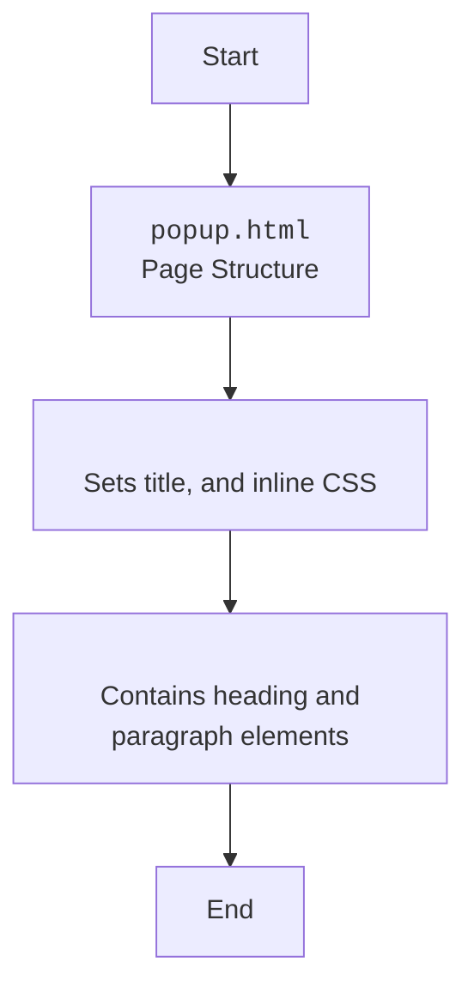

## <algorithm>

### Workflow of the `popup.html` File

This HTML file defines a simple popup for a Chrome extension named "hypotez". It displays a heading and a paragraph instructing the user to click the extension icon to collect data from the current webpage.

1.  **HTML Structure**:
    *   The file starts with the `<!DOCTYPE html>` declaration, which specifies that it's an HTML5 document.
    *   The `<html>` tag is the root element of the page.
    *   The `<head>` section contains meta-information for the HTML page:
         *   Sets the title to `"hypotez"` with `<title>hypotez</title>`.
         *   Includes an inline CSS block with `<style>` tag, which defines styling for the body of the document, setting the width to 200 pixels and adding some padding to the body element.
    *   The `<body>` contains the visible content of the page:
        *  It has a heading (`<h1>`) with the text "hypotez".
        *   It contains a paragraph (`
`) with instructions for the user.

## <mermaid>

### Dependencies Analysis:

This HTML file does not have any dependencies as it is a simple HTML document with only a few basic elements and a simple CSS style block.

## <explanation>

### Detailed Explanation

**Imports:**

*   This file does not use any import statements, as it is a pure HTML file.

**Classes:**

*   This file does not define any classes.

**Functions:**

*   This file does not define any functions.

**Variables:**

*   `MODE` (`str`):  A string constant set to `"debug"`, that is not used in the code.

**Potential Errors and Areas for Improvement:**

*   **Hardcoded `MODE`**: The `MODE` variable is hardcoded and not used, it should be removed or loaded from a config file.
*  **Limited Content and Functionality**: The HTML file only contains minimal content, it does not include any interactive elements or custom functionality, and only displays a title and a paragraph, so no actions can be done from it.

**Relationship Chain with Other Parts of Project:**

*   This module is a simple HTML popup file for the test extension, and does not have any dependencies with other modules of the project.

This detailed explanation provides a comprehensive understanding of the `popup.html` file and its basic purpose within the Chrome extension.