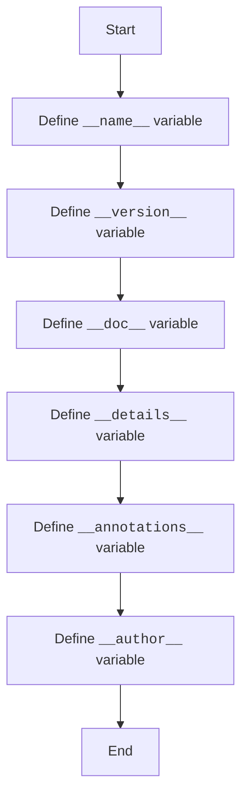

## <algorithm>

### Workflow of the `version.py` Module

This `version.py` module defines several variables, which are commonly used in Python packages to store meta information like version, name, documentation, and author.

1.  **Module Name**:
    *   The variable `__name__` is defined to store the name of the module as a string.
    *   **Example**: `__name__:str`
    *   It is an annotation and not an assignment, so the actual value would be set by python to `__main__` if the script was launched directly, or the module name when imported.

2.  **Module Version**:
    *   The variable `__version__` is defined to store the version of the module.
    *   **Example**: `__version__="3.12.0.0.0.4"`
    *   It is set to a string value which represents the current module version.

3.  **Module Documentation**:
    *   The variable `__doc__` is defined to store module documentation.
    *   **Example**: `__doc__:str`
    *    It's an annotation, but it's assigned with a docstring in a rst format which will be ignored by python interpreter.

4.  **Module Details**:
    *    The variable `__details__` is defined to store additional details about the module.
    *   **Example**: `__details__:str="Details about version for module or class"`
    *  It is set to a string which provides a description of module's version.

5. **Annotations**:
    *  The variable `__annotations__` is defined to store type annotations for variables and functions in the module.
    * **Example**: `__annotations__`
    *  It's an annotation, but no value is assigned, and it's not used in the code.

6.  **Module Author**:
    *   The variable `__author__` is defined to store the author of the module.
    *   **Example**: `__author__='hypotez '`
    *   It's set to string with the author name.

## <mermaid>

### Dependencies Analysis:

This module does not have any dependencies, as it only defines variables, and imports no modules.

## <explanation>

### Detailed Explanation

**Imports:**

*   There are no import statements in this module.

**Classes:**

*   This module does not define any classes.

**Functions:**

*   This module does not define any functions.

**Variables:**

*   `__name__` (`str`): Stores the name of the module, if the script was launched as main module - python will set it to `__main__`.
*   `__version__` (`str`): Stores the version of the module or package as a string.
*   `__doc__` (`str`): Stores the docstring of the module.
*   `__details__` (`str`): Stores additional details about the module.
*   `__annotations__`: Stores type annotations, but it's not used directly, and only annotated.
*   `__author__` (`str`):  Stores the name of the author as a string.

**Potential Errors and Areas for Improvement:**

*   **Type Hinting**:  Type hinting is used only for annotations, there is no default value assignment for the variables.
*   **Unused Variable**: Variable `__annotations__` is not used in code and has no assignment.
*    **Inconsistent Docstring**: Docstrings are inconsistent and hard to read.
*   **Hardcoded values**:  The version and author are hardcoded and it might be better to load them from the configuration or settings file.

**Relationship Chain with Other Parts of Project:**

*   This module is a part of the `src.webdriver.chrome.extentions` package.
*   It does not interact with other parts of the project directly, but provides metadata which can be used in other modules to identify the version, author, etc. of this module.

This detailed explanation provides a comprehensive understanding of the `version.py` module and its role within the project.