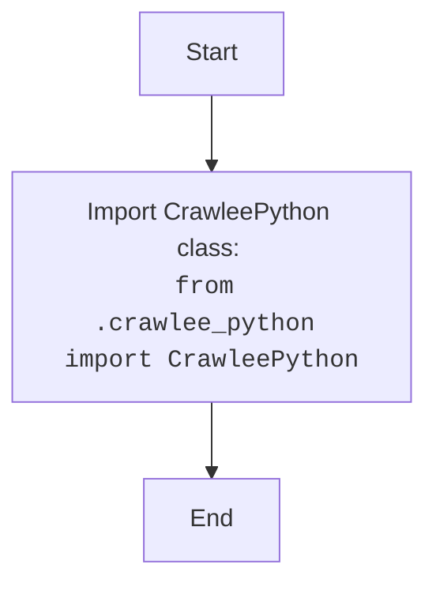

## <algorithm>

### Workflow of the `__init__.py` Module

This `__init__.py` file acts as an entry point for the `src.webdriver.crawlee_python` package, making the `CrawleePython` class available for import.

1.  **Import Statement**:
    *   The module imports the `CrawleePython` class from the `src.webdriver.crawlee_python.crawlee_python` module.
    *   **Example**: `from .crawlee_python import CrawleePython`
    *  This makes the `CrawleePython` class available for import when using `from src.webdriver.crawlee_python import CrawleePython`.

## <mermaid>

### Dependencies Analysis:

1.  **`CrawleePython Class`**: Represents the class imported from the `crawlee_python.py` module.

## <explanation>

### Detailed Explanation

**Imports:**

*   **`from .crawlee_python import CrawleePython`**: Imports the `CrawleePython` class from the `crawlee_python.py` file in the same directory.

**Classes:**

*   This module does not define any new classes.

**Functions:**

*   This module does not define any new functions.

**Variables:**

*   This module does not define any variables.

**Potential Errors and Areas for Improvement:**

*   **No Functionality**:  The module is very basic and only imports a class from another module. There is no functionality in the module itself, so there are no errors or improvements to be made.

**Relationship Chain with Other Parts of Project:**

*   This module is a part of the `src.webdriver.crawlee_python` package.
*   It exports the `CrawleePython` class, which makes it available to other modules that utilize `src.webdriver.crawlee_python`.

This detailed explanation provides a comprehensive understanding of the `__init__.py` module and its role as an entry point for the `src.webdriver.crawlee_python` package.