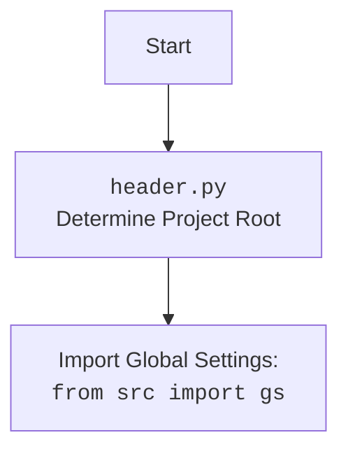

## <algorithm>

### Workflow of the `driver.py` Module

The `driver.py` module provides a class `Driver` to interact with Selenium web drivers. Here's a step-by-step explanation of its workflow:

1.  **Initialization (`__init__`)**:
    *   The `Driver` class is instantiated with `webdriver_cls` (e.g., `Chrome`, `Firefox`) and optional arguments (`*args`, `**kwargs`).
    *   **Example**: `driver = Driver(Chrome, executable_path='/path/to/chromedriver')`
    *   It checks if `webdriver_cls` has the `get` method, raising a `TypeError` if not.
    *   Initializes the WebDriver: `self.driver = webdriver_cls(*args, **kwargs)`.

2.  **Subclass Initialization (`__init_subclass__`)**:
    *   When a subclass of `Driver` is created, this method is automatically called.
    *   **Example**: `class CustomDriver(Driver, browser_name='Chrome'): ...`
    *   It checks if `browser_name` is provided, raising a `ValueError` if missing.
    *   Stores the `browser_name` in the subclass: `cls.browser_name = browser_name`.

3.  **Attribute Proxy (`__getattr__`)**:
    *   When an attribute not directly defined in `Driver` is accessed, `__getattr__` is invoked.
    *   **Example**: `driver.page_source` calls `self.driver.page_source`.
    *   Proxies attribute access to the underlying WebDriver: `return getattr(self.driver, item)`.

4.  **Scrolling (`scroll`)**:
    *   The `scroll` method scrolls the page using `scrolls`, `frame_size`, `direction`, and `delay`.
    *   **Example**: `driver.scroll(scrolls=2, direction='down')`
    *   It uses a nested `carousel` function with `execute_script` for scrolling and `wait()` for delays.
    *   Direction can be `'forward'`/`'down'`, `'backward'`/`'up'`, or `'both'`.

5.  **Determining Page Language (`locale`)**:
    *   The `locale` property tries to extract the language from the `<meta>` tag or JavaScript (`get_page_lang()`, which is not implemented).
    *   **Example**: `lang = driver.locale`
    *   It uses `find_element(By.CSS_SELECTOR, "meta[http-equiv='Content-Language']")` to locate the `<meta>` tag.
    *   Returns the language code or `None`.

6.  **Navigating to URL (`get_url`)**:
    *   The `get_url` method navigates to the given `url` using `self.driver.get(url)`.
    *   **Example**: `driver.get_url('https://example.com')`
    *   Copies `current_url` before navigation, waits for page load completion (`while self.ready_state != 'complete':`), updates the previous URL and saves cookies.
    *   Handles `WebDriverException`, `InvalidArgumentException`, and generic `Exception`.

7.  **Opening New Tab (`window_open`)**:
    *   The `window_open` method opens a new tab and switches the focus.
    *   **Example**: `driver.window_open('https://newtab.com')`
    *   It uses `execute_script('window.open();')`, then `switch_to.window(self.window_handles[-1])`, and navigates to the URL if provided.

8.  **Waiting (`wait`)**:
    *   The `wait` method pauses execution for a specified time.
    *   **Example**: `driver.wait(2)`
    *   It uses `time.sleep(delay)`.

9.  **Saving Cookies Locally (`_save_cookies_localy`)**:
    *   The `_save_cookies_localy` method saves cookies to a file (`gs.cookies_filepath`).
    *   **Example**: `driver._save_cookies_localy()`
    *   It uses `pickle.dump()` to save cookies.
    *    Currently stubbed with `return True # <- ~~~~~~~~~~~~~~~~~~~~~~~~~~~~~ debug`.

10. **Fetching HTML Content (`fetch_html`)**:
    *   The `fetch_html` method gets HTML from a file or web address.
    *   **Example**: `driver.fetch_html('file:///path/to/local.html')` or `driver.fetch_html('https://example.com')`
    *   For local files, it reads the content into `self.html_content`.
    *   For web addresses, it navigates to the URL, and uses `page_source`.
    *   Handles exceptions and logs errors.

## <mermaid>

```mermaid
flowchart TD
    Start[Start] --> InitDriver[Initialize Driver: <br><code>Driver(webdriver_cls, *args, **kwargs)</code>]
    InitDriver --> CheckWebDriver[Check if <br><code>webdriver_cls</code> is valid]
    CheckWebDriver -- Yes --> CreateWebDriver[Create driver instance <br><code>self.driver = webdriver_cls(*args, **kwargs)</code>]
    CheckWebDriver -- No --> TypeError[Raise TypeError]
    CreateWebDriver --> SubclassInit[Subclass Initialization: <br><code>__init_subclass__</code>]
    SubclassInit --> CheckBrowserName[Check if <br><code>browser_name</code> is specified]
    CheckBrowserName -- Yes --> SetBrowserName[Set browser name: <br><code>cls.browser_name = browser_name</code>]
    CheckBrowserName -- No --> ValueError[Raise ValueError]
    SetBrowserName --> AttributeProxy[Access Attribute: <br><code>__getattr__(self, item)</code>]
    AttributeProxy --> GetDriverAttribute[Get attribute from <br><code>self.driver</code>]
    GetDriverAttribute --> ScrollPage[Scroll Page: <br><code>scroll(self, scrolls, frame_size, direction, delay)</code>]
    ScrollPage --> CarouselFunction[<code>carousel(direction, scrolls, frame_size, delay)</code>]
    CarouselFunction --> ExecuteScript[Execute scroll by script:<br><code>execute_script(window.scrollBy(0,{direction}{frame_size}))</code>]
    ExecuteScript --> WaitAfterScroll[Wait for a while:<br><code>wait(delay)</code>]
    WaitAfterScroll -->  ScrollLoop[Loop if <br><code>scrolls</code> remain ]
    ScrollLoop -- Yes --> ExecuteScript
    ScrollLoop -- No --> ScrollComplete[Scroll operation complete]
    ScrollComplete --> GetLocale[Get Page Locale:<br><code>locale</code>]
    GetLocale --> GetMetaTag[Get <br><code>meta</code> tag]
     GetMetaTag -- Success --> GetContent[Get <br><code>content</code> attribute]
     GetContent --> ReturnLocale[Return language code]
     GetMetaTag -- Fail --> TryJavaScript[Try JavaScript <br><code>get_page_lang()</code>]
    TryJavaScript -- Success --> ReturnLocale
    TryJavaScript -- Fail --> ReturnNone[Return None]
    ReturnLocale --> NavigateToURL[Navigate to URL: <br><code>get_url(self, url)</code>]
    ReturnNone --> NavigateToURL
    NavigateToURL --> GetCurrentURL[Get current URL]
     GetCurrentURL -- Success --> SavePreviousURL[Save to <br><code>previous_url</code> if changed]
     GetCurrentURL -- Fail -->  ReturnFalse1[Return False]
    SavePreviousURL --> LoadURL[Load URL: <br><code>self.driver.get(url)</code>]
    LoadURL --> WaitForComplete[Wait until <br><code>readyState == 'complete'</code>]
    WaitForComplete -- Yes --> SaveCookies[Save Cookies: <br><code>_save_cookies_localy()</code>]
    WaitForComplete -- No --> WaitForComplete
    SaveCookies --> ReturnTrue[Return True]
    LoadURL -- Fail --> CatchWebDriverError[Catch <br><code>WebDriverException</code>]
     CatchWebDriverError --> LogWebDriverError[Log error]
     LogWebDriverError --> ReturnFalse2[Return False]
    LoadURL -- Fail --> CatchInvalidArgError[Catch <br><code>InvalidArgumentException</code>]
     CatchInvalidArgError --> LogInvalidArgError[Log error]
    LogInvalidArgError --> ReturnFalse3[Return False]
      LoadURL -- Fail --> CatchAnyError[Catch other exceptions]
    CatchAnyError --> LogAnyError[Log error]
    LogAnyError --> ReturnFalse4[Return False]
    ReturnFalse1 --> End[End]
    ReturnFalse2 --> End
    ReturnFalse3 --> End
    ReturnFalse4 --> End
    ReturnTrue --> End
    End --> OpenNewTab[Open New Tab: <br><code>window_open(self, url)</code>]
    OpenNewTab --> ExecuteNewTabScript[Execute: <br><code>execute_script('window.open();')</code>]
    ExecuteNewTabScript --> SwitchToNewTab[Switch to new tab]
    SwitchToNewTab --> LoadURLinNewTab[Load URL if specified]
    LoadURLinNewTab --> End1[End]
   End1 --> WaitTime[Wait Time: <br><code>wait(self, delay)</code>]
   WaitTime --> SleepTime[<code>time.sleep(delay)</code>]
   SleepTime --> End2[End]
   End2 --> SaveCookiesLocally[Save Cookies Locally: <br><code>_save_cookies_localy(self)</code>]
   SaveCookiesLocally --> OpenCookieFile[Open cookie file in <br><code>gs.cookies_filepath</code>]
    OpenCookieFile --> DumpCookies[Save cookies using <br><code>pickle.dump()</code>]
    DumpCookies -->  ReturnTrueDebug[Return True for debugging]
    SaveCookiesLocally -- Fail --> LogErrorSaveCookies[Log error saving cookies]
    LogErrorSaveCookies --> End3[End]
    ReturnTrueDebug --> End3
  End3 --> FetchHTML[Fetch HTML: <br><code>fetch_html(self, url)</code>]
    FetchHTML --> CheckURLType[Check if url starts with file, http or https]
    CheckURLType -- File --> ExtractFilePath[Extract File path]
    ExtractFilePath --> CheckFileExists[Check if file exists]
     CheckFileExists -- Yes --> ReadFile[Read the file content]
    ReadFile --> SetHTMLContent[Set html content as `self.html_content`]
       SetHTMLContent --> ReturnTrue4[Return True]
    CheckFileExists -- No -->  LogFileNotFound[Log "Local file not found"]
    LogFileNotFound --> ReturnFalse5[Return False]
    CheckURLType -- HTTP/HTTPS --> NavigateAndGetHTML[Call <br><code>get_url(url)</code>]
    NavigateAndGetHTML -- Success --> GetPageSource[Get the page source]
    GetPageSource --> SetHTMLContent
    NavigateAndGetHTML -- Fail --> LogErrorFetchingURL[Log error fetching URL]
    LogErrorFetchingURL --> ReturnFalse6[Return False]
    CheckURLType -- Other --> LogUnsupportedProtocol[Log unsupported protocol error]
    LogUnsupportedProtocol --> ReturnFalse7[Return False]
     ReturnFalse5 --> End4[End]
    ReturnFalse6 --> End4
    ReturnFalse7 --> End4
   ReturnTrue4 --> End4
```

### Explanation of Mermaid Diagram

**Dependencies:**

*   **`time`**: Used in the `wait` method to pause execution using `time.sleep(delay)`.
*   **`copy`**: Used in `get_url` to copy the current URL before navigation using `copy.copy(self.current_url)`.
*   **`pickle`**: Used in `_save_cookies_localy` to serialize cookies with `pickle.dump(self.driver.get_cookies(), cookiesfile)`.
*   **`pathlib`**: Used in `fetch_html` for file path handling with `Path(match.group(0))`.
*   **`re`**: Used in `fetch_html` for extracting file paths with `re.search(r'[a-zA-Z]:[\\/].*', cleaned_url)`.
*   **`gs`**: Global settings, provides access to `gs.cookies_filepath`.
*   **`logger`**: Logging functionality from `src.logger.logger`.
*   **`selenium.webdriver`**: Used to interact with web drivers, `webdriver_cls` is an instance of this.
*   **`selenium.webdriver.common.by`**: Used for locating elements with CSS selectors (`By.CSS_SELECTOR`).
*   **`selenium.common.exceptions`**: Used to handle specific exceptions: `WebDriverException`, `InvalidArgumentException`, etc.
*   **`header`**: Imported from `header.py`



## <explanation>

### Detailed Explanation

**Imports:**

*   `copy`: Used for creating copies of URLs before navigation.
*   `pickle`: Used for serializing and saving cookies.
*   `time`: Used for pausing execution with `time.sleep()`.
*   `re`: Used for regular expression operations, particularly in file path extraction.
*   `pathlib.Path`: Used for handling file paths.
*   `typing.Optional`: Used for type hinting optional values (can be `None`).
*   `selenium.webdriver.common.by.By`: Used for locating elements on a webpage.
*   `selenium.common.exceptions`: Used for handling specific selenium exceptions like `InvalidArgumentException`, etc.
*   `header`: Imports custom module `header.py`
*   `src.config.settings as gs`: Imports global settings from `src.config.settings`, for accessing the cookies file path (`gs.cookies_filepath`).
*   `src.logger.logger as logger`: Imports custom logger.
*   `src.logger.exceptions`: Imports custom exceptions `ExecuteLocatorException`, `WebDriverException`.

**Classes:**

*   `Driver`:
    *   **Purpose**: Provides a unified interface for interacting with Selenium WebDrivers.
    *   **Attributes**:
        *   `self.driver`: Instance of `selenium.webdriver`.
        *   `self.html_content`: Stores fetched HTML content.
        *   `self.previous_url`: Stores the previously visited URL.
    *   **Methods**:
        *   `__init__(self, webdriver_cls, *args, **kwargs)`: Initializes `Driver` by creating the WebDriver, validates input class with method `get`.
        *   `__init_subclass__(cls, *, browser_name=None, **kwargs)`: Called when a subclass is created to set `browser_name` attribute.
        *   `__getattr__(self, item)`: Attribute proxy, allows access to underlying `self.driver` attributes.
        *   `scroll(self, scrolls, frame_size, direction, delay)`: Scrolls the page.
        *   `locale(self)`: Property, tries to determine the page language.
        *   `get_url(self, url)`: Navigates to a URL, waits for load, saves cookies and previous url.
        *   `window_open(self, url)`: Opens a new tab in the browser.
        *   `wait(self, delay)`: Pauses execution.
        *   `_save_cookies_localy(self)`: Saves cookies to a local file.
        *   `fetch_html(self, url)`: Fetches HTML content.

**Functions:**

*   `__init__(self, webdriver_cls, *args, **kwargs)`:
    *   **Arguments**: `webdriver_cls` (WebDriver class), `*args`, `**kwargs`.
    *   **Purpose**: Initializes the `Driver` instance.
    *   **Return**: `None`.
*   `__init_subclass__(cls, *, browser_name=None, **kwargs)`:
    *   **Arguments**: `browser_name`, `**kwargs`.
    *   **Purpose**: Sets `browser_name` attribute in subclass.
    *   **Return**: `None`.
*   `__getattr__(self, item)`:
    *   **Arguments**: `item` (attribute name).
    *   **Purpose**: Proxies attribute access to the underlying `self.driver`.
    *   **Return**: Attribute from `self.driver`.
*   `scroll(self, scrolls, frame_size, direction, delay)`:
    *   **Arguments**: `scrolls` (int), `frame_size` (int), `direction` (str), `delay` (float).
    *   **Purpose**: Scrolls the page using javascript execution.
    *   **Return**: `bool`.
*   `locale(self)`:
    *   **Arguments**: `self`.
    *   **Purpose**: Attempts to determine the page language.
    *   **Return**: `Optional[str]` language or `None`.
*   `get_url(self, url)`:
    *   **Arguments**: `url` (str).
    *   **Purpose**: Navigates to the given URL.
    *   **Return**: `bool`.
*   `window_open(self, url)`:
    *   **Arguments**: `url` (Optional[str]).
    *   **Purpose**: Opens new browser tab.
    *   **Return**: `None`.
*   `wait(self, delay)`:
    *   **Arguments**: `delay` (float).
    *   **Purpose**: Introduces a delay in execution.
    *   **Return**: `None`.
*   `_save_cookies_localy(self)`:
    *   **Arguments**: `self`.
    *   **Purpose**: Saves cookies locally with `pickle`.
    *   **Return**: `None`.
*   `fetch_html(self, url)`:
    *   **Arguments**: `url` (str).
    *   **Purpose**: Fetches HTML content from a URL or file.
    *   **Return**: `Optional[bool]`.

**Variables:**

*   `self.driver`: Instance of the Selenium `WebDriver`.
*   `self.html_content`: String holding HTML content of the page.
*   `self.previous_url`: String storing previously visited URL.
*   `gs.cookies_filepath`: Path to the cookies file, loaded from settings.
*   `logger`: Instance of the logger for logging messages.

**Potential Errors and Areas for Improvement:**

*   **`get_page_lang()`**: The `get_page_lang()` method, used to obtain the language with JavaScript is not implemented, leading to a possible error when the language cannot be extracted from meta tags.
*   **Cookie Saving**: The `_save_cookies_localy()` method is stubbed and does not save cookies.
*   **File Reading**: File reading in `fetch_html` could use `src.utils.file.read_text_file` for consistency.
*    **Looping:** The `while self.ready_state != 'complete':` loop in `get_url` might lead to infinite loops if the page doesn't complete loading.

**Relationship Chain with Other Parts of Project:**

*   The module is part of the `src.webdriver` package, responsible for web automation and testing.
*   It imports settings from `src.config.settings` (`gs`).
*   It uses a custom logger from `src.logger.logger` and custom exceptions from `src.logger.exceptions`.
*   It uses `selenium` for browser interaction.
*    The module `header.py` is a dependency for accessing global settings using `from src import gs`

This detailed analysis provides a comprehensive understanding of the `driver.py` module and its place within the broader project.