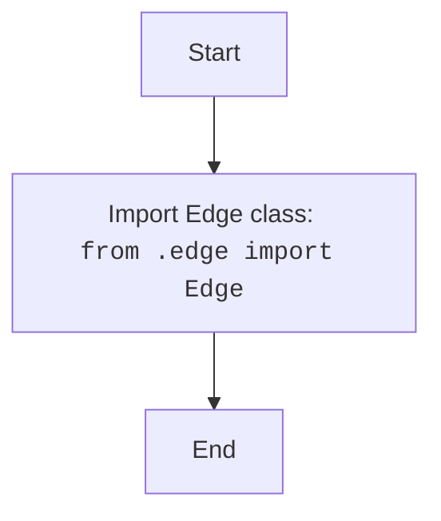

## <algorithm>

### Workflow of the `__init__.py` Module

This `__init__.py` file serves as the entry point for the `src.webdriver.edge` package. It makes the `Edge` class available for import from the package.

1.  **Import Statement**:
    *   The module imports the `Edge` class from the `src.webdriver.edge.edge` module.
    *   **Example**: `from .edge import Edge`
    *   This makes the `Edge` class directly accessible when the `src.webdriver.edge` package is imported.

## <mermaid>

### Dependencies Analysis:

1.  **`Edge Class`**: Represents the class imported from the `edge.py` module.

## <explanation>

### Detailed Explanation

**Imports:**

*   **`from .edge import Edge`**: Imports the `Edge` class from the `edge.py` module located in the same directory, making it accessible when the `src.webdriver.edge` package is imported.

**Classes:**

*   This module does not define any new classes.

**Functions:**

*   This module does not define any new functions.

**Variables:**

*   This module does not define any variables.

**Potential Errors and Areas for Improvement:**

*   **No Functionality**: The module is very basic and only imports a class from another module. There is no functionality in the module itself.

**Relationship Chain with Other Parts of Project:**

*   This module is a part of the `src.webdriver.edge` package.
*   It exposes the `Edge` class, which is used by other parts of the project that require the functionality of the Edge browser.

This detailed explanation provides a comprehensive understanding of the `__init__.py` module and its role within the `src.webdriver.edge` package.