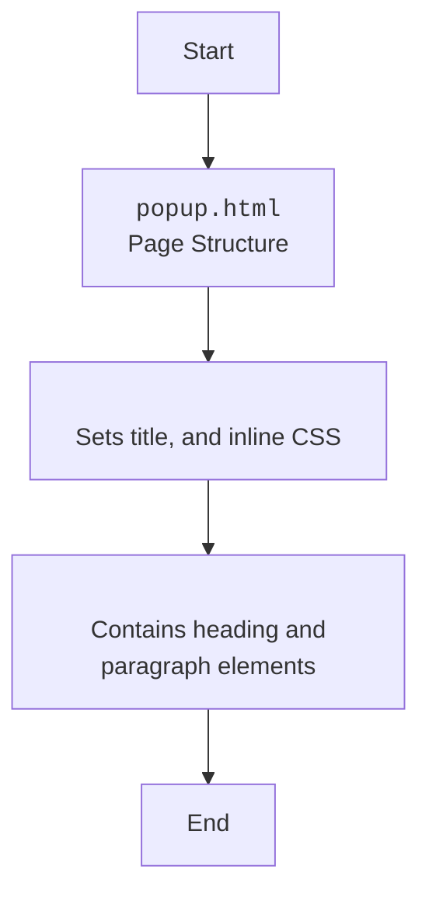

## <algorithm>

### Workflow of the `popup.html` File

This HTML file defines a simple popup for a Chrome extension named "hypotez." It displays a basic message to the user, instructing them to interact with the extension.

1.  **HTML Structure**:
    *   The file starts with the `<!DOCTYPE html>` declaration, indicating that it's an HTML5 document.
    *   It contains an `<html>` tag as the root element of the page.
    *   The `<head>` section contains meta-information:
        *   It sets the title of the page to `"hypotez"` with the `<title>` tag.
        *   It includes inline CSS styles within the `<style>` tag to set the width and padding for the body element.
    *  The `<body>` tag contains visible content:
        *   It has a heading (`<h1>`) with the text "hypotez".
        *   It contains a paragraph (`
`) with instructions for the user.

## <mermaid>

### Dependencies Analysis:

This HTML file doesn't have any dependencies, as it is a standalone HTML file without any external scripts or stylesheets except for the defined inline CSS.

## <explanation>

### Detailed Explanation

**Imports:**

*   This file does not use any import statements, as it is a standalone HTML file.

**Classes:**

*   This file does not define any classes.

**Functions:**

*   This file does not define any functions.

**Variables:**

*  `MODE` (`str`): String set to `"debug"`, and not used in the code.

**Potential Errors and Areas for Improvement:**

*   **Hardcoded `MODE`**: The `MODE` variable is hardcoded and not used in the code, therefore it can be removed.
*  **Limited Functionality**: The page is very basic and doesn't contain any interactive elements, except for the fact that it can be interacted with the extension icon.
*   **Limited Styling**:  The CSS is basic and can be improved, with more styles.

**Relationship Chain with Other Parts of Project:**

*   This module is a part of the chrome extension.
*   It has no dependencies on other parts of the project.

This detailed explanation provides a comprehensive understanding of the `popup.html` file and its basic purpose as a simple popup within a Chrome extension.