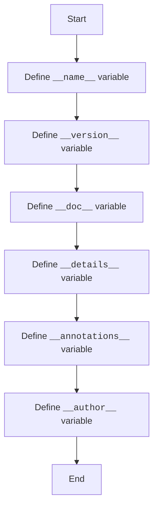

## <algorithm>

### Workflow of the `version.py` Module

This `version.py` module is designed to store metadata about the module or package. It defines variables for version, name, documentation, author, and other details.

1.  **Module Name**:
    *   The `__name__` variable is defined to store the name of the module (it's an annotation not an assignment).
    *   **Example**: `__name__:str`
    *   When the script is executed directly, this variable will be set by python to `"__main__"`, otherwise - to the module name.

2.  **Module Version**:
    *  The `__version__` variable is defined to store the version of the module.
    *   **Example**: `__version__="3.12.0.0.0.4"`
    *  It's set to a specific string that represents the version.

3.  **Module Documentation**:
    *   The `__doc__` variable is defined to store the documentation string for the module.
    *   **Example**: `__doc__:str`
    *  It's an annotation, but the actual docstring is set in rst format and is ignored by python interpreter.

4.  **Module Details**:
    *   The `__details__` variable is defined to store additional details about the module's version.
    *   **Example**: `__details__:str="Details about version for module or class"`

5.  **Annotations**:
    *  The variable `__annotations__` is defined and used for annotations, with type annotations for variables and functions in the module.
     * **Example**: `__annotations__`

6.  **Module Author**:
    *   The `__author__` variable is defined to store the name of the author(s) of the module.
    *   **Example**: `__author__='hypotez '`

## <mermaid>

### Dependencies Analysis:

This module does not have any dependencies since it only defines variables and no modules are imported.

## <explanation>

### Detailed Explanation

**Imports:**

*   This module does not use any import statements.

**Classes:**

*   This module does not define any classes.

**Functions:**

*   This module does not define any functions.

**Variables:**

*   `__name__` (`str`):  Stores the name of the module (if script is executed directly, then its value is set to `__main__`).
*   `__version__` (`str`):  Stores the version of the module as a string.
*   `__doc__` (`str`):  Stores the docstring of the module.
*  `__details__` (`str`): Stores additional details about the module.
*  `__annotations__`:  Stores the type annotations for variables in the module.
*  `__author__` (`str`): Stores the author's name, a string with author of the module.

**Potential Errors and Areas for Improvement:**

*  **Unused Imports**:  The imports for `json` and `packaging.version` from the previous version of the file are no longer present.
*  **Type Hinting**: While type hints are used, they don't have initial values assignment.
*   **Hardcoded Values**: The version and author are hardcoded as strings and can be loaded from a config file for more flexibility.
*    **Inconsistent Docstrings**: The usage of docstrings is inconsistent with the standard usage of module docstrings.

**Relationship Chain with Other Parts of Project:**

*   This module is part of the `src.webdriver.edge.extentions` package.
*  It stores module metadata and does not interact with other parts of the project directly.

This detailed explanation provides a comprehensive understanding of the `version.py` module and its role within the project.