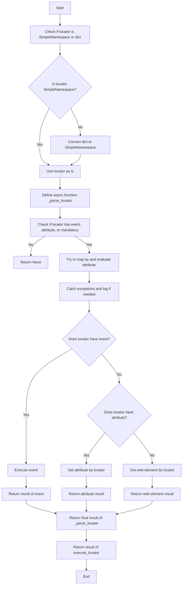
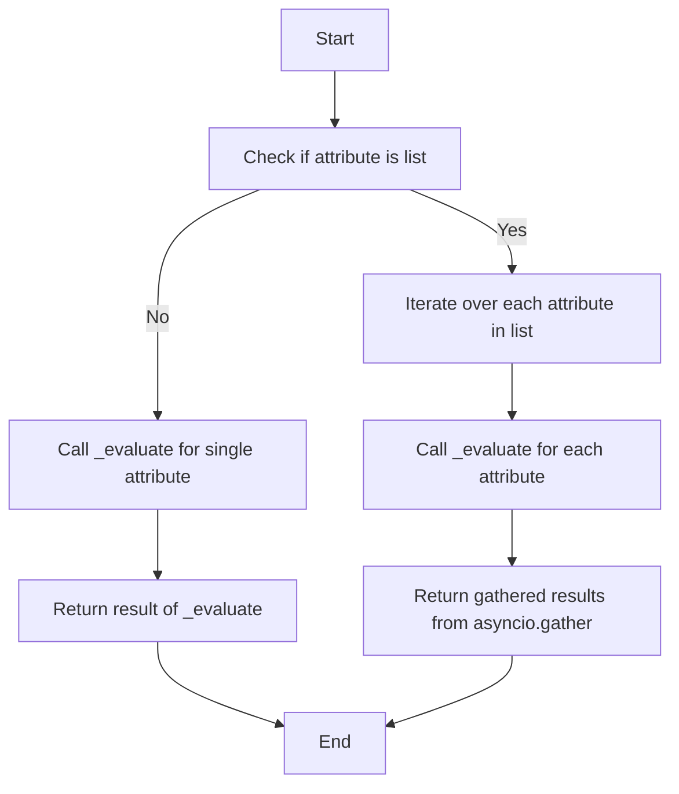
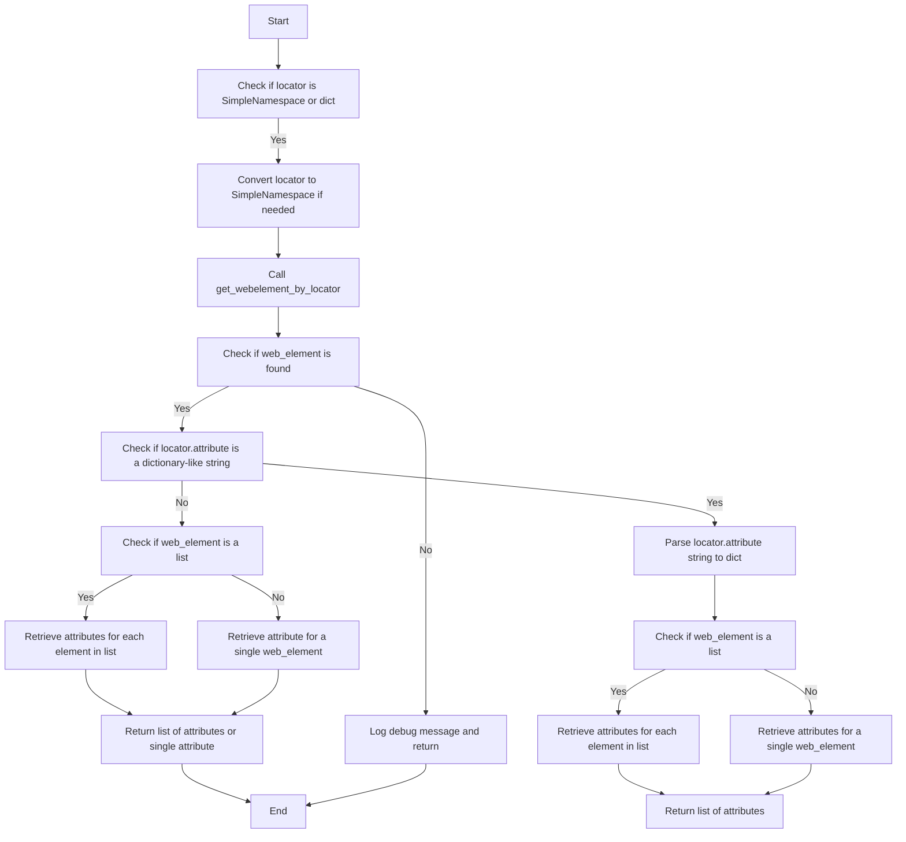

## <algorithm>

### Workflow of the `executor.py` Module

The `executor.py` module is designed to automate interactions with web elements using Selenium. Here's a step-by-step breakdown of its workflow:

1.  **Initialization (`__post_init__`):**
    *   When an instance of `ExecuteLocator` is created, and if the `driver` is provided, the `__post_init__` method initializes the `ActionChains` object.
    *   **Example**: `executor = ExecuteLocator(driver=driver)`
    *   If a `driver` is provided, an `ActionChains` object is created using this driver instance.

2.  **Executing a Locator (`execute_locator`):**
    *   This method takes a locator, which can be a `SimpleNamespace` or a `dict`.
    *   **Example**: `result = await executor.execute_locator(locator)`
    *   Checks the locator type, converts a `dict` to `SimpleNamespace` if necessary.
    *   Defines the async function `_parse_locator`, which is responsible for parsing and processing locator attributes, events and extracting web elements
    *   If the locator does not contain `event`, `attribute`, or `mandatory` parameters, it returns `None`.
    *   Tries to map the `by` attribute of locator to `By` method and to evaluate the locator attributes by calling `evaluate_locator`.
    *   Handles exceptions, logging errors and continuing the execution.
    *   If an event exists, executes it using `execute_event`.
    *   If an attribute exists, retrieves it using `get_attribute_by_locator`.
    *   If no event or attribute is specified, gets the web element using `get_webelement_by_locator`.
    *   Returns the result of the `_parse_locator` function.

3.  **Evaluating a Locator (`evaluate_locator`):**
    *   Takes a locator `attribute` which is a list or single value
    *   **Example**: `result = await executor.evaluate_locator(locator)`
    *   Checks if the locator `attribute` is a list. If yes, it iterates through the list and evaluates all of the elements asynchronously, calling `_evaluate` for each element and gathering results.
    *   If it's a single value, it calls `_evaluate` for it and returns result.

4. **Getting Attribute by Locator (`get_attribute_by_locator`):**
   *    Takes a locator object which can be a dictionary or `SimpleNamespace` and returns the attributes of located elements.
   *   **Example**: `result = await executor.get_attribute_by_locator(locator)`
   *   Converts locator to `SimpleNamespace` if necessary.
   *   Gets the web element using `get_webelement_by_locator`.
   *   If the element is not found, it returns `None`.
   *   Checks if the attribute is a dictionary-like string, if yes, it parses the string to dict, then checks if element is a list.
   *   If the element is a list, it retrieves the requested attributes for each element and returns a list of attributes.
   *   If the element is not a list, it retrieves attributes for a single element.
   *   If attribute is not a dictionary like string it again checks if the web element is a list and handles it accordingly.

5.  **Getting Web Element by Locator (`get_webelement_by_locator`):**
    *   Takes a locator object (SimpleNamespace or dictionary).
    *   **Example**: `element = await executor.get_webelement_by_locator(locator)`
    *   Converts to SimpleNamespace if it is a dictionary.
    *   Uses the `by` and `selector` fields from the locator to find the element(s).
    *   Handles `locator.all` flag for finding single element or multiple.
    *   Returns the located web element(s) or `None` if not found.

6.  **Getting Web Element Screenshot (`get_webelement_as_screenshot`):**
    *  Takes a locator object (SimpleNamespace or dictionary) and returns a screenshot of the found web element.
    *    **Example**: `screenshot = await executor.get_webelement_as_screenshot(locator)`
    *    Uses `get_webelement_by_locator` to locate element.
    *    Takes a screenshot of located element.
    *    Returns byte array of screenshot or None.

7.  **Executing an Event (`execute_event`):**
    *   Takes a locator which contains an event string
    *   **Example**: `await executor.execute_event(locator)`
    *   Parses the event string and performs the desired action (click, send keys, hover, etc) with ActionsChain
    *  Handles cases when `locator.event` contains a list of events and executes all of them sequentially.

8.  **Sending a Message (`send_message`):**
    *    Takes a locator and message string to send
    *  **Example**: `await executor.send_message(locator, "test message")`
    *  Locates the web element using `get_webelement_by_locator` and sends the given message.
    * Handles case when web element is not found.

### Flow Diagrams

The module includes Mermaid flow diagrams to illustrate the flow of execution for key methods:

-   **`execute_locator`**:

-   **`evaluate_locator`**:

-   **`get_attribute_by_locator`**:

## <explanation>

### Detailed Explanation

**Imports:**

*   **`asyncio`**: For asynchronous operations, allowing non-blocking code execution.
*   **`re`**: For regular expression operations, primarily for parsing events and dictionary-like attribute strings.
*   **`dataclasses`**: For creating data classes, not used directly but as dependency.
*   **`enum`**: For creating enumerations, not used directly but as dependency.
*   **`pathlib`**: For handling file paths.
*   **`types.SimpleNamespace`**: For creating simple namespace objects, used to convert dictionaries into objects that can use dot notation.
*   **`typing`**: For type annotations, which help with code clarity and prevent type-related bugs.
*   **`selenium.webdriver.remote.webdriver.WebDriver`**:  The core class for interacting with web browsers.
*   **`selenium.webdriver.common.by.By`**: For locating elements using different strategies (e.g., ID, CSS selector).
*   **`selenium.webdriver.support.ui.WebDriverWait`**:  For explicit waits, used to wait for specific conditions before interacting with elements.
*  **`selenium.webdriver.common.action_chains.ActionChains`**: For complex user actions on web elements (hovering, click and hold, etc.).
*   **`selenium.common.exceptions`**:  For handling exceptions specific to Selenium WebDriver, such as `NoSuchElementException`, etc.
*   `header`: Imports custom module `header.py`
*   **`src.logger.logger`**:  For logging information, warnings, and errors.
*   **`src.logger.exceptions`**: Custom exceptions used by this module.

**Classes:**

*   **`ExecuteLocator`**:
    *   **Purpose**:  Central class for executing actions on web elements based on provided locators.
    *   **Attributes**:
        *   `driver` (`Optional[WebDriver]`):  Selenium WebDriver instance.
        *   `actions` (`Optional[ActionChains]`):  ActionChains instance.
        *   `by_mapping` (`dict`):  Maps locator types (string representations) to Selenium's `By` methods.
        *   `mode` (`str`):  Execution mode (`debug`, `dev`, etc.)
    *   **Methods**:
        *   `__post_init__`: Initializes the `ActionChains` object when a `driver` is provided.
        *   `execute_locator(self, locator)`: Main entry point for executing actions based on the locator.
        *   `evaluate_locator(self, locator)`: Evaluates and processes the locator's attribute(s).
        *   `get_attribute_by_locator(self, locator)`: Retrieves attributes from a web element or a list of elements based on the provided locator.
        *    `get_webelement_by_locator(self, locator)`: Extracts web elements based on the provided locator.
        *   `get_webelement_as_screenshot(self, locator)`: Takes a screenshot of located web element.
        *   `execute_event(self, locator)`: Executes a defined event on a located element.
        *   `send_message(self, locator, message)`: Sends a message to a web element.

**Functions:**

*   `__post_init__(self)`:
    *   **Arguments**: `self` (instance of `ExecuteLocator`).
    *   **Purpose**: Initializes ActionChains object.
    *   **Return**: `None`.
*   `execute_locator(self, locator)`:
    *   **Arguments**: `locator` (dict or SimpleNamespace).
    *   **Purpose**: Executes actions on a web element based on the provided locator.
    *   **Return**:  result of the `_parse_locator` function.
*   `evaluate_locator(self, locator)`:
    *    **Arguments**: `locator` (SimpleNamespace or dict).
    *   **Purpose**:  Evaluates and processes the locator's attribute(s).
    *   **Return**: result from evaluating the attributes.
*   `get_attribute_by_locator(self, locator)`:
    *   **Arguments**: `locator` (dict or SimpleNamespace).
    *   **Purpose**: Retrieves attributes of a web element or list of web elements.
    *   **Return**:  List of attributes or single attribute as a string or `None`.
*   `get_webelement_by_locator(self, locator)`:
    *   **Arguments**: `locator` (dict or SimpleNamespace).
    *   **Purpose**:  Extracts web elements based on the locator.
    *   **Return**: Web element or list of web elements, or None.
*   `get_webelement_as_screenshot(self, locator)`:
    *   **Arguments**: `locator` (dict or SimpleNamespace).
    *   **Purpose**: Takes a screenshot of the web element.
    *   **Return**: Bytes array with screenshot or None.
*  `execute_event(self, locator)`:
    *   **Arguments**: `locator` (dict or SimpleNamespace).
    *   **Purpose**:  Executes an event based on the locator.
    *   **Return**: None.
*   `send_message(self, locator, message)`:
    *   **Arguments**: `locator` (dict or SimpleNamespace), `message` (str).
    *   **Purpose**: Sends a message to a web element.
    *   **Return**: None.

**Variables:**

*   `driver` (`Optional[WebDriver]`): Stores the Selenium WebDriver instance.
*   `actions` (`Optional[ActionChains]`):  Stores ActionChains object.
*   `by_mapping` (`dict`): Maps locator types to Selenium's `By` methods.
*   `mode` (`str`):  Execution mode.
*   `locator` (`SimpleNamespace` or `dict`): Contains locator information (by, selector, event, attribute, etc.).
*   `message` (`str`): The message to be sent to a web element.

**Potential Errors and Areas for Improvement:**

*   **Error Handling**: While robust, the error handling could be expanded to include more specific exceptions and logging.
*   **Event Parsing**: The parsing and execution of events could be made more versatile by supporting more events and parameters.
*   **Locator Structure**: The current locator structure relies on dictionary-like string attribute and can be improved by using a more structured format to avoid parsing and extra checks.
*   **Type Hinting**: Some parts can benefit from more precise type hints.

**Relationship Chain with Other Parts of Project:**

*   This module is part of the `src.webdriver` package, which is responsible for web automation.
*   It depends on `src.logger.logger` for logging and `src.logger.exceptions` for custom exceptions.
*   It uses `selenium` for interacting with web browsers.
*  The module `header.py` is a dependency for accessing global settings using `from src import gs`

This detailed explanation should provide a comprehensive understanding of the `executor.py` module and how it interacts with the rest of the project.