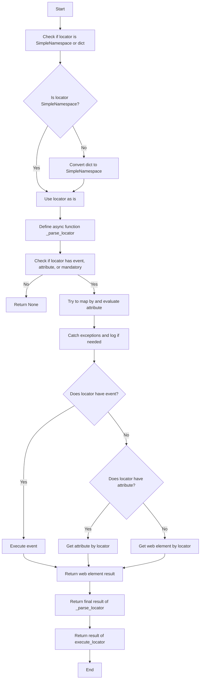
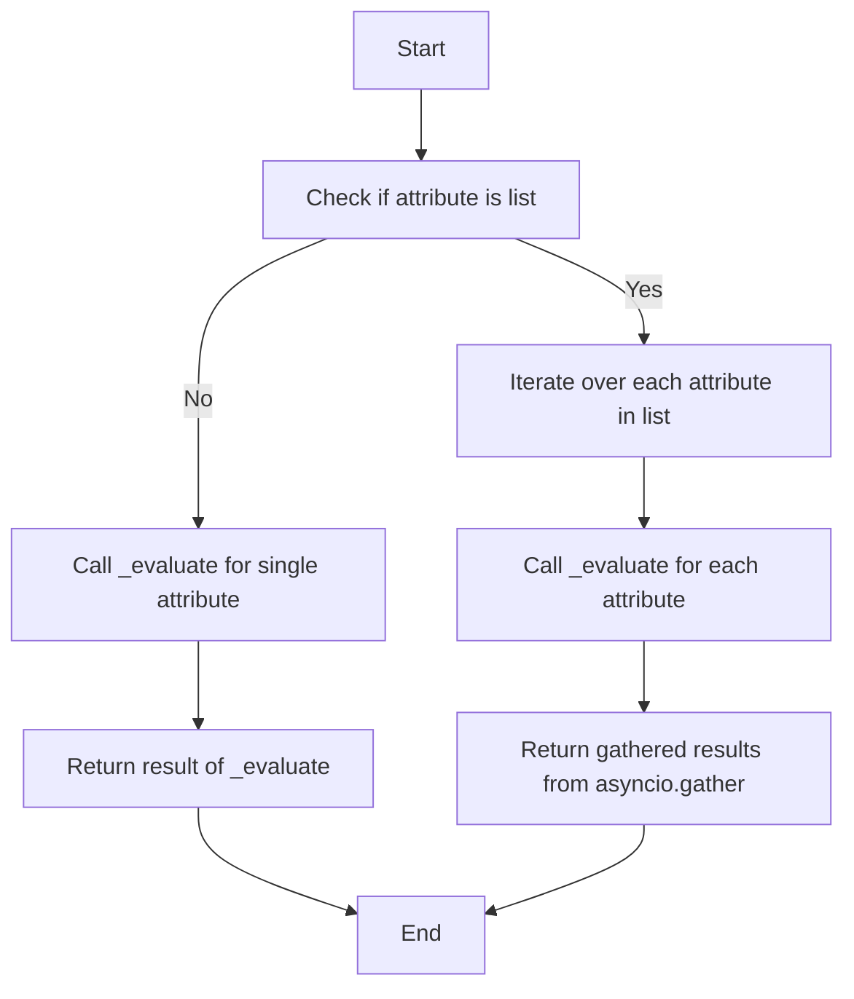
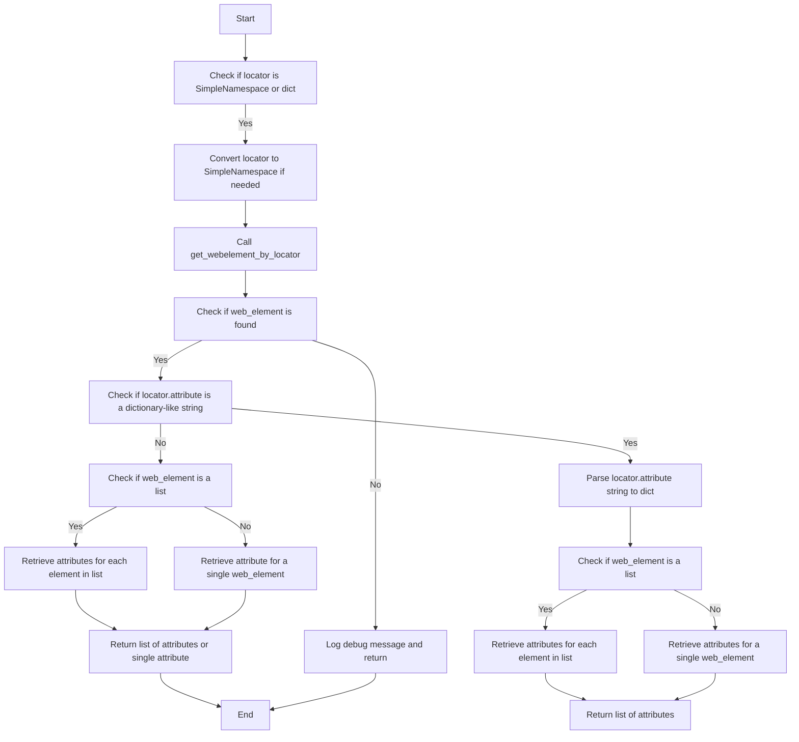

## <algorithm>

### Workflow of the `executor.py` Module

The `executor.py` module automates interactions with web elements using Selenium. Here's a breakdown of its workflow:

1.  **Initialization (`__post_init__`)**:
    *   When an `ExecuteLocator` instance is created with a `driver`, `__post_init__` initializes an `ActionChains` object.
    *   **Example**: `executor = ExecuteLocator(driver=driver)`
    *   If `self.driver` exists, it creates `self.actions = ActionChains(self.driver)`.

2.  **Executing a Locator (`execute_locator`)**:
    *   Takes a `locator` (dict or `SimpleNamespace`), `timeout`, `timeout_for_event`, `message`, `typing_speed`, and `continue_on_error`.
    *   **Example**: `result = await executor.execute_locator(locator, timeout=5)`
    *   Converts a `dict` locator to `SimpleNamespace` if needed or returns None if the locator is invalid.
    *   Defines an async inner function `_parse_locator` to handle logic of parsing locator, extracting web elements and processing them with events or attributes.
    *   Checks if the locator contains `attribute`, `selector`, or `event`. If none, it returns `None`.
    *   Within the `_parse_locator`, tries to map `by` method and evaluates attributes with `evaluate_locator`.
    *   If `locator.by` is `VALUE`, returns attribute.
    *   Executes an event using `execute_event` if `event` is present in the locator.
    *   Retrieves an attribute using `get_attribute_by_locator` if `attribute` is present.
    *   Retrieves a web element using `get_webelement_by_locator` if no event or attribute is specified.
    *   Returns the result of the `_parse_locator` function.

3.  **Evaluating a Locator (`evaluate_locator`)**:
    *   Takes an `attribute` which can be a string, a list of strings or a dictionary.
    *   **Example**: `result = await executor.evaluate_locator(attribute)`
    *   Defines an async function `_evaluate` which processes the attribute by checking if it is a `Keys` enum or just a string and handles it respectively
    *   If the `attribute` is a list, it maps over this list using `_evaluate` and uses `asyncio.gather` to collect the results and returns the results.
    *   If the `attribute` is a single element (not a list), processes it using `_evaluate` and returns result.

4.  **Getting an Attribute by Locator (`get_attribute_by_locator`)**:
    *   Takes a `locator`, `timeout`, `timeout_for_event`, `message`, `typing_speed`, and `continue_on_error`.
    *   **Example**: `attribute = await executor.get_attribute_by_locator(locator)`
    *   Converts the locator to a SimpleNamespace if it is a dictionary.
    *   Retrieves a web element using `get_webelement_by_locator`.
    *   If no web element is found, returns `None`.
    *   Defines an inner function `_parse_dict_string` to parse dictionary-like string attributes, and `_get_attributes_from_dict` to retrieve a web element attributes as a dictionary.
    *   If `locator.attribute` is a dictionary-like string, it parses the string into dict and retrieves attribute from the element using `_get_attributes_from_dict` and returns the result
    *   If it is a list of elements, then for every element it retrieves the attribute and returns the list of attributes.
    *   If it is a single web element, it retrieves the attribute of the web element by key from locator and returns it.

5.  **Getting a Web Element by Locator (`get_webelement_by_locator`)**:
    *   Takes a `locator`, `timeout`, and `timeout_for_event`.
    *   **Example**: `element = await executor.get_webelement_by_locator(locator, timeout=10)`
    *   Converts locator to SimpleNamespace if it is a dict, or raises exception if it's not a dict or SimpleNamespace.
    *  Defines inner function `_parse_elements_list` to handle logic for extracting elements from a list based on if_list property of a locator.
    *   If `timeout` is `0`, tries to get web element immediately without wait.
    *   If `timeout` is greater than 0, uses `WebDriverWait` to wait for elements based on `timeout_for_event`
    *  Returns result of `_parse_elements_list` or `None` if web elements are not found or `TimeoutException` has been raised.

6.  **Getting a Web Element as Screenshot (`get_webelement_as_screenshot`)**:
     *   Takes a `locator`, `timeout`, `timeout_for_event`, `message`, `typing_speed`, `continue_on_error` and optional `webelement`.
     *   **Example**:  `screenshot = await executor.get_webelement_as_screenshot(locator)`
     *    If `webelement` is not provided it gets one using `get_webelement_by_locator`
     *    If web element is not found returns `None`
     *    Takes screenshot with `screenshot_as_png` and returns it as byte string, or returns `None` if error was raised.

7.  **Executing an Event (`execute_event`)**:
    *   Takes a `locator`, `timeout`, `timeout_for_event`, `message`, `typing_speed`, and `continue_on_error`.
    *   **Example**: `await executor.execute_event(locator, event="click()")`
    *   Splits `locator.event` string to the list of events separated by `;`.
    *   Gets a web element with `get_webelement_by_locator`.
    *   Iterates over each event and if element found processes it, and appends the result to the list, if some error occured then returns result and breaks the loop, if no error occured - it returns `True` or a list of results from screenshot event type.
    *  Supported events:
        *   `click()`: clicks element using selenium method `click()`.
        *   `pause(duration)`: pauses the script execution for the duration specified using `asyncio.sleep(duration)`.
        *   `upload_media()`: uploads media by using `send_keys` method of selenium.
        *    `screenshot()`: takes a screenshot of an element by calling method `get_webelement_as_screenshot`
        *    `clear()`: clears input or textarea web element by using `clear()` method.
        *   `send_keys(key1+key2...)`: sends keys specified by `Keys` enum using ActionsChain API.
        *    `type(message)`: types the message using `send_keys` with optional `typing_speed`.

8.  **Sending a Message (`send_message`)**:
    *   Takes a `locator`, `timeout`, `timeout_for_event`, `message`, `typing_speed` and `continue_on_error`.
    *    **Example**: `await executor.send_message(locator, message="Hello world!")`
    *   Converts locator to SimpleNamespace if necessary.
    *   Defines inner function `type_message` which simulates typing into an input element with a specific typing speed, supporting SHIFT+ENTER by replacing `;` character.
    *   Gets a web element using `get_webelement_by_locator` and if element is found executes the `type_message` function.
    *  Returns `True` if message was successfully sent, or `None` if web element was not found.

### Flow Diagrams

The module includes Mermaid flow diagrams to illustrate the flow of execution for key methods:

-   **`execute_locator`**:

-   **`evaluate_locator`**:

-   **`get_attribute_by_locator`**:

## <explanation>

### Detailed Explanation

**Imports:**

*   **`asyncio`**: For asynchronous programming, enabling non-blocking operations.
*   **`re`**: For regular expressions, used for parsing event strings and attribute strings.
*   **`dataclasses`**: For creating data classes (`ExecuteLocator`).
*   **`enum`**: For creating enumerations (`Keys`), but not directly used in code.
*   **`pathlib`**: For handling file paths, if required.
*   **`types.SimpleNamespace`**:  For creating simple objects with attributes, used for flexible locator handling.
*   **`typing`**: For type annotations (like `Optional`, `List`, `Union`, etc.).
*   **`selenium.common.exceptions`**: For handling specific exceptions: `ElementClickInterceptedException`, `NoSuchElementException`, `TimeoutException` etc.
*   **`selenium.webdriver.common.action_chains.ActionChains`**: For creating action chains, used for complex interactions.
*   **`selenium.webdriver.common.by.By`**: For specifying how to locate elements (ID, CSS, XPath, etc.).
*   **`selenium.webdriver.common.keys.Keys`**: For sending special keys to elements (Enter, Shift, etc.).
*   **`selenium.webdriver.remote.webelement.WebElement`**: Represents a web element.
*   **`selenium.webdriver.support.expected_conditions as EC`**: For defining expected conditions, used for waits.
*   **`selenium.webdriver.support.ui.WebDriverWait`**: For explicit waits.
*   `header`: Imports custom module `header.py`
*   **`src.config.settings as gs`**: For accessing global settings, not used directly in this code but present in imports section.
*   **`src.logger.logger`**: For logging.
*   **`src.logger.exceptions`**: For custom exceptions.
*   **`src.utils.jjson`**: For JSON handling.
*   **`src.utils.printer`**: For pretty printing, used for debug logging.
*   **`src.utils.image`**:  For saving screenshot images.

**Classes:**

*   **`ExecuteLocator`**:
    *   **Purpose**: Manages interactions with web elements based on provided locators.
    *   **Attributes**:
        *   `driver` (`Optional[object]`): Selenium WebDriver instance.
        *   `actions` (`ActionChains`): ActionChains instance.
        *   `by_mapping` (`dict`): Maps locator types to Selenium's `By` methods.
        *   `mode` (`str`): Execution mode.
    *   **Methods**:
        *   `__post_init__(self)`: Initializes `ActionChains` if `driver` is provided.
        *   `execute_locator(self, locator, timeout, timeout_for_event, message, typing_speed, continue_on_error)`: Executes actions on a web element.
        *   `evaluate_locator(self, attribute)`: Evaluates locator attributes.
        *   `get_attribute_by_locator(self, locator, timeout, timeout_for_event, message, typing_speed, continue_on_error)`: Retrieves attributes.
        *   `get_webelement_by_locator(self, locator, timeout, timeout_for_event)`: Gets a web element.
        *   `get_webelement_as_screenshot(self, locator, timeout, timeout_for_event, message, typing_speed, continue_on_error, webelement)`: Takes a screenshot.
        *   `execute_event(self, locator, timeout, timeout_for_event, message, typing_speed, continue_on_error)`: Executes an event on a web element.
        *   `send_message(self, locator, timeout, timeout_for_event, message, typing_speed, continue_on_error)`: Sends a message to a web element.

**Functions:**

*   `__post_init__(self)`:
    *   **Arguments**: `self`.
    *   **Purpose**: Initializes `ActionChains` object.
    *   **Return**: `None`.
*   `execute_locator(self, locator, timeout, timeout_for_event, message, typing_speed, continue_on_error)`:
    *   **Arguments**: `locator` (dict or SimpleNamespace), `timeout` (float), `timeout_for_event`(str), `message`(str), `typing_speed`(float), `continue_on_error`(bool).
    *   **Purpose**: Executes actions based on the locator, returns the result.
    *   **Return**:  `str | list | dict | WebElement | bool`
*  `evaluate_locator(self, attribute)`:
    *   **Arguments**: `attribute` (`str | List[str] | dict`).
    *   **Purpose**: Evaluates and processes locator attributes.
    *  **Return**: `Optional[str | List[str] | dict]`.
*   `get_attribute_by_locator(self, locator, timeout, timeout_for_event, message, typing_speed, continue_on_error)`:
    *   **Arguments**: `locator` (`SimpleNamespace | dict`), `timeout` (`Optional[float]`), `timeout_for_event` (`str`), `message` (`Optional[str]`), `typing_speed` (`float`), `continue_on_error` (`bool`).
    *   **Purpose**: Retrieves attributes of a web element.
    *   **Return**: `WebElement | list[WebElement] | None`.
*   `get_webelement_by_locator(self, locator, timeout, timeout_for_event)`:
    *   **Arguments**: `locator` (`dict | SimpleNamespace`), `timeout` (`Optional[float]`), `timeout_for_event` (`Optional[str]`).
    *   **Purpose**: Retrieves a web element or a list of elements.
    *   **Return**: `WebElement | List[WebElement] | None`.
*  `get_webelement_as_screenshot(self, locator, timeout, timeout_for_event, message, typing_speed, continue_on_error, webelement)`:
     *   **Arguments**: `locator` (`SimpleNamespace | dict`), `timeout` (`float`), `timeout_for_event` (`str`), `message` (`Optional[str]`), `typing_speed` (`float`), `continue_on_error` (`bool`), `webelement` (`Optional[WebElement]`).
     *   **Purpose**: Takes a screenshot of web element and returns it as a bytes string.
     *   **Return**: `BinaryIO | None`.
*   `execute_event(self, locator, timeout, timeout_for_event, message, typing_speed, continue_on_error)`:
    *   **Arguments**: `locator` (`SimpleNamespace | dict`), `timeout` (`float`), `timeout_for_event` (`str`), `message` (`str`), `typing_speed` (`float`), `continue_on_error` (`bool`).
    *   **Purpose**: Executes an event, returns True or a list of results from screenshot event.
    *   **Return**: `str | list[str] | bytes | list[bytes] | bool`.
*  `send_message(self, locator, timeout, timeout_for_event, message, typing_speed, continue_on_error)`:
    *   **Arguments**: `locator` (`SimpleNamespace | dict`), `timeout` (`float`), `timeout_for_event` (`str`), `message` (`str`), `typing_speed` (`float`), `continue_on_error` (`bool`).
    *   **Purpose**: Sends a message to a web element using `send_keys` with a typing speed.
    *   **Return**: `bool`.

**Variables:**

*   `driver` (`Optional[object]`): Selenium WebDriver instance.
*    `actions` (`ActionChains`): ActionChains instance.
*   `by_mapping` (`dict`): Maps locator types to Selenium's `By` methods.
*   `mode` (`str`): Execution mode.
*   `locator`: Stores locator information (by, selector, event, attribute, etc.).
*   `message`: Text to send to a web element.
*  `timeout`: Float value representing maximum wait time for some operations.
*   `timeout_for_event`: String value representing type of wait condition.
*  `typing_speed`: Float value which specifies time for each character to type in seconds.
*  `continue_on_error`: Boolean value which specified to continue or not script execution if an error has occured.
* `webelement` (`Optional[WebElement]`) -  Optional parameter for passing pre-fetched web element, used by `get_webelement_as_screenshot` method.

**Potential Errors and Areas for Improvement:**

*   **Error Handling**: Some try-except blocks log the errors but then continue the script execution, which can hide issues, it can be improved.
*    **Type Hinting**: Some parts can benefit from more precise type hints.
*   **Event Parsing**: The parsing and execution of events is tightly coupled with the code and could be generalized with a more robust system of event parsing, and might use some kind of mapping for the event handlers.
*   **`send_message` implementation**: The `send_message` implementation is coupled with selenium's `ActionsChain`, and it can be improved to use `send_keys` selenium method for better performance and flexibility, and might require additional handling to support all the keys combinations.
*   **`_parse_dict_string`**: The function could be improved to handle complex cases of dictionary like strings, such as nested dictionaries, or lists of values.

**Relationship Chain with Other Parts of Project:**

*   The module belongs to the `src.webdriver` package, designed for web automation.
*   It imports settings from `src.config.settings` via `header.py` and `src` package.
*   It depends on `src.logger.logger` for logging and `src.logger.exceptions` for custom exceptions.
*   It uses `selenium` for browser interaction and `src.utils.jjson` for json processing.
*    It uses `src.utils.image` for saving images.
*   It uses `src.utils.printer` for pretty printing of debug information.

This detailed explanation should provide a comprehensive understanding of the `executor.py` module and its context within the project.