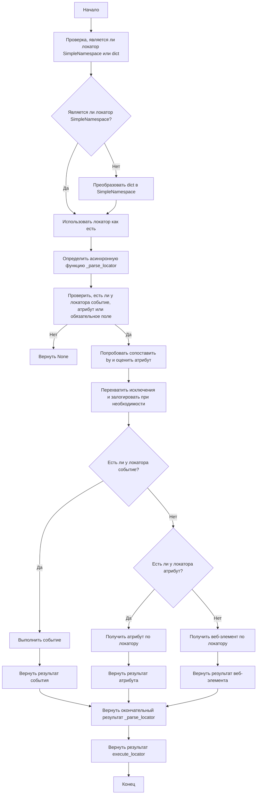
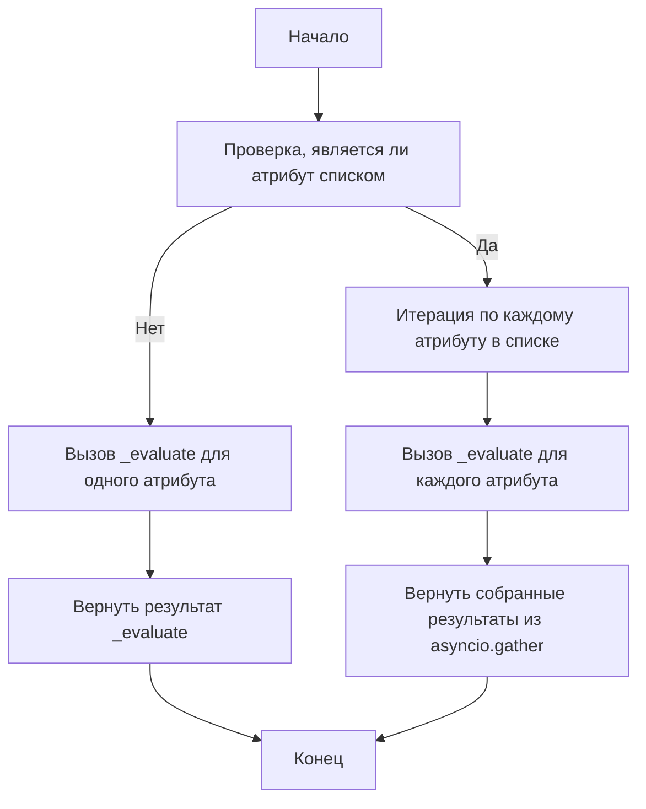
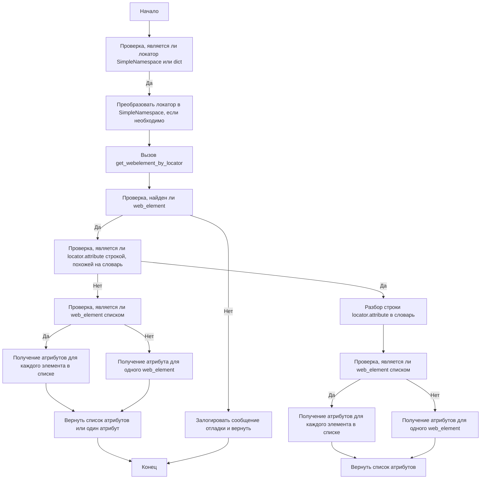

## <algorithm>

### Workflow of the `executor.py` Module

The `executor.py` module automates interactions with web elements using Selenium. Here's a step-by-step breakdown of its workflow:

1.  **Initialization (`__post_init__`)**:
    *   When an `ExecuteLocator` instance is created with a `driver`, `__post_init__` initializes an `ActionChains` object.
    *   **Example**: `executor = ExecuteLocator(driver=driver)`
    *   If `self.driver` exists, it creates `self.actions = ActionChains(self.driver)`.

2.  **Executing a Locator (`execute_locator`)**:
    *   Takes a `locator` (dict or `SimpleNamespace`), `timeout`, `timeout_for_event`, `message`, `typing_speed`, and `continue_on_error`.
    *   **Example**: `result = await executor.execute_locator(locator, timeout=5)`
    *   Converts a `dict` locator to `SimpleNamespace` if needed or returns None if the locator is invalid.
    *   Defines an async inner function `_parse_locator` to handle logic of parsing locator, extracting web elements and processing them with events or attributes.
    *   Checks if the locator contains `attribute`, `selector`, or `event`. If none, it returns `None`.
    *   Within the `_parse_locator`, tries to map `by` method and evaluates attributes with `evaluate_locator`.
    *    If `locator.by` is `VALUE`, returns attribute.
    *   Executes an event using `execute_event` if `event` is present in the locator.
    *   Retrieves an attribute using `get_attribute_by_locator` if `attribute` is present.
    *   Retrieves a web element using `get_webelement_by_locator` if no event or attribute is specified.
    *   Returns the result of the `_parse_locator` function.

3.  **Evaluating a Locator (`evaluate_locator`)**:
    *   Takes an `attribute` which can be a string, a list of strings or a dictionary.
    *   **Example**: `result = await executor.evaluate_locator(attribute)`
    *   Defines an async function `_evaluate` which processes the attribute by checking if it is a `Keys` enum or just a string and handles it respectively
    *   If the `attribute` is a list, it maps over this list using `_evaluate` and uses `asyncio.gather` to collect the results and returns the results.
    *   If the `attribute` is a single element (not a list), processes it using `_evaluate` and returns result.

4. **Getting Attribute by Locator (`get_attribute_by_locator`):**
   *    Takes a locator object which can be a dictionary or `SimpleNamespace` and returns the attributes of located elements.
   *   **Example**: `result = await executor.get_attribute_by_locator(locator)`
   *   Converts locator to `SimpleNamespace` if necessary.
   *   Gets the web element using `get_webelement_by_locator`.
   *   If the element is not found, it returns `None`.
   *   Checks if the attribute is a dictionary-like string, if yes, it parses the string to dict, then checks if element is a list.
   *   If the element is a list, it retrieves the requested attributes for each element and returns a list of attributes.
   *   If the element is not a list, it retrieves attributes for a single element.
   *    If attribute is not a dictionary like string it again checks if the web element is a list and handles it accordingly.

5.  **Getting Web Element by Locator (`get_webelement_by_locator`):**
    *   Takes a locator object (SimpleNamespace or dictionary).
    *   **Example**: `element = await executor.get_webelement_by_locator(locator)`
    *   Converts to SimpleNamespace if it is a dictionary.
    *   Uses the `by` and `selector` fields from the locator to find the element(s).
    *   Handles `locator.all` flag for finding single element or multiple.
    *   Returns the located web element(s) or `None` if not found.

6.  **Getting Web Element Screenshot (`get_webelement_as_screenshot`):**
    *  Takes a locator object (SimpleNamespace or dictionary) and returns a screenshot of the found web element.
    *    **Example**: `screenshot = await executor.get_webelement_as_screenshot(locator)`
    *    Uses `get_webelement_by_locator` to locate element.
    *    Takes a screenshot of located element.
    *    Returns byte array of screenshot or None.

7.  **Executing an Event (`execute_event`):**
    *   Takes a locator which contains an event string
    *   **Example**: `await executor.execute_event(locator)`
    *   Parses the event string and performs the desired action (click, send keys, hover, etc) with ActionsChain
    *  Handles cases when `locator.event` contains a list of events and executes all of them sequentially.

8.  **Sending a Message (`send_message`):**
    *    Takes a locator and message string to send
    *  **Example**: `await executor.send_message(locator, "test message")`
    *  Locates the web element using `get_webelement_by_locator` and sends the given message.
    * Handles case when web element is not found.

### Flow Diagrams

The module includes Mermaid flow diagrams to illustrate the flow of execution for key methods:

-   **`execute_locator`**:

-   **`evaluate_locator`**:

-   **`get_attribute_by_locator`**:

## <explanation>

### Detailed Explanation

**Imports:**

*   **`asyncio`**: For asynchronous operations, allowing non-blocking code execution.
*   **`re`**: For regular expression operations, primarily for parsing events and dictionary-like attribute strings.
*   **`dataclasses`**: For creating data classes, used to create `ExecuteLocator` class.
*   **`enum`**: For creating enumerations (`Keys`).
*   **`pathlib`**: For handling file paths, if required.
*   **`types.SimpleNamespace`**: For creating simple namespace objects, used to convert dictionaries into objects that can use dot notation.
*   **`typing`**: For type annotations, which help with code clarity and prevent type-related bugs.
*   **`selenium.webdriver.remote.webdriver.WebDriver`**:  The core class for interacting with web browsers.
*   **`selenium.webdriver.common.by.By`**: For locating elements using different strategies (e.g., ID, CSS selector).
*  **`selenium.webdriver.common.action_chains.ActionChains`**: For complex user actions on web elements (hovering, click and hold, etc.).
*   **`selenium.webdriver.support.ui.WebDriverWait`**:  For explicit waits, used to wait for specific conditions before interacting with elements.
*   **`selenium.common.exceptions`**:  For handling exceptions specific to Selenium WebDriver, such as `NoSuchElementException`, `TimeoutException` etc.
*   `header`: Imports custom module `header.py`
*   **`src.logger.logger`**:  For logging information, warnings, and errors.
*   **`src.logger.exceptions`**: Custom exceptions used by this module.
*   **`src.utils.jjson`**: For JSON handling.
*   **`src.utils.printer`**: For pretty printing, used for debug logging.
*  **`src.utils.image`**: For saving screenshots as images.

**Classes:**

*   **`ExecuteLocator`**:
    *   **Purpose**:  Central class for executing actions on web elements based on provided locators.
    *   **Attributes**:
        *   `driver` (`Optional[object]`):  Selenium WebDriver instance.
        *   `actions` (`Optional[ActionChains]`):  ActionChains instance.
        *   `by_mapping` (`dict`):  Maps locator types (string representations) to Selenium's `By` methods.
        *   `mode` (`str`):  Execution mode (`debug`, `dev`, etc.)
    *   **Methods**:
        *   `__post_init__`: Initializes the `ActionChains` object when a `driver` is provided.
        *   `execute_locator(self, locator, timeout, timeout_for_event, message, typing_speed, continue_on_error)`: Main entry point for executing actions based on the locator.
        *   `evaluate_locator(self, attribute)`: Evaluates and processes the locator's attribute(s).
        *   `get_attribute_by_locator(self, locator, timeout, timeout_for_event, message, typing_speed, continue_on_error)`: Retrieves attributes from a web element or a list of elements based on the provided locator.
        *   `get_webelement_by_locator(self, locator, timeout, timeout_for_event)`: Extracts web elements based on the provided locator.
        *   `get_webelement_as_screenshot(self, locator, timeout, timeout_for_event, message, typing_speed, continue_on_error, webelement)`: Takes a screenshot of located web element.
        *   `execute_event(self, locator, timeout, timeout_for_event, message, typing_speed, continue_on_error)`: Executes a defined event on a located element.
        *   `send_message(self, locator, timeout, timeout_for_event, message, typing_speed, continue_on_error)`: Sends a message to a web element.

**Functions:**

*   `__post_init__(self)`:
    *   **Arguments**: `self` (instance of `ExecuteLocator`).
    *   **Purpose**: Initializes ActionChains object.
    *   **Return**: `None`.
*   `execute_locator(self, locator, timeout, timeout_for_event, message, typing_speed, continue_on_error)`:
    *   **Arguments**: `locator` (dict or SimpleNamespace), `timeout` (float), `timeout_for_event`(str), `message`(str), `typing_speed`(float), `continue_on_error`(bool).
    *   **Purpose**: Executes actions on a web element based on the provided locator.
    *   **Return**:  result of the `_parse_locator` function.
*   `evaluate_locator(self, attribute)`:
    *    **Arguments**: `attribute` (`str | List[str] | dict`).
    *   **Purpose**:  Evaluates and processes the locator's attribute(s).
    *   **Return**: `Optional[str | List[str] | dict]`.
*   `get_attribute_by_locator(self, locator, timeout, timeout_for_event, message, typing_speed, continue_on_error)`:
    *   **Arguments**: `locator` (`dict | SimpleNamespace`), `timeout` (`Optional[float]`), `timeout_for_event` (`str`), `message` (`Optional[str]`), `typing_speed` (`float`), `continue_on_error` (`bool`).
    *   **Purpose**: Retrieves attributes of a web element or list of web elements.
    *   **Return**:  `WebElement | list[WebElement] | None`.
*   `get_webelement_by_locator(self, locator, timeout, timeout_for_event)`:
    *   **Arguments**: `locator` (`dict | SimpleNamespace`), `timeout` (`Optional[float]`), `timeout_for_event` (`Optional[str]`).
    *   **Purpose**:  Extracts web elements based on the locator.
    *   **Return**: `WebElement | List[WebElement] | None`.
*   `get_webelement_as_screenshot(self, locator, timeout, timeout_for_event, message, typing_speed, continue_on_error, webelement)`:
    *   **Arguments**: `locator` (`dict | SimpleNamespace`), `timeout` (`float`), `timeout_for_event` (`str`), `message` (`Optional[str]`), `typing_speed` (`float`), `continue_on_error` (`bool`), `webelement` (`Optional[WebElement]`).
    *   **Purpose**: Takes a screenshot of the web element.
    *   **Return**: `BinaryIO | None`.
*   `execute_event(self, locator, timeout, timeout_for_event, message, typing_speed, continue_on_error)`:
    *   **Arguments**: `locator` (`SimpleNamespace | dict`), `timeout` (`float`), `timeout_for_event` (`str`), `message` (`str`), `typing_speed` (`float`), `continue_on_error` (`bool`).
    *   **Purpose**:  Executes an event based on the locator.
    *   **Return**: `str | list[str] | bytes | list[bytes] | bool`.
*   `send_message(self, locator, timeout, timeout_for_event, message, typing_speed, continue_on_error)`:
    *   **Arguments**: `locator` (`SimpleNamespace | dict`), `timeout` (`float`), `timeout_for_event` (`str`), `message` (`str`), `typing_speed` (`float`), `continue_on_error` (`bool`).
    *   **Purpose**: Sends a message to a web element.
    *   **Return**: `bool`.

**Variables:**

*   `driver` (`Optional[object]`): Stores the Selenium WebDriver instance.
*    `actions` (`Optional[ActionChains]`):  Stores ActionChains object.
*   `by_mapping` (`dict`): Maps locator types to Selenium's `By` methods.
*   `mode` (`str`):  Execution mode.
*   `locator` (`SimpleNamespace` or `dict`): Contains locator information (by, selector, event, attribute, etc.).
*   `message` (`str`): The message to be sent to a web element.
*   `timeout`: Float value representing maximum wait time for some operations.
*   `timeout_for_event`: String value representing type of wait condition.
*   `typing_speed`: Float value which specifies time for each character to type in seconds.
*   `continue_on_error`: Boolean value which specified to continue or not script execution if an error has occured.
*    `webelement` (`Optional[WebElement]`): Optional web element passed to `get_webelement_as_screenshot`.

**Potential Errors and Areas for Improvement:**

*   **Error Handling**: While robust, the error handling could be expanded to include more specific exceptions and logging.
*   **Event Parsing**: The parsing and execution of events could be made more versatile by supporting more events and parameters.
*   **Locator Structure**: The current locator structure relies on dictionary-like string attribute and can be improved by using a more structured format to avoid parsing and extra checks.
*    **Type Hinting**: Some parts can benefit from more precise type hints.
*  **`send_message` Implementation**: The current implementation using `ActionChains` might be slow, using send_keys directly could improve performance.

**Relationship Chain with Other Parts of Project:**

*   This module is part of the `src.webdriver` package, which is responsible for web automation.
*   It depends on `src.logger.logger` for logging and `src.logger.exceptions` for custom exceptions.
*  It uses `selenium` for interacting with web browsers.
*    It uses `src.utils.jjson` for json processing and `src.utils.printer` for pretty print function.
*   It also depends on `src.utils.image` for image saving.
*   The module `header.py` is a dependency for accessing global settings using `from src import gs`

This detailed explanation should provide a comprehensive understanding of the `executor.py` module and how it interacts with the rest of the project.