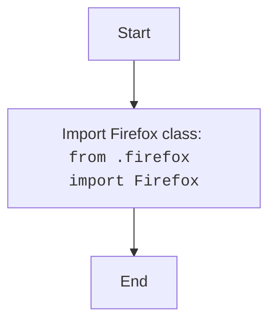

## <algorithm>

### Workflow of the `__init__.py` Module

This `__init__.py` file serves as the entry point for the `src.webdriver.firefox` package, making the `Firefox` class available for import.

1.  **Import Statement**:
    *   The module imports the `Firefox` class from the `src.webdriver.firefox.firefox` module.
    *   **Example**: `from .firefox import Firefox`
    *   This allows the `Firefox` class to be imported using `from src.webdriver.firefox import Firefox`.

## <mermaid>

### Dependencies Analysis:

1.  **`Firefox Class`**: Represents the class imported from the `firefox.py` module.

## <explanation>

### Detailed Explanation

**Imports:**

*   **`from .firefox import Firefox`**: Imports the `Firefox` class from the `firefox.py` module within the same directory.

**Classes:**

*   This module does not define any new classes.

**Functions:**

*   This module does not define any new functions.

**Variables:**

*   This module does not define any variables.

**Potential Errors and Areas for Improvement:**

*   **No Functionality**: The module is very basic and only imports a class from another module, therefore, no errors or improvements are applicable.

**Relationship Chain with Other Parts of Project:**

*   This module is a part of the `src.webdriver.firefox` package.
*  It exposes the `Firefox` class to other modules that need to work with Firefox browser.

This detailed explanation provides a comprehensive understanding of the `__init__.py` module and its role within the `src.webdriver.firefox` package.