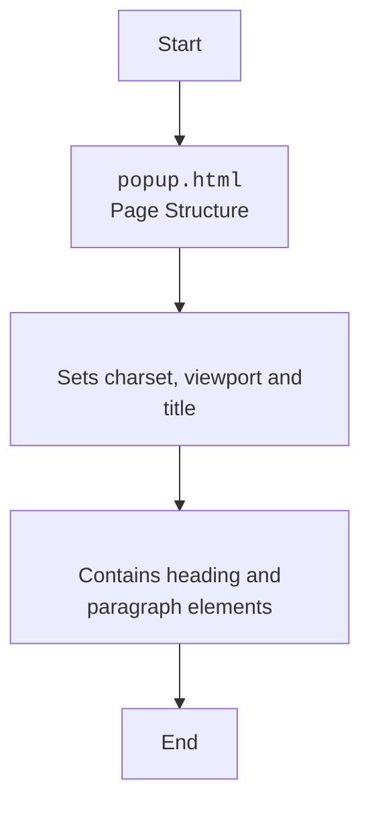

## <algorithm>

### Workflow of the `popup.html` File

This HTML file defines a simple popup for a Firefox extension named "hypotez". It displays a basic heading and paragraph as a message to the user.

1.  **HTML Structure**:
    *   The file starts with the `<!DOCTYPE html>` declaration, specifying that it's an HTML5 document.
    *   It contains an `<html>` tag with the `lang` attribute set to `"en"`, which specifies the language of the page.
    *    The `<head>` section contains meta-information for the HTML document:
        *   It sets character encoding to UTF-8, using `<meta charset="UTF-8">`.
        *   Sets the viewport settings, using `<meta name="viewport" content="width=device-width, initial-scale=1.0">`.
        *   Sets the title of the page to "Hypotez" with `<title>Hypotez</title>`.
    *   The `<body>` contains all the visible content of the page:
        *   It has a heading (`<h1>`) with the text "Hypotez".
        *   It has a paragraph (`
`) with the message "Привет, Это Давидка. Я обучаю модель".

## <mermaid>

### Dependencies Analysis:

This HTML file does not have any dependencies as it is a standalone HTML file with basic content and no external dependencies.

## <explanation>

### Detailed Explanation

**Imports:**

*   This file does not use any import statements, as it's a pure HTML file.

**Classes:**

*   This file does not define any classes.

**Functions:**

*   This file does not define any functions.

**Variables:**

*   `MODE` (`str`): String variable set to `"debug"`, which is not used in the provided code.

**Potential Errors and Areas for Improvement:**

*   **Hardcoded `MODE`**: The `MODE` variable is hardcoded and not used in the code, and it would be better to remove it.
*   **Basic Structure**: The HTML file has a very basic structure, and can be improved by using more structure, CSS for styling, and interactive components.
*  **Limited Functionality**: The file has very basic functionality and it would be better to add some more useful logic to make it more usable.

**Relationship Chain with Other Parts of Project:**

*   This module is a part of the firefox extension and is the popup page, and therefore has no relations with other modules besides the fact that it's going to be used as a frontend view for the extension.

This detailed explanation provides a comprehensive understanding of the `popup.html` file and its basic role as a simple popup for a Firefox extension.