## <algorithm>

### Workflow of Locators and Their Interaction with `executor`

This document describes how locators are defined and how they interact with the `executor`. Locators are configuration objects that instruct the `ExecuteLocator` class on how to find and interact with web elements.

1.  **Locator Definition**:
    *   Locators are defined as JSON objects or dictionaries that specify various parameters for finding and interacting with a web element.
    *   **Example**:
        ```json
        "close_banner": {
          "attribute": null,
          "by": "XPATH",
          "selector": "//button[@id = 'closeXButton']",
          "if_list": "first",
          "use_mouse": false,
          "mandatory": false,
          "timeout": 0,
          "timeout_for_event": "presence_of_element_located",
          "event": "click()",
          "locator_description": "Close the pop-up window, if it does not appear - it's okay (`mandatory`:`false`)"
        }
        ```

2.  **Locator Keys**:
    *   **`attribute`**: Specifies which attribute to extract or set, if any. Can be `null` or a string.
        *   Example: `"attribute": "src"` or `"attribute": null`
    *   **`by`**: Specifies the method to use to locate the element (e.g., `XPATH`, `ID`, `VALUE`).
        *   Example: `"by": "XPATH"` or `"by": "VALUE"`
    *   **`selector`**: The locator string used to find the element (e.g., XPath expression, CSS selector). Can be `null` if by is equal to `VALUE`.
        *   Example: `"selector": "//button[@id = 'closeXButton']"`
    *   **`if_list`**: Specifies how to handle a list of elements (e.g., `"first"`, `"all"`, `"last"`).
        *  Example: `"if_list": "first"`
    *   **`use_mouse`**: Flag indicating whether mouse interaction should be used (`true` or `false`).
        *   Example: `"use_mouse": false`
    *   **`mandatory`**: Flag indicating whether the action is mandatory (`true` or `false`).
        *   Example: `"mandatory": true`
    *   **`timeout`**: Specifies how long to wait for element to appear, defaults to 0.
        * Example: `"timeout": 10`
    *  **`timeout_for_event`**: Type of wait condition, used to wait for element to appear.
        *  Example: `"timeout_for_event": "presence_of_element_located"`
    *   **`event`**: Specifies which action to perform (`null` or  a string like `click()`, `screenshot()`, `send_keys()`).
        *   Example: `"event": "click()"` or  `"event": null`
    *   **`locator_description`**: A description of the locator for documentation.

3.  **Interaction with `executor`**:
    *   The `ExecuteLocator` class processes the locators to perform specific actions.
    *   The locators are usually passed as a dictionary or `SimpleNamespace` to methods of `ExecuteLocator`.
    *   **Example**: `executor.execute_locator(locator)`
    *   The workflow is as follows:
        1.  **Locator Parsing**: The `executor` converts the input to `SimpleNamespace` if it's a dictionary for convenient access to locator keys.
            * If the locator is not a dictionary or `SimpleNamespace` returns `None`.
        2.  **Element Location**:
            *   If `by` is not set to `VALUE`, the `executor` will attempt to locate elements using the specified method (`by`) and selector (`selector`).
            *   If `by` is set to `VALUE` no web element will be searched.
        3.  **Action Execution**:
            *   If `event` key is specified, `executor` will call corresponding method, or returns the value of `attribute` if `by` is equal to `VALUE`.
            *   Supported actions: `click()`, `screenshot()`, `send_keys(key1+key2)`, `type()`, `pause()`.
        4.  **Attribute Extraction**: If the `attribute` key is specified (and `by` not equals `VALUE`), the `executor` will extract the attribute value.
        5.  **Error Handling**:
            *   If element is not found and `mandatory` is `false` the execution will continue.
            *  If element is not found and `mandatory` is `true`, error will be raised.

4.  **Example Locator Workflows**:
    *   **`close_banner`**:
        *   The `executor` attempts to find a button element and perform a click.
        *   If the element is not found, the `executor` continues because the action is optional.
    *   **`id_manufacturer`**:
        *   The `executor` does not search the page, instead it immediately returns the value set in attribute which equals 11290.
    *  **`additional_images_urls`**:
        *  The `executor` will find all img elements within the given XPATH selector and extract `src` attribute from them.
        *   If the elements are not found, the execution will continue.
    *   **`default_image_url`**:
        *   The `executor` will find the img element with the given XPATH selector and creates a screenshot of this element, which is returned as byte array, if the element is not found an error is raised.
    *   **`id_supplier`**:
         *   The `executor` will find the span element and extract the text (`innerText`) content of this element.
         *   If the element is not found, an error will be raised.

```mermaid
flowchart TD
    Start[Start] --> DefineLocator[Define Locator as JSON or dict]
    DefineLocator --> SetKeys[Set Locator Keys]
    SetKeys --> AttributeKey{Is 'attribute' key present?}
    AttributeKey -- Yes --> HandleAttribute[Set attribute value]
    AttributeKey -- No --> ByKey{Is 'by' key present?}
    ByKey -- Yes --> HandleBy[Set locator type]
    ByKey -- No --> SelectorKey{Is 'selector' key present?}
    SelectorKey -- Yes --> HandleSelector[Set locator selector]
    SelectorKey -- No --> IfListKey{Is 'if_list' key present?}
    IfListKey -- Yes --> HandleIfList[Set if_list strategy]
    IfListKey -- No --> UseMouseKey{Is 'use_mouse' key present?}
     UseMouseKey -- Yes --> HandleUseMouse[Set use_mouse flag]
    UseMouseKey -- No --> MandatoryKey{Is 'mandatory' key present?}
    MandatoryKey -- Yes --> HandleMandatory[Set mandatory flag]
     MandatoryKey -- No --> TimeoutKey{Is 'timeout' key present?}
     TimeoutKey -- Yes --> HandleTimeout[Set timeout]
    TimeoutKey -- No --> TimeoutForEventKey{Is 'timeout_for_event' key present?}
     TimeoutForEventKey -- Yes --> HandleTimeoutForEvent[Set timeout_for_event]
     TimeoutForEventKey -- No --> EventKey{Is 'event' key present?}
     EventKey -- Yes --> HandleEvent[Set event action]
    EventKey -- No --> LocatorDescriptionKey{Is 'locator_description' key present?}
    LocatorDescriptionKey -- Yes --> HandleDescription[Set description]
      LocatorDescriptionKey -- No --> End[End]
    HandleAttribute --> ByKey
    HandleBy --> SelectorKey
    HandleSelector --> IfListKey
    HandleIfList --> UseMouseKey
     HandleUseMouse --> MandatoryKey
     HandleMandatory --> TimeoutKey
    HandleTimeout --> TimeoutForEventKey
     HandleTimeoutForEvent --> EventKey
     HandleEvent --> LocatorDescriptionKey
    HandleDescription --> End
    
   subgraph Global Dependencies
        classDef global fill:#f9f,stroke:#333,stroke-width:2px
    
       End:::global
    end
```

## <mermaid>



### Dependencies Analysis:

1.  **Global Dependencies**: Represents the output of the workflow.
    *   **`End`**:  Represents the final step of the workflow, indicating that all of the locator parameters has been set.

## <explanation>

### Detailed Explanation

**Locators:**

*   Locators are data structures (JSON objects or Python dictionaries) that specify how to find and interact with web elements.
*   They consist of a set of keys that describe the element, the action to be performed, and other parameters.

**Locator Keys:**

*   `attribute`: The attribute of the element to extract (e.g., `src`, `innerText`). If `by` key is equal to `VALUE` it is used as return value.
*   `by`: The method used to locate the element (e.g., `XPATH`, `ID`, `VALUE`, `CSS_SELECTOR`).
*   `selector`: The locator string used to find the element (e.g., XPath expression or CSS selector). Should be `null` if `by` is equal to `VALUE`.
*   `if_list`: Specifies how to handle lists of elements if multiple elements match the locator (e.g., `first`, `all`, `last`, `odd`, `even`).
*   `use_mouse`: Flag indicating whether mouse interaction should be used.
*   `mandatory`: Flag indicating whether the action is mandatory.
*   `timeout`: Time to wait for an element to appear.
*   `timeout_for_event`: Type of wait condition used to wait for element to appear, like `presence_of_element_located` or `element_to_be_clickable`.
*  `event`: Type of action to perform on element, could be `null` or string like `click()`, `screenshot()`, `send_keys()` etc.
*   `locator_description`: Description of the locator.

**Interaction with `executor`:**

*   The `ExecuteLocator` class receives a locator as a dictionary or a `SimpleNamespace` object.
*   The `executor` uses the `by` and `selector` keys to locate the web element(s) on the page.
*   If the `event` key is present it executes a specified action.
*   If the `attribute` key is present, it extracts the corresponding attribute value.
*   The `if_list` key specifies how to handle the web element if multiple elements are found.
*   The `mandatory` key determines whether to continue execution if the element is not found. If set to true, the `ExecuteLocator` will raise error, otherwise, it will return `None` and continue execution.
*    The `timeout` key specifies the amount of time to wait for element to appear, if it's set to zero, no waiting will happen, otherwise, `WebDriverWait` method will be used.
*   The `timeout_for_event` specifies the type of wait condition to apply to `WebDriverWait`.

**Examples of Locators:**

*   `close_banner`: Example of a locator that finds a button element and clicks it. The action is optional, so if the element is not found, the execution continues.
*    `id_manufacturer`: Example of a locator that returns the value set in `attribute` without searching web page for an element.
*   `additional_images_urls`: Example of a locator that extracts the `src` attributes from a list of image elements, this action is optional.
*   `default_image_url`: Example of a locator that takes a screenshot of an image element and returns a byte array, this action is mandatory.
*   `id_supplier`: Example of a locator that extracts the inner text from a web element, this action is mandatory.

**Relationship Chain with Other Parts of Project:**

*   Locators are used by the `ExecuteLocator` class which is part of the `src.webdriver.executor` module.
*   They define configuration for actions of the `ExecuteLocator`.
*   Locators are usually defined as json configuration files.

This analysis provides a detailed explanation of how locators are defined and used in conjunction with the `ExecuteLocator` class to automate interactions with web elements.