## <algorithm>

### Workflow of Locators and Their Interaction with `executor`

This document explains how locators are structured and how they interact with the `executor`. Locators are configuration objects that instruct the `ExecuteLocator` class on how to find and interact with web elements.

1.  **Locator Definition**:
    *   Locators are defined as JSON objects or dictionaries.
    *   **Example**:
        ```json
        "close_banner": {
          "attribute": null,
          "by": "XPATH",
          "selector": "//button[@id = 'closeXButton']",
          "if_list": "first",
          "use_mouse": false,
          "mandatory": false,
          "timeout": 0,
          "timeout_for_event": "presence_of_element_located",
          "event": "click()",
          "locator_description": "Закрываю pop-up окно, если оно не появилось - не страшно (`mandatory`:`false`)"
        }
        ```

2.  **Locator Keys**:
    *   **`attribute`**: Specifies which attribute to extract or set, if any. Can be `null` or a string or a dict.
        *   Example: `"attribute": "src"`, `"attribute": null` or  `"attribute": "{attr1:attr2}"`
    *   **`by`**: Specifies the method to use to locate the element (e.g., `XPATH`, `ID`, `VALUE`, etc.).
        *   Example: `"by": "XPATH"` or `"by": "VALUE"`
    *   **`selector`**: The locator string used to find the element (e.g., XPath expression, CSS selector). Should be `null` if by equals `VALUE`.
        *   Example: `"selector": "//button[@id = 'closeXButton']"`
    *   **`if_list`**: Specifies how to handle a list of elements (e.g., `"first"`, `"all"`, `"last"`, `"odd"`, `"even"`, or int index).
        *  Example: `"if_list": "first"`
    *   **`use_mouse`**: Flag indicating whether mouse interaction should be used (`true` or `false`).
        *   Example: `"use_mouse": false`
    *   **`mandatory`**: Flag indicating whether the action is mandatory (`true` or `false`).
        *   Example: `"mandatory": true`
    *   **`timeout`**: Specifies how long to wait for element to appear, defaults to `0`.
        *  Example: `"timeout": 10`
    *   **`timeout_for_event`**: Type of wait condition.
        *  Example: `"timeout_for_event": "presence_of_element_located"`
    *   **`event`**: Specifies which action to perform (`null` or  a string like `click()`, `screenshot()`, `send_keys()`).
        *   Example: `"event": "click()"` or  `"event": null`
    *   **`locator_description`**: A description of the locator.
        *  Example: `"locator_description": "Some description here"`

3.  **Interaction with `executor`**:
    *   The `ExecuteLocator` class processes locators.
    *   Locators are usually passed as a dictionary or `SimpleNamespace` to methods of `ExecuteLocator`.
    *   **Example**: `executor.execute_locator(locator)`
    *   The workflow:
        1.  **Locator Parsing**: The `executor` converts the input to `SimpleNamespace` if it's a dictionary. Returns `None` if it is not dict or `SimpleNamespace` object.
        2.  **Element Location**: If `by` is not `VALUE`, the `executor` locates elements using the `by` and `selector`. If `by` is equal to `VALUE` no web element will be searched for.
        3.  **Action Execution**: If `event` is specified, performs corresponding action or returns the value of attribute if `by` equals to `VALUE`.
            *   Supported actions: `click()`, `screenshot()`, `send_keys(key1+key2)`, `type()`, `pause()`, `upload_media()`.
        4.  **Attribute Extraction**: If `attribute` is specified (and by not equal to `VALUE`), extracts the attribute value from the located elements.
        5.  **Error Handling**: If an element is not found and `mandatory` is `false`, continues execution, otherwise - raises an exception.

4.  **Example Locator Workflows**:
    *   **`close_banner`**:
        *   The `executor` finds a button element and clicks it.
        *   Continues execution if the element is not found (`mandatory: false`).
    *   **`id_manufacturer`**:
        *   The `executor` returns the value of `attribute` (11290) without interacting with web page.
    *  **`additional_images_urls`**:
        *   The `executor` finds image elements and extracts the `src` attribute of found elements, returns them as a list.
        *   Continues if the elements are not found.
    *   **`default_image_url`**:
        *   The `executor` finds the element and takes a screenshot of it.
        *   Raises an error if the element is not found (`mandatory: true`).
    *   **`id_supplier`**:
        *   The `executor` finds the span element and extracts the inner text.
        *    Raises an error if the element is not found (`mandatory: true`).

```mermaid
flowchart TD
    Start[Начало] --> DefineLocator[Определение локатора как JSON или dict]
    DefineLocator --> SetKeys[Установка ключей локатора]
    SetKeys --> AttributeKey{Присутствует ли ключ 'attribute'?}
    AttributeKey -- Да --> HandleAttribute[Установить значение атрибута]
    AttributeKey -- Нет --> ByKey{Присутствует ли ключ 'by'?}
    ByKey -- Да --> HandleBy[Установить тип локатора]
    ByKey -- Нет --> SelectorKey{Присутствует ли ключ 'selector'?}
    SelectorKey -- Да --> HandleSelector[Установить селектор локатора]
    SelectorKey -- Нет --> IfListKey{Присутствует ли ключ 'if_list'?}
    IfListKey -- Да --> HandleIfList[Установить стратегию if_list]
    IfListKey -- Нет --> UseMouseKey{Присутствует ли ключ 'use_mouse'?}
     UseMouseKey -- Да --> HandleUseMouse[Установить флаг use_mouse]
    UseMouseKey -- Нет --> MandatoryKey{Присутствует ли ключ 'mandatory'?}
    MandatoryKey -- Да --> HandleMandatory[Установить флаг mandatory]
     MandatoryKey -- Нет --> TimeoutKey{Присутствует ли ключ 'timeout'?}
     TimeoutKey -- Да --> HandleTimeout[Установить таймаут]
    TimeoutKey -- Нет --> TimeoutForEventKey{Присутствует ли ключ 'timeout_for_event'?}
     TimeoutForEventKey -- Да --> HandleTimeoutForEvent[Установить timeout_for_event]
     TimeoutForEventKey -- Нет --> EventKey{Присутствует ли ключ 'event'?}
     EventKey -- Да --> HandleEvent[Установить действие события]
    EventKey -- Нет --> LocatorDescriptionKey{Присутствует ли ключ 'locator_description'?}
    LocatorDescriptionKey -- Да --> HandleDescription[Установить описание]
      LocatorDescriptionKey -- Нет --> End[Конец]
    HandleAttribute --> ByKey
    HandleBy --> SelectorKey
    HandleSelector --> IfListKey
    HandleIfList --> UseMouseKey
     HandleUseMouse --> MandatoryKey
     HandleMandatory --> TimeoutKey
    HandleTimeout --> TimeoutForEventKey
     HandleTimeoutForEvent --> EventKey
     HandleEvent --> LocatorDescriptionKey
    HandleDescription --> End
    
    
       subgraph Global Dependencies
        classDef global fill:#f9f,stroke:#333,stroke-width:2px
        
       End:::global
        
    end
```

## <mermaid>



### Dependencies Analysis:

1.  **Global Dependencies**: Represents the output of the workflow.
    *   **`End`**:  Represents the final step of the workflow, indicating that all locator parameters has been set.

## <explanation>

### Detailed Explanation

**Locators:**

*   Locators are configuration objects (JSON or Python dict) that specify how to find and interact with web elements.
*   They consist of keys that define the element, actions to perform, and other parameters.

**Locator Keys:**

*   `attribute`: Attribute of the element to extract or set (e.g., `src`, `innerText`). Used as a return value when `by` is equal to `VALUE`.
*   `by`: Method used to locate the element (e.g., `XPATH`, `ID`, `VALUE`, `CSS_SELECTOR`, etc).
*   `selector`: The locator string (XPath or CSS selector) used to find the element. Should be set to `null` if `by` equals to `VALUE`.
*   `if_list`: How to handle a list of elements (e.g., `first`, `all`, `last`, `odd`, `even`, or int index).
*   `use_mouse`: A boolean flag for using mouse interactions.
*   `mandatory`: Boolean flag that indicates if the action is mandatory. If set to `true` an error will be raised if element is not found, if set to `false` the action will be skipped.
*   `timeout`: How long to wait for element to appear, specified in seconds, if set to `0`, no waiting will happen.
*   `timeout_for_event`:  String describing the type of wait condition used when `timeout` is greater than `0`.
*   `event`: The action to perform (`null`, or a string like `click()`, `screenshot()`, `send_keys()`, `type()`, `pause()`, `upload_media()`).
*   `locator_description`: A description of what the locator is for.

**Interaction with `executor`:**

*   The `ExecuteLocator` class uses locators to perform various actions on a web page.
*   The `executor` parses the locator by converting it to a `SimpleNamespace`.
*   If the `by` key is set to `VALUE`, the `executor` returns the value set in the `attribute` key, without searching for a web element.
*   If the `by` key is not `VALUE`, the `executor` uses the `by` and `selector` to locate the element(s).
*  If the `event` key is defined the executor executes the action using `ActionChains` class if necessary.
*   If the `attribute` key is defined the `executor` attempts to extract the attribute from located elements.
*  If the element is not found and `mandatory` is `false`, the `executor` continues execution, otherwise, it raises an error.
*   The `if_list` key specifies how to handle multiple found elements when used.
*   The `timeout` key is used to specify how long should wait for an element to appear.
*   The `timeout_for_event` key specifies the type of wait condition that is applied to `WebDriverWait`.

**Example Locators:**

*   **`close_banner`**: Closes a pop-up window (if it appears) using click event. Action is optional.
*   **`id_manufacturer`**: Returns the value set in `attribute` key. No web element is searched for.
*   **`additional_images_urls`**: Extracts the `src` attributes from a list of image elements, the action is optional.
*   **`default_image_url`**: Takes a screenshot of an element. The action is mandatory.
*   **`id_supplier`**: Extracts the `innerText` from a web element. The action is mandatory.

**Relationship Chain with Other Parts of Project:**

*   Locators are used by the `ExecuteLocator` class from the `src.webdriver.executor` module, which provides a way to interact with web elements.
*   Locators define the configuration on how to find web elements and how to interact with them.
*  Locators are typically loaded from a json files, which are parsed by `src.utils.jjson.j_loads` function.

This detailed analysis provides a comprehensive understanding of how locators are used within the project for web automation tasks.