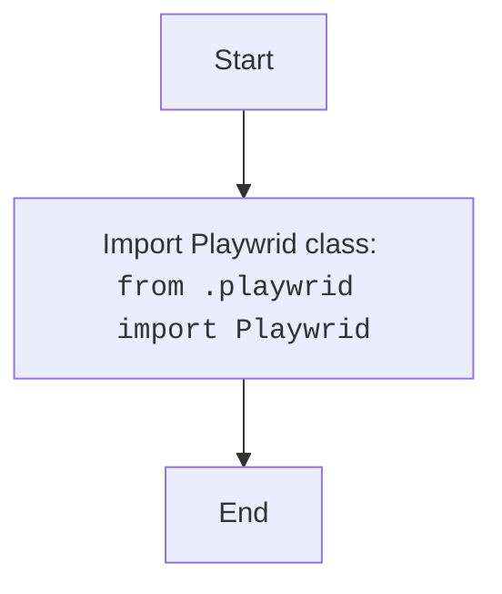

## <algorithm>

### Workflow of the `__init__.py` Module

This `__init__.py` file serves as the entry point for the `src.webdriver.playwright` package, making the `Playwrid` class available for import.

1.  **Import Statement**:
    *   The module imports the `Playwrid` class from the `src.webdriver.playwright.playwrid` module.
    *   **Example**: `from .playwrid import Playwrid`
    *   This allows importing the `Playwrid` class using `from src.webdriver.playwright import Playwrid`.

## <mermaid>

### Dependencies Analysis:

1.  **`Playwrid Class`**: Represents the class imported from the `playwrid.py` module.

## <explanation>

### Detailed Explanation

**Imports:**

*   **`from .playwrid import Playwrid`**: Imports the `Playwrid` class from the `playwrid.py` module, located in the same directory.

**Classes:**

*   This module does not define any new classes.

**Functions:**

*   This module does not define any new functions.

**Variables:**

*   This module does not define any variables.

**Potential Errors and Areas for Improvement:**

*   **No Functionality**: This module is very simple and only imports a class from another module. There is no functionality in the module itself.

**Relationship Chain with Other Parts of Project:**

*   This module is part of the `src.webdriver.playwright` package.
*   It makes `Playwrid` class available to other modules by exporting it.

This detailed explanation provides a comprehensive understanding of the `__init__.py` module and its role as an entry point for the `src.webdriver.playwright` package.