## <algorithm>

### Workflow of WebDriver Configurations

This document outlines the configurations for various web drivers and a parser available in the project. These configurations are typically stored in JSON files and used to initialize web automation tools.

1.  **Firefox WebDriver Configuration**:
    *   **Input**: `firefox.json` file.
    *   **Process**: Reads configuration from `firefox.json`.
    *   Defines settings for Firefox browser automation.
        *   `options`:  Browser options (e.g., `"--kiosk"`, `"--headless"`).
        *   `profile_directory`: Path to the Firefox profile.
            *  `os`:  OS-specific path (e.g. `%LOCALAPPDATA%\\Mozilla\\Firefox\\Profiles\\default`).
             *  `internal`: Project relative path (e.g. `"webdriver\\firefox\\profiles\\default"`).
        *   `executable_path`: Paths to the `firefox.exe` and `geckodriver.exe` files.
            *  `firefox_binary` - path to the executable of `firefox.exe`
            * `geckodriver` - path to the `geckodriver.exe`
         *  `headers`: Dictionary with custom headers.
            *  `User-Agent` - defines user agent header.
            *  `Accept` - defines accept header.
         *  `proxy_enabled` - boolean value to define if proxy is enabled or not.
    *   **Output**: Configuration for Firefox WebDriver.

2.  **Chrome WebDriver Configuration**:
    *   **Input**: `chrome.json` file.
    *   **Process**: Reads configuration from `chrome.json`.
    *    Defines settings for Chrome browser automation.
        *   `options`: Browser options (e.g., `"--headless"`, `"--disable-gpu"`).
         *   `profile_directory`: Path to the Chrome profile.
            *  `os`:  OS-specific path (e.g. `%LOCALAPPDATA%\\Google\\Chrome\\User Data\\Default`).
            *   `internal`: Project relative path (e.g. `"webdriver\\chrome\\profiles\\default"`).
        *   `executable_path`: Paths to the `chrome.exe` and `chromedriver.exe` files.
            *   `chrome_binary` - path to the executable of `chrome.exe`.
            *   `chromedriver` - path to the `chromedriver.exe`.
         *   `headers`: Dictionary with custom headers.
            *   `User-Agent` - defines user agent header.
            *   `Accept` - defines accept header.
        *   `proxy_enabled` - boolean value to define if proxy is enabled or not.
    *   **Output**: Configuration for Chrome WebDriver.

3.  **Edge WebDriver Configuration**:
    *   **Input**: `edge.json` file.
    *   **Process**: Reads configuration from `edge.json`.
    *   Defines settings for Microsoft Edge browser automation.
        *   `options`: Browser options (e.g., `"--headless"`, `"--disable-gpu"`).
         *   `profiles`: Path to the Edge profile.
            *  `os`:  OS-specific path (e.g. `%LOCALAPPDATA%\\Microsoft\\Edge\\User Data\\Default`).
            *  `internal`: Project relative path (e.g. `"webdriver\\edge\\profiles\\default"`).
        *   `executable_path`: Paths to the `edge.exe` and `msedgedriver.exe` files.
            *    `edge_binary` - path to the executable of `edge.exe`.
            *   `edgedriver` - path to the `msedgedriver.exe`.
        *   `headers`: Dictionary with custom headers.
            *   `User-Agent` - defines user agent header.
            *    `Accept` - defines accept header.
         *  `proxy_enabled` - boolean value to define if proxy is enabled or not.
    *   **Output**: Configuration for Edge WebDriver.

4.  **Playwright Crawler Configuration**:
    *   **Input**: `playwrid.json` file.
    *   **Process**: Reads configuration from `playwrid.json`.
    *   Defines settings for Playwright browser automation.
        *   `max_requests`: Maximum number of requests.
        *   `headless`: Boolean for headless mode.
        *   `browser_type`: Type of browser (`chromium`, `firefox`, `webkit`).
        *   `options`: List of options for playwright browser.
         *   `user_agent`: Custom user-agent string.
         *   `proxy`: Proxy settings:
             *   `enabled`: Boolean value to define if proxy is enabled or not.
             *  `server`: Proxy URL (e.g. `http://proxy.example.com:8080`).
             *   `username`: Proxy username.
              *  `password`: Proxy password.
        *   `viewport`: Browser window viewport.
            *   `width` - width of viewport.
            *   `height` - height of viewport.
         *   `timeout`: Timeout for requests.
         *   `ignore_https_errors`: Flag for ignoring HTTPS errors.
    *   **Output**: Configuration for Playwright crawler.

5.  **BeautifulSoup and XPath Parser Configuration**:
    *   **Input**: `bs.json` file.
    *   **Process**: Reads configuration from `bs.json`.
    *    Defines settings for BeautifulSoup and XPath Parser.
        *   `default_url`: Default URL for loading HTML.
        *   `default_file_path`: Default path for loading HTML from local file.
        *   `default_locator`: Default locator for extracting elements.
            *   `by` - locator type (e.g. `ID`, `XPATH`, etc.)
            *   `attribute` - attribute for extracting.
             *   `selector` - locator string (xpath expression, css selector, etc.)
        *    `logging`: Logging settings (level, file).
           *   `level`: level of the logging.
            *    `file` - file to store logs.
         *   `proxy`: Proxy server settings.
            *  `enabled`: Boolean value to define if proxy is enabled or not.
             *   `server`: Proxy server url (e.g. `http://proxy.example.com:8080`).
            *   `username`: proxy username.
            *   `password`: proxy password.
        *   `timeout`: Timeout for requests.
        *   `encoding`: Encoding for reading files or requests.
    *   **Output**: Configuration for BeautifulSoup and XPath parser.

```mermaid
flowchart TD
    subgraph Firefox WebDriver
        A[Load `firefox.json`] --> B[Set Browser Options]
         B --> C[Set Profile Directory]
         C --> D[Set Executable Paths]
         D --> E[Set Headers]
         E --> F[Set Proxy Enabled]
         F --> G[Firefox Config Ready]
    end
    
    subgraph Chrome WebDriver
        H[Load `chrome.json`] --> I[Set Browser Options]
         I --> J[Set Profile Directory]
         J --> K[Set Executable Paths]
         K --> L[Set Headers]
         L --> M[Set Proxy Enabled]
         M --> N[Chrome Config Ready]
    end
    
     subgraph Edge WebDriver
        O[Load `edge.json`] --> P[Set Browser Options]
         P --> Q[Set Profile Directory]
         Q --> R[Set Executable Paths]
         R --> S[Set Headers]
        S --> T[Set Proxy Enabled]
         T --> U[Edge Config Ready]
    end
    
    subgraph Playwright Crawler
        V[Load `playwrid.json`] --> W[Set Max Requests]
         W --> X[Set Headless mode]
         X --> Y[Set Browser Type]
        Y --> Z[Set Playwright Options]
        Z --> AA[Set User Agent]
        AA --> BB[Set Proxy Options]
        BB --> CC[Set Viewport Options]
        CC --> DD[Set Timeout]
       DD --> EE[Set Ignore HTTPS errors]
        EE --> FF[Playwright Config Ready]
    end
    
     subgraph BeautifulSoup and XPath Parser
        GG[Load `bs.json`] --> HH[Set Default URL]
         HH --> II[Set Default File Path]
         II --> JJ[Set Default Locator]
        JJ --> KK[Set Logging Options]
        KK --> LL[Set Proxy Options]
       LL --> MM[Set Timeout]
       MM --> NN[Set Encoding]
        NN --> OO[BeautifulSoup Config Ready]
    end
    
    
     subgraph Global Dependencies
        classDef global fill:#f9f,stroke:#333,stroke-width:2px
    
        OO:::global
        FF:::global
        U:::global
        N:::global
        G:::global
    end
```

## <mermaid>

### Dependencies Analysis:

1.  **Global Dependencies**: Represents the outputs of configurations.
    *   **`OO`**: Configuration ready for BeautifulSoup and XPath Parser.
    *   **`FF`**: Configuration ready for Playwright crawler.
    *   **`U`**: Configuration ready for Edge WebDriver.
    *   **`N`**: Configuration ready for Chrome WebDriver.
    *  **`G`**: Configuration ready for Firefox WebDriver.

## <explanation>

### Detailed Explanation

**Module Overview:**

This document provides an overview of all web drivers and parser available in the project, along with their respective configurations. Each driver and parser has its own JSON configuration file.

**Configurations:**

1.  **Firefox WebDriver:**
    *   **Description:** Configuration for working with the Firefox browser.
    *   **Settings:**
        *   `options`: List of command-line options for Firefox.
        *   `profile_directory`: Dictionary containing the OS-specific and internal path to the profile.
            *   `os` - os specific path to the profile.
            *   `internal` - path relative to the project to the profile.
        *    `executable_path`: Dictionary containing paths to executables:
             *   `firefox_binary` - path to the `firefox.exe`.
            *   `geckodriver` - path to the `geckodriver.exe`.
        *   `headers`: Custom HTTP headers (e.g., `User-Agent`).
        *  `proxy_enabled`: flag if proxy is enabled.
    *  **Example**: `firefox.json`

2.  **Chrome WebDriver:**
    *   **Description**: Configuration for working with Google Chrome.
    *   **Settings:**
        *   `options`: List of command-line options for Chrome.
         *   `profile_directory`: Dictionary containing the OS-specific and internal path to the profile.
             *   `os` - os specific path to the profile.
             *   `internal` - path relative to the project to the profile.
        *   `executable_path`: Dictionary containing paths to executables:
           *    `chrome_binary` - path to the `chrome.exe` executable.
            *   `chromedriver` - path to the `chromedriver.exe`.
         *  `headers`: Custom HTTP headers (e.g., `User-Agent`).
         *  `proxy_enabled`: flag if proxy is enabled.
    *   **Example**: `chrome.json`

3.  **Edge WebDriver:**
    *   **Description**: Configuration for working with Microsoft Edge.
    *   **Settings:**
        *  `options`: List of command-line options for Edge.
         *   `profiles`: Path to the Edge profile.
             *  `os` - os specific path to the profile.
             * `internal` - path relative to the project to the profile.
        *   `executable_path`: Dictionary containing paths to executables:
            *    `edge_binary` - path to the `edge.exe` executable.
            *   `edgedriver` - path to the `msedgedriver.exe`.
        *   `headers`: Custom HTTP headers (e.g., `User-Agent`).
         *  `proxy_enabled`: flag if proxy is enabled.
    *   **Example**: `edge.json`

4.  **Playwright Crawler**:
    *   **Description**: Configuration for browser automation using Playwright.
    *   **Settings**:
        *   `max_requests`: Maximum number of requests.
        *   `headless`: Boolean to define if the browser should be opened in headless mode.
        *   `browser_type`: Browser type (e.g., `chromium`, `firefox`, `webkit`).
        *    `options`: List of options for playwright browser.
        *   `user_agent`: Custom user agent string.
        *   `proxy`: Proxy settings (server, username, password).
            * `enabled` - boolean flag if proxy is enabled or not.
            * `server` - string which contains proxy server address.
            *  `username` - string which contains proxy username.
             * `password` - string which contains proxy password.
        *   `viewport`: Browser window viewport settings (width and height).
        *   `timeout`: Timeout for requests.
        *  `ignore_https_errors`: Flag for ignoring HTTPS errors.
    *   **Example**: `playwrid.json`

5.  **BeautifulSoup and XPath Parser:**
    *   **Description**: Configuration for parsing HTML content with BeautifulSoup and XPath.
    *   **Settings:**
        *   `default_url`: Default URL for loading HTML.
        *   `default_file_path`: Default path for loading HTML from a file.
        *   `default_locator`: Default locator for extracting elements.
             *   `by` - locator type.
            *   `attribute` - attribute for extracting.
             *   `selector` - locator string.
        *   `logging`: Settings for logging module.
            * `level` - log level.
             * `file` - path to the log file.
        *   `proxy`: Proxy settings.
             * `enabled` - boolean flag if proxy is enabled or not.
             * `server` - string which contains proxy server address.
              *  `username` - string which contains proxy username.
             * `password` - string which contains proxy password.
        *   `timeout`: Timeout for requests.
        *   `encoding`: Encoding for file operations.
    *   **Example**: `bs.json`

**Variables:**

*   These are mainly keys within the JSON configuration objects, such as `options`, `profile_directory`, `executable_path`, `headers`, `proxy_enabled`, etc.

**Potential Errors and Areas for Improvement:**

*   **Configuration Validation**: The document describes configurations but does not validate them. There can be missing keys or incorrect types of values, which will cause runtime errors. This should be fixed by creating schemas for configurations.
*   **Hardcoded Paths**: Using hardcoded paths in configurations (e.g., `%LOCALAPPDATA%`, file paths) makes code less portable and harder to maintain. These paths should be read from an external settings.
*  **Centralized Configuration**: Each configuration file is separated, but it might be better to store all of the configurations in a single file, or a single folder.

**Relationship Chain with Other Parts of Project:**

*   These configuration files are used by other modules to set up web drivers and perform parsing tasks.
*   The paths mentioned here should work with the project's main settings, specified in `gs` (global settings).
*  The configurations are used by modules from `src.webdriver` and `src.utils` packages.

This detailed explanation provides a comprehensive overview of the web driver and parser configurations used within the project, including their structure, purpose, and how they are used to initialize web automation tools.