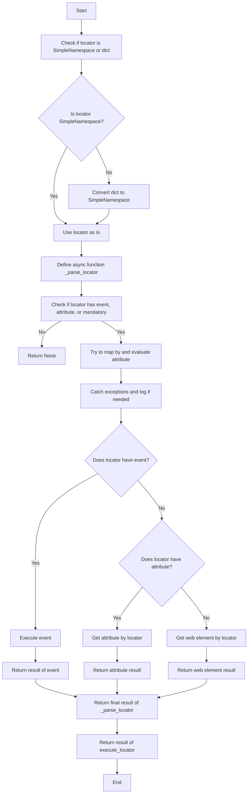
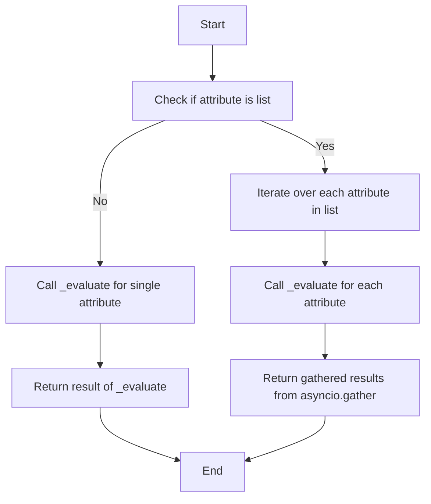
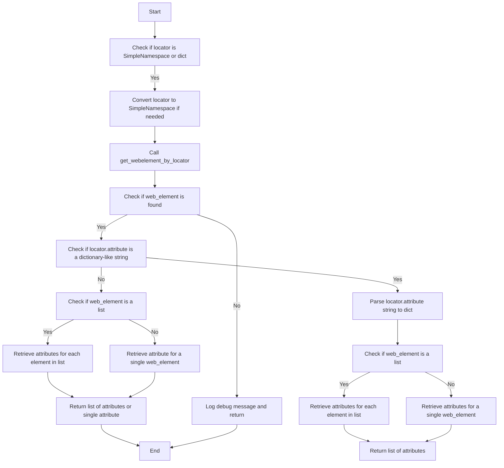

# Module: src.webdriver.excutor

## Overview

The `executor.py` module, part of the `src.webdriver` package, facilitates automated interactions with web elements using Selenium. It offers a flexible approach to locating, interacting with, and extracting information from web elements based on provided configurations, known as "locators."

## Table of Contents
1.  [Key Features](#key-features)
2.  [Module Structure](#module-structure)
    -   [Classes](#classes)
        -   [ExecuteLocator](#executelocator-class)
    -   [Flow Diagrams](#flow-diagrams)
        -   [`execute_locator`](#execute_locator-diagram)
        -   [`evaluate_locator`](#evaluate_locator-diagram)
        -   [`get_attribute_by_locator`](#get_attribute_by_locator-diagram)
3.  [Usage](#usage)
4.  [Dependencies](#dependencies)
5.  [Error Handling](#error-handling)
6.  [Contributing](#contributing)
7.  [License](#license)

## Key Features

1.  **Parsing and Handling Locators**: Converts dictionaries with configurations into `SimpleNamespace` objects, enabling flexible manipulation of locator data.
2.  **Interacting with Web Elements**: Executes actions like clicks, sending messages, running events, and retrieving attributes from web elements.
3.  **Error Handling**: Supports continuous execution even when errors occur, making it suitable for processing pages with unstable elements.
4.  **Support for Multiple Locator Types**: Manages both single and multiple locators, enabling identification and interaction with one or several web elements at the same time.

## Module Structure

### Classes

#### `ExecuteLocator`

**Description**: This class is the core of the module, responsible for handling web element interactions based on provided locators.

**Attributes**:

-   `driver`: The Selenium WebDriver instance.
-   `actions`: An `ActionChains` object for performing complex actions.
-   `by_mapping`: A dictionary that maps locator types to Selenium's `By` methods.
-   `mode`: The execution mode (`debug`, `dev`, etc.).

**Methods**:

-   [`__post_init__`](#__post_init__)
-   [`execute_locator`](#execute_locator)
-   [`evaluate_locator`](#evaluate_locator)
-   [`get_attribute_by_locator`](#get_attribute_by_locator)
-   [`get_webelement_by_locator`](#get_webelement_by_locator)
-  [`get_webelement_as_screenshot`](#get_webelement_as_screenshot)
-   [`execute_event`](#execute_event)
-   [`send_message`](#send_message)

##### `__post_init__`

```python
def __post_init__(self):
    """
    Initializes the ActionChains object if a driver is provided.
    """
```
**Description**: Initializes the `ActionChains` object if a driver is provided.

##### `execute_locator`

```python
async def execute_locator(self, locator: dict | types.SimpleNamespace, *, continue_if_error=True) -> Any:
    """
    Executes actions on a web element based on the provided locator.

    Args:
        locator (dict | types.SimpleNamespace): A dictionary or SimpleNamespace object containing locator details.
        continue_if_error (bool, optional): If `True`, continue execution if an error occurs. Defaults to `True`.

    Returns:
         Any: The result of the execution (e.g., the result of an event, the attribute of an element, or the element itself), or None if an error occurs.
    """
```

**Description**: Executes actions on a web element based on the provided locator.
**Parameters**:
    - `locator` (dict | types.SimpleNamespace): A dictionary or `SimpleNamespace` object containing locator details.
    - `continue_if_error` (bool, optional): If `True`, continues execution if an error occurs. Defaults to `True`.
**Returns**:
    - `Any`: The result of the execution, or `None` if an error occurs.

##### `evaluate_locator`

```python
async def evaluate_locator(self, locator: dict | types.SimpleNamespace, *, continue_if_error=True) -> Any:
    """
    Evaluates and processes locator attributes.

    Args:
        locator (dict | types.SimpleNamespace): A dictionary or SimpleNamespace object containing locator details.
        continue_if_error (bool, optional): If `True`, continue execution if an error occurs. Defaults to `True`.

    Returns:
        Any: The result of the evaluation, or None if an error occurs.
    """
```
**Description**: Evaluates and processes locator attributes.
**Parameters**:
    - `locator` (dict | types.SimpleNamespace): A dictionary or `SimpleNamespace` object containing locator details.
    - `continue_if_error` (bool, optional): If `True`, continues execution if an error occurs. Defaults to `True`.
**Returns**:
    - `Any`: The result of the evaluation, or `None` if an error occurs.

##### `get_attribute_by_locator`

```python
async def get_attribute_by_locator(self, locator: dict | types.SimpleNamespace, *, continue_if_error=True) -> Any:
    """
    Retrieves attributes from an element or list of elements found by the given locator.

    Args:
        locator (dict | types.SimpleNamespace): A dictionary or SimpleNamespace object containing locator details.
        continue_if_error (bool, optional): If `True`, continue execution if an error occurs. Defaults to `True`.

    Returns:
         Any: The attribute of the element, or a list of attributes, or None if an error occurs.
    """
```
**Description**: Retrieves attributes from an element or list of elements found by the given locator.
**Parameters**:
    - `locator` (dict | types.SimpleNamespace): A dictionary or `SimpleNamespace` object containing locator details.
    - `continue_if_error` (bool, optional): If `True`, continues execution if an error occurs. Defaults to `True`.
**Returns**:
    - `Any`: The attribute of the element, a list of attributes, or `None` if an error occurs.

##### `get_webelement_by_locator`

```python
async def get_webelement_by_locator(self, locator: dict | types.SimpleNamespace, *, continue_if_error=True) -> Optional[WebElement | list[WebElement]]:
    """
    Extracts web elements based on the provided locator.

    Args:
        locator (dict | types.SimpleNamespace): A dictionary or SimpleNamespace object containing locator details.
        continue_if_error (bool, optional): If `True`, continue execution if an error occurs. Defaults to `True`.

    Returns:
        Optional[WebElement | list[WebElement]]: The web element or list of web elements, or None if an error occurs.
    """
```
**Description**: Extracts web elements based on the provided locator.
**Parameters**:
    - `locator` (dict | types.SimpleNamespace): A dictionary or `SimpleNamespace` object containing locator details.
    - `continue_if_error` (bool, optional): If `True`, continues execution if an error occurs. Defaults to `True`.
**Returns**:
    - `Optional[WebElement | list[WebElement]]`: The web element, list of web elements, or `None` if an error occurs.

##### `get_webelement_as_screenshot`

```python
async def get_webelement_as_screenshot(self, locator: dict | types.SimpleNamespace, file_path: str, *, continue_if_error=True) -> bool:
    """
    Takes a screenshot of the located web element.

    Args:
        locator (dict | types.SimpleNamespace): A dictionary or SimpleNamespace object containing locator details.
        file_path (str): The path where the screenshot will be saved.
        continue_if_error (bool, optional): If `True`, continue execution if an error occurs. Defaults to `True`.

    Returns:
        bool: True if the screenshot is successfully taken, otherwise False.
    """
```
**Description**: Takes a screenshot of the located web element.
**Parameters**:
    - `locator` (dict | types.SimpleNamespace): A dictionary or `SimpleNamespace` object containing locator details.
    - `file_path` (str): The path where the screenshot will be saved.
   - `continue_if_error` (bool, optional): If `True`, continue execution if an error occurs. Defaults to `True`.
**Returns**:
   - `bool`: `True` if the screenshot is successfully taken, otherwise `False`.

##### `execute_event`

```python
async def execute_event(self, locator: dict | types.SimpleNamespace, *, continue_if_error=True) -> Any:
    """
    Executes the events associated with a locator.

    Args:
        locator (dict | types.SimpleNamespace): A dictionary or SimpleNamespace object containing locator details.
        continue_if_error (bool, optional): If `True`, continue execution if an error occurs. Defaults to `True`.

    Returns:
        Any: The result of the event execution, or None if an error occurs.
    """
```
**Description**: Executes the events associated with a locator.
**Parameters**:
    - `locator` (dict | types.SimpleNamespace): A dictionary or `SimpleNamespace` object containing locator details.
    - `continue_if_error` (bool, optional): If `True`, continue execution if an error occurs. Defaults to `True`.
**Returns**:
    - `Any`: The result of the event execution, or `None` if an error occurs.

##### `send_message`

```python
async def send_message(self, locator: dict | types.SimpleNamespace, message: str, *, continue_if_error=True) -> bool:
    """
    Sends a message to a web element.

    Args:
        locator (dict | types.SimpleNamespace): A dictionary or SimpleNamespace object containing locator details.
        message (str): The message to send to the element.
        continue_if_error (bool, optional): If `True`, continue execution if an error occurs. Defaults to `True`.

    Returns:
        bool: True if the message is successfully sent, otherwise False.
    """
```
**Description**: Sends a message to a web element.
**Parameters**:
    - `locator` (dict | types.SimpleNamespace): A dictionary or `SimpleNamespace` object containing locator details.
    - `message` (str): The message to send to the element.
    - `continue_if_error` (bool, optional): If `True`, continue execution if an error occurs. Defaults to `True`.
**Returns**:
    - `bool`: `True` if the message is successfully sent, otherwise `False`.

### Flow Diagrams

The module includes Mermaid flow diagrams to illustrate the flow of execution for key methods:

#### `execute_locator` Diagram



#### `evaluate_locator` Diagram



#### `get_attribute_by_locator` Diagram



## Usage

To use this module, instantiate the `ExecuteLocator` class with a Selenium WebDriver instance. Then, call the methods to interact with web elements using the provided locators.

### Example

```python
from selenium import webdriver
from src.webdriver.excutor import ExecuteLocator
import asyncio

async def main():
    # Initialize the WebDriver
    driver = webdriver.Chrome()

    # Initialize the ExecuteLocator class
    executor = ExecuteLocator(driver=driver)

    # Define a locator
    locator = {
        "by": "ID",
        "selector": "some_element_id",
        "event": "click()"
    }

    # Execute the locator
    result = await executor.execute_locator(locator)
    print(result)
    driver.quit()

if __name__ == "__main__":
    asyncio.run(main())
```

## Dependencies

-   `selenium`: For web automation.
-   `asyncio`: For asynchronous operations.
-   `re`: For regular expressions.
-   `dataclasses`: For creating data classes.
-   `enum`: For creating enumerations.
-   `pathlib`: For handling file paths.
-  `types`: For creating simple namespaces.
-   `typing`: For type annotations.

## Error Handling

The module includes error handling to ensure that the execution continues even if elements are not found or if there are issues with the web page. This makes it robust for handling dynamic or unstable web pages.

## Contributing

Contributions to this module are welcome. Please ensure that any changes are well-documented and include appropriate tests.

## License

This module is licensed under the MIT License. See the `LICENSE` file for more details.