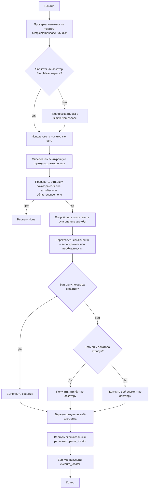
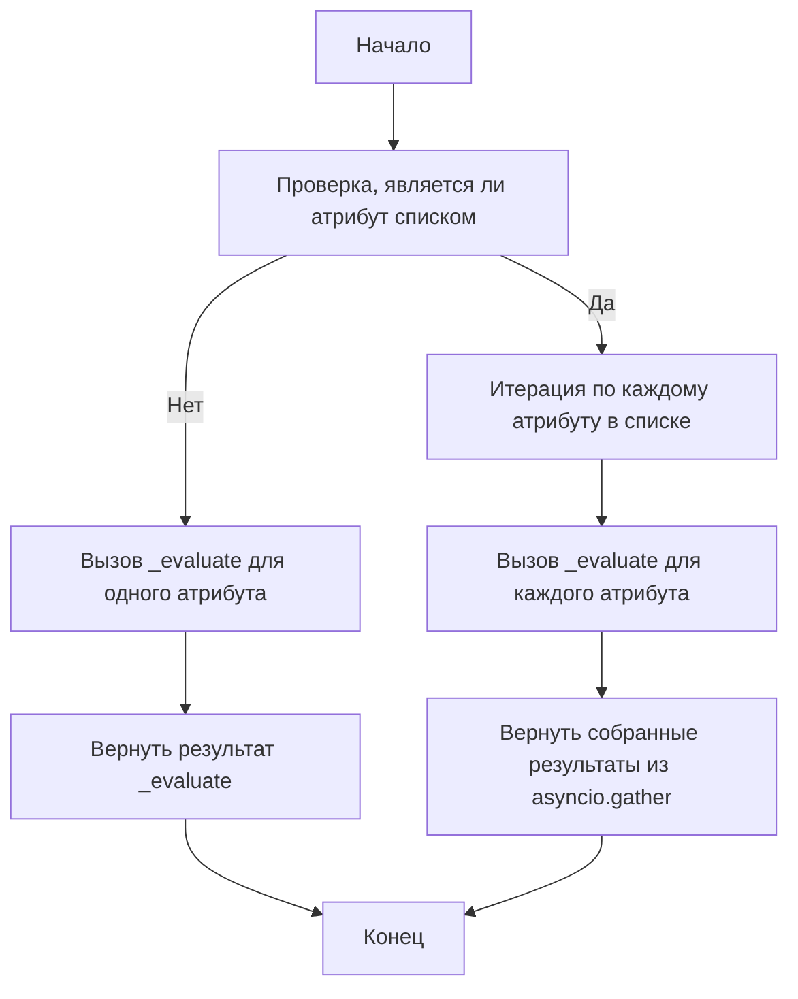
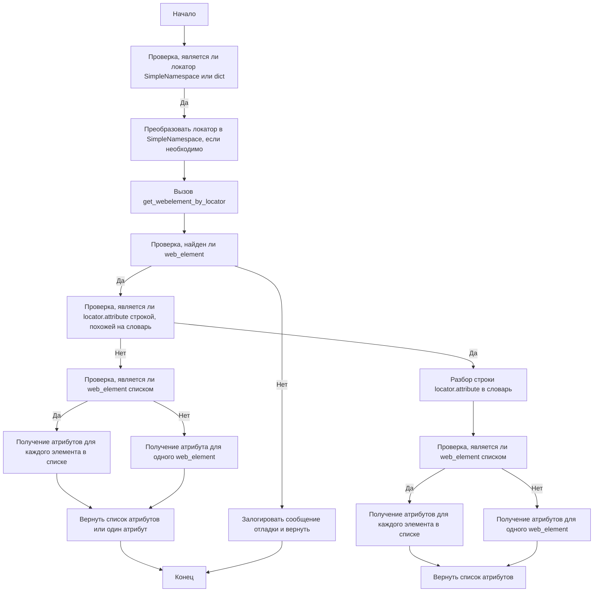

# Module: src.webdriver.excutor

## Overview

The `executor.py` module, part of the `src.webdriver` package, automates interactions with web elements using Selenium. It provides a flexible framework for locating, interacting with, and extracting information from web elements based on provided configurations known as "locators."

## Table of Contents
1.  [Key Features](#key-features)
2.  [Module Structure](#module-structure)
    -   [Classes](#classes)
        -   [ExecuteLocator](#executelocator-class)
    -   [Flow Diagrams](#flow-diagrams)
        -   [`execute_locator`](#execute_locator-diagram)
        -   [`evaluate_locator`](#evaluate_locator-diagram)
        -   [`get_attribute_by_locator`](#get_attribute_by_locator-diagram)
3.  [Usage](#usage)
4.  [Dependencies](#dependencies)
5.  [Error Handling](#error-handling)
6.  [Contributing](#contributing)
7.  [License](#license)

## Key Features

1.  **Parsing and Handling Locators**: Converts dictionaries with configurations into `SimpleNamespace` objects, allowing for flexible manipulation of locator data.
2.  **Interacting with Web Elements**: Performs various actions such as clicks, sending messages, executing events, and retrieving attributes from web elements.
3.  **Error Handling**: Supports continuous execution even in case of an error, allowing for the processing of web pages with unstable elements or requiring a special approach.
4.  **Support for Multiple Locator Types**: Handles both single and multiple locators, enabling the identification and interaction with one or several web elements simultaneously.

## Module Structure

### Classes

#### `ExecuteLocator`

**Description**: This class is the core of the module, responsible for handling web element interactions based on provided locators.

**Attributes**:

-   `driver`: The Selenium WebDriver instance.
-   `actions`: An `ActionChains` object for performing complex actions.
-   `by_mapping`: A dictionary mapping locator types to Selenium's `By` methods.
-   `mode`: The execution mode (`debug`, `dev`, etc.).

**Methods**:

-   [`__post_init__`](#__post_init__)
-   [`execute_locator`](#execute_locator)
-   [`evaluate_locator`](#evaluate_locator)
-   [`get_attribute_by_locator`](#get_attribute_by_locator)
-   [`get_webelement_by_locator`](#get_webelement_by_locator)
-   [`get_webelement_as_screenshot`](#get_webelement_as_screenshot)
-   [`execute_event`](#execute_event)
-   [`send_message`](#send_message)

##### `__post_init__`

```python
def __post_init__(self):
    """Initializes the ActionChains object if a driver is provided."""
```
**Description**: Initializes the `ActionChains` object if a driver is provided.

##### `execute_locator`

```python
async def execute_locator(
    self,
    locator: dict | SimpleNamespace,
    timeout: Optional[float] = 0,
    timeout_for_event: Optional[str] = 'presence_of_element_located',
    message: Optional[str] = None,
    typing_speed: Optional[float] = 0,
    continue_on_error: Optional[bool] = True,
) -> str | list | dict | WebElement | bool:
    """Executes actions on a web element based on the provided locator.

    Args:
        locator (dict | SimpleNamespace): Locator data (dict or SimpleNamespace).
        timeout (Optional[float], optional): Timeout for locating the element. Defaults to 0.
        timeout_for_event (Optional[str], optional): The wait condition ('presence_of_element_located', 'element_to_be_clickable'). Defaults to 'presence_of_element_located'.
        message (Optional[str], optional): Optional message to send. Defaults to None.
        typing_speed (Optional[float], optional): Typing speed for send_keys events. Defaults to 0.
        continue_on_error (Optional[bool], optional): Whether to continue on error. Defaults to True.

    Returns:
        str | list | dict | WebElement | bool: Outcome based on locator instructions.

    ```mermaid
            graph TD
        A[Начало] --> B[Проверка, является ли локатор SimpleNamespace или dict]
        B --> C{Является ли локатор SimpleNamespace?}
        C -->|Да| D[Использовать локатор как есть]
        C -->|Нет| E[Преобразовать dict в SimpleNamespace]
        E --> D
        D --> F[Определить асинхронную функцию _parse_locator]
        F --> G[Проверить, есть ли у локатора событие, атрибут или обязательное поле]
        G -->|Нет| H[Вернуть None]
        G -->|Да| I[Попробовать сопоставить by и оценить атрибут]
        I --> J[Перехватить исключения и залогировать при необходимости]
        J --> K{Есть ли у локатора событие?}
        K -->|Да| L[Выполнить событие]
        K -->|Нет| M{Есть ли у локатора атрибут?}
        M -->|Да| N[Получить атрибут по локатору]
        M -->|Нет| O[Получить веб-элемент по локатору]
        L --> P[Вернуть результат события]
        N --> P[Вернуть результат атрибута]
        O --> P[Вернуть результат веб-элемента]
        P --> Q[Вернуть окончательный результат _parse_locator]
        Q --> R[Вернуть результат execute_locator]
        R --> S[Конец]
    ```
    """
```
**Description**: Executes actions on a web element based on the provided locator.
**Parameters**:
    -   `locator` (dict | SimpleNamespace): Locator data as a dictionary or SimpleNamespace.
    -   `timeout` (Optional[float], optional): Timeout for locating the element. Defaults to 0.
    -  `timeout_for_event` (Optional[str], optional): The wait condition (`'presence_of_element_located'`, `'element_to_be_clickable'`). Defaults to `'presence_of_element_located'`.
    -   `message` (Optional[str], optional): Optional message to send. Defaults to `None`.
    -   `typing_speed` (Optional[float], optional): Typing speed for `send_keys` events. Defaults to 0.
    -  `continue_on_error` (Optional[bool], optional): Whether to continue on error. Defaults to `True`.
**Returns**:
    -   `str | list | dict | WebElement | bool`: Outcome based on locator instructions.

##### `evaluate_locator`

```python
async def evaluate_locator(self, attribute: str | List[str] | dict) -> Optional[str | List[str] | dict]:
    """Evaluates and processes locator attributes.

    Args:
        attribute (str | List[str] | dict): Attributes to evaluate.

    Returns:
        Optional[str | List[str] | dict]: Evaluated attributes.

    ```mermaid
            graph TD
        A[Начало] --> B[Проверка, является ли атрибут списком]
        B -->|Да| C[Итерация по каждому атрибуту в списке]
        C --> D[Вызов _evaluate для каждого атрибута]
        D --> E[Вернуть собранные результаты из asyncio.gather]
        B -->|Нет| F[Вызов _evaluate для одного атрибута]
        F --> G[Вернуть результат _evaluate]
        G --> H[Конец]
        E --> H
        ```
    """
```
**Description**: Evaluates and processes locator attributes.
**Parameters**:
    -   `attribute` (str | List[str] | dict): Attributes to evaluate.
**Returns**:
    -   `Optional[str | List[str] | dict]`: Evaluated attributes.

##### `get_attribute_by_locator`

```python
async def get_attribute_by_locator(
    self,
    locator: SimpleNamespace | dict,
    timeout: Optional[float] = 0,
    timeout_for_event: str = 'presence_of_element_located',
    message: Optional[str] = None,
    typing_speed: float = 0,
    continue_on_error: bool = True,
) -> WebElement | list[WebElement] | None:
    """Retrieves attributes from an element or list of elements found by the given locator.

    Args:
        locator (dict | SimpleNamespace): Locator as a dictionary or SimpleNamespace.
        timeout (Optional[float], optional): Max wait time for the element to appear. Defaults to 0.
        timeout_for_event (str, optional): Type of wait condition. Defaults to 'presence_of_element_located'.

    Returns:
        WebElement | list[WebElement] | None: The attribute value(s) or dictionary with attributes.

    ```mermaid
            graph TD
        A[Начало] --> B[Проверка, является ли локатор SimpleNamespace или dict]
        B -->|Да| C[Преобразовать локатор в SimpleNamespace, если необходимо]
        C --> D[Вызов get_webelement_by_locator]
        D --> E[Проверка, найден ли web_element]
        E -->|Нет| F[Залогировать сообщение отладки и вернуть]
        E -->|Да| G[Проверка, является ли locator.attribute строкой, похожей на словарь]
        G -->|Да| H[Разбор строки locator.attribute в словарь]
        H --> I[Проверка, является ли web_element списком]
        I -->|Да| J[Получение атрибутов для каждого элемента в списке]
        J --> K[Вернуть список атрибутов]
        I -->|Нет| L[Получение атрибутов для одного web_element]
        L --> K
        G -->|Нет| M[Проверка, является ли web_element списком]
        M -->|Да| N[Получение атрибутов для каждого элемента в списке]
        N --> O[Вернуть список атрибутов или один атрибут]
        M -->|Нет| P[Получение атрибута для одного web_element]
        P --> O
        O --> Q[Конец]
        F --> Q
        ```
    """
```
**Description**: Retrieves attributes from an element or list of elements found by the given locator.
**Parameters**:
    -   `locator` (SimpleNamespace | dict): Locator as a SimpleNamespace object or dictionary.
    -   `timeout` (Optional[float], optional): Max wait time for the element to appear. Defaults to 0.
    -  `timeout_for_event` (str, optional): Type of wait condition. Defaults to `'presence_of_element_located'`.
    -   `message` (Optional[str], optional): Message to send to the element. Defaults to `None`.
    -   `typing_speed` (float, optional): Speed of typing for `send_message` events. Defaults to 0.
    -  `continue_on_error` (bool, optional): Whether to continue in case of an error. Defaults to `True`.
**Returns**:
    -   `WebElement | list[WebElement] | None`: The attribute value(s) or dictionary with attributes.

##### `get_webelement_by_locator`

```python
async def get_webelement_by_locator(
    self,
    locator: dict | SimpleNamespace,
    timeout: Optional[float] = 0,
    timeout_for_event: Optional[str] = 'presence_of_element_located',
) -> WebElement | List[WebElement] | None:
    """
    Extracts a web element or a list of elements based on the provided locator.

    Args:
        locator (dict | SimpleNamespace): Locator data (dict or SimpleNamespace).
        timeout (Optional[float], optional): Timeout for locating the element. Defaults to 0.
        timeout_for_event (Optional[str], optional): The wait condition ('presence_of_element_located'). Defaults to 'presence_of_element_located'.

    Returns:
        WebElement | List[WebElement] | None: The web element or a list of web elements, or None if not found.
    """
```
**Description**: Extracts a web element or a list of elements based on the provided locator.
**Parameters**:
    -   `locator` (dict | SimpleNamespace): Locator data as a dictionary or SimpleNamespace.
    -   `timeout` (Optional[float], optional): Timeout for locating the element. Defaults to 0.
    -   `timeout_for_event` (Optional[str], optional): The wait condition (`'presence_of_element_located'`). Defaults to `'presence_of_element_located'`.
**Returns**:
    -   `WebElement | List[WebElement] | None`: The web element or a list of web elements, or `None` if not found.

##### `get_webelement_as_screenshot`

```python
async def get_webelement_as_screenshot(
    self,
    locator: SimpleNamespace | dict,
    timeout: float = 5,
    timeout_for_event: str = 'presence_of_element_located',
    message: Optional[str] = None,
    typing_speed: float = 0,
    continue_on_error: bool = True,
    webelement: Optional[WebElement] = None,
) -> BinaryIO | None:
    """Takes a screenshot of the located web element.

    Args:
        locator (dict | SimpleNamespace): Locator as a dictionary or SimpleNamespace.
        timeout (float, optional): Max wait time for the element to appear. Defaults to 5.
        timeout_for_event (str, optional): Type of wait condition. Defaults to 'presence_of_element_located'.
        message (Optional[str], optional): Message to send to the element. Defaults to None.
        typing_speed (float, optional): Speed of typing for send message events. Defaults to 0.
        continue_on_error (bool, optional): Whether to continue in case of an error. Defaults to True.
        webelement (Optional[WebElement], optional): Pre-fetched web element. Defaults to None.

    Returns:
        BinaryIO | None: Binary stream of the screenshot or None if failed.
    """
```
**Description**: Takes a screenshot of the located web element.
**Parameters**:
    -   `locator` (SimpleNamespace | dict): Locator as a SimpleNamespace or dictionary.
    -   `timeout` (float, optional): Max wait time for the element to appear. Defaults to 5.
    -   `timeout_for_event` (str, optional): Type of wait condition. Defaults to `'presence_of_element_located'`.
    -   `message` (Optional[str], optional): Message to send to the element. Defaults to `None`.
    -   `typing_speed` (float, optional): Speed of typing for `send_message` events. Defaults to 0.
    -   `continue_on_error` (bool, optional): Whether to continue in case of an error. Defaults to `True`.
    -   `webelement` (Optional[WebElement], optional): Pre-fetched web element. Defaults to `None`.
**Returns**:
    -   `BinaryIO | None`: Binary stream of the screenshot or `None` if failed.

##### `execute_event`

```python
async def execute_event(
    self,
    locator: SimpleNamespace | dict,
    timeout: float = 5,
    timeout_for_event: str = 'presence_of_element_located',
    message: str = None,
    typing_speed: float = 0,
    continue_on_error: bool = True,
) -> str | list[str] | bytes | list[bytes] | bool:
    """
    Execute the events associated with a locator.

    Args:
        locator (SimpleNamespace | dict): Locator specifying the element and event to execute.
        timeout (float, optional): Timeout for locating the element. Defaults to 5.
        timeout_for_event (str, optional): Timeout for waiting for the event. Defaults to 'presence_of_element_located'.
        message (Optional[str], optional): Message to send with the event, if applicable. Defaults to None.
        typing_speed (int, optional): Speed of typing for send_keys events. Defaults to 0.

    Returns:
         str | list[str] | bytes | list[bytes] | bool: Returns True if event execution was successful, False otherwise.
    """
```
**Description**: Executes the events associated with a locator.
**Parameters**:
    -   `locator` (SimpleNamespace | dict): Locator specifying the element and event to execute.
    -   `timeout` (float, optional): Timeout for locating the element. Defaults to 5.
    -   `timeout_for_event` (str, optional): Timeout for waiting for the event. Defaults to `'presence_of_element_located'`.
    -   `message` (Optional[str], optional): Message to send with the event, if applicable. Defaults to `None`.
    -   `typing_speed` (int, optional): Speed of typing for `send_keys` events. Defaults to 0.
**Returns**:
    -   `str | list[str] | bytes | list[bytes] | bool`: Returns `True` if event execution was successful, `False` otherwise.

##### `send_message`

```python
async def send_message(
    self,
    locator: SimpleNamespace | dict,
    timeout: float = 5,
    timeout_for_event: str = 'presence_of_element_located',
    message: str = None,
    typing_speed: float = 0,
    continue_on_error: bool = True,
) -> bool:
    """Sends a message to a web element.

    Args:
        locator (dict | SimpleNamespace): Information about the element's location on the page.
                                          It can be a dictionary or a SimpleNamespace object.
        timeout (float, optional): Max wait time for the element to appear. Defaults to 5 seconds.
        timeout_for_event (str, optional): Type of wait condition. Defaults to 'presence_of_element_located'.
        message (Optional[str], optional): The message to be sent to the web element. Defaults to `None`.
        typing_speed (float, optional): Speed of typing the message in seconds. Defaults to 0.

    Returns:
        bool: Returns `True` if the message was sent successfully, `False` otherwise.

    Example:
        >>> driver = Driver()
        >>> driver.send_message(locator={"id": "messageBox"}, message="Hello World", typing_speed=0.1)
        True
    """
```
**Description**: Sends a message to a web element.
**Parameters**:
    -  `locator` (SimpleNamespace | dict): Locator specifying the element.
    -   `timeout` (float, optional): Max wait time for the element to appear. Defaults to 5.
    -   `timeout_for_event` (str, optional): Type of wait condition. Defaults to `'presence_of_element_located'`.
    -   `message` (Optional[str], optional): The message to send to the web element. Defaults to `None`.
    -   `typing_speed` (float, optional): Speed of typing the message in seconds. Defaults to 0.
    -   `continue_on_error` (bool, optional): Whether to continue in case of an error. Defaults to `True`.
**Returns**:
    -   `bool`: Returns `True` if the message was sent successfully, `False` otherwise.

### Flow Diagrams

The module includes Mermaid flow diagrams to illustrate the flow of execution for key methods:

#### `execute_locator` Diagram



#### `evaluate_locator` Diagram



#### `get_attribute_by_locator` Diagram



## Usage

To use this module, create an instance of the `ExecuteLocator` class with a Selenium WebDriver instance. Then, call the methods to interact with web elements using the provided locators.

### Example

```python
from selenium import webdriver
from src.webdriver.executor import ExecuteLocator
import asyncio

async def main():
    # Инициализация WebDriver
    driver = webdriver.Chrome()

    # Инициализация класса ExecuteLocator
    executor = ExecuteLocator(driver=driver)

    # Определение локатора
    locator = {
        "by": "ID",
        "selector": "some_element_id",
        "event": "click()"
    }

    # Выполнение локатора
    result = await executor.execute_locator(locator)
    print(result)
    driver.quit()

if __name__ == "__main__":
    asyncio.run(main())
```

## Dependencies

-   `selenium`: For web automation.
-   `asyncio`: For asynchronous operations.
-   `re`: For regular expressions.
-   `dataclasses`: For creating data classes.
-   `enum`: For creating enumerations.
-   `pathlib`: For handling file paths.
-  `types`: For creating simple namespaces.
-   `typing`: For type annotations.
- `header`: For project header.
- `src`: For global settings, logger, and exceptions.
- `src.utils.jjson`: For JSON handling.
- `src.utils.printer`: For pretty printing.
- `src.utils.image`: For image handling.

## Error Handling

The module includes robust error handling to ensure that the execution continues even if some elements are not found or if there are issues with the web page. This is particularly useful for handling dynamic or unstable web pages.

## Contributing

Contributions to this module are welcome. Please ensure that any changes are well-documented and include appropriate tests.

## License

This module is licensed under the MIT License. See the `LICENSE` file for more details.