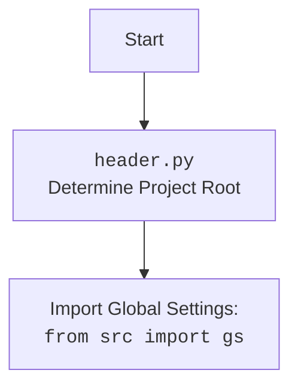

## Анализ модуля Custom Chrome WebDriver для Selenium

### 1. <алгоритм>

**Описание рабочего процесса:**

Модуль представляет собой кастомную реализацию Chrome WebDriver с использованием Selenium. Он предназначен для автоматизации взаимодействия с браузером Chrome и загрузки настроек из файла `chrome.json`.

**Блок-схема:**

1.  **Инициализация `Chrome` (`__init__`)**:
    *   Создается экземпляр класса `Chrome` с возможностью передачи различных параметров (профиль, версия, user-agent, прокси, опции, режим окна).
    *   **Пример**: `driver = Chrome(profile_name='myprofile', chromedriver_version='123', user_agent='myagent', window_mode='kiosk')` или `driver = Chrome()`
    *   Загружает настройки из файла `chrome.json` используя `j_loads_ns`.
    *   Определяет путь к chromedriver.
    *   Создает объект `Service` для управления chromedriver.
    *   Создает объект `Options` для настройки Chrome.
    *   Применяет опции из `settings.options`.
    *   Устанавливает режим окна (kiosk, windowless, full_window), используя настройки или переданные параметры.
    *   Устанавливает пользовательский агент, используя переданный или генерируя случайный.
    *   Если прокси включен, вызывает метод `set_proxy`.
    *   Устанавливает директорию профиля пользователя, используя  настройки из `profile_directory` и имени профиля, если передано.
    *   Инициализирует экземпляр WebDriver с настроенными опциями и сервисом.
    *   Вызывает метод `_payload()` для инициализации дополнительных инструментов.
    *   Обрабатываются исключения WebDriverException и другие исключения.

2.  **Установка прокси (`set_proxy`)**:
    *   Метод `set_proxy` принимает объект `Options` для добавления настроек прокси.
    *   **Пример**: `self.set_proxy(options_obj)`
    *   Получает словарь прокси из `get_proxies_dict`.
    *   Выбирает случайный рабочий прокси из списка.
    *   Добавляет параметры прокси в `options` в зависимости от протокола (http, socks4, socks5).
    *   Логирует информацию о выбранном прокси или предупреждение, если нет доступных прокси.

3.  **Инициализация дополнительных инструментов (`_payload`)**:
    *   Метод `_payload` инициализирует и связывает экземпляры `JavaScript` и `ExecuteLocator` с текущим экземпляром `Chrome`.
    *   **Пример**: `self._payload()`
    *  Создает экземпляр `JavaScript` и связывает его методы с методами экземпляра `Chrome`.
    *   Создает экземпляр `ExecuteLocator` и связывает его методы с методами экземпляра `Chrome`, что позволяет использовать `execute_locator` для работы с локаторами.

### 2. <mermaid>

```mermaid
flowchart TD
    Start[Start] --> InitChrome[Initialize Chrome Driver: <br><code>Chrome(...)</code>]
     InitChrome --> LoadSettings[Load settings from <code>chrome.json</code>]
     LoadSettings --> SetChromedriverPath[Set ChromeDriver path]
    SetChromedriverPath --> InitService[Initialize Chrome Service]
    InitService --> InitOptions[Initialize Chrome Options]
    InitOptions --> AddOptionsFromFile[Add options from config file]
     AddOptionsFromFile --> CheckWindowMode{Is window_mode in config?}
     CheckWindowMode -- Yes --> SetWindowModeFromConfig[Set window mode from config]
         SetWindowModeFromConfig --> CheckWindowModeArgs{Is window_mode in init args?}
        CheckWindowModeArgs -- Yes --> SetWindowModeFromArgs[Set window mode from args]
          SetWindowModeArgs -- No --> CheckForModeSet[Check for window mode, if not set pass]
        CheckWindowMode -- No --> CheckWindowModeArgs
           CheckForModeSet --> SetUserAgent[Set user agent]
    SetUserAgent --> CheckProxyEnabled{Is proxy enabled in settings?}
    CheckProxyEnabled -- Yes --> SetProxy[Set proxy:<br><code>set_proxy(options)</code>]
     SetProxy --> SetUserProfile[Set user profile directory]
        CheckProxyEnabled -- No --> SetUserProfile
    SetUserProfile --> CreateWebDriverInstance[Create WebDriver instance]
    CreateWebDriverInstance --> Payload[Call Payload Method: <br><code>_payload()</code>]
     Payload --> InitJavaScript[Initialize JavaScript helper]
    InitJavaScript --> SetJavaScriptMethods[Set JavaScript methods in the instance]
    SetJavaScriptMethods --> InitExecuteLocator[Initialize ExecuteLocator]
    InitExecuteLocator --> SetExecutorMethods[Set ExecuteLocator methods in the instance]
    SetExecutorMethods --> ReturnDriverInstance[Return Chrome Driver Instance]
    ReturnDriverInstance --> End[End]

    subgraph SetProxy
        GetProxiesList[Get proxies dictionary:<br><code>get_proxies_dict()</code>]
        GetProxiesList --> SelectProxy[Select a working proxy]
        SelectProxy --> CheckProxy{Is a working proxy found?}
        CheckProxy -- Yes --> SetProxyOptions[Set proxy options]
        SetProxyOptions --> EndSetProxy[End Set Proxy]
        CheckProxy -- No --> LogWarningNoProxy[Log warning about no proxy]
        LogWarningNoProxy --> EndSetProxy
    end
```



**Объяснение зависимостей `mermaid`:**

*   **`os`**: Используется для работы с переменными окружения.
*   **`pathlib`**: Используется для работы с путями к файлам.
*   **`selenium.webdriver`**: Используется для управления веб-драйвером Chrome.
*   **`selenium.webdriver.chrome.options`**: Используется для настройки опций Chrome.
*   **`selenium.webdriver.chrome.service`**: Используется для управления сервисом ChromeDriver.
*   **`selenium.common.exceptions`**: Используется для обработки исключений, связанных с Selenium.
*   **`src`**: Используется для импорта глобальных настроек `gs`.
*   **`src.webdriver.executor`**: Используется для выполнения действий с элементами.
*   **`src.webdriver.js`**: Используется для выполнения JavaScript на странице.
*   **`src.webdriver.proxy`**: Используется для работы с прокси.
*   **`src.utils.jjson`**: Используется для загрузки JSON-конфигураций.
*    **`src.logger.logger`**: Используется для логирования.
*   **`fake_useragent`**: Используется для генерации случайных user-agent.
*   **`random`**: Используется для выбора случайного прокси.

### 3. <объяснение>

**Импорты:**

*   `os`: Используется для работы с операционной системой (например, для доступа к переменным окружения).
*   `pathlib.Path`: Используется для работы с путями к файлам и директориям.
*   `typing.Optional`, `typing.List`: Используются для аннотации типов.
*   `selenium.webdriver.Chrome`: Базовый класс для создания кастомного драйвера.
*   `selenium.webdriver.chrome.options.Options`: Используется для настройки опций Chrome.
*    `selenium.webdriver.chrome.service.Service`: Используется для управления процессом ChromeDriver.
*   `selenium.common.exceptions.WebDriverException`: Используется для обработки исключений, связанных с WebDriver.
*   `src`: Используется для импорта глобальных настроек `gs`.
*   `src.webdriver.executor.ExecuteLocator`: Используется для управления взаимодействиями с элементами на странице.
*   `src.webdriver.js.JavaScript`: Используется для выполнения JavaScript на странице.
*    `src.webdriver.proxy.get_proxies_dict`, `src.webdriver.proxy.check_proxy`: Используются для работы с прокси.
*   `src.utils.jjson.j_loads_ns`: Используется для загрузки JSON-конфигурации.
*   `src.logger.logger`: Используется для логирования ошибок и другой информации.
*   `fake_useragent.UserAgent`: Используется для генерации случайных User-Agent.
*    `random`: Используется для выбора прокси случайным образом.

**Классы:**

*   `Chrome(WebDriver)`:
    *   **Роль**: Расширяет функциональность `selenium.webdriver.Chrome` с помощью дополнительных методов и атрибутов, добавляя поддержку профилей, прокси, пользовательских агентов и т.д..
    *   **Атрибуты**:
        *   `driver_name`: (`str`) - Имя драйвера (всегда "chrome").
    *   **Методы**:
        *   `__init__(...)`: Инициализация класса, настройка ChromeDriver.
        *    `set_proxy(self, options: Options) -> None`: Настройка прокси.
        *   `_payload(self) -> None`: Загружает инструменты для работы с локаторами и JavaScript.

**Функции:**

*   `__init__(...)`:
    *   **Аргументы**:
        *    `profile_name`: (`Optional[str]`) - имя профиля пользователя.
        *    `chromedriver_version`: (`Optional[str]`) - версия ChromeDriver.
        *   `user_agent`: (`Optional[str]`) - user-agent.
        *    `proxy_file_path`: (`Optional[str]`) - путь к файлу с прокси.
        *   `options`: (`Optional[List[str]]`) - список опций запуска.
        *    `window_mode`: (`Optional[str]`) - Режим окна браузера.
        *  `*args`, `**kwargs`: дополнительные параметры.
    *   **Назначение**: Инициализирует класс, настраивает параметры Chrome (прокси, user-agent, профиль, опции и т.д.).
    *   **Возвращает**: `None`.
*   `set_proxy(self, options: Options) -> None`:
    *   **Аргументы**:
        *   `options`: (`Options`) - Объект с настройками Chrome.
    *   **Назначение**: Настраивает прокси для Chrome, выбирая случайный рабочий прокси из списка.
    *   **Возвращает**: `None`.
*   `_payload(self) -> None`:
     *   **Назначение**: Инициализирует исполнителей для работы с локаторами и JavaScript (устанавливает методы для выполнения действий над элементами).
    *   **Аргументы**:
        *  `self` (`Chrome`): Экземпляр класса `Chrome`
    *   **Возвращает**: `None`.

**Переменные:**

*   `self.driver_name`: (`str`) - Имя драйвера.
*    `settings`: (`SimpleNamespace`) - Настройки из `chrome.json`.
*   `chromedriver_path`: (`str`) - Путь к chromedriver.
*   `service`: (`Service`) - Объект для управления ChromeDriver.
*   `options_obj`: (`Options`) - Объект для настройки опций Chrome.
*   `user_agent`: (`str`) - User-Agent.
*   `proxies_dict`: (`dict`) - Словарь прокси.
*   `all_proxies`: (`list`) - Список всех прокси.
*   `working_proxy`: (`dict`) - Рабочий прокси.
*    `profile_directory`: (`str`) - Директория профиля Chrome.
*    `j`: Экземпляр класса `JavaScript`
*   `execute_locator`: Экземпляр класса `ExecuteLocator`

**Потенциальные ошибки и области для улучшения:**

*   Обработка исключений при загрузке настроек из `chrome.json` может быть более детальной.
*   Метод `set_proxy` можно улучшить, если использовать асинхронный код для получения прокси, для ускорения процесса.
*   Можно добавить поддержку выбора конкретного прокси, а не случайного.
*    Можно добавить поддержку более сложных профилей Chrome, используя разные опции.
*   Можно добавить валидацию конфигурационных данных.
*    Можно добавить автоматическое обновление `chromedriver` до актуальной версии.

**Взаимосвязи с другими частями проекта:**

*   Использует `header` для определения корня проекта.
*    Использует глобальные настройки `gs` из пакета `src`.
*   Использует `src.webdriver.executor` для выполнения действий по локаторам.
*   Использует `src.webdriver.js` для выполнения JavaScript.
*   Использует `src.webdriver.proxy` для работы с прокси.
*   Использует `src.utils.jjson` для загрузки JSON-конфигураций.
*    Использует `src.logger.logger` для логирования.
*   Является частью веб-драйверного фреймворка и предоставляет конкретную реализацию для Chrome.

Этот анализ предоставляет полное представление о работе модуля `chrome.py`, его структуре и взаимодействии с другими частями проекта.