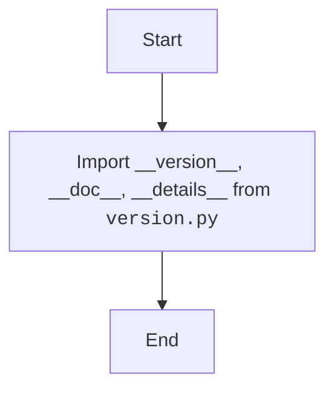

## Анализ кода модуля `__init__.py` в `src.webdriver.chrome.extentions`

### 1. <алгоритм>

**Описание рабочего процесса:**

Модуль `__init__.py` в пакете `src.webdriver.chrome.extentions` предназначен для инициализации пакета и импорта необходимых переменных, таких как `__version__`, `__doc__`, и `__details__` из модуля `version.py`.

**Блок-схема:**

1.  **Импорт переменных из `version.py`**:
    *   Импортируются переменные `__version__`, `__doc__` и `__details__` из модуля `version.py`.
    *   **Пример**: `from .version import __version__, __doc__, __details__`

### 2. <mermaid>

**Объяснение зависимостей `mermaid`:**

*   Зависимостей от внешних библиотек нет, используется только импорт из модуля `version.py` в той же директории.
*  **`packaging.version`**: Используется для работы с версиями (не используется в данном коде, но присутствует в импортах).

### 3. <объяснение>

**Импорты:**

*   `packaging.version.Version`: Используется для работы с версиями (в данном коде не используется).
*   `from .version import __version__, __doc__, __details__`: Импортирует переменные `__version__`, `__doc__` и `__details__` из модуля `version.py`, находящегося в той же директории.

**Классы:**

В данном коде нет классов.

**Функции:**

В данном коде нет функций.

**Переменные:**

*   `__version__`: (`str`) - Содержит версию модуля или пакета (импортируется из `version.py`).
*   `__doc__`: (`str`) - Содержит строку документации модуля (импортируется из `version.py`).
*   `__details__`: (`str`) - Содержит дополнительные сведения о модуле (импортируется из `version.py`).

**Потенциальные ошибки и области для улучшения:**

*   Код выполняет только импорт и не содержит логики, поэтому потенциальных ошибок нет.
*  В данном случае улучшения не требуются, так как модуль выполняет свою функцию.

**Взаимосвязи с другими частями проекта:**

*   Этот модуль является частью пакета `src.webdriver.chrome.extentions`.
*   Он делает переменные `__version__`, `__doc__`, `__details__` доступными при импорте пакета.
*   Модуль зависит от модуля `version.py`.

Этот анализ предоставляет полное представление о функциональности модуля `__init__.py` в пакете `src.webdriver.chrome.extentions`.