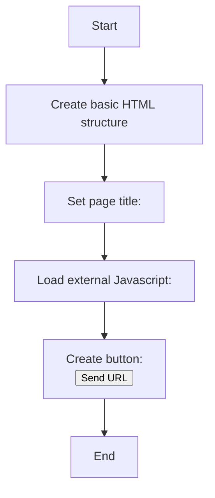

## Анализ HTML-кода `popup.html`

### 1. <алгоритм>

**Описание рабочего процесса:**

Файл `popup.html` представляет собой HTML-страницу, предназначенную для отображения всплывающего окна расширения Chrome. Страница содержит кнопку, которая при нажатии отправляет URL текущей вкладки.

**Блок-схема:**

1.  **Структура HTML**:
    *   Создается стандартный HTML-документ (`<!DOCTYPE html>`).
    *   Задается заголовок страницы `<title>URL Sender</title>`.
    *   Подключается JavaScript файл `popup.js`  с помощью ``.

2.  **Кнопка отправки URL**:
    *   Создается кнопка с идентификатором `sendUrlButton`.
    *   **Пример**: `<button id="sendUrlButton">Send URL</button>`
    *   При нажатии на кнопку, логика работы будет реализована в файле `popup.js`.

### 2. <mermaid>

**Объяснение зависимостей `mermaid`:**

В данном коде отсутствуют импорты или зависимости от каких-либо внешних библиотек.
* `popup.js`: JavaScript файл, который содержит логику работы кнопки.

### 3. <объяснение>

**Импорты:**

В данном коде отсутствуют импорты. Это HTML-файл, а не скрипт Python или JavaScript.

**Классы:**

В данном коде нет классов. Это HTML-файл, а не скрипт Python или JavaScript.

**Функции:**

В данном коде нет функций. Это HTML-файл, а не скрипт Python или JavaScript. Функциональность будет реализована в связанном JS файле `popup.js`.

**Переменные:**

*   `MODE`: (`str`) - Глобальная переменная `MODE`, устанавливающая режим работы в значение `'debug'`.
*   `sendUrlButton`: (`HTMLButtonElement`) - HTML элемент кнопки, с идентификатором `sendUrlButton`.

**Потенциальные ошибки и области для улучшения:**

*   В коде не описана работа с исключениями.
*   Отсутствует дополнительная стилизация.
*   Отсутствует описание `popup.js`

**Взаимосвязи с другими частями проекта:**

*   Этот модуль используется как всплывающее окно (popup) расширения Chrome.
*   Он связан с файлом `popup.js` (логика работы кнопки).
*   Используется для отправки URL текущей вкладки через сообщение, что связывает его с фоновым скриптом расширения (background.js).

Этот анализ предоставляет исчерпывающее описание файла `popup.html`, его структуры и роли в проекте.