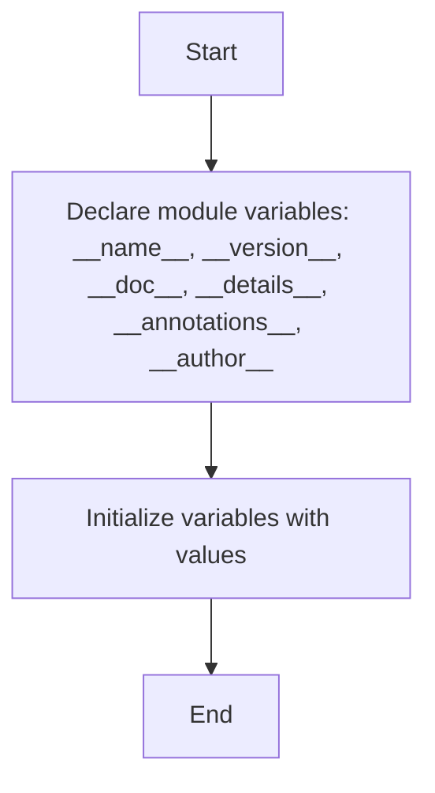

## Анализ кода модуля `version.py` в `src.webdriver.chrome.extentions`

### 1. <алгоритм>

**Описание рабочего процесса:**

Модуль `version.py` предназначен для хранения метаданных о версии и авторе модуля, а также описательной информации. В этом модуле определены глобальные переменные, которые используются для предоставления информации о версии и модуле.

**Блок-схема:**

1.  **Объявление переменных модуля**:
    *   Объявляются глобальные переменные: `__name__`, `__version__`, `__doc__`, `__details__`, `__annotations__`, `__author__`.
    *   **Пример**:
        ```python
        __name__:str
        __version__="3.12.0.0.0.4"
        __doc__:str
        __details__:str="Details about version for module or class"
        __annotations__
        __author__='hypotez '
        ```
    *   Переменные инициализируются заданными значениями.

### 2. <mermaid>



**Объяснение зависимостей `mermaid`:**

В данном коде нет зависимостей от внешних модулей или библиотек.

### 3. <объяснение>

**Импорты:**

В данном коде отсутствуют импорты.

**Классы:**

В данном коде отсутствуют классы.

**Функции:**

В данном коде отсутствуют функции.

**Переменные:**

*   `__name__`: (`str`) - Содержит имя модуля. (установлено неявно).
*   `__version__`: (`str`) - Содержит версию модуля (`"3.12.0.0.0.4"`).
*    `__doc__`: (`str`) - Содержит строку документации модуля (не установлено).
*   `__details__`: (`str`) - Содержит дополнительные детали о модуле или классе (по умолчанию `"Details about version for module or class"`).
*   `__annotations__`: (`dict`) - Словарь аннотаций типов.
*   `__author__`: (`str`) - Автор модуля (`"hypotez"`).

**Потенциальные ошибки и области для улучшения:**

*   Отсутствует явное описание типа для переменной `__doc__`.
*   Переменная `__annotations__` объявлена, но не инициализирована, что является не стандартным поведением.
*   Переменная `__details__` имеет фиксированное значение, лучше ее вынести в конфигурационный файл.

**Взаимосвязи с другими частями проекта:**

*   Этот модуль является частью пакета `src.webdriver.chrome.extentions`.
*   Переменные модуля предназначены для предоставления информации о версии и авторстве, которые могут использоваться в других частях проекта.
*   Модуль не имеет зависимостей от других частей проекта.

Этот анализ предоставляет полное представление о работе модуля `version.py` и его роли в проекте.