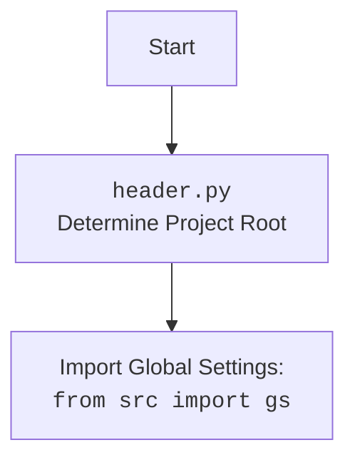

## Анализ модуля кастомной реализации Chrome WebDriver для Selenium

### 1. <алгоритм>

**Описание рабочего процесса:**

Этот документ описывает модуль, предоставляющий кастомную реализацию Chrome WebDriver с использованием Selenium. Он объединяет настройки из `chrome.json`, такие как user-agent и профили, для автоматизированного взаимодействия с браузером.

**Блок-схема:**

1.  **Инициализация `Chrome`**:
    *   Создается экземпляр класса `Chrome` с возможностью передачи параметров (профиль, версия, user-agent, прокси, опции, режим окна).
    *   **Пример**: `driver = Chrome(profile_name='myprofile', chromedriver_version='123', user_agent='myagent', window_mode='kiosk')` или `driver = Chrome()`
    *   Загружает настройки из файла `chrome.json`, используя `j_loads_ns`.
    *   Определяет путь к ChromeDriver.
    *    Инициализирует `Service` для ChromeDriver.
    *   Создает объект `Options` для настройки Chrome.
    *   Добавляет опции из файла конфигурации.
    *    Устанавливает режим окна из конфигурации или переданных параметров (kiosk, windowless, full_window).
    *   Устанавливает пользовательский агент (использует переданный или генерирует случайный).
    *    Настраивает прокси, если они включены в конфигурации, вызывая метод `set_proxy`.
    *   Устанавливает директорию профиля пользователя.
    *   Создается экземпляр `WebDriver` с настроенными опциями.
    *   Вызывает `_payload()` для инициализации дополнительных инструментов (JavaScript и ExecuteLocator).
    *   Обрабатывает исключения `WebDriverException` и общие исключения.

2.  **Установка прокси (`set_proxy`)**:
    *   Метод `set_proxy` принимает объект `Options`.
    *   **Пример**: `self.set_proxy(options_obj)`
    *   Получает словарь прокси из `get_proxies_dict()`.
    *   Выбирает случайный рабочий прокси из списка, проверяя его методом `check_proxy`.
    *   Добавляет опции прокси в зависимости от протокола (`http`, `socks4`, `socks5`).
    *   Выводит информацию о используемом прокси или предупреждение, если нет рабочих прокси.

3.  **Инициализация инструментов (`_payload`)**:
    *   Метод `_payload` устанавливает методы для JavaScript и работы с локаторами.
    *   **Пример**: `self._payload()`
    *   Создает экземпляр класса `JavaScript` и связывает его методы с методами экземпляра `Chrome` (для выполнения JavaScript).
    *   Создает экземпляр класса `ExecuteLocator` и связывает его методы с методами экземпляра `Chrome` (для управления локаторами).

### 2. <mermaid>

```mermaid
flowchart TD
    Start[Start] --> InitChrome[Initialize Chrome Driver: <br><code>Chrome(...)</code>]
    InitChrome --> LoadSettings[Load settings from <code>chrome.json</code>]
    LoadSettings --> SetChromedriverPath[Set ChromeDriver path]
    SetChromedriverPath --> InitService[Initialize Chrome Service]
    InitService --> InitOptions[Initialize Chrome Options]
    InitOptions --> AddOptionsFromFile[Add options from config file]
     AddOptionsFromFile --> CheckWindowMode{Is window_mode in config?}
     CheckWindowMode -- Yes --> SetWindowModeFromConfig[Set window mode from config]
         SetWindowModeFromConfig --> CheckWindowModeArgs{Is window_mode in init args?}
        CheckWindowModeArgs -- Yes --> SetWindowModeFromArgs[Set window mode from args]
          SetWindowModeArgs -- No --> CheckForModeSet[Check for window mode, if not set pass]
        CheckWindowMode -- No --> CheckWindowModeArgs
           CheckForModeSet --> SetUserAgent[Set user agent]
    SetUserAgent --> CheckProxyEnabled{Is proxy enabled in settings?}
    CheckProxyEnabled -- Yes --> SetProxy[Set proxy:<br><code>set_proxy(options)</code>]
     SetProxy --> SetUserProfile[Set user profile directory]
        CheckProxyEnabled -- No --> SetUserProfile
    SetUserProfile --> CreateWebDriverInstance[Create WebDriver instance]
    CreateWebDriverInstance --> Payload[Call Payload Method: <br><code>_payload()</code>]
     Payload --> InitJavaScript[Initialize JavaScript helper]
    InitJavaScript --> SetJavaScriptMethods[Set JavaScript methods in the instance]
    SetJavaScriptMethods --> InitExecuteLocator[Initialize ExecuteLocator]
    InitExecuteLocator --> SetExecutorMethods[Set ExecuteLocator methods in the instance]
    SetExecutorMethods --> ReturnDriverInstance[Return Chrome Driver Instance]
    ReturnDriverInstance --> End[End]

    subgraph SetProxy
        GetProxiesList[Get proxies dictionary:<br><code>get_proxies_dict()</code>]
        GetProxiesList --> SelectProxy[Select a working proxy]
        SelectProxy --> CheckProxy{Is a working proxy found?}
        CheckProxy -- Yes --> SetProxyOptions[Set proxy options]
        SetProxyOptions --> EndSetProxy[End Set Proxy]
        CheckProxy -- No --> LogWarningNoProxy[Log warning about no proxy]
        LogWarningNoProxy --> EndSetProxy
    end
```



**Объяснение зависимостей `mermaid`:**

*   **`os`**: Используется для работы с операционной системой, в частности, для доступа к переменным окружения.
*   **`pathlib`**: Используется для работы с путями к файлам.
*   **`selenium.webdriver`**: Используется для управления веб-драйвером Chrome.
*   **`selenium.webdriver.chrome.options`**: Используется для настройки опций Chrome.
*   **`selenium.webdriver.chrome.service`**: Используется для управления ChromeDriver.
*   **`selenium.common.exceptions`**: Используется для обработки исключений, связанных с Selenium.
*    **`src`**: Используется для импорта глобальных настроек `gs` и логгера.
*   **`src.webdriver.executor`**: Используется для управления взаимодействиями с элементами на странице.
*   **`src.webdriver.js`**: Используется для выполнения JavaScript-кода на странице.
*  **`src.webdriver.proxy`**: Используется для работы с прокси.
*   **`src.utils.jjson`**: Используется для загрузки JSON-конфигураций.
*   **`src.logger.logger`**: Используется для логирования.
*    **`fake_useragent`**: Используется для генерации случайных user-agent.
*   **`random`**: Используется для выбора случайного прокси.

### 3. <объяснение>

**Импорты:**

*   `os`: Используется для работы с операционной системой, включая переменные окружения.
*   `pathlib.Path`: Используется для работы с путями к файлам и директориям.
*    `typing.Optional`, `typing.List`: Используются для аннотаций типов.
*   `selenium.webdriver.Chrome`: Используется как базовый класс для создания кастомного WebDriver.
*  `selenium.webdriver.chrome.options.Options`: Используется для настройки опций Chrome.
*   `selenium.webdriver.chrome.service.Service`: Используется для управления процессом ChromeDriver.
*   `selenium.common.exceptions.WebDriverException`: Используется для обработки исключений, связанных с WebDriver.
*   `src`: Используется для импорта глобальных настроек `gs`.
*  `src.webdriver.executor.ExecuteLocator`: Используется для управления взаимодействиями с элементами.
*   `src.webdriver.js.JavaScript`: Используется для выполнения JavaScript-кода на странице.
*   `src.webdriver.proxy.get_proxies_dict`, `src.webdriver.proxy.check_proxy`: Используются для работы с прокси.
*   `src.utils.jjson.j_loads_ns`: Используется для загрузки JSON-конфигураций.
*   `src.logger.logger`: Используется для логирования.
*   `fake_useragent.UserAgent`: Используется для генерации случайных user-agent.
*   `random`: Используется для случайного выбора прокси.

**Классы:**

*   `Chrome(WebDriver)`:
    *   **Роль**: Расширяет функциональность `selenium.webdriver.Chrome`, добавляя поддержку кастомных настроек, прокси, user-agent и других опций.
    *   **Атрибуты**:
        *   `driver_name` (`str`): Имя драйвера (всегда "chrome").
    *   **Методы**:
        *   `__init__(...)`: Инициализирует объект драйвера Chrome, загружает настройки, устанавливает опции, прокси, user-agent и профиль.
        *   `set_proxy(self, options: Options) -> None`: Настраивает прокси для браузера.
        *   `_payload(self) -> None`: Инициализирует инструменты для работы с JavaScript и локаторами.

**Функции:**

*   `__init__(...)`:
    *   **Аргументы**:
        *  `profile_name`: (`Optional[str]`) - Имя профиля пользователя.
        *   `chromedriver_version`: (`Optional[str]`) - Версия ChromeDriver.
        *    `user_agent`: (`Optional[str]`) - User-Agent.
        *  `proxy_file_path`: (`Optional[str]`) - Путь к файлу с прокси.
        *   `options`: (`Optional[List[str]]`) - Список опций для Chrome.
        *    `window_mode`: (`Optional[str]`) - Режим окна браузера.
        *    `*args`, `**kwargs`: Дополнительные аргументы для WebDriver.
    *   **Назначение**: Инициализирует драйвер Chrome с заданными параметрами, загружает настройки, устанавливает прокси, user-agent, профиль, опции и т.д.
    *   **Возвращает**: `None`.
*   `set_proxy(self, options: Options) -> None`:
    *   **Аргументы**:
        *   `options`: (`Options`) - Объект `Options` Selenium.
    *   **Назначение**: Настраивает прокси для браузера, выбирая случайный рабочий прокси из списка.
    *   **Возвращает**: `None`.
*    `_payload(self) -> None`:
      *    **Аргументы**:
          *   `self` (`Chrome`): Экземпляр класса `Chrome`
      *    **Назначение**: Инициализирует объекты JavaScript и ExecuteLocator для взаимодействия с браузером и его элементами.
     *   **Возвращает**: `None`.

**Переменные:**

*   `self.driver_name`: (`str`) - имя драйвера ("chrome").
*   `settings`: (`SimpleNamespace`) -  Настройки из `chrome.json`.
*  `chromedriver_path`: (`str`) - Путь к chromedriver.
*   `service`: (`Service`) - Объект для управления chromedriver.
*    `options_obj`: (`Options`) - Объект для настройки опций Chrome.
*   `user_agent`: (`str`) - User-Agent.
*   `proxies_dict`: (`dict`) - Словарь прокси.
*   `all_proxies`: (`list`) - Список прокси.
*   `working_proxy`: (`dict`) - Рабочий прокси.
*    `profile_directory`: (`str`) - Путь к профилю пользователя Chrome.
*  `j`:  Экземпляр класса `JavaScript`.
*   `execute_locator`: Экземпляр класса `ExecuteLocator`

**Потенциальные ошибки и области для улучшения:**

*   Обработка ошибок при загрузке настроек из `chrome.json` может быть более детальной.
*  Можно использовать более гибкий способ выбора прокси, а не только случайный.
*  Можно добавить проверку на работоспособность прокси при инициализации.
*  При установке режима окна можно использовать более универсальную логику.
*  Можно добавить валидацию данных конфигурации.
*  Метод `set_proxy` можно разбить на несколько методов для более читаемого кода.

**Взаимосвязи с другими частями проекта:**

*   Использует `header` для определения корня проекта.
*   Использует глобальные настройки `gs` из пакета `src`.
*   Использует `src.webdriver.executor` для управления локаторами и выполнения действий.
*   Использует `src.webdriver.js` для выполнения JavaScript-кода.
*   Использует `src.webdriver.proxy` для работы с прокси.
*    Использует `src.utils.jjson` для загрузки конфигурационных файлов.
*    Использует `src.logger.logger` для логирования.
*    Модуль является частью веб-драйверного фреймворка и предоставляет конкретную реализацию для Chrome.

Этот анализ обеспечивает полное понимание работы модуля `chrome.py`, его структуры, зависимостей и возможностей.