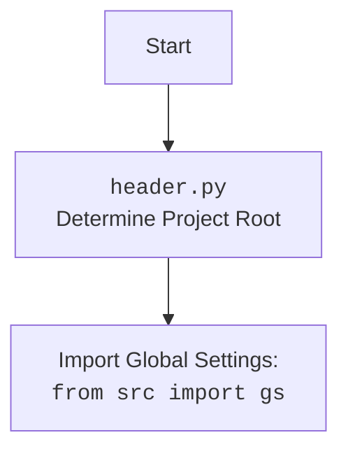

## Анализ модуля Crawlee Python для автоматизации и сбора данных

### 1. <алгоритм>

**Описание рабочего процесса:**

Этот документ описывает модуль `CrawleePython`, который представляет собой кастомную реализацию `PlaywrightCrawler` из библиотеки `Crawlee`. Модуль позволяет настраивать браузер, обрабатывать запросы и извлекать данные с веб-страниц, опираясь на конфигурацию из файла `crawlee_python.json`.

**Блок-схема:**

1.  **Инициализация `CrawleePython`**:
    *   Создается экземпляр класса `CrawleePython`, которому передаются параметры (максимальное количество запросов, режим без головы, тип браузера и опционально, список опций).
    *   **Пример**: `crawler = CrawleePython(max_requests=10, headless=True, browser_type='chromium', options=["--disable-gpu"])` или `crawler = CrawleePython()`
    *   Сохраняются переданные параметры в атрибуты объекта, а также создается атрибут `self.crawler = None`.

2.  **Настройка сканера (`setup_crawler`)**:
    *   Метод `setup_crawler` создает экземпляр `PlaywrightCrawler` и настраивает обработчик запросов.
    *   **Пример**: `await crawler.setup_crawler()`
    *   Создает экземпляр `PlaywrightCrawler`, передавая параметры из атрибутов объекта.
    *   Устанавливает обработчик запросов `request_handler`, который логирует обработку URL, добавляет ссылки в очередь и извлекает данные.
        *   В `request_handler` происходит логирование обработки URL, добавление найденных ссылок в очередь сканирования (`context.enqueue_links()`).
        *   Также извлекаются данные о текущей странице, такие как URL, заголовок, и первые 100 символов контента (`await context.page.content()`).
        *   Извлеченные данные добавляются в очередь результатов с помощью `context.push_data()`.

3.  **Запуск сканера (`run_crawler`)**:
    *   Метод `run_crawler` запускает сканирование с переданным списком URL.
    *   **Пример**: `await crawler.run_crawler(['https://example.com', 'https://example.org'])`
    *   Использует `self.crawler.run(urls)` для запуска сканирования.

4.  **Экспорт данных (`export_data`)**:
    *   Метод `export_data` экспортирует собранные данные в JSON файл.
    *   **Пример**: `await crawler.export_data('results.json')`
    *   Использует `self.crawler.export_data(file_path)` для сохранения данных в файл.

5.  **Получение данных (`get_data`)**:
    *   Метод `get_data` возвращает извлеченные данные.
    *   **Пример**: `data = await crawler.get_data()`
    *   Использует `self.crawler.get_data()` для получения данных.

6.  **Запуск сканирования (`run`)**:
    *   Метод `run` используется для запуска всего процесса сканирования.
    *   **Пример**: `await crawler.run(['https://example.com'])`
    *   Вызывает `setup_crawler` для настройки сканера.
    *   Вызывает `run_crawler` для запуска сканирования.
    *   Вызывает `export_data` для сохранения результатов в JSON файл.
    *   Получает результаты с помощью `get_data()` и логирует.
    *   Обрабатывает исключения, которые могут возникнуть в процессе.

### 2. <mermaid>

```mermaid
flowchart TD
    Start[Start] --> InitCrawler[Initialize CrawleePython: <br><code>CrawleePython(max_requests, headless, browser_type, options)</code>]
    InitCrawler --> SetAttributes[Set class attributes]
    SetAttributes --> SetupCrawlerCall[Set up crawler:<br><code>setup_crawler()</code>]
     SetupCrawlerCall --> InitPlaywrightCrawler[Init PlaywrightCrawler]
    InitPlaywrightCrawler --> SetDefaultRequestHandler[Set default request handler: <br><code>request_handler(context)</code>]
    SetDefaultRequestHandler --> EnqueueLinks[Enqueue links from the page: <br><code>context.enqueue_links()</code>]
    EnqueueLinks --> ExtractData[Extract data (URL, title, content)]
    ExtractData --> PushData[Push extracted data to dataset]
    PushData --> RunCrawlerCall[Run crawler: <br><code>run_crawler(urls)</code>]
    RunCrawlerCall --> RunPlaywrightCrawler[Run Playwright Crawler: <br><code>crawler.run(urls)</code>]
     RunPlaywrightCrawler --> ExportDataCall[Export data: <br><code>export_data(file_path)</code>]
   ExportDataCall --> ExportPlaywrightCrawler[Export data with Playwright: <br><code>crawler.export_data(file_path)</code>]
   ExportPlaywrightCrawler --> GetDataCall[Get data: <br><code>get_data()</code>]
    GetDataCall --> GetDataPlaywrightCrawler[Get data with Playwright: <br><code>crawler.get_data()</code>]
     GetDataPlaywrightCrawler --> LogData[Log extracted data]
     LogData --> End[End]
```



**Объяснение зависимостей `mermaid`:**

*   **`pathlib`**: Используется для работы с путями к файлам (сохранение результатов).
*   **`asyncio`**: Используется для асинхронного программирования.
*   **`crawlee.playwright_crawler`**: Используется для создания веб-сканеров на базе Playwright.
*    **`src`**: Используется для импорта глобальных настроек `gs` и логгера.
*   **`src.logger.logger`**: Используется для логирования.
*   **`src.utils.jjson`**: Используется в примере (не в коде) для загрузки настроек из JSON файла.

### 3. <объяснение>

**Импорты:**

*   `pathlib.Path`: Используется для работы с путями к файлам.
*   `typing.Optional`, `typing.List`, `typing.Dict`, `typing.Any`: Используются для аннотации типов.
*  `src`: Используется для импорта глобальных настроек `gs`.
*   `asyncio`: Используется для асинхронного программирования.
*   `crawlee.playwright_crawler.PlaywrightCrawler`, `crawlee.playwright_crawler.PlaywrightCrawlingContext`: Используются для создания и управления веб-сканером.
*  `src.logger.logger`: Используется для логирования.
*   `src.utils.jjson.j_loads_ns`: Используется для загрузки JSON конфигураций (не используется в основном коде, но упоминается в документации).

**Классы:**

*   `CrawleePython`:
    *   **Роль**: Реализует веб-сканер с использованием библиотеки `Crawlee` и `Playwright`.
    *   **Атрибуты**:
        *    `max_requests`: (`int`) - Максимальное количество запросов.
        *   `headless`: (`bool`) - Безголовый режим.
        *   `browser_type`: (`str`) - Тип браузера.
        *   `options`: (`Optional[List[str]]`) - Опции запуска браузера.
        *   `crawler`: (`PlaywrightCrawler`) - Объект `PlaywrightCrawler`.
    *   **Методы**:
        *   `__init__`: Инициализация параметров сканера.
        *   `setup_crawler`: Настройка `PlaywrightCrawler` и обработчика запросов.
        *    `run_crawler`: Запуск сканера.
        *    `export_data`: Экспорт данных в файл.
        *    `get_data`: Получение извлеченных данных.
        *    `run`: Запуск сканера, экспорт и логирование.

**Функции:**

*   `__init__(self, max_requests: int = 5, headless: bool = False, browser_type: str = 'firefox', options: Optional[List[str]] = None)`:
    *   **Аргументы**:
        *  `max_requests`: (`int`) - Максимальное количество запросов.
        *  `headless`: (`bool`) - Безголовый режим.
        *   `browser_type`: (`str`) - Тип браузера.
        *   `options`: (`Optional[List[str]]`) - Список опций браузера.
    *   **Назначение**: Инициализирует объект класса.
    *   **Возвращает**: `None`.
*   `setup_crawler(self)`:
    *   **Аргументы**:
        *   `self` (`CrawleePython`): Экземпляр класса `CrawleePython`.
    *   **Назначение**: Создает экземпляр `PlaywrightCrawler`, настраивает обработчик запросов и передает необходимые параметры.
    *   **Возвращает**: `None`.
*    `run_crawler(self, urls: List[str])`:
    *   **Аргументы**:
        *   `urls`: (`List[str]`) - Список URL для сканирования.
    *   **Назначение**: Запускает сканер.
    *   **Возвращает**: `None`.
*    `export_data(self, file_path: str)`:
    *    **Аргументы**:
        *   `file_path`: (`str`) - Путь для сохранения данных.
    *   **Назначение**: Экспортирует собранные данные в JSON файл.
    *   **Возвращает**: `None`.
*   `get_data(self) -> Dict[str, Any]`:
    *   **Аргументы**:
        * `self` (`CrawleePython`): Экземпляр класса `CrawleePython`.
    *   **Назначение**: Получает извлеченные данные.
    *  **Возвращает**: `Dict[str, Any]` - Словарь с извлеченными данными.
*   `run(self, urls: List[str])`:
     *  **Аргументы**:
         *  `urls`: (`List[str]`) - Список URL для сканирования.
     *   **Назначение**: Запускает сканер, экспортирует данные и логирует результаты.
     *  **Возвращает**: `None`.

**Переменные:**

*   `self.max_requests`: (`int`) - Максимальное количество запросов.
*   `self.headless`: (`bool`) - Режим без головы.
*   `self.browser_type`: (`str`) - Тип браузера.
*   `self.options`: (`List[str]`) - Опции запуска браузера.
*  `self.crawler`: (`PlaywrightCrawler`) - Экземпляр `PlaywrightCrawler`.
*  `context`: (`PlaywrightCrawlingContext`) - контекст запроса.
*  `data`: (`Dict[str, Any]`) - Словарь извлеченных данных.
*   `file_path`: (`str`) - Путь для сохранения результатов.
*    `urls`: (`List[str]`) - Список URL для сканирования.

**Потенциальные ошибки и области для улучшения:**

*   Обработка ошибок в `request_handler` может быть улучшена.
*   Можно добавить возможность настройки прокси, user-agent, viewport и других параметров из конфигурационного файла.
*   Можно добавить возможность выбора разных форматов экспорта данных.
*   Можно добавить поддержку разных типов локаторов (XPath, CSS).
*   Нужно добавить обработку ситуации, когда список URL пуст.

**Взаимосвязи с другими частями проекта:**

*   Модуль использует `src.logger.logger` для логирования.
*   Модуль использует глобальные настройки `gs` из пакета `src`.
*   Модуль использует библиотеку `Crawlee` для сканирования веб-страниц.
*   Модуль предназначен для автоматизированного сбора данных и может взаимодействовать с другими модулями проекта для обработки полученных данных.
*   Использует `src.utils.jjson` для загрузки конфигурации (хотя в данном коде не используется напрямую).

Этот анализ предоставляет полное представление о работе модуля `crawlee_python.py`, его структуре, зависимостях и возможностях.