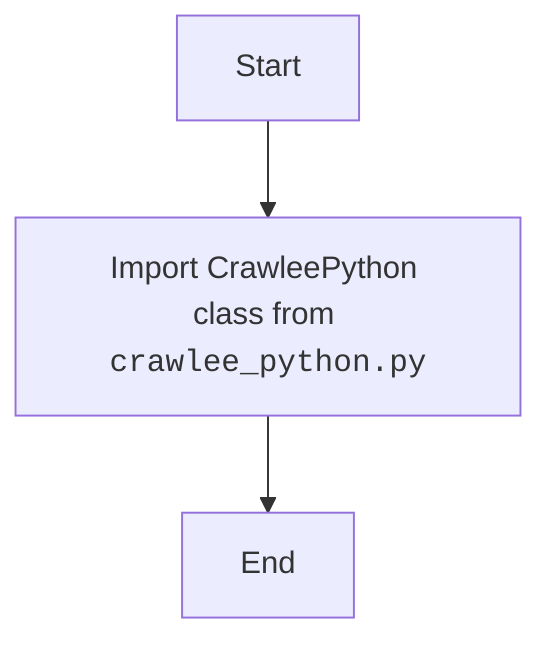

## Анализ кода модуля `__init__.py` в `src.webdriver.crawlee_python`

### 1. <алгоритм>

**Описание рабочего процесса:**

Модуль `__init__.py` служит для инициализации пакета `src.webdriver.crawlee_python`. В данном случае он импортирует класс `CrawleePython` из модуля `crawlee_python.py`, делая его доступным при импорте пакета `src.webdriver.crawlee_python`.

**Блок-схема:**

1.  **Импорт класса `CrawleePython`**:
    *   Импортируется класс `CrawleePython` из модуля `crawlee_python.py`, находящегося в той же директории.
    *   **Пример**: `from .crawlee_python import CrawleePython`

### 2. <mermaid>

**Объяснение зависимостей `mermaid`:**

В данном коде нет внешних зависимостей.

### 3. <объяснение>

**Импорты:**

*   `from .crawlee_python import CrawleePython`: Импортирует класс `CrawleePython` из модуля `crawlee_python.py`, находящегося в той же директории.

**Классы:**

В данном коде нет классов.

**Функции:**

В данном коде нет функций.

**Переменные:**

В данном коде нет переменных, кроме импортированного класса `CrawleePython`.

**Потенциальные ошибки и области для улучшения:**

*   Код выполняет только импорт и не имеет явной логики, поэтому потенциальные ошибки отсутствуют.
*   В данном случае улучшения не требуются, так как модуль выполняет свою функцию.

**Взаимосвязи с другими частями проекта:**

*   Этот модуль является частью пакета `src.webdriver.crawlee_python`.
*   Он обеспечивает доступность класса `CrawleePython` при импорте пакета `src.webdriver.crawlee_python`.
*  Модуль не имеет внешних зависимостей.

Этот анализ предоставляет полное представление о функциональности модуля `__init__.py` в пакете `src.webdriver.crawlee_python`.