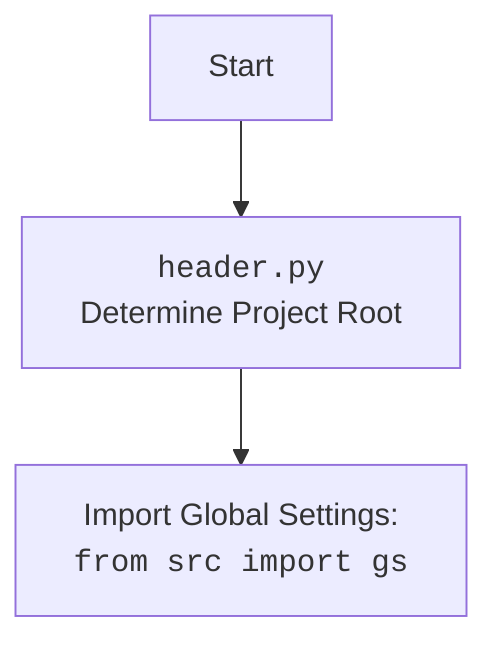

## Анализ кода модуля `crawlee_python.py`

### 1. <алгоритм>

**Описание рабочего процесса:**

Модуль `crawlee_python.py` реализует кастомный веб-сканер на базе библиотеки `Crawlee` с использованием `Playwright`. Модуль позволяет настраивать браузер, обрабатывать запросы и извлекать данные с веб-страниц.

**Блок-схема:**

1.  **Инициализация `CrawleePython` (`__init__`)**:
    *   Создается экземпляр класса `CrawleePython` с параметрами (максимальное количество запросов, безголовый режим, тип браузера, опции).
    *   **Пример**: `crawler = CrawleePython(max_requests=10, headless=True, browser_type='chromium')` или `crawler = CrawleePython()`
    *   Сохраняет переданные параметры.
    *   Инициализирует переменную `self.crawler` в `None`.

2.  **Настройка сканера (`setup_crawler`)**:
    *   Метод `setup_crawler` настраивает экземпляр `PlaywrightCrawler`.
    *   **Пример**: `await crawler.setup_crawler()`
    *   Инициализирует `PlaywrightCrawler` с параметрами (макс. кол-во запросов, безголовый режим, тип браузера, опции).
    *   Создает обработчик запросов (`request_handler`) для `PlaywrightCrawler`, который логирует URL, добавляет новые ссылки в очередь и извлекает title и первые 100 символов контента.

3.  **Запуск сканера (`run_crawler`)**:
    *   Метод `run_crawler` запускает сканер с переданным списком URL.
    *   **Пример**: `await crawler.run_crawler(['https://example.com', 'https://example.org'])`
    *   Использует `self.crawler.run(urls)` для запуска процесса сканирования.

4.  **Экспорт данных (`export_data`)**:
    *   Метод `export_data` экспортирует извлеченные данные в JSON-файл.
    *   **Пример**: `await crawler.export_data('results.json')`
    *   Использует `self.crawler.export_data(file_path)` для сохранения данных.

5.  **Получение данных (`get_data`)**:
    *   Метод `get_data` возвращает все извлеченные данные.
    *   **Пример**: `data = await crawler.get_data()`
    *   Использует `self.crawler.get_data()` для получения извлеченных данных.

6.  **Запуск сканера и экспорт данных (`run`)**:
    *   Метод `run` управляет процессом сканирования, экспорта данных и логирования.
    *   **Пример**: `await crawler.run(['https://example.com'])`
    *   Вызывает `setup_crawler` для настройки сканера.
    *   Вызывает `run_crawler` для запуска сканирования.
    *   Вызывает `export_data` для экспорта результатов в JSON.
    *   Получает данные с помощью `get_data` и логирует их.
    *   Обрабатывает исключения и логирует ошибки.

### 2. <mermaid>

```mermaid
flowchart TD
    Start[Start] --> InitCrawler[Initialize CrawleePython: <br><code>CrawleePython(max_requests, headless, browser_type, options)</code>]
    InitCrawler --> SetAttributes[Set class attributes]
    SetAttributes --> SetupCrawlerCall[Set up crawler:<br><code>setup_crawler()</code>]
     SetupCrawlerCall --> InitPlaywrightCrawler[Init PlaywrightCrawler]
    InitPlaywrightCrawler --> SetDefaultRequestHandler[Set default request handler: <br><code>request_handler(context)</code>]
    SetDefaultRequestHandler --> EnqueueLinks[Enqueue links from the page: <br><code>context.enqueue_links()</code>]
    EnqueueLinks --> ExtractData[Extract data (URL, title, content)]
    ExtractData --> PushData[Push extracted data to dataset]
    PushData --> RunCrawlerCall[Run crawler: <br><code>run_crawler(urls)</code>]
    RunCrawlerCall --> RunPlaywrightCrawler[Run Playwright Crawler: <br><code>crawler.run(urls)</code>]
     RunPlaywrightCrawler --> ExportDataCall[Export data: <br><code>export_data(file_path)</code>]
   ExportDataCall --> ExportPlaywrightCrawler[Export data with Playwright: <br><code>crawler.export_data(file_path)</code>]
   ExportPlaywrightCrawler --> GetDataCall[Get data: <br><code>get_data()</code>]
    GetDataCall --> GetDataPlaywrightCrawler[Get data with Playwright: <br><code>crawler.get_data()</code>]
     GetDataPlaywrightCrawler --> LogData[Log extracted data]
     LogData --> End[End]
```



**Объяснение зависимостей `mermaid`:**

*   **`pathlib`**: Используется для работы с путями к файлам.
*   **`asyncio`**: Используется для асинхронного программирования.
*   **`crawlee.playwright_crawler`**: Используется для создания веб-сканеров на основе Playwright.
*    **`src`**: Используется для импорта глобальных настроек `gs` и логгера.
*    **`src.logger.logger`**: Используется для логирования.
*   **`src.utils.jjson`**: Используется для работы с JSON.

### 3. <объяснение>

**Импорты:**

*   `pathlib.Path`: Используется для работы с путями к файлам.
*    `typing.Optional`, `typing.List`, `typing.Dict`, `typing.Any`: Используются для аннотации типов.
*   `src`: Используется для импорта глобальных настроек `gs`.
*   `asyncio`: Используется для асинхронного программирования.
*   `crawlee.playwright_crawler.PlaywrightCrawler`, `crawlee.playwright_crawler.PlaywrightCrawlingContext`: Используются для создания и управления веб-сканером.
*   `src.logger.logger`: Используется для логирования.
*   `src.utils.jjson.j_loads_ns`: Используется для работы с JSON (не используется непосредственно, но в примере).

**Классы:**

*   `CrawleePython`:
    *   **Роль**: Реализует кастомный веб-сканер на основе `PlaywrightCrawler`.
    *   **Атрибуты**:
        *   `max_requests`: (`int`) Максимальное количество запросов для сканирования.
        *   `headless`: (`bool`) Запускать ли браузер в безголовом режиме.
        *   `browser_type`: (`str`) Тип браузера (`chromium`, `firefox`, `webkit`).
        *   `options`: (`Optional[List[str]]`) Список опций для браузера.
        *   `crawler`: (`PlaywrightCrawler`) Экземпляр `PlaywrightCrawler`.
    *   **Методы**:
        *   `__init__(self, max_requests: int = 5, headless: bool = False, browser_type: str = 'firefox', options: Optional[List[str]] = None)`: Инициализирует сканер с переданными параметрами.
        *    `setup_crawler(self)`: Настраивает экземпляр `PlaywrightCrawler` с заданными параметрами и обработчиком запросов.
        *   `run_crawler(self, urls: List[str])`: Запускает сканер с переданными URL.
        *   `export_data(self, file_path: str)`: Экспортирует данные в JSON файл.
        *   `get_data(self) -> Dict[str, Any]`: Получает извлеченные данные.
        *   `run(self, urls: List[str])`: Запускает сканирование, экспортирует данные и логирует результаты.

**Функции:**

*   `__init__(...)`:
    *   **Аргументы**:
        *   `max_requests`: (`int`) Максимальное количество запросов.
        *   `headless`: (`bool`) Запускать ли браузер в безголовом режиме.
        *    `browser_type`: (`str`) Тип браузера.
        *   `options`: (`Optional[List[str]]`) Список опций.
    *   **Назначение**: Инициализирует объект класса.
    *   **Возвращает**: `None`.
*    `setup_crawler(self)`:
    *   **Аргументы**:
        *  `self` (`CrawleePython`): Экземпляр класса `CrawleePython`.
    *   **Назначение**: Создает экземпляр `PlaywrightCrawler` с заданными параметрами и настраивает обработчик запросов.
    *   **Возвращает**: `None`.
*   `run_crawler(self, urls: List[str])`:
    *   **Аргументы**:
        *   `urls`: (`List[str]`) Список URL для сканирования.
    *   **Назначение**: Запускает сканер с заданными URL.
    *   **Возвращает**: `None`.
*   `export_data(self, file_path: str)`:
    *  **Аргументы**:
        *   `file_path`: (`str`) Путь к файлу, в который будут экспортированы данные.
    *   **Назначение**: Экспортирует все собранные данные в файл.
    *   **Возвращает**: `None`.
*    `get_data(self) -> Dict[str, Any]`:
    *  **Аргументы**:
        *   `self` (`CrawleePython`): Экземпляр класса `CrawleePython`.
    *   **Назначение**: Возвращает все собранные данные.
    *   **Возвращает**: Словарь со всеми собранными данными.
*   `run(self, urls: List[str])`:
    *   **Аргументы**:
        *   `urls`: (`List[str]`) Список URL для сканирования.
    *   **Назначение**: Запускает весь процесс сканирования, экспорта и логирования данных.
    *   **Возвращает**: `None`.

**Переменные:**

*   `self.max_requests`: (`int`) Максимальное количество запросов.
*   `self.headless`: (`bool`)  Флаг для безголового режима.
*   `self.browser_type`: (`str`) Тип браузера.
*   `self.options`: (`List[str]`) Список опций браузера.
*   `self.crawler`: (`PlaywrightCrawler`) экземпляр класса `PlaywrightCrawler`.
*  `context`: (`PlaywrightCrawlingContext`) контекст запроса.
* `data`: (`Dict[str, Any]`) Словарь собранных данных.
* `file_path`: (`str`) Путь к файлу для экспорта.
*  `urls`: (`List[str]`) Список URL для сканирования.

**Потенциальные ошибки и области для улучшения:**

*   Можно добавить поддержку конфигурационных файлов для Playwright.
*    Метод `run` можно разделить на несколько методов для более читаемого кода.
*   Можно добавить возможность настройки прокси.
*   Нужно добавить обработку исключений в методе `request_handler`.
*   В методе `run` можно использовать явные ожидания.
*    Можно добавить возможность вывода данных в разных форматах (CSV, Excel и т.д.).

**Взаимосвязи с другими частями проекта:**

*   Модуль импортирует `src.logger.logger` для логирования.
*   Модуль использует глобальные настройки `gs` из пакета `src`.
*   Модуль может использоваться для автоматического сбора данных с веб-страниц.
*   Использует библиотеку `Crawlee` и `Playwright` для работы с веб-страницами.
*  Может взаимодействовать с другими модулями для обработки собранных данных.

Этот анализ предоставляет полное представление о работе модуля `crawlee_python.py`, его структуре, зависимостях и возможностях.