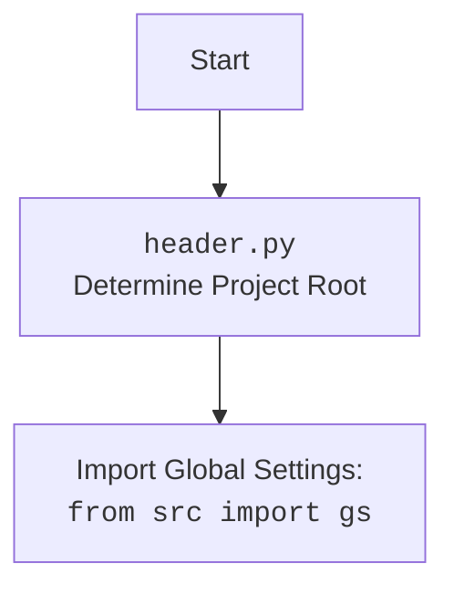

## Анализ модуля Crawlee Python для автоматизации и сбора данных

### 1. <алгоритм>

**Описание рабочего процесса:**

Этот документ описывает модуль `CrawleePython`, который является кастомной реализацией веб-сканера на основе `PlaywrightCrawler` из библиотеки `Crawlee`. Модуль предназначен для автоматизации сбора данных с веб-страниц с настраиваемыми параметрами браузера и конфигурацией из файла `crawlee_python.json`.

**Блок-схема:**

1.  **Инициализация `CrawleePython`**:
    *   Создается экземпляр класса `CrawleePython` с параметрами (максимальное кол-во запросов, безголовый режим, тип браузера и дополнительные опции).
    *   **Пример**: `crawler = CrawleePython(max_requests=10, headless=True, browser_type='chromium', options=["--disable-gpu"])` или `crawler = CrawleePython()`
    *   Сохраняет переданные параметры в атрибутах объекта.

2.  **Настройка сканера (`setup_crawler`)**:
    *   Метод `setup_crawler` настраивает экземпляр `PlaywrightCrawler`.
    *   **Пример**: `await crawler.setup_crawler()`
    *   Создает экземпляр `PlaywrightCrawler` с параметрами из объекта.
    *   Устанавливает обработчик запросов `request_handler`, который:
        *   Логирует URL страницы.
        *   Добавляет найденные ссылки в очередь.
        *    Извлекает данные (URL, заголовок, первые 100 символов контента) со страницы.
        *   Добавляет извлеченные данные в очередь результатов.

3.  **Запуск сканера (`run_crawler`)**:
    *   Метод `run_crawler` запускает сканирование, передавая список URL.
    *   **Пример**: `await crawler.run_crawler(['https://example.com', 'https://example.org'])`
    *   Использует `self.crawler.run(urls)` для запуска сканирования.

4.  **Экспорт данных (`export_data`)**:
    *   Метод `export_data` экспортирует все извлеченные данные в JSON файл.
    *   **Пример**: `await crawler.export_data('results.json')`
    *   Использует `self.crawler.export_data(file_path)` для сохранения данных в файл.

5.  **Получение данных (`get_data`)**:
    *   Метод `get_data` возвращает все извлеченные данные.
    *   **Пример**: `data = await crawler.get_data()`
    *   Использует `self.crawler.get_data()` для получения данных.

6.  **Запуск сканирования (`run`)**:
    *   Метод `run` управляет полным циклом сканирования.
    *   **Пример**: `await crawler.run(['https://example.com'])`
    *   Вызывает `setup_crawler()` для настройки сканера.
    *   Вызывает `run_crawler()` для запуска сканирования.
    *   Экспортирует данные в JSON файл.
    *   Получает все данные из сканера.
    *   Логирует извлеченные данные.
    *    Обрабатывает исключения, которые могут возникнуть.

### 2. <mermaid>

```mermaid
flowchart TD
    Start[Start] --> InitCrawler[Initialize CrawleePython: <br><code>CrawleePython(max_requests, headless, browser_type, options)</code>]
    InitCrawler --> SetAttributes[Set class attributes]
    SetAttributes --> SetupCrawlerCall[Set up crawler:<br><code>setup_crawler()</code>]
     SetupCrawlerCall --> InitPlaywrightCrawler[Init PlaywrightCrawler]
    InitPlaywrightCrawler --> SetDefaultRequestHandler[Set default request handler: <br><code>request_handler(context)</code>]
    SetDefaultRequestHandler --> EnqueueLinks[Enqueue links from the page: <br><code>context.enqueue_links()</code>]
    EnqueueLinks --> ExtractData[Extract data (URL, title, content)]
    ExtractData --> PushData[Push extracted data to dataset]
    PushData --> RunCrawlerCall[Run crawler: <br><code>run_crawler(urls)</code>]
    RunCrawlerCall --> RunPlaywrightCrawler[Run Playwright Crawler: <br><code>crawler.run(urls)</code>]
     RunPlaywrightCrawler --> ExportDataCall[Export data: <br><code>export_data(file_path)</code>]
   ExportDataCall --> ExportPlaywrightCrawler[Export data with Playwright: <br><code>crawler.export_data(file_path)</code>]
   ExportPlaywrightCrawler --> GetDataCall[Get data: <br><code>get_data()</code>]
    GetDataCall --> GetDataPlaywrightCrawler[Get data with Playwright: <br><code>crawler.get_data()</code>]
     GetDataPlaywrightCrawler --> LogData[Log extracted data]
     LogData --> End[End]
```



**Объяснение зависимостей `mermaid`:**

*   **`pathlib`**: Используется для работы с путями к файлам.
*   **`asyncio`**: Используется для асинхронного программирования.
*   **`crawlee.playwright_crawler`**: Используется для создания веб-сканеров на базе Playwright.
*    **`src`**: Используется для импорта глобальных настроек `gs` и логгера.
*   **`src.logger.logger`**: Используется для логирования.
*   **`src.utils.jjson`**: Используется для загрузки конфигураций из JSON файла.

### 3. <объяснение>

**Импорты:**

*   `pathlib.Path`: Используется для работы с путями к файлам.
*   `typing.Optional`, `typing.List`, `typing.Dict`, `typing.Any`: Используются для аннотации типов.
*   `src`: Используется для импорта глобальных настроек `gs`.
*    `asyncio`: Используется для асинхронного программирования.
*   `crawlee.playwright_crawler.PlaywrightCrawler`, `crawlee.playwright_crawler.PlaywrightCrawlingContext`: Используются для создания и управления веб-сканером.
*    `src.logger.logger`: Используется для логирования.
*   `src.utils.jjson.j_loads_ns`: Используется для загрузки JSON-конфигураций (хотя в коде не используется напрямую).

**Классы:**

*   `CrawleePython`:
    *   **Роль**: Кастомный класс для веб-сканирования с использованием Crawlee и Playwright.
    *   **Атрибуты**:
        *   `max_requests`: (`int`) Максимальное количество запросов для сканирования.
        *   `headless`: (`bool`) Режим безголового браузера.
        *    `browser_type`: (`str`) Тип браузера (chromium, firefox, webkit).
        *   `options`: (`Optional[List[str]]`) Список опций запуска браузера.
        *    `crawler`: (`PlaywrightCrawler`) Объект `PlaywrightCrawler`.
    *   **Методы**:
        *   `__init__`: Инициализация объекта `CrawleePython`.
        *    `setup_crawler`: Настройка `PlaywrightCrawler`.
        *  `run_crawler`: Запуск сканирования.
        *  `export_data`: Экспорт данных в JSON.
        * `get_data`: Получение извлеченных данных.
        *   `run`: Полный цикл запуска сканирования.

**Функции:**

*   `__init__(self, max_requests: int = 5, headless: bool = False, browser_type: str = 'firefox', options: Optional[List[str]] = None)`:
    *    **Аргументы**:
        *    `max_requests`: (`int`) - Максимальное количество запросов.
        *    `headless`: (`bool`) - Режим без головы.
        *   `browser_type`: (`str`) - Тип браузера.
        *   `options`: (`Optional[List[str]]`) - Список опций для браузера.
    *   **Назначение**: Инициализация объекта класса.
    *   **Возвращает**: `None`.
*   `setup_crawler(self)`:
    *    **Аргументы**:
        *    `self` (`CrawleePython`): Экземпляр класса `CrawleePython`.
    *    **Назначение**: Настраивает объект PlaywrightCrawler, устанавливая максимальное количество запросов, тип браузера, опции и обработчик запросов.
    *   **Возвращает**: `None`.
*   `run_crawler(self, urls: List[str])`:
    *    **Аргументы**:
        *   `urls`: (`List[str]`) - Список URL для сканирования.
    *    **Назначение**: Запускает сканирование с указанными URL.
    *    **Возвращает**: `None`.
*   `export_data(self, file_path: str)`:
    *   **Аргументы**:
        *    `file_path`: (`str`) - Путь к файлу для сохранения результатов.
    *   **Назначение**: Экспортирует данные в файл JSON.
    *    **Возвращает**: `None`.
*   `get_data(self) -> Dict[str, Any]`:
    *   **Аргументы**:
        *   `self` (`CrawleePython`): Экземпляр класса `CrawleePython`.
    *    **Назначение**: Возвращает собранные данные.
    *    **Возвращает**: `Dict[str, Any]` - Словарь со всеми собранными данными.
*   `run(self, urls: List[str])`:
    *    **Аргументы**:
        *   `urls`: (`List[str]`) - Список URL для сканирования.
    *    **Назначение**: Запускает полный цикл сканирования, экспорта и логирования данных.
    *   **Возвращает**: `None`.

**Переменные:**

*    `self.max_requests`: (`int`) - Максимальное количество запросов.
*   `self.headless`: (`bool`) - Режим без головы.
*   `self.browser_type`: (`str`) - Тип браузера.
*   `self.options`: (`List[str]`) - Опции запуска браузера.
*   `self.crawler`: (`PlaywrightCrawler`) - Экземпляр `PlaywrightCrawler`.
*   `context`: (`PlaywrightCrawlingContext`) - контекст запроса.
*    `data`: (`Dict[str, Any]`) - словарь извлеченных данных.
*    `file_path`: (`str`) - путь для сохранения результатов.
*   `urls`: (`List[str]`) - список URL для сканирования.

**Потенциальные ошибки и области для улучшения:**

*   В коде отсутствует обработка исключений в обработчике запросов `request_handler`.
*    Метод `run` можно разделить на несколько методов для более гибкого использования.
*  Логика экспорта данных жестко задана, следует вынести возможность настройки формата экспорта.
*   Можно добавить возможность настраивать прокси из конфигурационного файла `crawlee_python.json`.
*   Можно добавить больше опций для настройки Playwright (viewport, user-agent).

**Взаимосвязи с другими частями проекта:**

*   Модуль использует `src.logger.logger` для логирования.
*   Модуль использует глобальные настройки `gs` из пакета `src`.
*   Модуль может использоваться для сбора данных с веб-страниц.
*   Использует библиотеку `Crawlee` и `Playwright` для работы с браузером.
*   Может взаимодействовать с другими частями проекта для обработки собранных данных.
*   Использует `src.utils.jjson` в примере для загрузки настроек.

Этот анализ предоставляет исчерпывающую информацию о модуле `crawlee_python.py`, включая его структуру, зависимости и возможности.