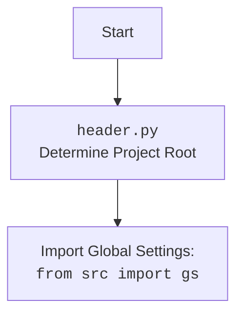

## Анализ кода модуля `driver.py`

### 1. <алгоритм>

**Описание рабочего процесса:**

Модуль `driver.py` предоставляет класс `Driver`, который используется для взаимодействия с веб-драйверами Selenium. Класс обеспечивает методы для инициализации драйвера, навигации, управления куками, прокрутки и обработки исключений.

**Блок-схема:**

1.  **Инициализация `Driver` (`__init__`)**:
    *   Создается экземпляр класса `Driver` с параметрами: класс веб-драйвера (`webdriver_cls`) и дополнительные аргументы (`*args`, `**kwargs`).
    *   **Пример**: `driver = Driver(Chrome, executable_path='/path/to/chromedriver')`
    *   Проверяется наличие метода `get` у `webdriver_cls`, чтобы убедиться, что это валидный класс WebDriver.
    *   Создается экземпляр веб-драйвера: `self.driver = webdriver_cls(*args, **kwargs)`.

2.  **Инициализация подкласса (`__init_subclass__`)**:
    *   Этот метод вызывается автоматически при создании подкласса `Driver`.
    *   **Пример**: `class CustomDriver(Driver, browser_name='chrome'): ...`
    *   Проверяется наличие аргумента `browser_name` при создании подкласса, и если он отсутствует, то выбрасывается `ValueError`.
    *   `browser_name` сохраняется в атрибуте класса: `cls.browser_name = browser_name`.

3.  **Проксирование атрибутов (`__getattr__`)**:
    *   Этот метод позволяет обращаться к атрибутам экземпляра `Driver`, которых нет непосредственно в классе `Driver`.
    *   **Пример**: `driver.current_url` вызовет `self.driver.current_url`.
    *   Метод проксирует доступ к атрибутам объекта `self.driver` с помощью `getattr(self.driver, item)`.

4.  **Прокрутка (`scroll`)**:
    *   Метод `scroll` используется для прокрутки страницы в заданном направлении.
    *   **Пример**: `driver.scroll(scrolls=2, direction='down')`
    *   Внутренняя функция `carousel` выполняет прокрутку, используя `execute_script` для выполнения JavaScript.
    *   Используется метод `wait` для задержки между прокрутками.
    *   Направление прокрутки может быть `'forward'`, `'down'`, `'backward'`, `'up'` или `'both'`.

5.  **Определение локали (`locale`)**:
    *   Свойство `locale` пытается определить язык страницы, сначала ища мета-тег `Content-Language`.
    *   **Пример**: `lang = driver.locale`
    *   Если мета-тег не найден, то вызывается метод `get_page_lang()` (который не реализован в коде).
    *   Если язык определить не удалось, возвращается `None`.

6.  **Переход по URL (`get_url`)**:
    *   Метод `get_url` переходит по указанному URL.
    *   **Пример**: `driver.get_url('https://example.com')`
    *   Перед переходом сохраняется текущий URL в `_previous_url`.
    *   Используется `self.driver.get(url)` для загрузки страницы.
    *   Ожидается завершение загрузки страницы (`while self.ready_state != 'complete'`).
    *   Сохраняется предыдущий URL в `self.previous_url`, если текущий URL отличается.
    *   Сохраняются куки с помощью `self._save_cookies_localy()`.
    *   Обрабатываются исключения `WebDriverException` и `InvalidArgumentException`, а также общее `Exception`.

7.  **Открытие нового окна (`window_open`)**:
    *   Метод `window_open` открывает новое окно браузера.
    *   **Пример**: `driver.window_open('https://newtab.com')`
    *   Используется `execute_script('window.open();')` для открытия новой вкладки.
    *   Выполняется переключение на новую вкладку с помощью `self.switch_to.window(self.window_handles[-1])`.
    *   Если URL предоставлен, то он загружается в новой вкладке с помощью `self.get(url)`.

8.  **Ожидание (`wait`)**:
    *   Метод `wait` приостанавливает выполнение на заданное время.
    *   **Пример**: `driver.wait(2)`
    *   Используется `time.sleep(delay)` для создания задержки.

9.  **Сохранение куков (`_save_cookies_localy`)**:
    *   Метод `_save_cookies_localy` сохраняет куки веб-драйвера в локальный файл.
    *   **Пример**: `driver._save_cookies_localy()`
    *   В коде есть заглушка `return True`, что отключает сохранение куков, но когда не будет заглушки будет использоваться `pickle.dump(self.driver.get_cookies(), cookiesfile)`.

10. **Извлечение HTML (`fetch_html`)**:
    *   Метод `fetch_html` используется для загрузки HTML контента с файла или веб-страницы.
    *   **Пример**: `driver.fetch_html('file:///path/to/file.html')` или `driver.fetch_html('https://example.com')`
    *   Проверяется, является ли URL файлом или веб-адресом.
    *   Если это файл, то читается содержимое файла.
    *   Если это веб-адрес, то используется `get_url` для загрузки страницы и сохраняется `page_source`.

### 2. <mermaid>

```mermaid
flowchart TD
    Start[Start] --> InitDriver[Initialize Driver: <br><code>Driver(webdriver_cls, *args, **kwargs)</code>]
    InitDriver --> CheckWebDriver[Check if <br><code>webdriver_cls</code> is valid]
    CheckWebDriver -- Yes --> CreateWebDriver[Create driver instance <br><code>self.driver = webdriver_cls(*args, **kwargs)</code>]
    CheckWebDriver -- No --> TypeError[Raise TypeError]
    CreateWebDriver --> SubclassInit[Subclass Initialization: <br><code>__init_subclass__</code>]
    SubclassInit --> CheckBrowserName[Check if <br><code>browser_name</code> is specified]
    CheckBrowserName -- Yes --> SetBrowserName[Set browser name: <br><code>cls.browser_name = browser_name</code>]
    CheckBrowserName -- No --> ValueError[Raise ValueError]
    SetBrowserName --> AttributeProxy[Access Attribute: <br><code>__getattr__(self, item)</code>]
    AttributeProxy --> GetDriverAttribute[Get attribute from <br><code>self.driver</code>]
    GetDriverAttribute --> ScrollPage[Scroll Page: <br><code>scroll(self, scrolls, frame_size, direction, delay)</code>]
    ScrollPage --> CarouselFunction[<code>carousel(direction, scrolls, frame_size, delay)</code>]
    CarouselFunction --> ExecuteScript[Execute scroll by script:<br><code>execute_script(window.scrollBy(0,{direction}{frame_size}))</code>]
    ExecuteScript --> WaitAfterScroll[Wait for a while:<br><code>wait(delay)</code>]
    WaitAfterScroll -->  ScrollLoop[Loop if <br><code>scrolls</code> remain ]
    ScrollLoop -- Yes --> ExecuteScript
    ScrollLoop -- No --> ScrollComplete[Scroll operation complete]
    ScrollComplete --> GetLocale[Get Page Locale:<br><code>locale</code>]
    GetLocale --> GetMetaTag[Get <br><code>meta</code> tag]
     GetMetaTag -- Success --> GetContent[Get <br><code>content</code> attribute]
     GetContent --> ReturnLocale[Return language code]
     GetMetaTag -- Fail --> TryJavaScript[Try JavaScript <br><code>get_page_lang()</code>]
    TryJavaScript -- Success --> ReturnLocale
    TryJavaScript -- Fail --> ReturnNone[Return None]
    ReturnLocale --> NavigateToURL[Navigate to URL: <br><code>get_url(self, url)</code>]
    ReturnNone --> NavigateToURL
    NavigateToURL --> GetCurrentURL[Get current URL]
     GetCurrentURL -- Success --> SavePreviousURL[Save to <br><code>previous_url</code> if changed]
     GetCurrentURL -- Fail -->  ReturnFalse1[Return False]
    SavePreviousURL --> LoadURL[Load URL: <br><code>self.driver.get(url)</code>]
    LoadURL --> WaitForComplete[Wait until <br><code>readyState == \'complete\'</code>]
    WaitForComplete -- Yes --> SaveCookies[Save Cookies: <br><code>_save_cookies_localy()</code>]
    WaitForComplete -- No --> WaitForComplete
    SaveCookies --> ReturnTrue[Return True]
    LoadURL -- Fail --> CatchWebDriverError[Catch <br><code>WebDriverException</code>]
     CatchWebDriverError --> LogWebDriverError[Log error]
     LogWebDriverError --> ReturnFalse2[Return False]
    LoadURL -- Fail --> CatchInvalidArgError[Catch <br><code>InvalidArgumentException</code>]
     CatchInvalidArgError --> LogInvalidArgError[Log error]
    LogInvalidArgError --> ReturnFalse3[Return False]
      LoadURL -- Fail --> CatchAnyError[Catch other exceptions]
    CatchAnyError --> LogAnyError[Log error]
    LogAnyError --> ReturnFalse4[Return False]
    ReturnFalse1 --> End[End]
    ReturnFalse2 --> End
    ReturnFalse3 --> End
    ReturnFalse4 --> End
    ReturnTrue --> End
    End --> OpenNewTab[Open New Tab: <br><code>window_open(self, url)</code>]
    OpenNewTab --> ExecuteNewTabScript[Execute: <br><code>execute_script(\'window.open();\')</code>]
    ExecuteNewTabScript --> SwitchToNewTab[Switch to new tab]
    SwitchToNewTab --> LoadURLinNewTab[Load URL if specified]
    LoadURLinNewTab --> End1[End]
   End1 --> WaitTime[Wait Time: <br><code>wait(self, delay)</code>]
   WaitTime --> SleepTime[<code>time.sleep(delay)</code>]
   SleepTime --> End2[End]
   End2 --> SaveCookiesLocally[Save Cookies Locally: <br><code>_save_cookies_localy(self)</code>]
   SaveCookiesLocally --> OpenCookieFile[Open cookie file in <br><code>gs.cookies_filepath</code>]
    OpenCookieFile --> DumpCookies[Save cookies using <br><code>pickle.dump()</code>]
    DumpCookies -->  ReturnTrueDebug[Return True for debugging]
    SaveCookiesLocally -- Fail --> LogErrorSaveCookies[Log error saving cookies]
    LogErrorSaveCookies --> End3[End]
    ReturnTrueDebug --> End3
  End3 --> FetchHTML[Fetch HTML: <br><code>fetch_html(self, url)</code>]
    FetchHTML --> CheckURLType[Check if url starts with file, http or https]
    CheckURLType -- File --> ExtractFilePath[Extract File path]
    ExtractFilePath --> CheckFileExists[Check if file exists]
     CheckFileExists -- Yes --> ReadFile[Read the file content]
    ReadFile --> SetHTMLContent[Set html content as `self.html_content`]
       SetHTMLContent --> ReturnTrue4[Return True]
    CheckFileExists -- No -->  LogFileNotFound[Log "Local file not found"]
    LogFileNotFound --> ReturnFalse5[Return False]
    CheckURLType -- HTTP/HTTPS --> NavigateAndGetHTML[Call <br><code>get_url(url)</code>]
    NavigateAndGetHTML -- Success --> GetPageSource[Get the page source]
    GetPageSource --> SetHTMLContent
    NavigateAndGetHTML -- Fail --> LogErrorFetchingURL[Log error fetching URL]
    LogErrorFetchingURL --> ReturnFalse6[Return False]
    CheckURLType -- Other --> LogUnsupportedProtocol[Log unsupported protocol error]
    LogUnsupportedProtocol --> ReturnFalse7[Return False]
     ReturnFalse5 --> End4[End]
    ReturnFalse6 --> End4
    ReturnFalse7 --> End4
   ReturnTrue4 --> End4
```

**Зависимости `mermaid`:**

*   **`time`**: Используется в методе `wait` для задержки выполнения (`time.sleep(delay)`).
*   **`copy`**: Используется в методе `get_url` для копирования текущего URL (`copy.copy(self.current_url)`).
*   **`pickle`**: Используется в методе `_save_cookies_localy` для сохранения куков (`pickle.dump(...)`).
*   **`pathlib`**: Используется в методе `fetch_html` для работы с путями к файлам (`Path(...)`).
*   **`re`**: Используется в методе `fetch_html` для обработки путей к файлам через регулярные выражения (`re.search(...)`).
*   **`gs`**: Глобальные настройки, импортируются из проекта (`from src import gs`), используется для получения пути к файлу куков (`gs.cookies_filepath`).
*    **`header`**: Используется для определения корня проекта и импорта настроек.
*   **`logger`**: Используется для логирования ошибок и отладочной информации (`from src.logger.logger import logger`).
*   **`selenium.webdriver`**: Используется для управления веб-драйверами (`from selenium.webdriver.common.by import By`).
*   **`selenium.common.exceptions`**: Используется для обработки исключений, связанных с веб-драйвером (`InvalidArgumentException`, `ElementClickInterceptedException`, `ElementNotInteractableException`, `ElementNotVisibleException`).
*   **`src.logger.exceptions`**: Используется для кастомных исключений (`ExecuteLocatorException`, `WebDriverException`).

Дополнительный блок для `header.py`:



### 3. <объяснение>

**Импорты:**

*   `copy`: Используется для создания копий объектов, в частности, для сохранения предыдущего URL.
*   `pickle`: Используется для сериализации и десериализации объектов, применяется для сохранения куков в файл.
*   `time`: Используется для задержек в выполнении кода, например, при прокрутке страницы.
*   `re`: Используется для работы с регулярными выражениями, например, при проверке пути к файлу.
*   `pathlib.Path`: Используется для работы с путями к файлам, обеспечивает кроссплатформенную совместимость.
*   `typing.Optional`: Используется для указания, что переменная может иметь значение `None`.
*   `selenium.webdriver.common.by.By`: Используется для выбора элементов на веб-странице по CSS-селекторам.
*   `selenium.common.exceptions`: Набор исключений, которые могут возникнуть при работе с веб-драйвером.
*   `header`: Используется для определения корня проекта и импорта настроек.
*   `src.gs`: Импортирует глобальные настройки из проекта.
*   `src.logger.logger`: Импортирует модуль для логирования ошибок и отладочной информации.
*   `src.logger.exceptions`: Импортирует кастомные исключения.

**Класс `Driver`:**

*   **Роль:** Предоставляет унифицированный интерфейс для управления веб-драйверами Selenium.
*   **Атрибуты:**
    *   `driver`: Экземпляр веб-драйвера Selenium.
    *   `previous_url`: Предыдущий URL.
    *   `html_content`: HTML контент, полученный со страницы.
    *  `browser_name`: Имя браузера, задается при наследовании.
*   **Методы:**
    *   `__init__(self, webdriver_cls, *args, **kwargs)`: Инициализирует класс `Driver`, создавая экземпляр веб-драйвера.
    *   `__init_subclass__(cls, *, browser_name=None, **kwargs)`: Автоматически вызывается при создании подкласса, проверяет наличие `browser_name`.
    *   `__getattr__(self, item)`: Проксирует доступ к атрибутам веб-драйвера.
    *   `scroll(self, scrolls: int = 1, frame_size: int = 600, direction: str = 'both', delay: float = 0.3)`: Прокручивает страницу в заданном направлении.
    *    `locale(self) -> Optional[str]`: Определяет язык страницы.
    *   `get_url(self, url: str)`: Переходит по указанному URL.
    *   `window_open(self, url: Optional[str] = None)`: Открывает новое окно браузера.
    *   `wait(self, delay: float = 0.3)`: Приостанавливает выполнение на заданное время.
    *   `_save_cookies_localy(self)`: Сохраняет куки в локальный файл (заглушка, в коде выключено).
    *   `fetch_html(self, url: str)`: Получает HTML контент с веб-страницы или файла.

**Функции:**

*   `carousel(direction: str = '', scrolls: int = 1, frame_size: int = 600, delay: float = 0.3) -> bool`: Вспомогательная функция для прокрутки.
*   Все методы класса `Driver`, перечисленные выше.

**Переменные:**

*   `self.driver`: Экземпляр веб-драйвера.
*   `self.previous_url`: Предыдущий URL.
*   `self.html_content`: HTML контент страницы.
*    `self.browser_name`: Имя браузера, задается при наследовании.
*   `webdriver_cls`: Класс веб-драйвера.
*   `url`: URL для навигации или загрузки.
*   `scrolls`: Количество прокруток.
*   `frame_size`: Размер прокрутки.
*   `direction`: Направление прокрутки.
*   `delay`: Задержка между действиями.

**Потенциальные ошибки и области для улучшения:**

*   Метод `_save_cookies_localy` сейчас заглушен (`return True`), что отключает сохранение куков.
*   Метод `get_page_lang()` не реализован, что может привести к проблемам при определении языка страницы.
*   В методе `get_url` ожидание загрузки страницы реализовано через `while self.ready_state != 'complete'`, что может быть ненадежным.
*   Обработка исключений в `fetch_html` может быть более конкретной.
*   Код дублируется в `scroll`, т.к. `direction` проверяется через `if/elif/elif`, а метод `carousel` вызывается с одинаковыми параметрами, меняется только `direction`.

**Взаимосвязи с другими частями проекта:**

*   Модуль `src.logger.logger` используется для логирования ошибок и отладочной информации.
*   Модуль `src.config.settings` используется для получения пути к файлу для хранения куков (`gs.cookies_filepath`).
*   Модуль `header` используется для определения корня проекта.
*   Модуль `selenium` используется для взаимодействия с веб-драйверами.

Это подробное объяснение кода должно помочь понять его функциональность, архитектуру и место в проекте.