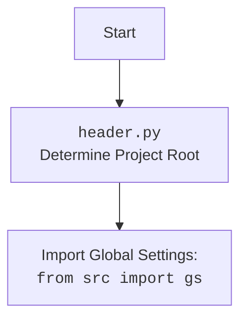

## Анализ модуля кастомной реализации Edge WebDriver для Selenium

### 1. <алгоритм>

**Описание рабочего процесса:**

Модуль `edge.py` предоставляет класс `Edge`, который расширяет `selenium.webdriver.Edge`, добавляя кастомную функциональность, такую как загрузку настроек из JSON файла, управление профилями, поддержку user-agent и различные опции запуска.

**Блок-схема:**

1.  **Инициализация `Edge` (`__init__`)**:
    *   Создается экземпляр класса `Edge` с возможностью передачи параметров (профиль, user-agent, опции, режим окна).
    *   **Пример**: `driver = Edge(profile_name='myprofile', user_agent='myagent', options=["--disable-gpu"], window_mode='kiosk')` или `driver = Edge()`
    *   Загружает настройки из файла `edge.json`, используя `j_loads_ns`.
    *    Устанавливает user-agent, используя переданный или генерируя случайный с помощью `fake_useragent`.
    *    Создает объект `EdgeOptions`.
    *  Устанавливает режим окна (kiosk, windowless, full_window).
    *    Добавляет опции, переданные при инициализации.
    *   Добавляет опции из файла конфигурации.
    *    Добавляет заголовки из файла конфигурации.
    *   Настраивает директорию профиля пользователя, если имя профиля задано, создает новый профиль, если нет.
    *   Создает экземпляр `EdgeService` и WebDriver, передавая опции и сервис.
    *   Вызывает `_payload()` для настройки дополнительных инструментов (JavaScript и ExecuteLocator).
    *   Обрабатывает исключения `WebDriverException` и общие исключения.

2.  **Инициализация инструментов (`_payload`)**:
    *   Метод `_payload` инициализирует `JavaScript` и `ExecuteLocator` и связывает их с экземпляром `Edge`.
    *   **Пример**: `self._payload()`
    *    Создает экземпляр `JavaScript` и связывает его методы с методами экземпляра `Edge`.
    *    Создает экземпляр `ExecuteLocator` и связывает его методы с методами экземпляра `Edge`.

3.   **Создание опций (`set_options`)**:
    *   Метод `set_options` принимает список опций.
    *   **Пример**: `options = self.set_options(opts=["--disable-gpu"])`
    *   Создает объект `EdgeOptions` и добавляет в него переданные опции.
    *   Возвращает объект `EdgeOptions`.

### 2. <mermaid>

```mermaid
flowchart TD
    Start[Start] --> InitEdge[Initialize Edge Driver: <br><code>Edge(...)</code>]
    InitEdge --> LoadSettings[Load settings from <code>edge.json</code>]
    LoadSettings --> SetUserAgent[Set user agent]
    SetUserAgent --> InitOptions[Initialize Edge Options]
    InitOptions --> SetWindowModeFromConfig{Is window_mode in config?}
     SetWindowModeFromConfig -- Yes --> SetWindowModeFromConfig1[Set window mode from config]
        SetWindowModeFromConfig1 --> SetWindowModeArgs{Is window_mode in init args?}
        SetWindowModeArgs -- Yes --> SetWindowModeFromArgs[Set window mode from args]
        SetWindowModeArgs -- No --> CheckForModeSet[Check for window mode, if not set pass]
    CheckWindowMode -- No --> SetWindowModeArgs
       CheckForModeSet --> AddOptionsFromFile[Add options from config file]
      AddOptionsFromFile --> AddCustomOptions[Add custom options from init args]
    AddCustomOptions --> AddHeaders[Add headers from config file]
     AddHeaders --> SetUserProfile[Set user profile directory]
    SetUserProfile --> CreateWebDriverInstance[Create WebDriver instance]
    CreateWebDriverInstance --> Payload[Call Payload Method: <br><code>_payload()</code>]
        Payload --> InitJavaScript[Initialize JavaScript helper]
    InitJavaScript --> SetJavaScriptMethods[Set JavaScript methods in the instance]
    SetJavaScriptMethods --> InitExecuteLocator[Initialize ExecuteLocator]
    InitExecuteLocator --> SetExecutorMethods[Set ExecuteLocator methods in the instance]
    SetExecutorMethods --> ReturnDriverInstance[Return Edge Driver Instance]
    ReturnDriverInstance --> End[End]

```



**Объяснение зависимостей `mermaid`:**

*   **`os`**: Используется для доступа к переменным окружения.
*   **`pathlib`**: Используется для работы с путями к файлам.
*   **`selenium.webdriver`**: Используется для управления веб-драйвером Edge.
*   **`selenium.webdriver.edge.service`**: Используется для управления сервисом EdgeDriver.
*   **`selenium.webdriver.edge.options`**: Используется для настройки опций Edge.
*    **`selenium.common.exceptions`**: Используется для обработки исключений, связанных с Selenium.
*   **`src`**: Используется для импорта глобальных настроек `gs` и логгера.
*   **`src.webdriver.executor`**: Используется для выполнения действий с элементами.
*   **`src.webdriver.js`**: Используется для выполнения JavaScript на странице.
*   **`fake_useragent`**: Используется для генерации случайных user-agent.
*   **`src.utils.jjson`**: Используется для загрузки JSON-конфигураций.
*    **`src.logger.logger`**: Используется для логирования.

### 3. <объяснение>

**Импорты:**

*   `os`: Используется для работы с операционной системой, включая доступ к переменным окружения.
*   `pathlib.Path`: Используется для работы с путями к файлам.
*   `typing.Optional`, `typing.List`: Используются для аннотации типов.
*   `selenium.webdriver.Edge`: Базовый класс для кастомного Edge WebDriver.
*   `selenium.webdriver.edge.service.Service`: Используется для управления сервисом EdgeDriver.
*   `selenium.webdriver.edge.options.Options`: Используется для настройки опций Edge.
*   `selenium.common.exceptions.WebDriverException`: Используется для обработки исключений WebDriver.
*  `src.webdriver.executor.ExecuteLocator`: Используется для управления взаимодействиями с веб-элементами.
*   `src.webdriver.js.JavaScript`: Используется для выполнения JavaScript на странице.
*   `fake_useragent.UserAgent`: Используется для генерации случайных User-Agent.
*  `src`: Используется для импорта глобальных настроек `gs`.
*    `src.logger.logger`: Используется для логирования.
*  `src.utils.jjson.j_loads_ns`: Используется для загрузки JSON-конфигураций.

**Классы:**

*   `Edge(WebDriver)`:
    *   **Роль**: Кастомный класс Edge WebDriver, расширяет функциональность `selenium.webdriver.Edge`.
    *   **Атрибуты**:
        *  `driver_name`: (`str`) - имя драйвера (всегда "edge").
    *   **Методы**:
        *   `__init__(...)`: Инициализирует класс, настраивает параметры Edge.
        *  `_payload(self) -> None`: Настраивает инструменты для работы с локаторами и JavaScript.
        *   `set_options(self, opts: Optional[List[str]] = None) -> EdgeOptions`: Настраивает опции Edge.

**Функции:**

*   `__init__(...)`:
    *   **Аргументы**:
        * `profile_name`: (`Optional[str]`) - имя профиля пользователя.
        *  `user_agent`: (`Optional[str]`) - user-agent.
        *  `options`: (`Optional[List[str]]`) - список опций запуска.
         * `window_mode`: (`Optional[str]`) - Режим окна браузера.
        *   `*args`, `**kwargs`: Дополнительные параметры для WebDriver.
    *   **Назначение**: Инициализирует Edge WebDriver, загружает настройки, устанавливает user-agent, опции, профиль и режим окна.
    *   **Возвращает**: `None`.
*   `_payload(self) -> None`:
    *    **Аргументы**:
        *   `self` (`Edge`): Экземпляр класса `Edge`.
    *   **Назначение**: Загружает исполнителей для работы с локаторами и JavaScript.
    *   **Возвращает**: `None`.
*    `set_options(self, opts: Optional[List[str]] = None) -> EdgeOptions`:
    *   **Аргументы**:
        *   `opts`: (`Optional[List[str]]`) - Список опций.
    *   **Назначение**:  Создает и возвращает объект `EdgeOptions`.
    *   **Возвращает**:  Объект `EdgeOptions`.

**Переменные:**

*   `self.driver_name`: (`str`) - Имя драйвера (всегда "edge").
*   `self.user_agent`: (`str`) - User-Agent.
*   `settings`: (`SimpleNamespace`) -  Настройки из `edge.json`.
*  `options_obj`: (`EdgeOptions`) - Объект для настройки опций Edge.
*    `profile_directory`: (`str`) - Директория профиля пользователя.
*   `j`: Экземпляр класса `JavaScript`.
*  `execute_locator`: Экземпляр класса `ExecuteLocator`.
*   `edgedriver_path`:  (`str`) - Путь к edgedriver.
* `service`: (`EdgeService`) - Объект для управления edgedriver.
*    `opts`:  (`Optional[List[str]]`) - Список опций для `set_options`.

**Потенциальные ошибки и области для улучшения:**

*   Обработка исключений может быть более специфичной.
*   В методе `_payload` можно добавить проверку на наличие объектов `JavaScript` и `ExecuteLocator`, перед их использованием.
*   Можно вынести логику получения настроек из `__init__` в отдельный метод.
*    Можно добавить поддержку прокси, аналогичную Chrome WebDriver.
*    Можно добавить валидацию данных в JSON файле `edge.json`.
*    Можно упростить выбор режима окна из аргументов.

**Взаимосвязи с другими частями проекта:**

*   Использует `header` для определения корня проекта.
*   Использует глобальные настройки `gs` из пакета `src`.
*    Использует `src.webdriver.executor` для управления локаторами и выполнения действий.
*   Использует `src.webdriver.js` для выполнения JavaScript.
*    Использует `src.utils.jjson` для загрузки конфигурационных файлов.
*  Использует `src.logger.logger` для логирования.
*   Является частью веб-драйверного фреймворка и предоставляет конкретную реализацию для Edge.

Этот анализ предоставляет полное представление о работе модуля `edge.py`, его структуре, зависимостях и возможностях.