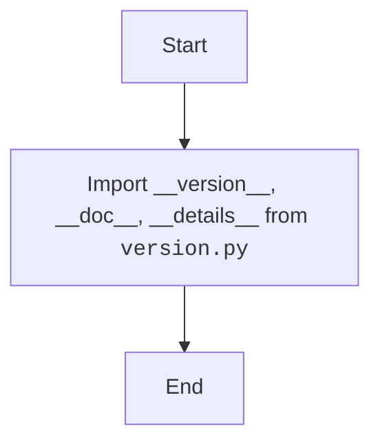

## Анализ кода модуля `__init__.py` в `src.webdriver.edge.extentions`

### 1. <алгоритм>

**Описание рабочего процесса:**

Модуль `__init__.py` служит для инициализации пакета `src.webdriver.edge.extentions`. Он импортирует переменные `__version__`, `__doc__` и `__details__` из модуля `version.py`, делая их доступными при импорте пакета `src.webdriver.edge.extentions`.

**Блок-схема:**

1.  **Импорт переменных из `version.py`**:
    *   Импортируются переменные `__version__`, `__doc__` и `__details__` из модуля `version.py`.
    *   **Пример**: `from .version import __version__, __doc__, __details__`

### 2. <mermaid>

**Объяснение зависимостей `mermaid`:**

*   В данном коде нет внешних зависимостей. Используется только импорт из модуля `version.py`, находящегося в той же директории.
*   **`packaging.version`**: Используется для работы с версиями (не используется в данном коде, но присутствует в импортах).

### 3. <объяснение>

**Импорты:**

*   `packaging.version.Version`: Используется для работы с версиями (но не используется в данном коде).
*    `from .version import __version__, __doc__, __details__`: Импортирует переменные `__version__`, `__doc__` и `__details__` из модуля `version.py`.

**Классы:**

В данном коде нет классов.

**Функции:**

В данном коде нет функций.

**Переменные:**

*   `__version__`: (`str`) -  Содержит версию модуля или пакета.
*   `__doc__`: (`str`) - Содержит строку документации.
*  `__details__`: (`str`) - Содержит дополнительные детали о модуле или классе.

**Потенциальные ошибки и области для улучшения:**

*   Код выполняет только импорт и не имеет логики, поэтому потенциальные ошибки отсутствуют.
*   В данном случае улучшения не требуются, так как модуль выполняет свою функцию.

**Взаимосвязи с другими частями проекта:**

*  Этот модуль является частью пакета `src.webdriver.edge.extentions`.
*   Он делает переменные `__version__`, `__doc__` и `__details__` доступными при импорте пакета.
*  Модуль зависит от модуля `version.py`.

Этот анализ предоставляет полное представление о функциональности модуля `__init__.py` в пакете `src.webdriver.edge.extentions`.