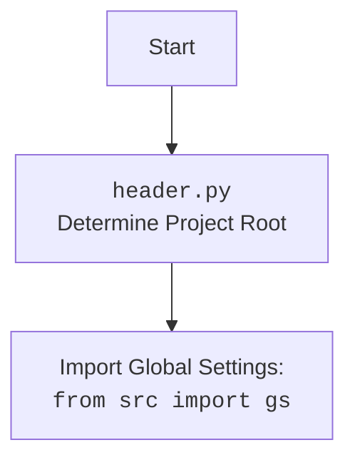

## Анализ модуля Edge WebDriver для Selenium

### 1. <алгоритм>

**Описание рабочего процесса:**

Этот документ описывает модуль Edge WebDriver, который является кастомной реализацией WebDriver для браузера Edge с использованием Selenium. Модуль интегрирует настройки из файла `edge.json`, включая user-agent и профили, для гибкого и автоматизированного взаимодействия с браузером.

**Блок-схема:**

1.  **Инициализация `Edge`**:
    *   Создается экземпляр класса `Edge` с параметрами (профиль, user-agent, опции, режим окна).
    *   **Пример**: `driver = Edge(profile_name='myprofile', user_agent='myagent', options=["--disable-gpu"], window_mode='kiosk')` или `driver = Edge()`
    *   Загружает настройки из файла `edge.json`.
    *   Устанавливает user-agent, либо используя предоставленный, либо генерирует случайный с помощью `fake_useragent`.
    *   Создает объект `EdgeOptions`.
    *   Устанавливает режим окна (kiosk, windowless, full_window) в зависимости от конфигурации и переданных аргументов.
    *  Добавляет опции, переданные при инициализации, из конфигурации и из списка заголовков.
    *   Устанавливает путь к профилю пользователя.
    *   Создает экземпляр `EdgeService`, передавая путь к `msedgedriver`.
    *   Инициализирует `WebDriver` с настроенными опциями и сервисом.
    *   Вызывает метод `_payload()` для загрузки необходимых инструментов (JavaScript и ExecuteLocator).
    *   Обрабатывает исключения `WebDriverException` и общие исключения.

2.  **Инициализация инструментов (`_payload`)**:
    *   Метод `_payload` инициализирует объекты `JavaScript` и `ExecuteLocator`.
    *   **Пример**: `self._payload()`
    *   Создает экземпляр `JavaScript`, и связывает его методы с методами экземпляра `Edge`.
    *   Создает экземпляр `ExecuteLocator` и связывает его методы с методами экземпляра `Edge`.

3. **Создание опций (`set_options`)**:
     * Метод `set_options` принимает список опций
     *  **Пример:** `options = self.set_options(opts=["--disable-gpu"])`
     * Создает объект `EdgeOptions` и добавляет в него переданные опции.
     *  Возвращает объект `EdgeOptions`.

### 2. <mermaid>

```mermaid
flowchart TD
    Start[Start] --> InitEdge[Initialize Edge Driver: <br><code>Edge(...)</code>]
    InitEdge --> LoadSettings[Load settings from <code>edge.json</code>]
    LoadSettings --> SetUserAgent[Set user agent]
    SetUserAgent --> InitOptions[Initialize Edge Options]
    InitOptions --> SetWindowModeFromConfig{Is window_mode in config?}
     SetWindowModeFromConfig -- Yes --> SetWindowModeFromConfig1[Set window mode from config]
        SetWindowModeFromConfig1 --> SetWindowModeArgs{Is window_mode in init args?}
        SetWindowModeArgs -- Yes --> SetWindowModeFromArgs[Set window mode from args]
        SetWindowModeArgs -- No --> CheckForModeSet[Check for window mode, if not set pass]
    CheckWindowMode -- No --> SetWindowModeArgs
       CheckForModeSet --> AddOptionsFromFile[Add options from config file]
      AddOptionsFromFile --> AddCustomOptions[Add custom options from init args]
    AddCustomOptions --> AddHeaders[Add headers from config file]
     AddHeaders --> SetUserProfile[Set user profile directory]
    SetUserProfile --> CreateWebDriverInstance[Create WebDriver instance]
    CreateWebDriverInstance --> Payload[Call Payload Method: <br><code>_payload()</code>]
     Payload --> InitJavaScript[Initialize JavaScript helper]
    InitJavaScript --> SetJavaScriptMethods[Set JavaScript methods in the instance]
    SetJavaScriptMethods --> InitExecuteLocator[Initialize ExecuteLocator]
    InitExecuteLocator --> SetExecutorMethods[Set ExecuteLocator methods in the instance]
    SetExecutorMethods --> ReturnDriverInstance[Return Edge Driver Instance]
    ReturnDriverInstance --> End[End]
```



**Объяснение зависимостей `mermaid`:**

*   **`os`**: Используется для доступа к переменным окружения.
*   **`pathlib`**: Используется для работы с путями к файлам.
*   **`selenium.webdriver`**: Используется для управления веб-драйвером Edge.
*   **`selenium.webdriver.edge.options`**: Используется для настройки опций Edge.
*   **`selenium.webdriver.edge.service`**: Используется для управления сервисом EdgeDriver.
*   **`selenium.common.exceptions`**: Используется для обработки исключений WebDriver.
*    **`src`**: Используется для импорта глобальных настроек `gs`.
*   **`src.webdriver.executor`**: Используется для выполнения действий с элементами.
*   **`src.webdriver.js`**: Используется для выполнения JavaScript на странице.
*   **`fake_useragent`**: Используется для генерации случайных user-agent.
*  **`src.utils.jjson`**: Используется для загрузки JSON-конфигураций.
*  **`src.logger.logger`**: Используется для логирования.

### 3. <объяснение>

**Импорты:**

*   `os`: Используется для работы с операционной системой (например, для доступа к переменным окружения).
*   `pathlib.Path`: Используется для работы с путями к файлам и каталогам.
*   `typing.Optional`, `typing.List`: Используются для аннотации типов.
*   `selenium.webdriver.Edge`: Используется как базовый класс для создания кастомного драйвера Edge.
*   `selenium.webdriver.edge.service.Service`: Используется для управления процессом EdgeDriver.
*   `selenium.webdriver.edge.options.Options`: Используется для настройки опций Edge.
*   `selenium.common.exceptions.WebDriverException`: Используется для обработки исключений, связанных с WebDriver.
*   `src`: Используется для импорта глобальных настроек `gs`.
*   `src.webdriver.executor.ExecuteLocator`: Используется для управления взаимодействиями с элементами на странице.
*   `src.webdriver.js.JavaScript`: Используется для выполнения JavaScript-кода на странице.
*   `fake_useragent.UserAgent`: Используется для генерации случайных User-Agent.
*    `src.logger.logger`: Используется для логирования.
*   `src.utils.jjson.j_loads_ns`: Используется для загрузки JSON-конфигураций.

**Классы:**

*   `Edge(WebDriver)`:
    *   **Роль**: Расширяет функциональность `selenium.webdriver.Edge`, предоставляя дополнительные возможности, такие как загрузка настроек из JSON, установка пользовательского агента и т.д.
    *   **Атрибуты**:
        *   `driver_name` (`str`): Имя драйвера (всегда "edge").
    *   **Методы**:
        *   `__init__(...)`: Инициализирует объект драйвера Edge, загружает настройки, устанавливает user-agent, опции и профиль.
        *   `_payload(self) -> None`:  Настраивает инструменты для работы с локаторами и JavaScript.
        *    `set_options(self, opts: Optional[List[str]] = None) -> EdgeOptions`:  Создает и возвращает объект `EdgeOptions`.

**Функции:**

*   `__init__(...)`:
    *   **Аргументы**:
        *   `profile_name`: (`Optional[str]`) - Имя профиля пользователя.
        *   `user_agent`: (`Optional[str]`) - Пользовательский агент.
        *   `options`: (`Optional[List[str]]`) - Список опций запуска браузера.
         *   `window_mode`: (`Optional[str]`) - Режим окна браузера.
        *   `*args`, `**kwargs`: Дополнительные параметры для WebDriver.
    *   **Назначение**: Инициализирует Edge WebDriver, загружая настройки из `edge.json`, устанавливая пользовательский агент, опции, профиль и режим окна.
    *   **Возвращает**: `None`.
*   `_payload(self) -> None`:
     *  **Аргументы**:
         *  `self` (`Edge`): Экземпляр класса `Edge`.
     *   **Назначение**: Инициализирует объекты `JavaScript` и `ExecuteLocator`.
     *   **Возвращает**: `None`.
*   `set_options(self, opts: Optional[List[str]] = None) -> EdgeOptions`:
    *    **Аргументы**:
        *   `opts`: (`Optional[List[str]]`) - Список опций.
    *   **Назначение**: Создает и настраивает объект `EdgeOptions`.
    *   **Возвращает**: `EdgeOptions` - Объект EdgeOptions.

**Переменные:**

*   `self.driver_name`: (`str`) - Имя драйвера (всегда "edge").
*   `self.user_agent`: (`str`) - User-Agent.
*    `settings`: (`SimpleNamespace`) - Настройки из `edge.json`.
*   `options_obj`: (`EdgeOptions`) - Объект для настройки опций Edge.
*    `profile_directory`: (`str`) - Путь к директории профиля.
*    `j`: Экземпляр класса `JavaScript`.
*   `execute_locator`: Экземпляр класса `ExecuteLocator`.
*   `edgedriver_path`: (`str`) - Путь к исполняемому файлу EdgeDriver.
*   `service`: (`EdgeService`) - Сервис для управления драйвером Edge.
*   `opts`:  (`Optional[List[str]]`) - Список опций.

**Потенциальные ошибки и области для улучшения:**

*   Обработка ошибок при загрузке настроек из `edge.json` может быть более детальной.
*   Можно добавить возможность выбора прокси.
*   Можно добавить валидацию конфигурационных данных.
*    Метод `_payload` можно разбить на несколько методов для более читаемого кода.
*    В `set_options` не используется конфигурация из `edge.json`.

**Взаимосвязи с другими частями проекта:**

*    Использует `header` для определения корня проекта.
*   Использует глобальные настройки `gs` из пакета `src`.
*   Использует `src.webdriver.executor` для управления локаторами и выполнения действий.
*    Использует `src.webdriver.js` для выполнения JavaScript.
*  Использует `fake_useragent` для генерации User-Agent.
*    Использует `src.utils.jjson` для загрузки JSON-конфигураций.
*   Использует `src.logger.logger` для логирования.
*   Является частью веб-драйверного фреймворка и предоставляет конкретную реализацию для Edge.

Этот анализ предоставляет подробное описание работы модуля `edge.py`, его структуры, зависимостей и возможностей.