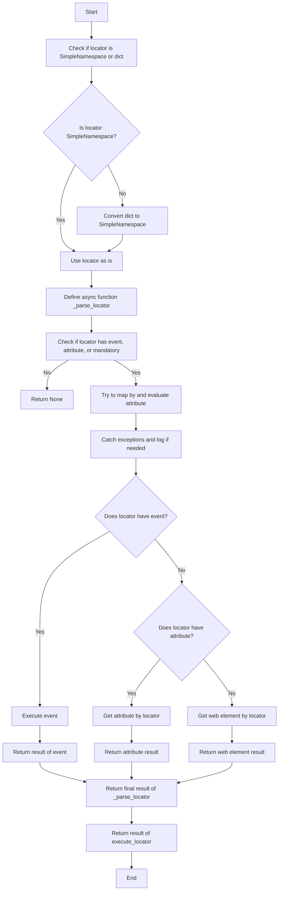
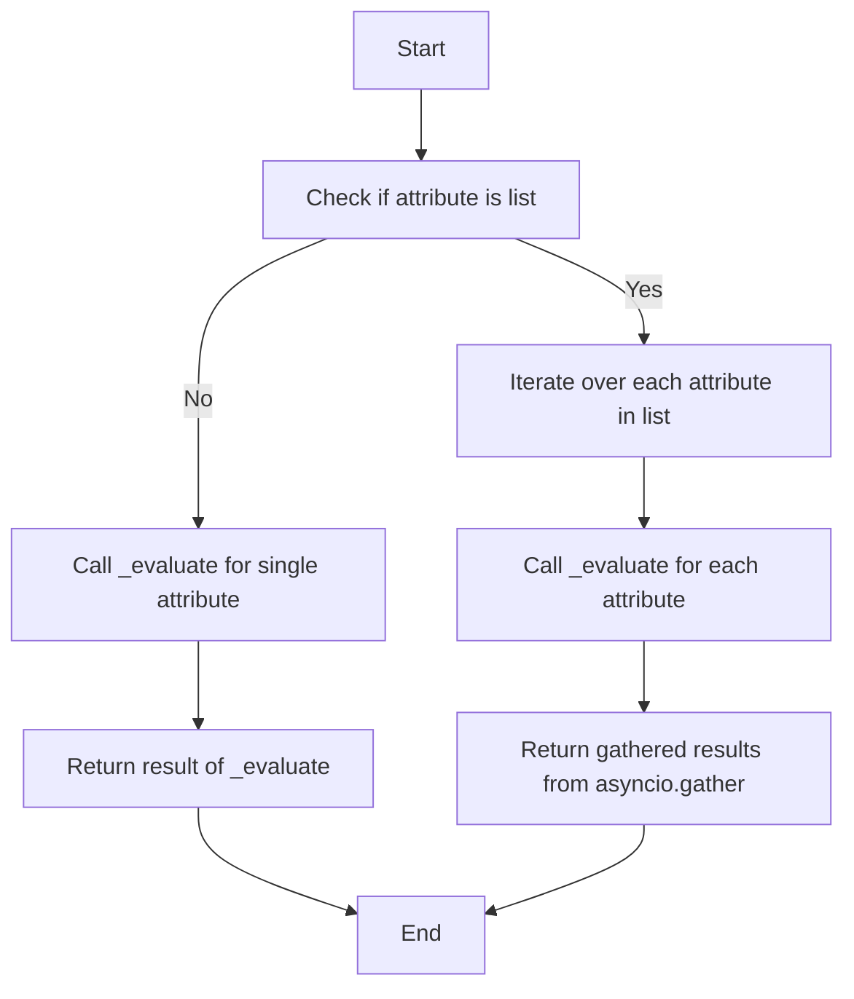
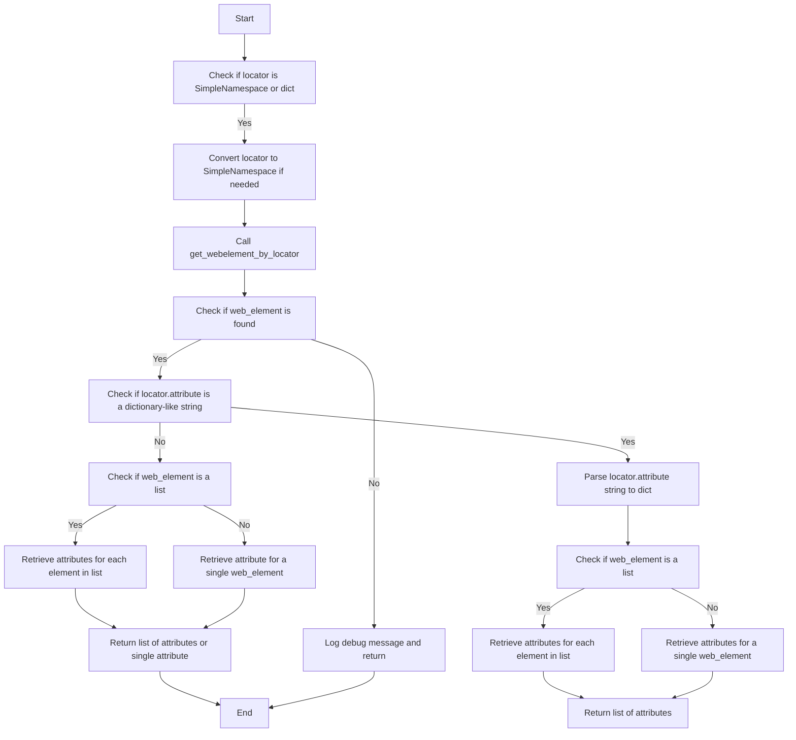

## Анализ кода модуля `executor.py`

### 1. <алгоритм>

**Описание рабочего процесса:**

Модуль `executor.py` предназначен для автоматизации взаимодействия с веб-элементами с использованием Selenium. Он предоставляет гибкий и универсальный фреймворк для поиска элементов, взаимодействия с ними и извлечения информации на основе предоставленных конфигураций (локаторов).

**Блок-схема:**

1.  **Инициализация `ExecuteLocator`**:
    *   При создании экземпляра класса `ExecuteLocator` передается экземпляр Selenium WebDriver.
    *   **Пример**: `executor = ExecuteLocator(driver=driver)`
    *   Инициализируется объект `ActionChains`, если предоставлен драйвер.

2.  **Выполнение локатора (`execute_locator`)**:
    *   Метод `execute_locator` принимает локатор (словарь или `SimpleNamespace`).
    *   **Пример**: `result = await executor.execute_locator(locator)`
    *   Локатор преобразуется в `SimpleNamespace`, если передан словарь.
    *   Внутри вызывается асинхронная функция `_parse_locator`.
    *   Проверяется наличие атрибутов `event`, `attribute` или `mandatory` в локаторе. Если их нет, возвращается `None`.
    *   Вызывается метод `evaluate_locator`, для обработки атрибута `attribute`.
    *   Если у локатора есть событие `event`, оно выполняется с помощью `execute_event`.
    *   Если есть атрибут `attribute`, он извлекается с помощью `get_attribute_by_locator`.
    *   Если нет ни события, ни атрибута, то извлекается веб-элемент с помощью `get_webelement_by_locator`.

3.  **Оценка локатора (`evaluate_locator`)**:
    *   Метод `evaluate_locator` принимает локатор и обрабатывает атрибут `attribute`.
    *   **Пример**: `result = await executor.evaluate_locator(locator)`
    *   Если `attribute` является списком, то `_evaluate` вызывается для каждого элемента списка асинхронно.
    *   Если `attribute` не список, вызывается `_evaluate` для одного элемента.
    *   Возвращается результат.

4.  **Получение атрибута по локатору (`get_attribute_by_locator`)**:
    *   Метод `get_attribute_by_locator` получает значение атрибута для веб-элемента(-ов).
    *   **Пример**: `attribute = await executor.get_attribute_by_locator(locator)`
    *   Локатор преобразуется в `SimpleNamespace`, если передан словарь.
    *   Вызывается метод `get_webelement_by_locator` для получения элемента(-ов).
    *   Если элемент не найден, возвращается отладочное сообщение.
    *   Проверяется, является ли атрибут словарем, представленным в виде строки. Если это так, то строка парсится в словарь.
    *   Если найден веб-элемент, проверяется, является ли элемент списком.
    *   Если элемент список, то атрибуты извлекаются для каждого элемента.
    *   Возвращается список атрибутов.

5.  **Получение веб-элемента по локатору (`get_webelement_by_locator`)**:
    *   Метод `get_webelement_by_locator` используется для извлечения веб-элемента(-ов) по локатору.
    *   **Пример**: `element = await executor.get_webelement_by_locator(locator)`
    *    Ищет элементы на веб-странице на основе параметров, указанных в локаторе, таких как `by` (например, `ID`, `XPATH`, `CSS_SELECTOR`) и `selector`.
    *   Если указан параметр `many=True`, то возвращается список веб-элементов, иначе возвращается один веб-элемент.
    *   Обрабатываются исключения и логируются ошибки.
   
6.  **Создание скриншота элемента (`get_webelement_as_screenshot`)**:
    *  Метод `get_webelement_as_screenshot` принимает локатор и путь для сохранения скриншота.
    *  **Пример**: `screenshot_path = await executor.get_webelement_as_screenshot(locator, path='./screenshot.png')`
    *  Получает веб-элемент через `get_webelement_by_locator`.
    *   Делает скриншот элемента и сохраняет его по указанному пути.

7.  **Выполнение события (`execute_event`)**:
    *   Метод `execute_event` используется для выполнения события на веб-элементе.
    *   **Пример**: `await executor.execute_event(locator)`
    *   Выполняет действия, указанные в `locator.event` (например, `click()`, `send_keys('text')`).
    *   Обрабатывает исключения и логирует ошибки.

8.  **Отправка сообщения (`send_message`)**:
    *   Метод `send_message` используется для отправки сообщения в веб-элемент.
    *    **Пример**: `await executor.send_message(locator, "message")`
    *   Получает веб-элемент, и отправляет ему сообщение, через метод `send_keys`.

### 2. <mermaid>

**Зависимости `mermaid`:**

*   **`selenium`**: Используется для автоматизации веб-браузеров.
*   **`asyncio`**: Используется для асинхронных операций.
*   **`re`**: Используется для работы с регулярными выражениями.
*    **`types`**: Используется для создания пространств имен, для представления локаторов как объектов, которые поддерживают доступ к атрибутам через точку (dot notation)
*   **`typing`**: Используется для аннотаций типов.
*   **`header`**: Импортируется для определения корня проекта и глобальных настроек.
*    **`src`**: Используется для импорта глобальных настроек `gs` и для логирования.

### 3. <объяснение>

**Импорты:**

*   `selenium.webdriver`: Базовый модуль для управления веб-драйверами Selenium.
*   `selenium.webdriver.remote.webelement`: Используется для представления веб-элементов.
*   `selenium.webdriver.common.by.By`: Используется для определения стратегий поиска элементов.
*   `selenium.webdriver.support.ui`: Модуль для явных ожиданий.
*   `selenium.webdriver.common.action_chains`: Используется для создания цепочек действий.
*    `selenium.common.exceptions`: Набор исключений, связанных с Selenium.
*   `asyncio`: Используется для асинхронного программирования.
*   `re`: Используется для работы с регулярными выражениями, например, при разборе строк.
*   `dataclasses`: Используется для создания классов данных.
*   `enum`: Используется для создания перечислений.
*   `pathlib.Path`: Используется для работы с путями к файлам.
*    `types.SimpleNamespace`:  Используется для создания объектов, которые можно использовать как простой контейнер для атрибутов, для динамического создания локаторов.
*   `typing`: Используется для аннотаций типов.
*   `src.header`: Импортируется модуль `header`.
*   `src.gs`: Импортируются глобальные настройки из модуля `src`.
*   `src.logger.logger`: Импортируется модуль для логирования.
*   `src.logger.exceptions`: Импортируются кастомные исключения.

**Класс `ExecuteLocator`:**

*   **Роль:** Основной класс для выполнения действий над веб-элементами.
*   **Атрибуты:**
    *   `driver`: Экземпляр Selenium WebDriver.
    *   `actions`: Объект `ActionChains` для выполнения сложных действий.
    *   `by_mapping`: Словарь, связывающий типы локаторов с методами `By` из Selenium.
    *   `mode`: Режим выполнения (`debug`, `dev` и т.д.).
*   **Методы:**
    *   `__post_init__`: Инициализирует объект `ActionChains`, если предоставлен драйвер.
    *    `execute_locator(self, locator: dict | SimpleNamespace) -> Any`: Выполняет действия над веб-элементом на основе предоставленного локатора.
    *   `evaluate_locator(self, locator: SimpleNamespace) -> Any`: Оценивает и обрабатывает атрибуты локатора.
    *    `get_attribute_by_locator(self, locator: dict | SimpleNamespace) -> Any`: Получает атрибуты веб-элемента(-ов) по локатору.
    *    `get_webelement_by_locator(self, locator: dict | SimpleNamespace) -> WebElement | list[WebElement] | None`: Извлекает веб-элемент(-ы) на основе предоставленного локатора.
    *   `get_webelement_as_screenshot(self, locator: dict | SimpleNamespace, path: str) -> Optional[str]`: Делает скриншот веб-элемента.
    *    `execute_event(self, locator: SimpleNamespace) -> None`: Выполняет событие, связанное с локатором.
    *    `send_message(self, locator: dict | SimpleNamespace, message: str) -> None`: Отправляет сообщение веб-элементу.

**Функции:**

*   `_parse_locator(self, locator: SimpleNamespace) -> Any`: Асинхронная функция для обработки локатора.
*   `_evaluate(self, element: WebElement, attribute: str) -> Any`: Вспомогательная асинхронная функция для оценки атрибутов.

**Переменные:**

*   `self.driver`: Экземпляр Selenium WebDriver.
*   `self.actions`: Объект `ActionChains`.
*   `self.by_mapping`: Словарь типов локаторов и методов `By`.
*   `self.mode`: Режим выполнения.
*   `locator`: Локатор веб-элемента в виде словаря или `SimpleNamespace`.
*   `attribute`: Атрибут веб-элемента.
*   `element`: Веб-элемент.
*   `message`: Сообщение для отправки.
*    `path`: Путь к файлу для сохранения скриншота.

**Потенциальные ошибки и области для улучшения:**

*   Обработка ошибок может быть более детальной и специфичной.
*   Метод `_evaluate` не проверяет наличие атрибута у элемента перед его получением.
*   При работе с несколькими элементами можно добавить возможность выполнять действия последовательно, а не только параллельно.
*   `get_webelement_by_locator` можно улучшить с добавлением явных ожиданий для поиска элементов.
*   Можно добавить поддержку для загрузки параметров локаторов из внешних источников.

**Взаимосвязи с другими частями проекта:**

*   Модуль `src.logger.logger` используется для логирования ошибок и отладочной информации.
*   Модуль `src.header` используется для определения корня проекта.
*    Модуль `src.gs`  используется для доступа к глобальным настройкам проекта.
*   Модуль `selenium` используется для управления веб-драйверами.
*   Модули  `asyncio`, `re`, `dataclasses`, `enum`, `pathlib`, `types` являются стандартными библиотеками для создания вспомогательного функционала.
*   Модуль `src.logger.exceptions` предоставляет кастомные исключения.

Этот анализ предоставляет полное представление о работе модуля `executor.py` и его месте в проекте.