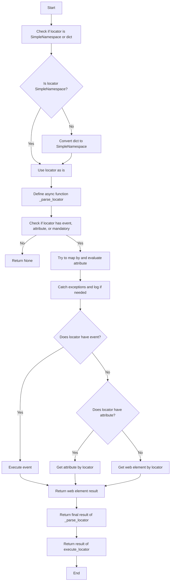
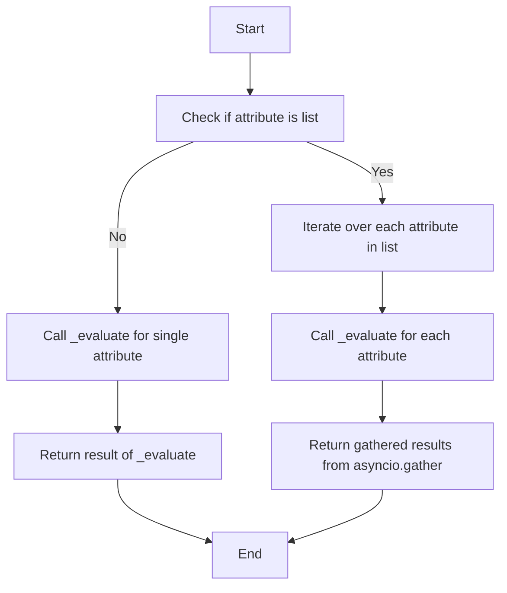
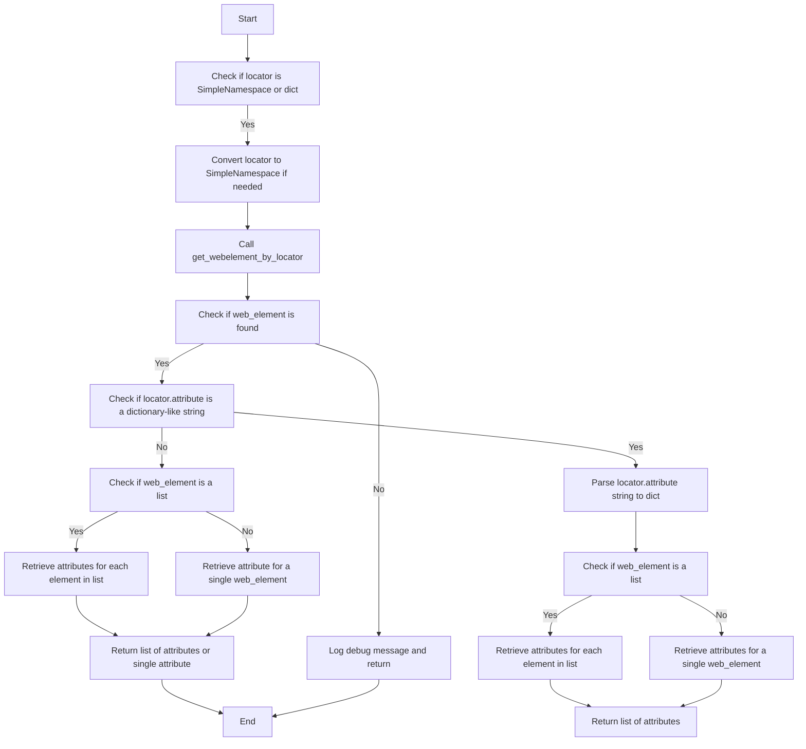
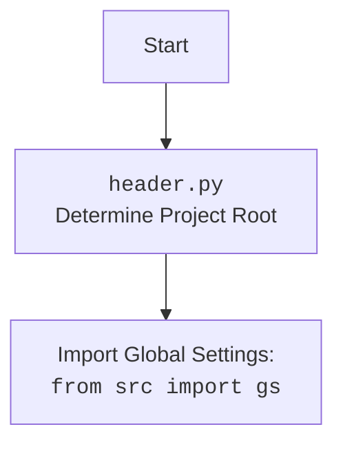

## Анализ кода модуля `executor.py`

### 1. <алгоритм>

**Описание рабочего процесса:**

Модуль `executor.py` предназначен для выполнения действий над веб-элементами на основе предоставленных конфигураций, называемых "локаторами". Локаторы представляют собой словари с информацией о том, как находить и взаимодействовать с элементами на веб-странице. Модуль поддерживает различные типы действий, такие как клики, отправка сообщений, выполнение событий и получение атрибутов.

**Блок-схема:**

1.  **Инициализация `ExecuteLocator`**:
    *   Создается экземпляр класса `ExecuteLocator`, которому передается драйвер Selenium (необязательно).
    *   **Пример**: `executor = ExecuteLocator(driver=driver)`
    *   Инициализируется `ActionChains`, если передан драйвер.

2.  **Выполнение локатора (`execute_locator`)**:
    *   Метод `execute_locator` принимает локатор (словарь или `SimpleNamespace`).
    *   **Пример**: `result = await executor.execute_locator(locator)`
    *   Проверяется тип локатора, и, если это словарь, он преобразуется в `SimpleNamespace`.
    *   Вызывается внутренняя асинхронная функция `_parse_locator`.
    *   Если в локаторе нет `event`, `attribute` или `mandatory`, возвращается `None`.
    *   Пытается преобразовать `locator.by` в соответствующий атрибут `By`.
    *   Вызывает метод `evaluate_locator` для оценки `locator.attribute`.
    *   Если есть `event`, то вызывается `execute_event`.
    *   Если есть `attribute`, то вызывается `get_attribute_by_locator`.
    *   В противном случае вызывается `get_webelement_by_locator`.

3.  **Оценка локатора (`evaluate_locator`)**:
    *   Метод `evaluate_locator` принимает атрибут (строку, список или словарь).
    *   **Пример**: `result = await executor.evaluate_locator(attribute)`
    *   Если атрибут - строка, то вызывается `_evaluate`, чтобы обработать строку.
    *   Если атрибут - список, то `_evaluate` вызывается для каждого элемента асинхронно.
    *   Возвращается результат обработки атрибута.

4.  **Получение атрибута по локатору (`get_attribute_by_locator`)**:
    *   Метод `get_attribute_by_locator` принимает локатор и получает атрибут(-ы) элемента(-ов).
    *   **Пример**: `attribute = await executor.get_attribute_by_locator(locator)`
    *   Проверяется тип локатора, и, если это словарь, он преобразуется в `SimpleNamespace`.
    *   Вызывается метод `get_webelement_by_locator` для получения веб-элемента.
    *   Если элемент не найден, возвращается `None`.
    *   Проверяется, является ли `locator.attribute` строкой, представляющей словарь.
    *   Если это словарь, он разбирается с помощью `_parse_dict_string`, и возвращается словарь атрибутов для элемента или списка элементов.
    *    Если атрибут не словарь, возвращает  атрибут элемента или списка элементов.

5.  **Получение веб-элемента по локатору (`get_webelement_by_locator`)**:
    *   Метод `get_webelement_by_locator` принимает локатор и получает веб-элемент(-ы).
    *   **Пример**: `element = await executor.get_webelement_by_locator(locator)`
    *   Извлекает `timeout` из локатора или использует значение по умолчанию.
    *   Если `timeout` равен 0, элемент ищется без ожидания.
    *   Иначе используются явные ожидания с `WebDriverWait` с условием `presence_of_all_elements_located` или `visibility_of_all_elements_located`.
     *    Применяет фильтрацию с помощью `_parse_elements_list`, чтобы вернуть конкретный элемент из списка или весь список.

6.  **Получение скриншота элемента (`get_webelement_as_screenshot`)**:
    *   Метод `get_webelement_as_screenshot` принимает локатор и возвращает скриншот элемента.
    *   **Пример**: `image = await executor.get_webelement_as_screenshot(locator)`
    *   Получает элемент с помощью `get_webelement_by_locator`.
    *   Делает скриншот элемента в формате `png`.
    *   Возвращает поток с изображением или `None` при ошибке.

7.  **Выполнение события (`execute_event`)**:
    *   Метод `execute_event` принимает локатор и выполняет событие(-я) над элементом.
    *   **Пример**: `result = await executor.execute_event(locator)`
    *   Локатор преобразуется в `SimpleNamespace`.
    *   Разделяет `locator.event` на список событий.
    *   Получает веб-элемент.
    *   Выполняет события поочередно: `click()`, `pause()`, `upload_media()`, `screenshot()`, `clear()`, `send_keys()`, `type()`.
    *   Возвращает результат выполнения события.

8.  **Отправка сообщения (`send_message`)**:
    *   Метод `send_message` принимает локатор и сообщение, которое нужно отправить.
    *   **Пример**: `result = await executor.send_message(locator, "message")`
    *    Получает веб-элемент по локатору.
    *   Использует `type_message` для отправки сообщения, поддерживает замену символов и задержку при печати.
    *   Возвращает `True` если сообщение отправлено успешно.

### 2. <mermaid>

**Зависимости `mermaid`:**

*   **`selenium`**: Используется для автоматизации веб-браузеров.
*   **`asyncio`**: Используется для асинхронных операций.
*   **`re`**: Используется для работы с регулярными выражениями.
*   **`dataclasses`**: Используется для создания классов данных.
*   **`enum`**: Используется для создания перечислений.
*   **`pathlib`**: Используется для работы с путями к файлам.
*   **`types`**: Используется для создания пространств имен.
*   **`typing`**: Используется для аннотаций типов.
*    **`header`**: Используется для определения корня проекта.
*   **`src`**: Используется для импорта глобальных настроек `gs` и логгера.

Дополнительный блок для `header.py`:

### 3. <объяснение>

**Импорты:**

*   `asyncio`: Используется для асинхронного программирования, что позволяет выполнять неблокирующие операции.
*   `re`: Модуль для работы с регулярными выражениями, используется для обработки строк.
*   `sys`: Используется для доступа к некоторым переменным и функциям, взаимодействующим с интерпретатором Python.
*   `time`: Используется для работы со временем, например для задержек.
*   `dataclasses`: Модуль для создания классов данных с использованием декоратора `@dataclass`.
*   `enum`: Используется для создания перечислений.
*   `pathlib`: Используется для работы с путями к файлам.
*   `types`:  Используется для создания динамических пространств имен (`SimpleNamespace`).
*   `typing`: Используется для аннотации типов.
*   `selenium.common.exceptions`: Набор исключений, которые могут возникнуть при работе с Selenium.
*   `selenium.webdriver.common.action_chains.ActionChains`: Используется для создания цепочек действий.
*   `selenium.webdriver.common.by.By`: Используется для определения стратегий поиска элементов.
*   `selenium.webdriver.common.keys.Keys`: Используется для отправки специальных клавиш.
*   `selenium.webdriver.remote.webelement.WebElement`: Используется для представления веб-элементов.
*   `selenium.webdriver.support.expected_conditions as EC`: Используется для явных ожиданий.
*   `selenium.webdriver.support.ui.WebDriverWait`: Используется для явных ожиданий.
*    `header`: Используется для определения корня проекта.
*   `src`: Импортирует глобальные настройки `gs` из проекта, и логгер.
*   `src.logger.logger`: Используется для логирования ошибок и отладочной информации.
*   `src.logger.exceptions`:  Используется для кастомных исключений.
*   `src.utils.jjson`: Используется для работы с JSON.
*    `src.utils.printer`: Используется для форматированного вывода.
*   `src.utils.image`: Используется для работы с изображениями.

**Класс `ExecuteLocator`:**

*   **Роль:** Выполняет действия над веб-элементами на основе предоставленных локаторов.
*   **Атрибуты:**
    *   `driver`: Экземпляр веб-драйвера Selenium.
    *   `actions`: Объект `ActionChains` для выполнения сложных действий.
    *   `by_mapping`: Словарь, сопоставляющий типы локаторов с соответствующими константами `By` из Selenium.
    *    `mode`: Режим выполнения (`debug`).
*   **Методы:**
    *   `__post_init__(self)`: Инициализирует объект `ActionChains`, если предоставлен драйвер.
    *   `execute_locator(self, locator, timeout=0, timeout_for_event='presence_of_element_located', message=None, typing_speed=0, continue_on_error=True)`: Выполняет действия над элементом на основе локатора.
    *    `evaluate_locator(self, attribute)`: Оценивает и обрабатывает атрибуты локатора.
    *   `get_attribute_by_locator(self, locator, timeout=0, timeout_for_event='presence_of_element_located', message=None, typing_speed=0, continue_on_error=True)`: Возвращает значения атрибутов элемента(-ов), найденного по локатору.
    *   `get_webelement_by_locator(self, locator, timeout=0, timeout_for_event='presence_of_element_located')`: Возвращает веб-элемент(-ы) по локатору.
    *   `get_webelement_as_screenshot(self, locator, timeout=5, timeout_for_event='presence_of_element_located', message=None, typing_speed=0, continue_on_error=True, webelement=None)`:  Делает снимок экрана веб-элемента.
    *   `execute_event(self, locator, timeout=5, timeout_for_event='presence_of_element_located', message=None, typing_speed=0, continue_on_error=True)`: Выполняет события, связанные с локатором.
    *  `send_message(self, locator, timeout=5, timeout_for_event='presence_of_element_located', message=None, typing_speed=0, continue_on_error=True)`: Отправляет сообщение веб-элементу.

**Функции:**

*    `_parse_locator(self, locator, message)`: Асинхронная функция для разбора и выполнения локатора.
*    `_evaluate(self, attr)`: Асинхронная функция для оценки одного атрибута.
*   `_parse_dict_string(attr_string)`: Разбирает строку, представляющую словарь, в словарь.
*   `_get_attributes_from_dict(web_element, attr_dict)`: Извлекает значения атрибутов из элемента на основе словаря.
*   `_parse_elements_list(web_elements, locator)`: Фильтрует список веб-элементов на основе правил, указанных в локаторе.

**Переменные:**

*   `self.driver`: Экземпляр веб-драйвера Selenium.
*   `self.actions`: Экземпляр `ActionChains`.
*   `self.by_mapping`: Словарь соответствия типов локаторов.
*    `self.mode`: Режим выполнения.
*    `locator`: Локатор веб-элемента.
*   `attribute`: Атрибут элемента.
*    `web_element`: Веб-элемент.
*    `message`: Сообщение для отправки.
*   `timeout`: Время ожидания элемента.
*   `timeout_for_event`: Условие ожидания события.
*    `typing_speed`: Скорость ввода символов.
*    `continue_on_error`: Флаг для продолжения выполнения при ошибках.
*   `keys_to_send`: Список клавиш для отправки.
*  `screenshot_stream`: Поток байтов со скриншотом.

**Потенциальные ошибки и области для улучшения:**

*   Метод `_parse_elements_list` можно упростить.
*   Обработка исключений может быть более подробной.
*   В методе `send_message` можно улучшить логику замены символов.
*   Метод `type_message` не проверяет, является ли символ специальным или нет.
*   `execute_event` выполняет события последовательно, можно сделать асинхронно.
*   Нужно добавить обработку ошибок в `_evaluate`.

**Взаимосвязи с другими частями проекта:**

*   Модуль `src.logger.logger` используется для логирования ошибок и отладочной информации.
*   Модуль `src.config.settings` используется для получения глобальных настроек проекта (`gs`).
*   Модуль `header` используется для определения корня проекта.
*   Модуль `src.utils.jjson` используется для работы с JSON.
*   Модуль `src.utils.printer` используется для форматированного вывода.
*   Модуль `src.utils.image` используется для сохранения изображений.
*   Модуль `selenium` используется для взаимодействия с веб-драйверами.
*   Модуль `src.logger.exceptions` предоставляет кастомные исключения.

Этот анализ предоставляет полное представление о работе модуля `executor.py`, его структуре и взаимосвязях с другими частями проекта.