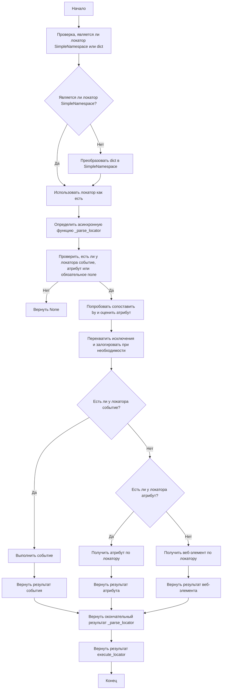
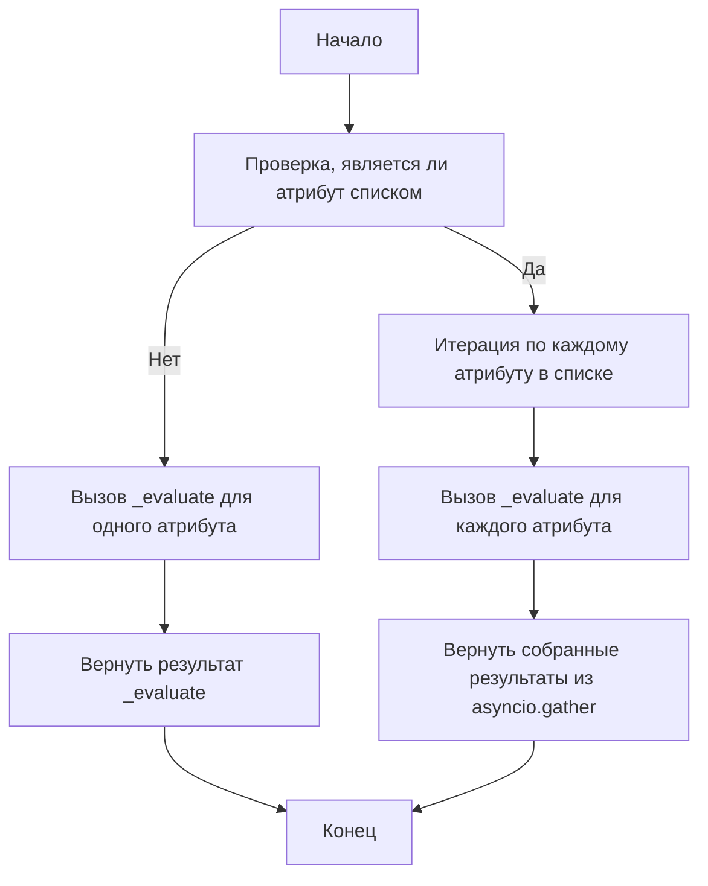
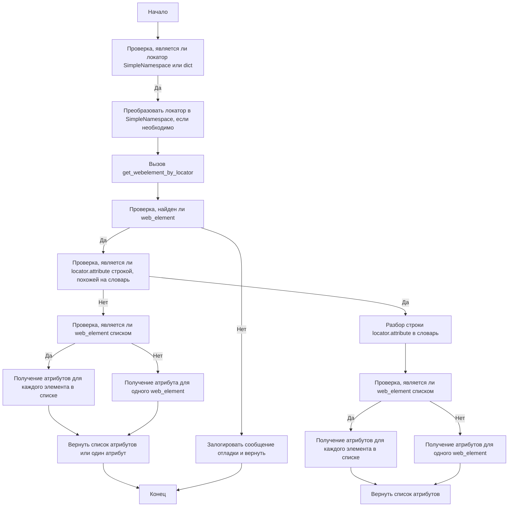
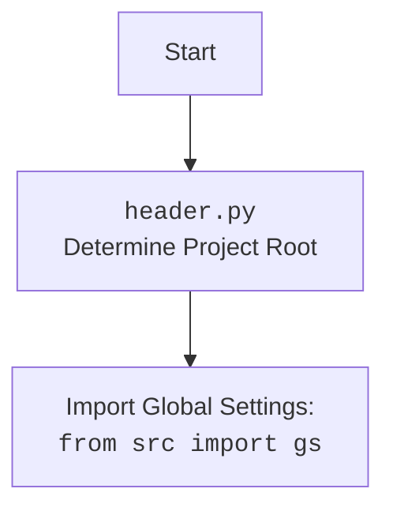

## Анализ кода модуля `executor.py`

### 1. <алгоритм>

**Описание рабочего процесса:**

Модуль `executor.py` предназначен для автоматизации взаимодействия с веб-элементами с помощью Selenium. Он предоставляет фреймворк для поиска элементов, выполнения действий и извлечения данных на основе конфигураций, называемых "локаторами".

**Блок-схема:**

1.  **Инициализация `ExecuteLocator`**:
    *   Создается экземпляр класса `ExecuteLocator` с передачей драйвера Selenium (необязательно).
    *   **Пример**: `executor = ExecuteLocator(driver=driver)`
    *   Если драйвер передан, инициализируется объект `ActionChains`.

2.  **Выполнение локатора (`execute_locator`)**:
    *   Метод `execute_locator` принимает локатор (словарь или `SimpleNamespace`), тайм-аут, тип ожидания события и другие параметры.
    *   **Пример**: `result = await executor.execute_locator(locator, timeout=10, message="test")`
    *   Проверяется тип локатора, и, если это словарь, он преобразуется в `SimpleNamespace`.
    *   Вызывается асинхронная функция `_parse_locator`.
    *   Проверяется наличие `event`, `attribute` или `mandatory` в локаторе. Если их нет, возвращается `None`.
    *   Пытается сопоставить `locator.by` с соответствующим значением из `by_mapping` и обрабатывает `locator.attribute` с помощью `evaluate_locator`.
    *   Если есть событие (`event`), вызывается `execute_event`.
    *   Если есть атрибут (`attribute`), вызывается `get_attribute_by_locator`.
    *   Если нет ни события, ни атрибута, вызывается `get_webelement_by_locator`.

3.  **Оценка локатора (`evaluate_locator`)**:
    *   Метод `evaluate_locator` принимает атрибут (строку, список или словарь).
    *   **Пример**: `result = await executor.evaluate_locator(attribute)`
    *   Если атрибут - список, то вызывает `_evaluate` для каждого элемента списка асинхронно.
    *   Если атрибут не список, то вызывает `_evaluate` для атрибута.
    *   Возвращает результат обработки атрибута.

4.  **Получение атрибута по локатору (`get_attribute_by_locator`)**:
    *   Метод `get_attribute_by_locator` принимает локатор и параметры для получения атрибута(-ов) веб-элемента(-ов).
    *   **Пример**: `attribute = await executor.get_attribute_by_locator(locator, timeout=5)`
    *    Проверяет тип локатора, и преобразует его в `SimpleNamespace` если это словарь.
    *   Вызывает метод `get_webelement_by_locator` для получения элемента(-ов).
    *   Если элемент не найден, возвращает `None`.
    *   Проверяет, является ли атрибут строкой, похожей на словарь. Если да, то парсит ее в словарь с помощью `_parse_dict_string`.
    *   Если элемент - список, то получает атрибуты для каждого элемента.
    *   Возвращает список атрибутов или один атрибут.

5.  **Получение веб-элемента по локатору (`get_webelement_by_locator`)**:
    *   Метод `get_webelement_by_locator` принимает локатор, тайм-аут и тип ожидания события для получения элемента(-ов).
    *   **Пример**: `element = await executor.get_webelement_by_locator(locator, timeout=5)`
    *   Определяет `timeout` из локатора или использует переданный.
    *   Вызывает `find_elements` или `WebDriverWait` с  `presence_of_all_elements_located` или `visibility_of_all_elements_located` в зависимости от переданных параметров.
     *  Фильтрует список элементов с помощью  `_parse_elements_list`.
    *   Возвращает найденные элементы.

6.  **Получение скриншота элемента (`get_webelement_as_screenshot`)**:
    *   Метод `get_webelement_as_screenshot` принимает локатор и возвращает скриншот элемента.
    *   **Пример**: `image = await executor.get_webelement_as_screenshot(locator, path="screenshot.png")`
    *    Получает веб-элемент с помощью `get_webelement_by_locator`.
    *   Делает скриншот элемента в формате `png`.
    *   Возвращает поток байтов с изображением или `None` при ошибке.

7.  **Выполнение события (`execute_event`)**:
    *   Метод `execute_event` принимает локатор, тайм-аут, тип ожидания события и другие параметры.
    *   **Пример**: `result = await executor.execute_event(locator, timeout=10, message="test")`
    *   Разделяет `locator.event` на список событий.
    *   Получает веб-элемент с помощью `get_webelement_by_locator`.
    *   Выполняет события: `click()`, `pause()`, `upload_media()`, `screenshot()`, `clear()`, `send_keys()`, `type()`.
    *   Возвращает результат выполнения событий.

8.  **Отправка сообщения (`send_message`)**:
    *   Метод `send_message` принимает локатор и сообщение.
    *   **Пример**: `result = await executor.send_message(locator, "message", typing_speed=0.1)`
    *   Получает веб-элемент с помощью  `get_webelement_by_locator`.
    *   Использует `type_message` для отправки сообщения с поддержкой замены символов и скорости ввода.
    *   Возвращает `True` при успешной отправке.

### 2. <mermaid>

**Зависимости `mermaid`:**

*   **`selenium`**: Используется для автоматизации веб-браузеров.
*   **`asyncio`**: Используется для асинхронных операций.
*   **`re`**: Используется для работы с регулярными выражениями.
*   **`dataclasses`**: Используется для создания классов данных.
*   **`enum`**: Используется для создания перечислений.
*   **`pathlib`**: Используется для обработки путей к файлам.
*   **`types`**: Используется для создания простых пространств имен.
*   **`typing`**: Используется для аннотаций типов.
*   **`header`**: Импортируется для определения корня проекта.
*   **`src`**: Используется для импорта глобальных настроек `gs` и логгера.

Дополнительный блок для `header.py`:

### 3. <объяснение>

**Импорты:**

*   `asyncio`: Используется для асинхронного программирования.
*   `re`: Используется для работы с регулярными выражениями.
*   `sys`: Предоставляет доступ к системным переменным и функциям.
*   `time`: Используется для работы со временем, например, для задержек.
*   `dataclasses`: Используется для создания классов данных.
*   `enum`: Используется для создания перечислений.
*   `pathlib`: Используется для работы с путями к файлам.
*   `types`: Используется для создания простых пространств имен (`SimpleNamespace`).
*   `typing`: Используется для аннотации типов.
*   `selenium.common.exceptions`: Содержит исключения, которые могут возникнуть при работе с Selenium.
*   `selenium.webdriver.common.action_chains.ActionChains`: Позволяет выполнять цепочки действий.
*   `selenium.webdriver.common.by.By`: Позволяет выбирать элементы по разным стратегиям поиска.
*   `selenium.webdriver.common.keys.Keys`: Предоставляет доступ к специальным клавишам клавиатуры.
*   `selenium.webdriver.remote.webelement.WebElement`: Используется для представления веб-элементов.
*   `selenium.webdriver.support.expected_conditions as EC`: Используется для явных ожиданий.
*   `selenium.webdriver.support.ui.WebDriverWait`: Используется для ожидания появления элемента на странице.
*   `header`: Используется для определения корня проекта.
*   `src`: Импортирует глобальные настройки `gs` и логгер.
*   `src.logger.logger`: Используется для логирования ошибок и отладочной информации.
*   `src.logger.exceptions`: Используется для кастомных исключений.
*    `src.utils.jjson`: Используется для работы с JSON.
*   `src.utils.printer`: Используется для форматированного вывода.
*  `src.utils.image`: Используется для работы с изображениями.

**Класс `ExecuteLocator`:**

*   **Роль:** Основной класс для выполнения действий над веб-элементами на основе локаторов.
*   **Атрибуты:**
    *   `driver`: Экземпляр Selenium WebDriver.
    *   `actions`: Экземпляр `ActionChains` для выполнения сложных действий.
    *   `by_mapping`: Словарь, сопоставляющий типы локаторов с методами `By` из Selenium.
    *   `mode`: Режим выполнения (`debug`).
*   **Методы:**
    *   `__post_init__(self)`: Инициализирует объект `ActionChains`, если предоставлен драйвер.
    *   `execute_locator(self, locator, timeout=0, timeout_for_event='presence_of_element_located', message=None, typing_speed=0, continue_on_error=True)`: Выполняет действия над веб-элементом на основе локатора.
    *   `evaluate_locator(self, attribute)`: Оценивает и обрабатывает атрибуты локатора.
    *   `get_attribute_by_locator(self, locator, timeout=0, timeout_for_event='presence_of_element_located', message=None, typing_speed=0, continue_on_error=True)`: Получает атрибут(ы) элемента(-ов) по локатору.
    *   `get_webelement_by_locator(self, locator, timeout=0, timeout_for_event='presence_of_element_located')`: Получает веб-элемент(-ы) по локатору.
    *   `get_webelement_as_screenshot(self, locator, timeout=5, timeout_for_event='presence_of_element_located', message=None, typing_speed=0, continue_on_error=True, webelement=None)`: Делает скриншот веб-элемента.
    *   `execute_event(self, locator, timeout=5, timeout_for_event='presence_of_element_located', message=None, typing_speed=0, continue_on_error=True)`: Выполняет событие на веб-элементе.
    *  `send_message(self, locator, timeout=5, timeout_for_event='presence_of_element_located', message=None, typing_speed=0, continue_on_error=True)`: Отправляет сообщение веб-элементу.

**Функции:**

*    `_parse_locator(self, locator, message)`: Асинхронная функция для обработки локатора.
*    `_evaluate(self, attr)`: Асинхронная функция для оценки одного атрибута.
*   `_parse_dict_string(attr_string)`: Разбирает строку, представляющую словарь, в словарь.
*   `_get_attributes_from_dict(web_element, attr_dict)`: Извлекает атрибуты из элемента на основе словаря.
*    `_parse_elements_list(web_elements, locator)`: Фильтрует список веб-элементов на основе правил, указанных в локаторе.

**Переменные:**

*   `self.driver`: Экземпляр веб-драйвера Selenium.
*   `self.actions`: Объект `ActionChains`.
*   `self.by_mapping`: Словарь типов локаторов и методов `By`.
*   `self.mode`: Режим выполнения.
*    `locator`: Локатор веб-элемента.
*   `attribute`: Атрибут элемента.
*  `web_element`: Веб-элемент.
*   `message`: Сообщение для отправки.
*    `timeout`: Время ожидания элемента.
*   `timeout_for_event`: Условие ожидания события.
*  `typing_speed`: Скорость ввода текста.
*   `continue_on_error`: Флаг продолжения при ошибке.
*   `webelement`: Веб-элемент, переданный в функцию.
*  `path`: Путь сохранения скриншота.

**Потенциальные ошибки и области для улучшения:**

*   Обработка ошибок может быть улучшена для более детального логирования.
*    Метод `_evaluate` не обрабатывает ошибки.
*    В `send_message` можно вынести `type_message` за пределы функции для возможности использовать её напрямую.
*   В `send_message` не учитываются ситуации с несколькими элементами.
*   В методе `execute_event` можно использовать `asyncio.gather` для выполнения событий параллельно.
*    Метод `get_webelement_by_locator` делает много проверок, можно оптимизировать.
*   Метод `_parse_elements_list` может проверять тип `if_list` более конкретно.

**Взаимосвязи с другими частями проекта:**

*   Модуль `src.logger.logger` используется для логирования ошибок и отладочной информации.
*   Модуль `src.config.settings` используется для получения глобальных настроек.
*   Модуль `header` используется для определения корня проекта.
*   Модуль `selenium` используется для взаимодействия с веб-драйверами.
*   Модули `src.utils.jjson`, `src.utils.printer` и `src.utils.image` используются для работы с JSON, форматированным выводом и изображениями соответственно.
*   Модуль `src.logger.exceptions` предоставляет кастомные исключения.

Этот анализ предоставляет полное понимание модуля `executor.py`, его функциональности, архитектуры и взаимосвязи с другими частями проекта.