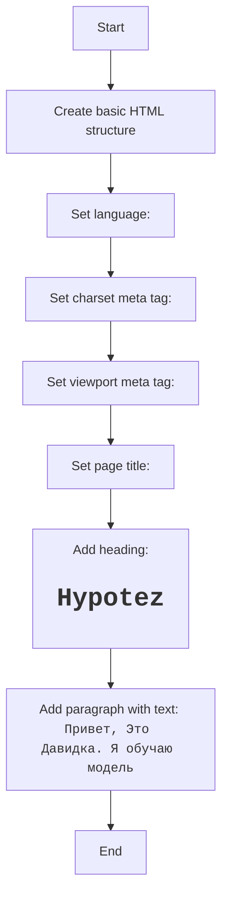

## Анализ HTML-кода `popup.html` в `src/webdriver/firefox/extentions/test_extention/html`

### 1. <алгоритм>

**Описание рабочего процесса:**

Файл `popup.html` представляет собой простую HTML-страницу, предназначенную для отображения во всплывающем окне расширения Firefox. Содержит заголовок и информационный текст.

**Блок-схема:**

1.  **Структура HTML**:
    *   Создается стандартный HTML-документ (`<!DOCTYPE html>`).
    *   Устанавливается язык страницы `en`.
    *    Задается кодировка UTF-8 и viewport.
    *   Устанавливается заголовок страницы (`<title>Hypotez</title>`).

2.  **Содержимое страницы**:
    *   Выводится заголовок `<h1>Hypotez</h1>`.
    *    Выводится абзац ` 
Привет, Это Давидка. Я обучаю модель
`.

### 2. <mermaid>

**Объяснение зависимостей `mermaid`:**

В данном коде нет зависимостей от каких-либо внешних библиотек, используются только нативные HTML-элементы.

### 3. <объяснение>

**Импорты:**

В данном коде отсутствуют импорты, так как это HTML-файл.

**Классы:**

В данном коде нет классов, так как это HTML-файл.

**Функции:**

В данном коде нет функций.

**Переменные:**

*  `MODE`: (`str`) - Глобальная переменная режима, установлена в значение `'debug'`.
*  `lang`:( `str`) -  Атрибут языка.
*   `body`:( `HTMLBodyElement`) - DOM-элемент `body`.

**Потенциальные ошибки и области для улучшения:**

*   В коде не обрабатываются ошибки, так как это чистый HTML.
*    Отсутствует возможность взаимодействия.
*   Отсутствует динамический контент.
*  Не предусмотрены дополнительные стили.

**Взаимосвязи с другими частями проекта:**

*   Модуль представляет собой всплывающее окно расширения Firefox.
*  В данном коде нет явного взаимодействия с другими модулями.
*   Этот модуль предназначен для отображения статической информации пользователю и является отправной точкой для взаимодействия с расширением (скрипт не представлен в этом коде).

Этот анализ предоставляет полное представление о работе модуля `popup.html`, его структуре и назначении в данном проекте.