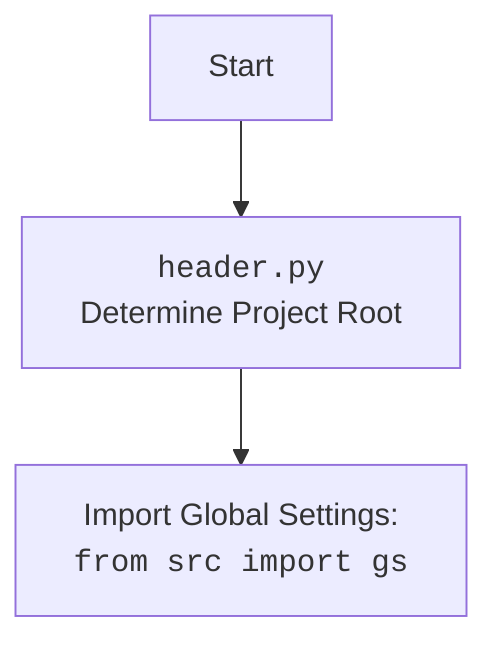

## Анализ модуля Firefox WebDriver для Selenium

### 1. <алгоритм>

**Описание рабочего процесса:**

Модуль `firefox.py` предоставляет кастомную реализацию Firefox WebDriver на основе Selenium. Он включает загрузку настроек из файла `firefox.json`, поддержку профилей, user-agent, прокси и другие опции.

**Блок-схема:**

1.  **Инициализация `Firefox` (`__init__`)**:
    *   Создается экземпляр класса `Firefox` с параметрами (имя профиля, версия geckodriver, версия firefox, пользовательский агент, путь к прокси, опции, режим окна).
    *   **Пример**: `driver = Firefox(profile_name='myprofile', geckodriver_version='123', firefox_version='120', user_agent='myagent', proxy_file_path='/path/to/proxies.txt', options=["--headless"], window_mode='kiosk')` или `driver = Firefox()`
    *   Загружаются настройки из файла `firefox.json`, используя `j_loads_ns`.
    *    Определяется путь к geckodriver и Firefox.
    *  Инициализируется `Service` для geckodriver.
    *   Создается объект `Options`.
    *   Применяются опции из файла настроек.
    *    Устанавливается режим окна (kiosk, windowless).
    *   Применяются опции, переданные при инициализации.
    *   Применяются заголовки из файла настроек.
    *  Устанавливается пользовательский агент, либо используя переданный, либо генерируя случайный с помощью `fake_useragent`.
    *   Устанавливает прокси, если они включены в настройках, вызывая метод `set_proxy`.
    *   Устанавливает директорию профиля Firefox, если имя профиля задано, создает новый профиль, если нет.
    *   Создается экземпляр `WebDriver` с настроенными опциями, сервисом и профилем.
    *   Вызывается метод `_payload` для инициализации JavaScript и ExecuteLocator.
    *   Обрабатываются исключения `WebDriverException` и общие исключения.

2.  **Установка прокси (`set_proxy`)**:
    *   Метод `set_proxy` принимает объект `Options` для добавления настроек прокси.
    *    **Пример**: `self.set_proxy(options_obj)`
    *   Получает список прокси из `get_proxies_dict()`.
    *   Выбирает случайный рабочий прокси из списка, проверяя его методом `check_proxy`.
    *   Устанавливает параметры прокси в зависимости от протокола (http, socks4, socks5).
    *   Логирует информацию об используемом прокси. Если рабочий прокси не найден, то логирует предупреждение.

3.  **Инициализация инструментов (`_payload`)**:
    *   Метод `_payload` инициализирует `JavaScript` и `ExecuteLocator` и связывает их с экземпляром `Firefox`.
    *   **Пример**: `self._payload()`
    *  Создает экземпляр `JavaScript` и связывает его методы с методами экземпляра `Firefox`.
    *   Создает экземпляр `ExecuteLocator` и связывает его методы с методами экземпляра `Firefox`.

### 2. <mermaid>

```mermaid
flowchart TD
    Start[Start] --> InitFirefox[Initialize Firefox Driver: <br><code>Firefox(...)</code>]
     InitFirefox --> LoadSettings[Load settings from <code>firefox.json</code>]
     LoadSettings --> SetGeckoPath[Set geckodriver and firefox binary path]
     SetGeckoPath --> InitService[Initialize Firefox Service]
     InitService --> InitOptions[Initialize Firefox Options]
    InitOptions --> AddOptionsFromFile[Add options from config file]
     AddOptionsFromFile --> CheckWindowMode{Is window_mode in config?}
     CheckWindowMode -- Yes --> SetWindowModeFromConfig[Set window mode from config]
         SetWindowModeFromConfig --> CheckWindowModeArgs{Is window_mode in init args?}
        CheckWindowModeArgs -- Yes --> SetWindowModeFromArgs[Set window mode from args]
           SetWindowModeArgs -- No --> CheckForModeSet[Check for window mode, if not set pass]
           CheckWindowMode -- No --> CheckWindowModeArgs
       CheckForModeSet --> AddHeaders[Add headers from config]
        AddHeaders --> SetUserAgent[Set user agent]
       SetUserAgent --> CheckProxyEnabled{Is proxy enabled in settings?}
    CheckProxyEnabled -- Yes --> SetProxy[Set proxy:<br><code>set_proxy(options)</code>]
     SetProxy --> SetProfileDir[Set user profile directory]
        CheckProxyEnabled -- No --> SetProfileDir
    SetProfileDir --> CreateWebDriverInstance[Create WebDriver instance]
        CreateWebDriverInstance --> Payload[Call Payload Method: <br><code>_payload()</code>]
     Payload --> InitJavaScript[Initialize JavaScript helper]
    InitJavaScript --> SetJavaScriptMethods[Set JavaScript methods in the instance]
    SetJavaScriptMethods --> InitExecuteLocator[Initialize ExecuteLocator]
    InitExecuteLocator --> SetExecutorMethods[Set ExecuteLocator methods in the instance]
    SetExecutorMethods --> ReturnDriverInstance[Return Firefox Driver Instance]
     ReturnDriverInstance --> End[End]
   
      subgraph SetProxy
        GetProxiesList[Get proxies dictionary:<br><code>get_proxies_dict()</code>]
        GetProxiesList --> SelectProxy[Select a working proxy]
        SelectProxy --> CheckProxy{Is a working proxy found?}
        CheckProxy -- Yes --> SetProxyOptions[Set proxy options]
        SetProxyOptions --> EndSetProxy[End Set Proxy]
        CheckProxy -- No --> LogWarningNoProxy[Log warning about no proxy]
        LogWarningNoProxy --> EndSetProxy
    end
```



**Объяснение зависимостей `mermaid`:**

*   **`os`**: Используется для работы с переменными окружения.
*   **`pathlib`**: Используется для работы с путями к файлам.
*   **`selenium.webdriver`**: Используется для управления веб-драйвером Firefox.
*   **`selenium.webdriver.firefox.options`**: Используется для настройки опций Firefox.
*    **`selenium.webdriver.firefox.service`**: Используется для управления сервисом GeckoDriver.
*    **`selenium.webdriver.firefox.firefox_profile`**: Используется для настройки профиля Firefox.
*   **`selenium.common.exceptions`**: Используется для обработки исключений WebDriver.
*   **`src`**: Используется для импорта глобальных настроек `gs`.
*   **`src.webdriver.executor`**: Используется для выполнения действий с элементами.
*   **`src.webdriver.js`**: Используется для выполнения JavaScript на странице.
*   **`src.webdriver.proxy`**: Используется для работы с прокси.
*   **`src.utils.jjson`**: Используется для загрузки JSON-конфигураций.
*   **`src.logger.logger`**: Используется для логирования.
*    **`fake_useragent`**: Используется для генерации случайных user-agent.
*   **`random`**: Используется для случайного выбора прокси.
*   **`header`**: Используется для определения корня проекта.

### 3. <объяснение>

**Импорты:**

*   `os`: Используется для доступа к переменным окружения.
*   `pathlib.Path`: Используется для работы с путями к файлам.
*   `typing.Optional`, `typing.List`: Используются для аннотации типов.
*   `selenium.webdriver.Firefox`: Используется как базовый класс для создания кастомного драйвера.
*    `selenium.webdriver.firefox.options.Options`: Используется для настройки опций Firefox.
*   `selenium.webdriver.firefox.service.Service`: Используется для управления сервисом GeckoDriver.
*   `selenium.webdriver.firefox.firefox_profile.FirefoxProfile`: Используется для работы с профилями Firefox.
*   `selenium.common.exceptions.WebDriverException`: Используется для обработки исключений WebDriver.
*    `src`: Используется для импорта глобальных настроек `gs`.
*    `src.webdriver.executor.ExecuteLocator`: Используется для управления взаимодействиями с элементами.
*   `src.webdriver.js.JavaScript`: Используется для выполнения JavaScript-кода.
*   `src.webdriver.proxy.get_proxies_dict`, `src.webdriver.proxy.check_proxy`: Используются для работы с прокси.
*   `src.utils.jjson.j_loads_ns`: Используется для загрузки JSON-конфигурации.
*    `src.logger.logger`: Используется для логирования.
*    `fake_useragent.UserAgent`: Используется для генерации случайных User-Agent.
*  `random`: Используется для случайного выбора прокси.
*   `header`: Используется для определения корня проекта.

**Классы:**

*   `Firefox(WebDriver)`:
    *   **Роль**: Кастомный класс Firefox WebDriver, расширяет `selenium.webdriver.Firefox` и добавляет поддержку загрузки настроек из JSON, user-agent, прокси, профилей и других параметров.
    *   **Атрибуты**:
         *  `driver_name`: (`str`) - Имя драйвера (всегда "firefox").
    *   **Методы**:
        *   `__init__(...)`: Инициализирует класс, загружает настройки, устанавливает user-agent, прокси, профиль и опции.
        *    `set_proxy(self, options: Options) -> None`: Настраивает прокси для браузера, если он включен.
        *   `_payload(self) -> None`: Инициализирует инструменты для работы с локаторами и JavaScript.

**Функции:**

*  `__init__(...)`:
    *   **Аргументы**:
        *   `profile_name`: (`Optional[str]`) - Имя профиля пользователя.
        *   `geckodriver_version`: (`Optional[str]`) - Версия geckodriver.
        *   `firefox_version`: (`Optional[str]`) - Версия Firefox.
        *   `user_agent`: (`Optional[str]`) - Пользовательский агент.
        *    `proxy_file_path`: (`Optional[str]`) - Путь к файлу с прокси.
        *   `options`: (`Optional[List[str]]`) - Список опций для Firefox.
        *  `window_mode`: (`Optional[str]`) - Режим окна.
        *  `*args`, `**kwargs`: Дополнительные параметры для WebDriver.
    *   **Назначение**: Инициализация объекта драйвера Firefox с настройками.
    *   **Возвращает**: `None`.
*   `set_proxy(self, options: Options) -> None`:
    *   **Аргументы**:
        *    `options`: (`Options`) - Объект `Options` Selenium.
    *   **Назначение**: Настраивает прокси для браузера, выбирая случайный рабочий прокси из списка.
    *    **Возвращает**: `None`.
*  `_payload(self) -> None`:
    *    **Аргументы**:
         *   `self` (`Firefox`): Экземпляр класса `Firefox`.
    *    **Назначение**: Загружает исполнителей для работы с локаторами и JavaScript.
    *   **Возвращает**: `None`.

**Переменные:**

*   `self.driver_name`: (`str`) - Имя драйвера (всегда "firefox").
*   `settings`: (`SimpleNamespace`) - Объект с настройками из `firefox.json`.
*    `geckodriver_path`: (`str`) - Путь к geckodriver.
*   `firefox_binary_path`: (`str`) - Путь к бинарнику firefox.
*   `service`: (`Service`) - Сервис для управления geckodriver.
*   `options_obj`: (`Options`) - Объект для настройки опций Firefox.
*   `user_agent`: (`str`) - User-Agent.
*    `proxies_dict`: (`dict`) - Словарь прокси.
*    `all_proxies`: (`list`) - Список всех прокси.
*   `working_proxy`: (`dict`) - Рабочий прокси.
*   `profile_directory`: (`str`) - Путь к директории профиля.
*   `j`: Экземпляр класса `JavaScript`.
*   `execute_locator`: Экземпляр класса `ExecuteLocator`.

**Потенциальные ошибки и области для улучшения:**

*   Обработка исключений может быть более специфичной.
*  Метод `set_proxy` не обрабатывает ошибки при проверке прокси.
*  Можно добавить поддержку разных типов прокси в `set_proxy`.
*   Можно упростить логику выбора режима окна.
*  Можно добавить возможность автоматического обновления `geckodriver`.
*   Можно добавить валидацию настроек из `firefox.json`.

**Взаимосвязи с другими частями проекта:**

*   Использует `header` для определения корня проекта.
*   Использует глобальные настройки `gs` из пакета `src`.
*   Использует `src.webdriver.executor` для выполнения действий по локаторам.
*   Использует `src.webdriver.js` для выполнения JavaScript.
*  Использует `src.webdriver.proxy` для работы с прокси.
*  Использует `src.utils.jjson` для загрузки JSON-конфигураций.
*    Использует `src.logger.logger` для логирования.
*   Является частью веб-драйверного фреймворка, предоставляя конкретную реализацию для Firefox.

Этот анализ предоставляет полное представление о работе модуля `firefox.py`, его структуре, зависимостях и возможностях.