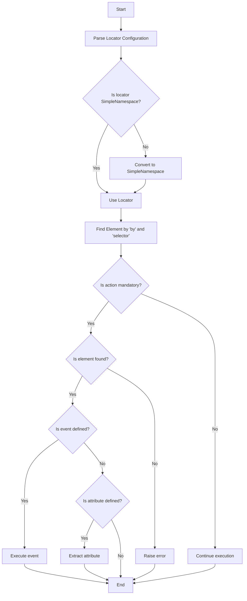

## Анализ кода модуля `locator.py`

### 1. <алгоритм>

**Описание рабочего процесса:**

Модуль `locator.py` (описан в Markdown) предоставляет примеры конфигурационных объектов, называемых "локаторами", которые используются для описания того, как находить и взаимодействовать с веб-элементами на странице. Эти локаторы передаются в класс `ExecuteLocator` для выполнения различных действий, таких как клики, отправка сообщений, извлечение атрибутов и т.д.

**Блок-схема:**

1.  **Описание локатора `close_banner`**:
    *   Локатор `close_banner` предназначен для закрытия всплывающего окна (баннера).
    *   **Пример**:
    ```json
    "close_banner": {
        "attribute": null,
        "by": "XPATH",
        "selector": "//button[@id = 'closeXButton']",
        "if_list": "first",
        "use_mouse": false,
        "mandatory": false,
        "timeout": 0,
        "timeout_for_event": "presence_of_element_located",
        "event": "click()",
        "locator_description": "Close the pop-up window, if it does not appear - it's okay (`mandatory`:`false`)"
    }
    ```
    *   `executor` находит элемент по XPATH и выполняет клик. Действие не обязательное.

2.  **Описание локатора `id_manufacturer`**:
    *   Локатор `id_manufacturer` предназначен для возврата значения, указанного в `attribute`.
    *   **Пример**:
    ```json
    "id_manufacturer": {
        "attribute": 11290,
        "by": "VALUE",
        "selector": null,
        "if_list": "first",
        "use_mouse": false,
        "mandatory": true,
        "timeout": 0,
        "timeout_for_event": "presence_of_element_located",
        "event": null,
        "locator_description": "id_manufacturer"
    }
    ```
    *   `executor` возвращает значение атрибута (`11290`), не выполняя поиск элемента на странице. Действие обязательное.

3.  **Описание локатора `additional_images_urls`**:
    *   Локатор `additional_images_urls` предназначен для извлечения URL дополнительных изображений.
    *   **Пример**:
    ```json
    "additional_images_urls": {
        "attribute": "src",
        "by": "XPATH",
        "selector": "//ol[contains(@class, 'flex-control-thumbs')]//img",
        "if_list": "first",
        "use_mouse": false,
        "mandatory": false,
        "timeout": 0,
        "timeout_for_event": "presence_of_element_located",
        "event": null
    }
    ```
    *   `executor` находит элементы по XPATH и извлекает значения атрибута `src` для каждого элемента. Действие не обязательное.

4.  **Описание локатора `default_image_url`**:
    *   Локатор `default_image_url` предназначен для получения скриншота изображения.
    *   **Пример**:
    ```json
    "default_image_url": {
        "attribute": null,
        "by": "XPATH",
        "selector": "//a[@id = 'mainpic']//img",
        "if_list": "first",
        "use_mouse": false,
        "timeout": 0,
        "timeout_for_event": "presence_of_element_located",
        "event": "screenshot()",
        "mandatory": true,
        "locator_description": "Attention! In Morlevi, the image is obtained via screenshot and returned as png (`bytes`)"
    }
    ```
    *   `executor` находит элемент по XPATH и делает его скриншот. Действие обязательное.

5.  **Описание локатора `id_supplier`**:
    *   Локатор `id_supplier` предназначен для извлечения текста элемента, содержащего SKU.
    *   **Пример**:
    ```json
    "id_supplier": {
        "attribute": "innerText",
        "by": "XPATH",
        "selector": "//span[@class = 'ltr sku-copy']",
        "if_list": "first",
        "use_mouse": false,
        "mandatory": true,
        "timeout": 0,
        "timeout_for_event": "presence_of_element_located",
        "event": null,
        "locator_description": "SKU morlevi"
    }
    ```
    *   `executor` находит элемент по XPATH и извлекает его текст. Действие обязательное.

6.  **Взаимодействие с `executor`**:
    *   Локатор преобразуется в `SimpleNamespace` (если это необходимо).
    *   `executor` использует `by` и `selector` для поиска элемента.
    *   Если есть `event`, то он выполняется.
    *   Если есть `attribute`, то его значение извлекается.
    *   Если элемент не найден и действие не обязательно (`mandatory: false`), то выполнение продолжается, иначе вызывает ошибку.

### 2. <mermaid>



**Объяснение зависимостей `mermaid`:**

В данном коде нет зависимостей от внешних библиотек, поэтому диаграмма `mermaid` не имеет зависимостей.

### 3. <объяснение>

**Импорты:**

В коде не используются импорты, так как он представляет собой описание локаторов в формате JSON.

**Классы:**

В коде нет классов.

**Функции:**

В коде нет функций.

**Переменные:**

*   `close_banner`: Локатор для закрытия баннера.
    *   `attribute`: `null` (не используется).
    *   `by`: `"XPATH"` (тип локатора).
    *   `selector`: `"//button[@id = 'closeXButton']"` (выражение для поиска элемента).
    *   `if_list`: `"first"` (использовать первый найденный элемент).
    *   `use_mouse`: `false` (не использовать мышь).
    *   `mandatory`: `false` (действие не обязательное).
    *   `timeout`: `0` (таймаут поиска элемента).
    *   `timeout_for_event`: `"presence_of_element_located"` (условие ожидания элемента).
    *   `event`: `"click()"` (действие, выполняемое над элементом).
    *   `locator_description`: `"Close the pop-up window, if it does not appear - it's okay (`mandatory`:`false`)"` (описание локатора).
*   `id_manufacturer`: Локатор для получения значения `id_manufacturer`.
    *   `attribute`: `11290` (значение атрибута).
    *   `by`: `"VALUE"` (тип локатора).
    *   `selector`: `null` (не используется).
    *   `if_list`: `"first"` (использовать первый найденный элемент).
    *   `use_mouse`: `false` (не использовать мышь).
    *   `mandatory`: `true` (действие обязательное).
    *   `timeout`: `0` (таймаут поиска элемента).
    *  `timeout_for_event`: `"presence_of_element_located"` (условие ожидания элемента).
    *   `event`: `null` (действие не требуется).
    *   `locator_description`: `"id_manufacturer"` (описание локатора).
*   `additional_images_urls`: Локатор для извлечения URL дополнительных изображений.
    *   `attribute`: `"src"` (атрибут для извлечения).
    *   `by`: `"XPATH"` (тип локатора).
    *   `selector`: `"//ol[contains(@class, 'flex-control-thumbs')]//img"` (выражение для поиска элемента).
    *   `if_list`: `"first"` (использовать первый найденный элемент).
    *   `use_mouse`: `false` (не использовать мышь).
    *   `mandatory`: `false` (действие не обязательное).
    *   `timeout`: `0` (таймаут поиска элемента).
    *   `timeout_for_event`: `"presence_of_element_located"` (условие ожидания элемента).
    *   `event`: `null` (действие не требуется).
*   `default_image_url`: Локатор для получения скриншота изображения.
    *   `attribute`: `null` (не используется).
    *   `by`: `"XPATH"` (тип локатора).
    *   `selector`: `"//a[@id = 'mainpic']//img"` (выражение для поиска элемента).
    *   `if_list`: `"first"` (использовать первый найденный элемент).
    *   `use_mouse`: `false` (не использовать мышь).
    *   `timeout`: `0` (таймаут поиска элемента).
    *   `timeout_for_event`: `"presence_of_element_located"` (условие ожидания элемента).
    *   `event`: `"screenshot()"` (действие, выполняемое над элементом).
     *   `mandatory`: `true` (действие обязательное).
     * `locator_description`: `"Attention! In Morlevi, the image is obtained via screenshot and returned as png (`bytes`)"` (описание локатора).
*   `id_supplier`: Локатор для получения текста элемента, содержащего SKU.
    *   `attribute`: `"innerText"` (атрибут для извлечения).
    *   `by`: `"XPATH"` (тип локатора).
    *   `selector`: `"//span[@class = 'ltr sku-copy']"` (выражение для поиска элемента).
    *   `if_list`: `"first"` (использовать первый найденный элемент).
    *   `use_mouse`: `false` (не использовать мышь).
    *   `mandatory`: `true` (действие обязательное).
    *   `timeout`: `0` (таймаут поиска элемента).
    *    `timeout_for_event`: `"presence_of_element_located"` (условие ожидания элемента).
    *   `event`: `null` (действие не требуется).
    *    `locator_description`: `"SKU morlevi"` (описание локатора).

**Потенциальные ошибки и области для улучшения:**

*   Отсутствует валидация структуры локаторов при загрузке.
*   Нет обработки исключений на уровне локаторов.
*   Описания локаторов можно хранить отдельно, а не в самих локаторах.
*   Отсутствует описание возможных значений ключа `by`.
*   Можно добавить поддержку регулярных выражений для значений `selector`.

**Взаимосвязи с другими частями проекта:**

*   Локаторы используются в модуле `executor.py` для взаимодействия с веб-элементами.
*   Они представляют собой конфигурационные данные, которые определяют поведение `executor`.
*   Описание локаторов помогает понять взаимодействие с веб-элементами на странице.

Этот анализ обеспечивает полное понимание структуры и назначения локаторов, а также их взаимодействия с модулем `executor`.