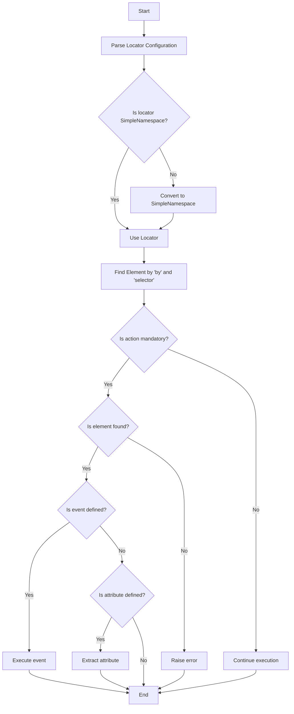

## Анализ кода модуля `locator.py`

### 1. <алгоритм>

**Описание рабочего процесса:**

Модуль `locator.py` (описанный в Markdown) демонстрирует примеры локаторов и их взаимодействие с `executor`. Локаторы — это конфигурационные объекты, описывающие, как находить веб-элементы и взаимодействовать с ними. Эти объекты передаются в класс `ExecuteLocator` для выполнения различных действий.

**Блок-схема:**

1.  **Описание локатора `close_banner`**:
    *   Локатор предназначен для закрытия всплывающего баннера.
    *   **Пример**:
        ```json
        "close_banner": {
          "attribute": null,
          "by": "XPATH",
          "selector": "//button[@id = 'closeXButton']",
          "if_list": "first",
          "use_mouse": false,
          "mandatory": false,
          "timeout": 0,
          "timeout_for_event": "presence_of_element_located",
          "event": "click()",
          "locator_description": "Закрываю pop-up окно, если оно не появилось - не страшно (`mandatory`:`false`)"
        }
        ```
    *   `executor` находит элемент по XPATH, выполняет клик. Если элемент не найден, выполнение продолжается, так как действие не обязательное.

2.  **Описание локатора `id_manufacturer`**:
    *   Локатор предназначен для возврата заданного значения `attribute`.
    *   **Пример**:
        ```json
        "id_manufacturer": {
          "attribute": 11290,
          "by": "VALUE",
          "selector": null,
          "if_list": "first",
          "use_mouse": false,
          "mandatory": true,
          "timeout": 0,
          "timeout_for_event": "presence_of_element_located",
          "event": null,
          "locator_description": "id_manufacturer"
        }
        ```
    *   `executor` возвращает значение `11290` из атрибута. Поиск элемента на странице не производится. Действие обязательное.

3.  **Описание локатора `additional_images_urls`**:
    *   Локатор предназначен для извлечения URL дополнительных изображений.
    *   **Пример**:
        ```json
        "additional_images_urls": {
          "attribute": "src",
          "by": "XPATH",
          "selector": "//ol[contains(@class, 'flex-control-thumbs')]//img",
          "if_list": "first",
          "use_mouse": false,
          "mandatory": false,
          "timeout": 0,
          "timeout_for_event": "presence_of_element_located",
          "event": null
        }
        ```
    *   `executor` находит элементы по XPATH и извлекает значение атрибута `src`. Если элементы не найдены, выполнение продолжается, так как действие не обязательное.

4.  **Описание локатора `default_image_url`**:
    *   Локатор предназначен для создания скриншота изображения по умолчанию.
    *   **Пример**:
        ```json
        "default_image_url": {
          "attribute": null,
          "by": "XPATH",
          "selector": "//a[@id = 'mainpic']//img",
          "if_list": "first",
          "use_mouse": false,
          "timeout": 0,
          "timeout_for_event": "presence_of_element_located",
          "event": "screenshot()",
          "mandatory": true,
          "locator_description": "Внимание! в морлеви картинка получается через screenshot и возвращается как png (`bytes`)"
        }
        ```
    *    `executor` находит элемент по XPATH и делает его скриншот. Действие обязательное, при ошибке возвращает исключение.

5.  **Описание локатора `id_supplier`**:
    *   Локатор предназначен для извлечения текста элемента, содержащего SKU.
    *   **Пример**:
        ```json
        "id_supplier": {
          "attribute": "innerText",
          "by": "XPATH",
          "selector": "//span[@class = 'ltr sku-copy']",
          "if_list": "first",
          "use_mouse": false,
          "mandatory": true,
          "timeout": 0,
          "timeout_for_event": "presence_of_element_located",
          "event": null,
          "locator_description": "SKU morlevi"
        }
        ```
    *   `executor` находит элемент по XPATH и извлекает его текст (`innerText`). Действие обязательное, при ошибке возвращает исключение.

6. **Взаимодействие с `executor`**:
    *   Локатор преобразуется в `SimpleNamespace`, если необходимо.
    *   `executor` использует `by` и `selector` для поиска элементов.
    *   Если есть `event`, он выполняется.
    *   Если есть `attribute`, его значение извлекается.
    *   Если элемент не найден и действие не обязательное, выполнение продолжается. Если элемент не найден и действие обязательное, возвращает исключение.

### 2. <mermaid>



**Объяснение зависимостей `mermaid`:**

В данном коде нет зависимостей от внешних библиотек, так как он представляет собой описание локаторов в формате JSON.

### 3. <объяснение>

**Импорты:**

В данном коде нет импортов, так как он представляет собой JSON-подобное описание локаторов.

**Классы:**

В данном коде нет классов.

**Функции:**

В данном коде нет функций.

**Переменные:**

*   `close_banner`: Локатор для закрытия баннера.
    *   `attribute`: `null` (не используется).
    *   `by`: `"XPATH"` (тип локатора).
    *   `selector`: `"//button[@id = 'closeXButton']"` (селектор для поиска элемента).
    *   `if_list`: `"first"` (использовать первый элемент из списка).
    *   `use_mouse`: `false` (не использовать мышь).
    *   `mandatory`: `false` (действие не обязательное).
    *   `timeout`: `0` (время ожидания элемента).
    *   `timeout_for_event`: `"presence_of_element_located"` (условие ожидания).
    *   `event`: `"click()"` (событие, которое нужно выполнить).
    *   `locator_description`: `"Закрываю pop-up окно, если оно не появилось - не страшно (`mandatory`:`false`)"` (описание локатора).
*   `id_manufacturer`: Локатор для получения значения `id_manufacturer`.
    *   `attribute`: `11290` (значение атрибута).
    *   `by`: `"VALUE"` (тип локатора).
    *   `selector`: `null` (селектор не используется).
    *   `if_list`: `"first"` (использовать первый элемент из списка).
    *    `use_mouse`: `false` (не использовать мышь).
    *   `mandatory`: `true` (действие обязательное).
    *    `timeout`: `0` (время ожидания элемента).
    *   `timeout_for_event`: `"presence_of_element_located"` (условие ожидания).
    *   `event`: `null` (событие не требуется).
    *  `locator_description`: `"id_manufacturer"` (описание локатора).
*   `additional_images_urls`: Локатор для извлечения URL дополнительных изображений.
    *   `attribute`: `"src"` (атрибут для извлечения).
    *    `by`: `"XPATH"` (тип локатора).
    *   `selector`: `"//ol[contains(@class, 'flex-control-thumbs')]//img"` (селектор для поиска элемента).
    *   `if_list`: `"first"` (использовать первый элемент из списка).
    *    `use_mouse`: `false` (не использовать мышь).
    *    `mandatory`: `false` (действие не обязательное).
    *   `timeout`: `0` (время ожидания элемента).
    *   `timeout_for_event`: `"presence_of_element_located"` (условие ожидания).
    *   `event`: `null` (событие не требуется).
*   `default_image_url`: Локатор для получения скриншота изображения.
    *   `attribute`: `null` (не используется).
    *   `by`: `"XPATH"` (тип локатора).
    *   `selector`: `"//a[@id = 'mainpic']//img"` (селектор для поиска элемента).
    *    `if_list`: `"first"` (использовать первый элемент из списка).
    *   `use_mouse`: `false` (не использовать мышь).
    *   `timeout`: `0` (время ожидания элемента).
    *    `timeout_for_event`: `"presence_of_element_located"` (условие ожидания).
    *   `event`: `"screenshot()"` (событие для выполнения).
    *   `mandatory`: `true` (действие обязательное).
    *    `locator_description`: `"Внимание! в морлеви картинка получается через screenshot и возвращается как png (`bytes`)"` (описание локатора).
*   `id_supplier`: Локатор для получения текста элемента, содержащего SKU.
    *   `attribute`: `"innerText"` (атрибут для извлечения).
    *    `by`: `"XPATH"` (тип локатора).
    *   `selector`: `"//span[@class = 'ltr sku-copy']"` (селектор для поиска элемента).
    *    `if_list`: `"first"` (использовать первый элемент из списка).
    *   `use_mouse`: `false` (не использовать мышь).
    *   `mandatory`: `true` (действие обязательное).
    *    `timeout`: `0` (время ожидания элемента).
    *    `timeout_for_event`: `"presence_of_element_located"` (условие ожидания).
    *   `event`: `null` (событие не требуется).
    *   `locator_description`: `"SKU morlevi"` (описание локатора).

**Потенциальные ошибки и области для улучшения:**

*   Отсутствует валидация структуры локаторов.
*   Нет обработки ошибок при работе с локаторами.
*    Описания локаторов хранятся прямо в локаторах, а не отдельно.
*   Отсутствует описание возможных значений ключа `by`.
*   Не обрабатываются ситуации, когда `selector` имеет неправильный формат.

**Взаимосвязи с другими частями проекта:**

*   Локаторы используются классом `ExecuteLocator` из модуля `executor.py`.
*   Локаторы представляют собой конфигурационные данные, определяющие взаимодействие с веб-элементами.
*   Они используются для автоматизации задач веб-скрапинга и тестирования.

Этот анализ предоставляет исчерпывающее понимание структуры, назначения и взаимодействия локаторов с другими частями проекта.