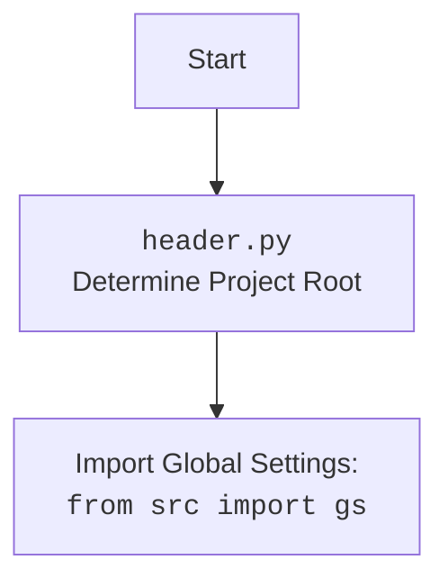

## Анализ модуля Playwright Crawler для автоматизации и сбора данных

### 1. <алгоритм>

**Описание рабочего процесса:**

Этот документ описывает модуль, предоставляющий кастомную реализацию веб-сканера на основе `PlaywrightCrawler` из библиотеки `Crawlee`. Модуль предназначен для автоматизации сбора данных с веб-страниц и управления браузером с помощью настроек из файла `playwrid.json`.

**Блок-схема:**

1.  **Инициализация `Playwrid`**:
    *   Создается экземпляр класса `Playwrid` с возможностью передачи параметров (user-agent, опции, и других параметров для `PlaywrightCrawler`).
    *   **Пример**: `browser = Playwrid(user_agent='myagent', options=['--disable-gpu'], max_requests=10, headless=True)` или `browser = Playwrid()`
    *   Загружаются настройки из файла `playwrid.json` используя `j_loads_ns`.
    *   Вызывается метод `_set_launch_options` для настройки запуска браузера.
    *   Инициализируется `PlaywrightExecutor`.
    *   Инициализируется `PlaywrightCrawler` с заданными параметрами.
    *  Если у класса есть метод `set_launch_options`, вызывается он.
    *   Если у класса нет метода `set_launch_options`, то используется альтернативный метод настройки.

2.  **Настройка параметров запуска (`_set_launch_options`)**:
    *   Метод `_set_launch_options` принимает `user_agent` и `options`.
    *   **Пример**: `launch_options = self._set_launch_options(user_agent='myagent', options=['--disable-gpu'])`
    *   Создает словарь `launch_options` с параметрами для запуска браузера, включая `headless` режим и список `args`.
    *   Добавляет user-agent, если он передан.
    *   Добавляет кастомные опции, если они переданы.
    *   Возвращает словарь параметров запуска.

3.  **Запуск сканера и навигация (`start`)**:
    *   Метод `start` запускает Playwright и переходит по заданному URL.
    *   **Пример**: `await browser.start('https://example.com')`
    *   Логирует информацию о запуске сканера.
    *   Вызывает `self.executor.start()` для запуска Playwright.
    *   Вызывает `self.executor.goto(url)` для перехода по URL.
    *   Вызывает `super().run(url)` для запуска процесса сканирования.
    *   Получает контекст сканирования `self.crawling_context`.
    *   Обрабатывает исключения.

4.  **Получение текущего URL (`current_url`)**:
    *   Свойство `current_url` возвращает текущий URL страницы.
    *   **Пример**: `url = browser.current_url`
    *  Возвращает текущий URL или `None`, если контекст не определен.

5.  **Получение HTML-контента страницы (`get_page_content`)**:
    *   Метод `get_page_content` возвращает HTML-контент текущей страницы.
    *   **Пример**: `content = browser.get_page_content()`
    *  Возвращает HTML-контент или `None`, если контент не доступен.

6.  **Получение контента элемента (`get_element_content`)**:
    *   Метод `get_element_content` принимает CSS-селектор и получает `inner_html` контент.
    *   **Пример**: `content = await browser.get_element_content('h1')`
    *   Использует `self.context.page.locator(selector)` для получения элемента.
    *  Возвращает `inner_html` или `None` при ошибке.

7.  **Получение значения элемента по XPath (`get_element_value_by_xpath`)**:
    *   Метод `get_element_value_by_xpath` получает текст элемента по XPath.
    *   **Пример**: `value = await browser.get_element_value_by_xpath('//h1/text()')`
    *   Использует `self.context.page.locator(f'xpath={xpath}')` для получения элемента.
    *   Возвращает текст или `None` при ошибке.

8.  **Клик на элемент (`click_element`)**:
    *   Метод `click_element` выполняет клик на элемент по CSS-селектору.
    *   **Пример**: `await browser.click_element('button')`
    *   Использует `self.context.page.locator(selector)` для получения элемента.
    *   Выполняет клик.
    *   Обрабатывает исключения.

9.  **Выполнение локатора (`execute_locator`)**:
    *   Метод `execute_locator` выполняет действия, указанные в локаторе.
    *    **Пример**: `result = await browser.execute_locator(locator)`
    *  Использует метод `self.executor.execute_locator` для обработки локатора.

### 2. <mermaid>

```mermaid
flowchart TD
    Start[Start] --> InitPlaywrid[Initialize Playwrid: <br><code>Playwrid(user_agent, options, **kwargs)</code>]
    InitPlaywrid --> SetLaunchOptions[Set launch options:<br><code>_set_launch_options(user_agent, options)</code>]
     SetLaunchOptions --> CreateLaunchOptions[Create launch options dict, adding user agent and custom options]
     CreateLaunchOptions --> InitPlaywrightCrawler[Init PlaywrightCrawler]
    InitPlaywrightCrawler --> StartPlaywrid[Start Playwrid: <br><code>start(url)</code>]
    StartPlaywrid --> StartExecutor[Start PlaywrightExecutor:<br><code>self.executor.start()</code>]
     StartExecutor --> NavigateToURL[Navigate to URL:<br><code>self.executor.goto(url)</code>]
     NavigateToURL --> RunPlaywrightCrawler[Run PlaywrightCrawler: <br><code>super().run(url)</code>]
       RunPlaywrightCrawler --> GetCrawlingContext[Get crawling context: <code>self.crawling_context</code>]
     GetCrawlingContext --> GetCurrentURL[Get current URL: <br><code>current_url</code>]
        GetCurrentURL --> GetPageContent[Get page content: <br><code>get_page_content()</code>]
           GetPageContent --> GetElementContent[Get element content by CSS selector: <br><code>get_element_content(selector)</code>]
         GetElementContent --> GetElementByXPath[Get element content by Xpath: <br><code>get_element_value_by_xpath(xpath)</code>]
     GetElementByXPath --> ClickElementByCss[Click on element by CSS selector: <br><code>click_element(selector)</code>]
        ClickElementByCss --> ExecuteLocatorCall[Execute locator: <br><code>execute_locator(locator)</code>]
    ExecuteLocatorCall --> End[End]
```



**Объяснение зависимостей `mermaid`:**

*   **`pathlib`**: Используется для работы с путями к файлам.
*   **`asyncio`**: Используется для асинхронного программирования.
*   **`crawlee.playwright_crawler`**: Используется для создания веб-сканеров на базе Playwright.
*   **`src`**: Используется для импорта глобальных настроек `gs` и логгера.
*   **`src.logger.logger`**: Используется для логирования.
*  **`src.webdriver.playwright.executor`**: Используется для управления локаторами и выполнения действий на странице.
*   **`src.webdriver.js`**: Используется для выполнения JavaScript на странице (хотя и не напрямую в этом модуле, но через  `PlaywrightExecutor`).
*  **`src.utils.jjson`**: Используется для загрузки конфигураций из JSON файлов.

### 3. <объяснение>

**Импорты:**

*   `asyncio`: Используется для асинхронного программирования.
*   `pathlib.Path`: Используется для работы с путями к файлам.
*    `typing.Optional`, `typing.List`, `typing.Dict`, `typing.Any`: Используются для аннотации типов.
*   `types.SimpleNamespace`: Используется для создания простых объектов с атрибутами, доступными через точку.
*   `crawlee.playwright_crawler.PlaywrightCrawler`, `crawlee.playwright_crawler.PlaywrightCrawlingContext`: Используются для создания и управления веб-сканером Playwright.
*  `src`: Используется для импорта глобальных настроек `gs` и других модулей проекта.
*  `src.webdriver.playwright.executor.PlaywrightExecutor`: Используется для управления действиями на странице.
*   `src.webdriver.js.JavaScript`: Используется для выполнения JavaScript (не напрямую, а через `PlaywrightExecutor`).
*   `src.utils.jjson.j_loads_ns`: Используется для загрузки конфигурационных файлов.
*   `src.logger.logger`: Используется для логирования.
*  `re`: Используется для работы с регулярными выражениями.

**Классы:**

*   `Playwrid(PlaywrightCrawler)`:
    *   **Роль**: Расширение класса `PlaywrightCrawler` с дополнительными функциями, такими как настройка user-agent, работа с прокси, и т.д.
    *   **Атрибуты**:
        *    `driver_name`: (`str`) - Имя драйвера.
        *    `base_path`: (`pathlib.Path`) - базовый путь к файлу конфигурации.
        *   `config`: (`SimpleNamespace`) - настройки, загруженные из `playwrid.json`.
        *   `context`: Контекст сканирования.
    *   **Методы**:
        *   `__init__`: Инициализирует `Playwrid`, устанавливает параметры запуска.
        *   `_set_launch_options`: Настраивает параметры запуска браузера.
        *  `start`: Запускает сканирование и навигацию.
        *   `current_url`: Возвращает текущий URL страницы.
        *   `get_page_content`: Возвращает HTML контент страницы.
        *   `get_element_content`: Возвращает `inner_html` элемента по CSS-селектору.
        *   `get_element_value_by_xpath`: Возвращает текстовое значение элемента по XPath.
        *    `click_element`: Выполняет клик на элемент по CSS-селектору.
        * `execute_locator`: Выполняет действия, заданные в локаторе, передавая управление в класс `PlaywrightExecutor`.

**Функции:**

*   `__init__(self, user_agent: Optional[str] = None, options: Optional[List[str]] = None, *args, **kwargs)`:
    *   **Аргументы**:
        *    `user_agent`: (`Optional[str]`) - Пользовательский агент.
        *  `options`: (`Optional[List[str]]`) - Список опций запуска браузера.
        * `*args`, `**kwargs`: Дополнительные параметры для PlaywrightCrawler.
    *   **Назначение**: Инициализирует объект `Playwrid`, загружает настройки и применяет их.
    *   **Возвращает**: `None`.
*    `_set_launch_options(self, user_agent: Optional[str] = None, options: Optional[List[str]] = None) -> Dict[str, Any]`:
    *   **Аргументы**:
        *   `user_agent`: (`Optional[str]`) - Пользовательский агент.
        *   `options`: (`Optional[List[str]]`) - Список опций запуска браузера.
    *   **Назначение**: Настраивает опции запуска браузера.
    *   **Возвращает**: Словарь с опциями для Playwright.
*   `start(self, url: str) -> None`:
    *    **Аргументы**:
        *   `url`: (`str`) - URL для перехода.
    *    **Назначение**: Запускает браузер и переходит по URL, вызывает `super().run()`.
    *   **Возвращает**: `None`.
*    `current_url(self) -> Optional[str]`:
    *   **Назначение**: Получение текущего URL страницы.
    *  **Возвращает**: Текущий URL или `None` если URL не получен.
*   `get_page_content(self) -> Optional[str]`:
    *   **Назначение**: Получение HTML контента текущей страницы.
    *   **Возвращает**: HTML контент или `None` если контент не доступен.
*   `get_element_content(self, selector: str) -> Optional[str]`:
    *   **Аргументы**:
         *   `selector`: (`str`) - CSS селектор элемента.
    *  **Назначение**: Получает `inner_html` контент элемента по CSS-селектору.
    *  **Возвращает**:  `inner_html` контент или `None`, если элемент не найден.
*    `get_element_value_by_xpath(self, xpath: str) -> Optional[str]`:
    *   **Аргументы**:
         * `xpath`: (`str`) - XPath элемента.
    *   **Назначение**:  Получает текстовое значение элемента по XPath.
    *   **Возвращает**: Значение элемента или `None`, если элемент не найден.
*    `click_element(self, selector: str) -> None`:
    *   **Аргументы**:
         *    `selector`: (`str`) - CSS-селектор элемента.
    *    **Назначение**:  Выполняет клик на элемент по селектору.
    *   **Возвращает**: `None`.
* `execute_locator(self, locator: dict | SimpleNamespace, message: Optional[str] = None, typing_speed: float = 0) -> str | List[str] | bytes | List[bytes] | bool`:
    *   **Аргументы**:
         *   `locator`: (`dict | SimpleNamespace`) - Локатор элемента.
         *    `message`: (`Optional[str]`) - Сообщение.
         *    `typing_speed`: (`float`) - Скорость печати.
    *    **Назначение**: Выполняет действия, заданные в локаторе.
    *   **Возвращает**: Результат выполнения операции (атрибут, список атрибутов, словарь атрибутов, элемент, бинарный поток или bool).

**Переменные:**

*   `self.driver_name`: (`str`) - Имя драйвера (всегда "playwrid").
*   `self.base_path`: (`pathlib.Path`) - Базовый путь к файлу конфигурации.
*   `self.config`: (`SimpleNamespace`) - Настройки, загруженные из `playwrid.json`.
*  `self.context`: (`PlaywrightCrawlingContext`) - контекст сканирования.
*   `launch_options`: (`Dict[str, Any]`) - Словарь параметров запуска.
*   `user_agent`: (`Optional[str]`) - User-agent.
*   `options`: (`Optional[List[str]]`) - Опции запуска браузера.
*   `self.executor`: Экземпляр класса `PlaywrightExecutor`.
*   `selector`: (`str`) CSS-селектор элемента.
*   `xpath`: (`str`) Xpath элемента.
* `message`: (`Optional[str]`) сообщение.
*  `typing_speed`: (`float`) Скорость печати.

**Потенциальные ошибки и области для улучшения:**

*   Обработка ошибок может быть более специфичной.
*    Можно добавить возможность настраивать прокси из конфигурационного файла.
*   Можно добавить валидацию конфигурационных данных.
*   Можно добавить поддержку разных типов локаторов.
*   Можно добавить возможность кастомизировать процесс обработки данных с помощью callback-функции.

**Взаимосвязи с другими частями проекта:**

*   Использует `header` для определения корня проекта.
*   Использует глобальные настройки `gs` из пакета `src`.
*   Использует `src.webdriver.playwright.executor` для управления выполнением действий на странице.
*    Использует `src.webdriver.js` для выполнения JavaScript на странице (через класс `PlaywrightExecutor`).
*   Использует `src.utils.jjson` для загрузки JSON-конфигураций.
*  Использует `src.logger.logger` для логирования.
*   Является частью веб-драйверного фреймворка, реализует взаимодействие с Playwright.

Этот анализ предоставляет полное представление о работе модуля `playwrid.py`, его структуре, зависимостях и возможностях.