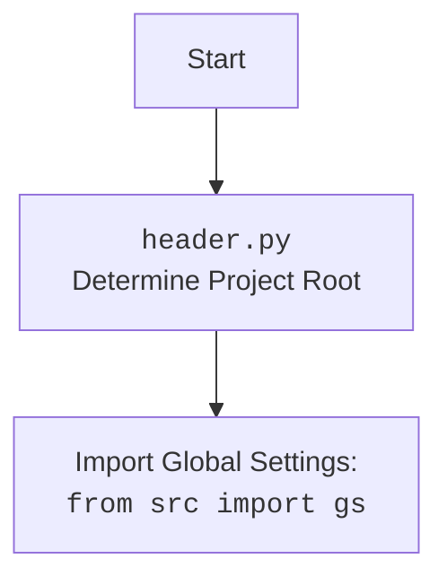

## Анализ кода модуля `executor.py` в `src.webdriver.playwright`

### 1. <алгоритм>

**Описание рабочего процесса:**

Модуль `executor.py` предоставляет класс `PlaywrightExecutor`, который является кастомной реализацией для выполнения команд на веб-страницах с использованием Playwright. Он обрабатывает локаторы, извлекает данные, выполняет события и предоставляет базовые операции для взаимодействия с браузером.

**Блок-схема:**

1.  **Инициализация `PlaywrightExecutor` (`__init__`)**:
    *   Создается экземпляр класса `PlaywrightExecutor` с указанием типа браузера (по умолчанию `chromium`).
    *   **Пример**: `executor = PlaywrightExecutor(browser_type='firefox')` или `executor = PlaywrightExecutor()`
    *   Инициализируются переменные, в том числе считываются настройки из `playwrid.json`.

2.  **Запуск Playwright (`start`)**:
    *   Метод `start` инициализирует Playwright и запускает браузер.
    *   **Пример**: `await executor.start()`
    *   Запускает Playwright, устанавливает headless режим и применяет опции из конфигурации.
    *   Создает новую страницу в браузере.
    *    Обрабатывает исключения.

3.  **Остановка Playwright (`stop`)**:
    *   Метод `stop` закрывает браузер и останавливает экземпляр Playwright.
    *   **Пример**: `await executor.stop()`
    *   Закрывает страницу, если она существует.
    *   Останавливает Playwright и сбрасывает ссылку на драйвер.
    *   Обрабатывает исключения.

4.  **Выполнение локатора (`execute_locator`)**:
    *   Метод `execute_locator` принимает локатор, сообщение и скорость ввода для выполнения действий на веб-элементе.
    *    **Пример**: `result = await executor.execute_locator(locator, message="test", typing_speed=0.1)`
    *   Преобразует локатор в `SimpleNamespace`, если это словарь.
    *  Внутренняя функция `_parse_locator` проверяет наличие `event`, `attribute` или `mandatory` и вызывает нужный метод.
         * Если `event`, то вызывается `execute_event`.
         * Если `attribute`, то вызывается `get_attribute_by_locator`.
         *  Иначе вызывается `get_webelement_by_locator`.

5. **Оценка локатора (`evaluate_locator`)**:
    * Метод `evaluate_locator` оценивает атрибут локатора.
    *  **Пример**: `result = await executor.evaluate_locator(attribute)`
    *  Если атрибут список, то выполняется асинхронный вызов для каждого атрибута.
    * Если атрибут не список, то вызывается `_evaluate` для одного элемента.
    *   Возвращается результат обработки атрибута.
6.  **Получение атрибута (`get_attribute_by_locator`)**:
    *   Метод `get_attribute_by_locator` получает значение атрибута(ов) элемента.
    *   **Пример**: `attribute = await executor.get_attribute_by_locator(locator, attribute='href')`
    *   Получает элемент с помощью `get_webelement_by_locator`.
    *    Проверяет, является ли атрибут словарем.
    *    Если атрибут строка, то ищет атрибут у элемента, если атрибут похож на словарь, то разбирает его и извлекает значения.
    *  Возвращает атрибут элемента или None, если элемент не найден.
    *    Обрабатывает исключения.

7.  **Получение веб-элемента (`get_webelement_by_locator`)**:
    *   Метод `get_webelement_by_locator` получает веб-элементы по локатору.
    *   **Пример**: `element = await executor.get_webelement_by_locator(locator)`
    *   Проверяет тип локатора (XPATH или иной).
    *   Использует `self.page.locator` для получения `Locator`.
    *    Обрабатывает `if_list`, чтобы вернуть первый, последний, четный, нечетный, конкретный элементы или все элементы.
     *   Обрабатывает исключения и логирует ошибки.

8.  **Получение скриншота элемента (`get_webelement_as_screenshot`)**:
    *   Метод `get_webelement_as_screenshot` делает скриншот веб-элемента.
    *   **Пример**: `screenshot = await executor.get_webelement_as_screenshot(locator)`
    *  Использует `get_webelement_by_locator` для получения элемента.
    *   Возвращает скриншот элемента в виде `bytes`.
    *   Обрабатывает исключения и логирует ошибки.

9.  **Выполнение события (`execute_event`)**:
    *   Метод `execute_event` используется для выполнения события на веб-элементе.
    *    **Пример**: `await executor.execute_event(locator, event='click()')`
    *    Получает элемент с помощью `get_webelement_by_locator`.
    *    Разделяет строку `event` на отдельные события.
    *   Выполняет события, указанные в `locator.event` (`click()`, `pause()`, `upload_media()`, `screenshot()`, `clear()`, `send_keys()`, `type()`).
    *   Возвращает результат выполнения события.

10. **Отправка сообщения (`send_message`)**:
    *    Метод `send_message` используется для отправки сообщения в элемент.
    *   **Пример**: `await executor.send_message(locator, 'hello', typing_speed=0.1)`
    *   Получает элемент, с помощью `get_webelement_by_locator`.
    *   Выполняет `element.type()` с заданным сообщением и задержкой.

11. **Переход по URL (`goto`)**:
    *   Метод `goto` используется для перехода по указанному URL.
    *  **Пример:** `await executor.goto("https://example.com")`
    *  Использует `self.page.goto(url)` для перехода по URL.
    *   Логирует ошибку при переходе.

### 2. <mermaid>

```mermaid
flowchart TD
    Start[Start] --> InitExecutor[Initialize PlaywrightExecutor: <br><code>PlaywrightExecutor(browser_type, **kwargs)</code>]
    InitExecutor --> LoadConfig[Load settings from <code>playwrid.json</code>]
     LoadConfig -->  StartPlaywright[Start Playwright: <br><code>start()</code>]
    StartPlaywright --> LaunchBrowser[Launch browser (chromium, firefox or webkit)]
     LaunchBrowser --> CreateNewPage[Create new page]
     CreateNewPage --> ExecuteLocatorCall[Execute Locator: <br><code>execute_locator(locator, message, typing_speed)</code>]
    ExecuteLocatorCall --> CheckLocatorType{Is locator SimpleNamespace or dict?}
    CheckLocatorType -- Yes --> UseLocatorAsIs[Use locator as is]
    CheckLocatorType -- No --> ConvertDictToSimpleNamespace[Convert dict to SimpleNamespace]
    ConvertDictToSimpleNamespace --> UseLocatorAsIs
    UseLocatorAsIs --> DefineParseLocator[Define async function _parse_locator]
    DefineParseLocator --> CheckEventAttributeMandatory[Check if locator has event, attribute, or mandatory]
    CheckEventAttributeMandatory -->|No| ReturnNone[Return None]
    CheckEventAttributeMandatory -->|Yes| TryMapByEvaluateAttribute[Try to map by and evaluate attribute]
    TryMapByEvaluateAttribute --> CatchExceptionsAndLog[Catch exceptions and log if needed]
    CatchExceptionsAndLog --> HasEvent{Does locator have event?}
    HasEvent -->|Yes| ExecuteEvent[Execute event]
    HasEvent -->|No| HasAttribute{Does locator have attribute?}
    HasAttribute -->|Yes| GetAttributeByLocator[Get attribute by locator]
    HasAttribute -->|No| GetWebElementByLocator[Get web element by locator]
    ExecuteEvent --> ReturnEventResult[Return result of event]
    GetAttributeByLocator --> ReturnAttributeResult[Return attribute result]
    GetWebElementByLocator --> ReturnWebElementResult[Return web element result]
    ReturnEventResult --> ReturnFinalResult[Return final result of _parse_locator]
    ReturnAttributeResult --> ReturnFinalResult
    ReturnWebElementResult --> ReturnFinalResult
    ReturnFinalResult --> ReturnExecuteLocatorResult[Return result of execute_locator]
    ReturnExecuteLocatorResult --> End[End]
```



**Объяснение зависимостей `mermaid`:**

*   **`asyncio`**: Используется для асинхронного программирования.
*   **`pathlib`**: Используется для работы с путями к файлам.
*  **`playwright.async_api`**: Используется для работы с Playwright.
*   **`types`**: Используется для создания `SimpleNamespace`.
*   **`src`**: Используется для импорта глобальных настроек `gs` и логгера.
*   **`src.logger.logger`**: Используется для логирования ошибок и отладочной информации.
*   **`src.utils.jjson`**: Используется для загрузки настроек из JSON.
*  **`re`**: Используется для работы с регулярными выражениями

### 3. <объяснение>

**Импорты:**

*  `asyncio`: Используется для асинхронного программирования.
*   `typing.Optional`, `typing.List`, `typing.Dict`, `typing.Any`: Используются для аннотаций типов.
*   `pathlib.Path`: Используется для работы с путями к файлам.
*   `playwright.async_api.async_playwright`, `playwright.async_api.Page`, `playwright.async_api.Locator`: Используются для управления браузером Playwright.
*   `types.SimpleNamespace`: Используется для создания простых объектов с атрибутами, доступ к которым осуществляется через точку.
*   `src`: Используется для импорта глобальных настроек `gs` и других модулей проекта.
*   `src.logger.logger`: Используется для логирования.
*   `src.utils.jjson.j_loads_ns`: Используется для загрузки JSON конфигураций.
*    `src.logger.exceptions.WebDriverException`: Используется для кастомного исключения.
*  `re`: Используется для работы с регулярными выражениями.

**Классы:**

*   `PlaywrightExecutor`:
    *   **Роль**:  Исполнитель команд на веб-страницах с использованием Playwright.
    *   **Атрибуты**:
        *   `driver`: Экземпляр Playwright.
        *   `browser_type`: Тип браузера (chromium, firefox, webkit).
        *   `page`: Текущая страница браузера Playwright.
        *   `config`:  Настройки загруженные из файла `playwrid.json`.
    *   **Методы**:
        *   `__init__`: Инициализирует класс, загружая конфигурацию из файла и устанавливая тип браузера.
        *   `start`: Запускает Playwright и браузер.
        *   `stop`: Останавливает Playwright и браузер.
        *   `execute_locator`: Выполняет действия с веб-элементами на основе локатора.
        *   `evaluate_locator`: Оценивает атрибуты локатора.
        *    `get_attribute_by_locator`: Извлекает атрибуты элемента.
        *   `get_webelement_by_locator`: Получает веб-элемент(-ы) по локатору.
        *   `get_webelement_as_screenshot`: Делает скриншот элемента.
        *    `execute_event`: Выполняет события на элементе.
        *   `send_message`: Отправляет сообщение в элемент.
        *   `goto`: Переходит по URL.

**Функции:**

*   `__init__(self, browser_type: str = 'chromium', **kwargs)`:
    *   **Аргументы**:
        *  `browser_type`: (`str`) - Тип браузера.
         *   `**kwargs`: дополнительные параметры.
    *   **Назначение**: Инициализирует `PlaywrightExecutor`, загружает конфигурации из `playwrid.json`
    *  **Возвращает**: `None`.
*   `start(self) -> None`:
    *   **Аргументы**:
        *    `self` (`PlaywrightExecutor`): Экземпляр класса `PlaywrightExecutor`
    *  **Назначение**: Запускает Playwright и браузер.
    *  **Возвращает**: `None`.
*   `stop(self) -> None`:
     *   **Аргументы**:
         *  `self` (`PlaywrightExecutor`): Экземпляр класса `PlaywrightExecutor`
     *   **Назначение**: Останавливает Playwright и закрывает браузер.
     *   **Возвращает**: `None`.
*    `execute_locator(self, locator: dict | SimpleNamespace, message: Optional[str] = None, typing_speed: float = 0) -> str | List[str] | dict | bytes | bool`:
    *   **Аргументы**:
         *   `locator`: (`dict | SimpleNamespace`) - Локатор элемента.
        *   `message`: (`Optional[str]`) - Сообщение для отправки.
         *   `typing_speed`: (`float`) - Скорость ввода текста.
    *   **Назначение**:  Выполняет действия на веб-элементе на основе локатора.
    *   **Возвращает**: Результат операции (атрибут, список атрибутов, словарь атрибутов, элемент, бинарный поток или bool).
*    `evaluate_locator(self, attribute: str | List[str] | dict) -> Optional[str | List[str] | dict]`:
    *    **Аргументы**:
         *   `attribute`: (`str | List[str] | dict`) - Атрибут для оценки.
    *    **Назначение**: Оценивает атрибут локатора.
    *   **Возвращает**: Оцененные атрибуты.
*   `get_attribute_by_locator(self, locator: dict | SimpleNamespace) -> Optional[str | List[str] | dict]`:
     *   **Аргументы**:
         *   `locator`: (`dict | SimpleNamespace`) - Локатор элемента.
    *   **Назначение**: Получает атрибут элемента.
    *   **Возвращает**: Атрибут элемента или None.
*  `get_webelement_by_locator(self, locator: dict | SimpleNamespace) -> Optional[Locator | List[Locator]]`:
    *   **Аргументы**:
        *   `locator`: (`dict | SimpleNamespace`) - Локатор для поиска элементов.
    *    **Назначение**: Получает веб-элемент(-ы) по локатору.
    *   **Возвращает**: Playwright Locator или список Locators.
*   `get_webelement_as_screenshot(self, locator: dict | SimpleNamespace, webelement: Optional[Locator] = None) -> Optional[bytes]`:
    *   **Аргументы**:
        *  `locator`:  (`dict | SimpleNamespace`) - Локатор элемента.
         *  `webelement`: (`Optional[Locator]`) -  Элемент для скриншота.
    *   **Назначение**:  Делает скриншот элемента.
    *    **Возвращает**: Скриншот в виде bytes или None.
*   `execute_event(self, locator: dict | SimpleNamespace, message: Optional[str] = None, typing_speed: float = 0) -> str | List[str] | bytes | List[bytes] | bool`:
    *   **Аргументы**:
        * `locator`:  (`dict | SimpleNamespace`) - Локатор элемента.
         *   `message`: (`Optional[str]`) - Сообщение для события.
         *    `typing_speed`: (`float`) - Скорость печати.
    *   **Назначение**:  Выполняет событие, связанные с локатором.
    *   **Возвращает**: Результат события.
*    `send_message(self, locator: dict | SimpleNamespace, message: str = None, typing_speed: float = 0) -> bool`:
    *   **Аргументы**:
         *   `locator`: (`dict | SimpleNamespace`) - Локатор элемента.
        *   `message`: (`Optional[str]`) - Сообщение для элемента.
         *    `typing_speed`: (`float`) - Скорость печати.
    *    **Назначение**: Отправляет сообщение элементу.
    *   **Возвращает**: `True`, если сообщение отправлено, `False` в обратном случае.
*   `goto(self, url: str) -> None`:
     *   **Аргументы**:
          *    `url`: (`str`) - URL для навигации.
    *    **Назначение**: Переходит по указанному URL.
     *   **Возвращает**: `None`.

**Переменные:**

*   `self.driver`: Экземпляр `Playwright` драйвера.
*   `self.browser_type`: Тип браузера.
*    `self.page`: Текущая страница.
*   `self.config`: Объект настроек, полученный из JSON.
*   `locator`: Локатор элемента.
*   `message`: Сообщение для отправки.
*  `typing_speed`: Скорость ввода текста.
*  `element`: Веб-элемент (Playwright Locator).
*  `attribute`: Атрибут элемента.
*  `attr_dict`: Словарь атрибутов.
*   `attr_string`: Строка атрибута.
*    `key`, `value`: Ключ и значение атрибута.
*   `el`: Веб-элемент (Playwright Locator).
* `keys_to_send`: Список клавиш.

**Потенциальные ошибки и области для улучшения:**

*  Можно добавить поддержку прокси, user-agent и других параметров из `playwrid.json`.
*    Можно добавить больше возможностей для настройки Playwright (размер окна, и т.д.) из конфигурации.
*   Метод `get_attribute_by_locator` может извлекать атрибуты с использованием словаря, но в `_get_attribute` не использует значения ключа и значения `attr_dict`.
*   Можно добавить валидацию конфигурационного файла.
*   Можно обрабатывать больше случаев в `_parse_elements_list`.
*   Можно добавить обработку специфических исключений для разных этапов выполнения.
*   Метод `execute_event` выполняется последовательно, можно сделать асинхронным.

**Взаимосвязи с другими частями проекта:**

*   Модуль использует глобальные настройки `gs` из пакета `src`.
*  Модуль использует `src.logger.logger` для логирования.
*   Использует `src.utils.jjson` для загрузки JSON.
*   Может использоваться другими частями проекта для взаимодействия с веб-страницами через Playwright.
*   `src.webdriver.executor` для реализации логики поиска элементов, `src.webdriver.js` для выполнения JavaScript на странице.

Этот анализ предоставляет подробное понимание работы модуля `executor.py` для Playwright, его структуры, зависимостей и возможностей.