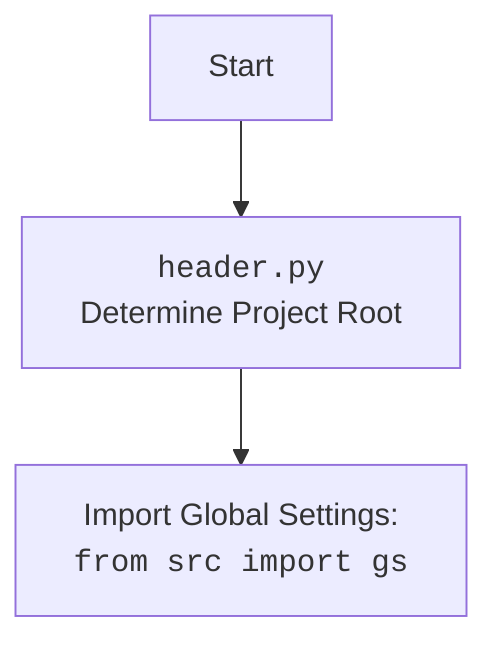

## Анализ кода модуля `playwrid.py`

### 1. <алгоритм>

**Описание рабочего процесса:**

Модуль `playwrid.py` предоставляет кастомную реализацию `PlaywrightCrawler`, называемую `Playwrid`. Он предназначен для автоматизации взаимодействия с браузером Playwright, включая навигацию по URL, извлечение данных и управление браузером с помощью кастомных настроек.

**Блок-схема:**

1.  **Инициализация `Playwrid` (`__init__`)**:
    *   Создается экземпляр класса `Playwrid` с возможностью передачи параметров (user-agent, опции) и всех параметров, поддерживаемых PlaywrightCrawler.
    *   **Пример**: `browser = Playwrid(user_agent='myagent', options=['--disable-gpu'], max_requests=5)` или `browser = Playwrid()`
    *   Загружаются настройки из `playwrid.json`.
    *   Вызывается метод `_set_launch_options` для настройки запуска браузера.
    *   Инициализируется объект `PlaywrightExecutor`.
    *   Инициализируется родительский класс `PlaywrightCrawler` с параметрами и launch_options.

2.  **Настройка параметров запуска (`_set_launch_options`)**:
    *   Метод `_set_launch_options` принимает user-agent и опции и настраивает параметры для запуска браузера.
    *    **Пример**: `launch_options = self._set_launch_options(user_agent='myagent', options=['--disable-gpu'])`
    *   Создает словарь `launch_options` с настройками `headless` и `args`.
    *   Добавляет user-agent, если он предоставлен.
    *  Добавляет пользовательские опции в список `args`.
    *   Возвращает словарь с опциями запуска.

3.  **Запуск браузера и навигация (`start`)**:
    *   Метод `start` запускает браузер Playwright и переходит по URL.
    *   **Пример**: `await browser.start('https://example.com')`
    *   Логирует информацию о начале сканирования.
    *   Вызывает `self.executor.start()` для запуска Playwright.
    *   Вызывает `self.executor.goto(url)` для перехода по URL.
    *   Запускает `PlaywrightCrawler` с помощью `super().run(url)`.
    *   Получает контекст сканирования.
    *   Обрабатывает исключения.

4.  **Получение текущего URL (`current_url`)**:
    *  Свойство `current_url` возвращает текущий URL страницы.
    *   **Пример**: `url = browser.current_url`
    *   Возвращает текущий URL страницы или `None`, если контекст не определен.

5.  **Получение HTML контента страницы (`get_page_content`)**:
    *   Метод `get_page_content` возвращает HTML контент текущей страницы.
    *    **Пример**: `content = browser.get_page_content()`
    *    Возвращает HTML контент или `None`, если контент не доступен.

6.  **Получение содержимого элемента (`get_element_content`)**:
    *   Метод `get_element_content` принимает CSS-селектор, получает элемент и возвращает его `inner_html`.
    *   **Пример**: `content = await browser.get_element_content('h1')`
    *  Использует `self.context.page.locator(selector)` для поиска элемента.
    *   Возвращает `inner_html` контент элемента или `None`.
    *   Обрабатывает исключения.

7.  **Получение значения элемента по XPath (`get_element_value_by_xpath`)**:
    *   Метод `get_element_value_by_xpath` получает значение элемента по XPath.
    *   **Пример**: `title = await browser.get_element_value_by_xpath('//head/title')`
    *   Использует `self.context.page.locator(f'xpath={xpath}')` для поиска элемента.
    *  Возвращает текстовое содержимое элемента или `None`.
    *  Обрабатывает исключения.

8.  **Клик на элемент (`click_element`)**:
    *   Метод `click_element` выполняет клик на элемент, найденный по CSS-селектору.
    *   **Пример**: `await browser.click_element('button')`
    *   Использует `self.context.page.locator(selector)` для поиска элемента.
    *   Вызывает метод `click()` у элемента.
    *   Обрабатывает исключения.

9.  **Выполнение локатора (`execute_locator`)**:
     * Метод `execute_locator` выполняет действия на странице, используя локатор.
     *   **Пример**: `result = await browser.execute_locator(locator)`
     *  Использует метод `self.executor.execute_locator` для обработки локатора.

### 2. <mermaid>

```mermaid
flowchart TD
    Start[Start] --> InitPlaywrid[Initialize Playwrid: <br><code>Playwrid(user_agent, options, **kwargs)</code>]
    InitPlaywrid --> SetLaunchOptions[Set launch options:<br><code>_set_launch_options(user_agent, options)</code>]
     SetLaunchOptions --> CreateLaunchOptions[Create launch options dict, adding user agent and custom options]
     CreateLaunchOptions --> InitPlaywrightCrawler[Init PlaywrightCrawler]
    InitPlaywrightCrawler --> StartPlaywrid[Start Playwrid: <br><code>start(url)</code>]
    StartPlaywrid --> StartExecutor[Start PlaywrightExecutor:<br><code>self.executor.start()</code>]
     StartExecutor --> NavigateToURL[Navigate to URL:<br><code>self.executor.goto(url)</code>]
     NavigateToURL --> RunPlaywrightCrawler[Run PlaywrightCrawler: <br><code>super().run(url)</code>]
       RunPlaywrightCrawler --> GetCrawlingContext[Get crawling context: <code>self.crawling_context</code>]
     GetCrawlingContext --> GetCurrentURL[Get current URL: <br><code>current_url</code>]
        GetCurrentURL --> GetPageContent[Get page content: <br><code>get_page_content()</code>]
           GetPageContent --> GetElementContent[Get element content by CSS selector: <br><code>get_element_content(selector)</code>]
         GetElementContent --> GetElementByXPath[Get element content by Xpath: <br><code>get_element_value_by_xpath(xpath)</code>]
     GetElementByXPath --> ClickElementByCss[Click on element by CSS selector: <br><code>click_element(selector)</code>]
        ClickElementByCss --> ExecuteLocatorCall[Execute locator: <br><code>execute_locator(locator)</code>]
    ExecuteLocatorCall --> End[End]
```



**Объяснение зависимостей `mermaid`:**

*   **`pathlib`**: Используется для работы с путями к файлам.
*   **`asyncio`**: Используется для асинхронных операций.
*   **`crawlee.playwright_crawler`**: Используется для создания веб-сканеров на базе Playwright.
*   **`src`**: Используется для импорта глобальных настроек `gs` и логгера.
*   **`src.logger.logger`**: Используется для логирования.
*   **`src.webdriver.playwright.executor`**: Используется для выполнения действий с элементами на странице.
*   **`src.webdriver.js`**: Используется для выполнения JavaScript на странице.
*  **`src.utils.jjson`**: Используется для загрузки JSON конфигураций.
*  **`re`**: Используется для работы с регулярными выражениями (в методе `execute_event` в `PlaywrightExecutor`, который вызывается через `self.executor`).

### 3. <объяснение>

**Импорты:**

*   `asyncio`: Используется для асинхронного программирования.
*   `pathlib.Path`: Используется для работы с путями к файлам.
*    `typing.Optional`, `typing.List`, `typing.Dict`, `typing.Any`: Используются для аннотации типов.
*   `types.SimpleNamespace`: Используется для создания объектов с атрибутами, доступными через точку.
*   `crawlee.playwright_crawler.PlaywrightCrawler`, `crawlee.playwright_crawler.PlaywrightCrawlingContext`: Используются для создания и управления веб-сканером на базе Playwright.
*   `src`: Используется для импорта глобальных настроек `gs`.
*   `src.webdriver.playwright.executor.PlaywrightExecutor`: Используется для выполнения действий на веб-странице.
*   `src.webdriver.js.JavaScript`: Используется для выполнения JavaScript-кода на странице.
*   `src.utils.jjson.j_loads_ns`: Используется для загрузки JSON-конфигураций.
*   `src.logger.logger`: Используется для логирования.
*  `re`: Используется для работы с регулярными выражениями

**Классы:**

*   `Playwrid(PlaywrightCrawler)`:
    *   **Роль**: Кастомная реализация веб-сканера на основе `PlaywrightCrawler` с дополнительной функциональностью.
    *   **Атрибуты**:
         *   `driver_name` (`str`): Имя драйвера.
         *   `base_path`: (`pathlib.Path`) - Базовый путь для конфигурации.
         *   `config`: (`SimpleNamespace`) - Загруженная конфигурация.
         *   `context`:  Контекст сканирования.
    *   **Методы**:
        *   `__init__`: Инициализация объекта, настройка опций, загрузка конфигурации и т.д..
        *  `_set_launch_options`: Настраивает опции запуска браузера.
        *  `start`: Запускает сканер и переходит по URL.
        *  `current_url`: Возвращает текущий URL страницы.
        *   `get_page_content`: Возвращает HTML контент страницы.
        *  `get_element_content`: Извлекает `inner_html` из элемента по CSS-селектору.
        *   `get_element_value_by_xpath`: Извлекает текст элемента по XPath.
        *  `click_element`: Кликает на элемент по CSS-селектору.
         * `execute_locator`: Выполняет действия, заданные в локаторе.

**Функции:**

*   `__init__(self, user_agent: Optional[str] = None, options: Optional[List[str]] = None, *args, **kwargs)`:
    *   **Аргументы**:
        *   `user_agent`: (`Optional[str]`) - Пользовательский агент.
        *   `options`: (`Optional[List[str]]`) - Список опций для Playwright.
        *   `*args`, `**kwargs`: Дополнительные параметры.
    *  **Назначение**: Инициализирует класс, загружает настройки, устанавливает user-agent и дополнительные опции.
    *    **Возвращает**: `None`.
*  `_set_launch_options(self, user_agent: Optional[str] = None, options: Optional[List[str]] = None) -> Dict[str, Any]`:
    *   **Аргументы**:
        *   `user_agent`: (`Optional[str]`) - Пользовательский агент.
        *   `options`: (`Optional[List[str]]`) - Список опций для Playwright.
    *   **Назначение**: Настраивает опции для запуска браузера Playwright.
    *   **Возвращает**: `dict[str, Any]` -  Словарь параметров для запуска браузера.
*   `start(self, url: str) -> None`:
    *   **Аргументы**:
        *   `url`: (`str`) - URL для перехода.
    *  **Назначение**: Запускает сканер и переходит по URL.
    *  **Возвращает**: `None`.
*  `current_url(self) -> Optional[str]`:
    *    **Аргументы**:
         * `self` (`Playwrid`): Экземпляр класса `Playwrid`.
    *   **Назначение**: Возвращает текущий URL.
    *   **Возвращает**: `Optional[str]` - Текущий URL страницы.
*  `get_page_content(self) -> Optional[str]`:
    *   **Аргументы**:
         *   `self` (`Playwrid`): Экземпляр класса `Playwrid`.
    *   **Назначение**: Возвращает HTML-контент страницы.
    *   **Возвращает**:  `Optional[str]` - HTML-код страницы.
*   `get_element_content(self, selector: str) -> Optional[str]`:
    *   **Аргументы**:
        *    `selector`: (`str`) - CSS-селектор для поиска элемента.
    *   **Назначение**:  Получает содержимое элемента по CSS-селектору.
    *   **Возвращает**: `Optional[str]` - Внутренний HTML контент элемента.
*    `get_element_value_by_xpath(self, xpath: str) -> Optional[str]`:
    *   **Аргументы**:
         *  `xpath`: (`str`) - XPath элемента.
    *   **Назначение**: Возвращает текстовое содержимое элемента по XPath.
    *  **Возвращает**: `Optional[str]` - Текстовое содержимое элемента.
*   `click_element(self, selector: str) -> None`:
    *   **Аргументы**:
        *   `selector`: (`str`) - CSS-селектор элемента.
    *   **Назначение**: Кликает на элемент по CSS-селектору.
    *   **Возвращает**: `None`.
*  `execute_locator(self, locator: dict | SimpleNamespace, message: Optional[str] = None, typing_speed: float = 0) -> str | List[str] | bytes | List[bytes] | bool`:
      *   **Аргументы**:
            *  `locator`: (`dict | SimpleNamespace`) - Локатор элемента.
            * `message`: (`Optional[str]`) - Сообщение.
            *    `typing_speed`: (`float`) - Скорость печати.
      *   **Назначение**: Выполняет действия с веб-элементами на основе локатора, передавая управление в класс `PlaywrightExecutor`.
      *   **Возвращает**: Результат выполнения операции, возвращает значения (атрибут, список атрибутов, словарь атрибутов, элемент, бинарный поток или bool).

**Переменные:**

*   `self.driver_name`: (`str`) - Имя драйвера ("playwrid").
*    `self.base_path`: (`pathlib.Path`) - Путь к директории, где хранятся конфигурационные файлы.
*  `self.config`: (`SimpleNamespace`) - Объект с настройками из `playwrid.json`.
*    `self.context`: Контекст сканирования.
* `launch_options`:  (`Dict[str, Any]`) - словарь с опциями для запуска Playwright.
* `user_agent`:  (`Optional[str]`) - Пользовательский агент.
*    `options`: (`Optional[List[str]]`) - Список опций.
*  `self.executor`: Экземпляр класса `PlaywrightExecutor`.
*  `selector`: (`str`) CSS-селектор для поиска элемента.
* `xpath`: (`str`) Xpath для поиска элемента.

**Потенциальные ошибки и области для улучшения:**

*   Обработка исключений может быть более специфичной.
*   Метод `get_element_content` может возвращать только `inner_html`, можно добавить поддержку других атрибутов.
*   Можно добавить поддержку других типов локаторов.
*    Можно добавить более гибкую настройку таймаутов.
*   Следует добавить валидацию конфигурационного файла.

**Взаимосвязи с другими частями проекта:**

*   Использует `header` для определения корня проекта.
*   Использует глобальные настройки `gs` из пакета `src`.
*   Использует `src.webdriver.playwright.executor` для выполнения действий.
*    Использует `src.webdriver.js` для выполнения JavaScript на странице (не используется, но присутствует в `PlaywrightExecutor`).
*    Использует `src.utils.jjson` для загрузки конфигурационных файлов.
*   Использует `src.logger.logger` для логирования.
*   Модуль является частью веб-драйверного фреймворка и предоставляет конкретную реализацию для Playwright.

Этот анализ предоставляет полное понимание работы модуля `playwrid.py`, его структуры, зависимостей и возможностей.