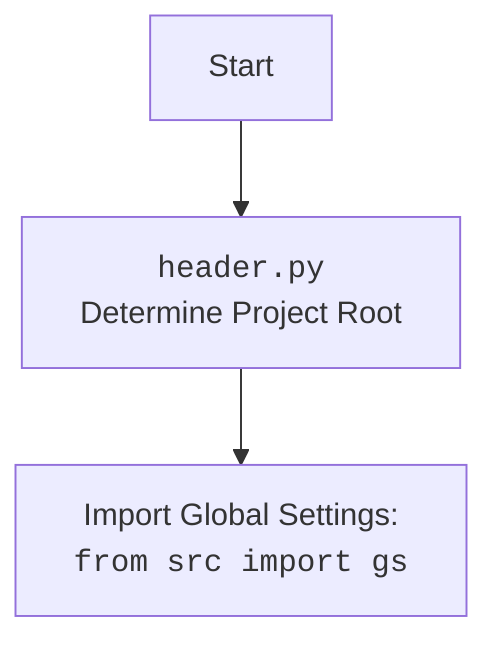

## Анализ модуля Playwright Crawler для автоматизации браузера

### 1. <алгоритм>

**Описание рабочего процесса:**

Этот документ описывает модуль, представляющий кастомную реализацию `PlaywrightCrawler` для автоматизации браузера и сбора данных. Модуль использует библиотеку Playwright и настраивается с помощью файла `playwrid.json`.

**Блок-схема:**

1.  **Инициализация `Playwrid`**:
    *   Создается экземпляр класса `Playwrid` с параметрами, такими как user-agent и опции.
    *   **Пример**: `browser = Playwrid(user_agent='myagent', options=['--disable-gpu'], max_requests=10, headless=True)` или `browser = Playwrid()`
    *  Загружает настройки из файла `playwrid.json`.
    *   Вызывает метод `_set_launch_options` для применения этих настроек к браузеру Playwright.
    *   Инициализирует базовый класс `PlaywrightCrawler` с настроенными параметрами.

2.  **Настройка параметров запуска (`_set_launch_options`)**:
    *   Метод `_set_launch_options` принимает user-agent и список опций.
    *   **Пример**: `launch_options = self._set_launch_options(user_agent='myagent', options=['--disable-gpu'])`
    *   Создает словарь с настройками, устанавливая `headless` режим из конфигурации.
    *   Добавляет пользовательские аргументы из конфигурации или из аргументов инициализации.
    *  Устанавливает пользовательский агент если он передан, или оставляет значение из настроек.
    *   Возвращает словарь с параметрами запуска.

3.  **Запуск сканера и навигация (`start`)**:
    *   Метод `start` запускает Playwright и переходит по URL.
    *   **Пример**: `await browser.start('https://example.com')`
    *  Логирует информацию о начале сканирования.
    *  Запускает `PlaywrightExecutor`.
    *   Переходит по указанному URL с использованием `self.executor.goto(url)`.
    *   Вызывает `super().run(url)` для запуска сканирования Crawlee.
    *   Получает контекст сканирования.
    *   Обрабатывает возникающие исключения.

4.  **Получение текущего URL (`current_url`)**:
    *   Свойство `current_url` возвращает текущий URL страницы.
    *  **Пример**: `url = browser.current_url`
    *   Возвращает URL или `None`, если контекст не определен.

5.  **Получение HTML-контента страницы (`get_page_content`)**:
    *   Метод `get_page_content` возвращает HTML-контент текущей страницы.
    *   **Пример**: `content = browser.get_page_content()`
    *    Возвращает HTML-контент или `None`, если контекст не определен.

6.  **Получение контента элемента (`get_element_content`)**:
    *   Метод `get_element_content` принимает CSS-селектор и возвращает внутренний HTML контент элемента.
    *   **Пример**: `content = await browser.get_element_content('h1')`
    *   Использует `self.context.page.locator(selector)` для поиска элемента.
    *   Возвращает `inner_html` элемента, или `None` если элемент не найден.
    *   Обрабатывает исключения.

7.  **Получение значения элемента по XPath (`get_element_value_by_xpath`)**:
    *   Метод `get_element_value_by_xpath` возвращает текстовое значение элемента, найденного по XPath.
    *   **Пример**: `value = await browser.get_element_value_by_xpath('//h1/text()')`
    *  Использует `self.context.page.locator(f'xpath={xpath}')` для поиска элемента.
    *   Возвращает текст элемента или `None`.
    *   Обрабатывает исключения.

8. **Клик на элемент (`click_element`)**:
    *  Метод `click_element` выполняет клик на элементе, найденном по CSS-селектору.
    *    **Пример**: `await browser.click_element('button')`
    *   Использует `self.context.page.locator(selector)` для поиска элемента.
    *  Выполняет клик на элемент, если он существует.
    *   Логирует ошибки если элемент не найден.

9.  **Выполнение локатора (`execute_locator`)**:
    *    Метод `execute_locator` используется для выполнения действий на странице с использованием локаторов.
    *    **Пример**: `result = await browser.execute_locator(locator)`
    *   Передает управление методу `execute_locator` класса `PlaywrightExecutor`.

### 2. <mermaid>

```mermaid
flowchart TD
    Start[Start] --> InitPlaywrid[Initialize Playwrid: <br><code>Playwrid(user_agent, options, **kwargs)</code>]
    InitPlaywrid --> SetLaunchOptions[Set launch options:<br><code>_set_launch_options(user_agent, options)</code>]
     SetLaunchOptions --> CreateLaunchOptions[Create launch options dict, adding user agent and custom options]
     CreateLaunchOptions --> InitPlaywrightCrawler[Init PlaywrightCrawler]
    InitPlaywrightCrawler --> StartPlaywrid[Start Playwrid: <br><code>start(url)</code>]
    StartPlaywrid --> StartExecutor[Start PlaywrightExecutor:<br><code>self.executor.start()</code>]
     StartExecutor --> NavigateToURL[Navigate to URL:<br><code>self.executor.goto(url)</code>]
     NavigateToURL --> RunPlaywrightCrawler[Run PlaywrightCrawler: <br><code>super().run(url)</code>]
       RunPlaywrightCrawler --> GetCrawlingContext[Get crawling context: <code>self.crawling_context</code>]
     GetCrawlingContext --> GetCurrentURL[Get current URL: <br><code>current_url</code>]
        GetCurrentURL --> GetPageContent[Get page content: <br><code>get_page_content()</code>]
           GetPageContent --> GetElementContent[Get element content by CSS selector: <br><code>get_element_content(selector)</code>]
         GetElementContent --> GetElementByXPath[Get element content by Xpath: <br><code>get_element_value_by_xpath(xpath)</code>]
     GetElementByXPath --> ClickElementByCss[Click on element by CSS selector: <br><code>click_element(selector)</code>]
        ClickElementByCss --> ExecuteLocatorCall[Execute locator: <br><code>execute_locator(locator)</code>]
    ExecuteLocatorCall --> End[End]
```



**Объяснение зависимостей `mermaid`:**

*   **`pathlib`**: Используется для работы с путями к файлам.
*   **`asyncio`**: Используется для асинхронного программирования.
*   **`crawlee.playwright_crawler`**: Используется для создания веб-сканеров на базе Playwright.
*   **`src`**: Используется для импорта глобальных настроек `gs` и логгера.
*   **`src.logger.logger`**: Используется для логирования.
*    **`src.webdriver.playwright.executor`**: Используется для выполнения действий с элементами на странице.
*    **`src.webdriver.js`**: Используется для выполнения JavaScript на странице (через `PlaywrightExecutor`).
*   **`src.utils.jjson`**: Используется для загрузки JSON конфигураций.

### 3. <объяснение>

**Импорты:**

*   `asyncio`: Используется для асинхронного программирования.
*  `pathlib.Path`: Используется для работы с путями к файлам.
*   `typing.Optional`, `typing.List`, `typing.Dict`, `typing.Any`: Используются для аннотации типов.
*   `types.SimpleNamespace`: Используется для создания объектов с произвольными атрибутами.
*    `crawlee.playwright_crawler.PlaywrightCrawler`, `crawlee.playwright_crawler.PlaywrightCrawlingContext`: Используются для управления веб-сканером.
*   `src`: Используется для импорта глобальных настроек `gs`.
*   `src.webdriver.playwright.executor.PlaywrightExecutor`: Используется для выполнения действий на веб-странице.
*   `src.webdriver.js.JavaScript`: Используется для выполнения JavaScript (через `PlaywrightExecutor`).
*   `src.utils.jjson.j_loads_ns`: Используется для загрузки конфигурационных файлов в формате JSON.
*   `src.logger.logger`: Используется для логирования.
*  `re`: Используется для работы с регулярными выражениями

**Классы:**

*   `Playwrid(PlaywrightCrawler)`:
    *   **Роль**: Реализует кастомный веб-сканер на основе `PlaywrightCrawler` с дополнительными методами для взаимодействия со страницей.
    *   **Атрибуты**:
        *   `driver_name` (`str`): Имя драйвера, всегда 'playwrid'.
        *   `base_path` (`pathlib.Path`): Путь к конфигурационным файлам.
        *   `config` (`SimpleNamespace`): Объект конфигурации, загруженный из `playwrid.json`.
        *   `context`:  Контекст сканирования `PlaywrightCrawlingContext`.
        *   `executor`: Экземпляр `PlaywrightExecutor`.
    *   **Методы**:
        *   `__init__`: Инициализирует сканер, загружает настройки, применяет опции.
        *   `_set_launch_options`: Настраивает параметры для запуска браузера.
        *   `start`: Запускает сканер и переходит по URL.
        *   `current_url`: Возвращает текущий URL страницы.
        *   `get_page_content`: Возвращает HTML-контент текущей страницы.
        *   `get_element_content`: Возвращает внутренний HTML-контент элемента по CSS-селектору.
        *   `get_element_value_by_xpath`: Возвращает текст элемента по XPath.
         *   `click_element`: Кликает на элемент, найденный по CSS-селектору.
        *  `execute_locator`: Выполняет действия с веб-элементами на основе локатора через `PlaywrightExecutor`.

**Функции:**

*   `__init__(...)`:
    *    **Аргументы**:
         *    `user_agent`:  (`Optional[str]`) - Пользовательский агент.
         *    `options`: (`Optional[List[str]]`) - Список опций.
        *  `*args`, `**kwargs`: Дополнительные аргументы.
    *   **Назначение**: Инициализирует объект `Playwrid`, применяет кастомные настройки.
    *    **Возвращает**: `None`.
*   `_set_launch_options(self, user_agent: Optional[str] = None, options: Optional[List[str]] = None) -> Dict[str, Any]`:
     *   **Аргументы**:
        *  `user_agent`: (`Optional[str]`) - Пользовательский агент.
         *  `options`: (`Optional[List[str]]`) - Список опций.
     *   **Назначение**: Настраивает опции запуска браузера, объединяет пользовательские настройки и настройки из конфигурационного файла.
     *   **Возвращает**: Словарь с опциями запуска браузера.
*    `start(self, url: str) -> None`:
    *    **Аргументы**:
         *  `url`: (`str`) - URL для перехода.
    *    **Назначение**: Запускает браузер и переходит по указанному URL, запуская процесс сканирования.
    *    **Возвращает**: `None`.
*  `current_url(self) -> Optional[str]`:
    *   **Назначение**: Возвращает текущий URL страницы.
    *   **Возвращает**: `Optional[str]` - Текущий URL.
*   `get_page_content(self) -> Optional[str]`:
    *   **Назначение**: Возвращает HTML-контент текущей страницы.
    *   **Возвращает**: `Optional[str]` - HTML-код страницы.
*   `get_element_content(self, selector: str) -> Optional[str]`:
    *   **Аргументы**:
        *   `selector`: (`str`) - CSS-селектор для поиска элемента.
    *   **Назначение**: Получает `inner_html` контент элемента по CSS-селектору.
    *   **Возвращает**:  `Optional[str]` - Содержимое элемента, если элемент найден.
*    `get_element_value_by_xpath(self, xpath: str) -> Optional[str]`:
    *   **Аргументы**:
        *   `xpath`: (`str`) - XPath элемента.
    *   **Назначение**: Получает текстовое значение элемента по XPath.
    *   **Возвращает**: `Optional[str]` - Текстовое содержимое элемента, если элемент найден.
*   `click_element(self, selector: str) -> None`:
     *   **Аргументы**:
        *   `selector`: (`str`) - CSS-селектор для поиска элемента.
     *  **Назначение**: Выполняет клик на элемент.
     *    **Возвращает**: `None`.
*   `execute_locator(self, locator: dict | SimpleNamespace, message: Optional[str] = None, typing_speed: float = 0) -> str | List[str] | bytes | List[bytes] | bool`:
    *   **Аргументы**:
         *   `locator`:  (`dict | SimpleNamespace`) - Локатор элемента.
        *   `message`:  (`Optional[str]`) - Сообщение.
        *   `typing_speed`: (`float`) - Скорость печати.
     *   **Назначение**:  Выполняет действия на веб-элементе на основе локатора, использует методы `PlaywrightExecutor`.
    *    **Возвращает**: Результат выполнения операции, возвращает значения (атрибут, список атрибутов, словарь атрибутов, элемент, бинарный поток или bool).

**Переменные:**

*   `self.driver_name`: (`str`) - Имя драйвера ('playwrid').
*   `self.base_path`: (`pathlib.Path`) - Путь к директории, содержащей конфигурацию `playwrid.json`.
*   `self.config`: (`SimpleNamespace`) -  Объект с настройками из `playwrid.json`.
*   `launch_options`: (`Dict[str, Any]`) - Параметры запуска браузера.
*   `user_agent`: (`Optional[str]`) - User-Agent.
*   `options`: (`Optional[List[str]]`) - Список опций запуска.
*  `self.executor`: (`PlaywrightExecutor`) - Экземпляр класса `PlaywrightExecutor`.
*   `selector`: (`str`) - CSS-селектор для поиска элементов.
*  `xpath`: (`str`) -  XPath для поиска элемента.
* `message`: (`Optional[str]`) сообщение.
*  `typing_speed`: (`float`) Скорость ввода текста.

**Потенциальные ошибки и области для улучшения:**

*   В коде отсутствует обработка ошибок в `request_handler`.
*   Можно добавить поддержку прокси, user-agent и viewport из конфигурационного файла.
*   Можно добавить проверку типа входных данных.
*   Можно добавить обработку таймаутов.
*    В методе `start` можно добавить логику повторных попыток при ошибках.
*   Можно добавить поддержку большего количества событий и действий над элементами.
*  Следует более гибко настраивать параметры запуска Playwright.
*  Можно добавить возможность выбора различных форматов вывода.

**Взаимосвязи с другими частями проекта:**

*   Модуль импортирует `header` для определения корня проекта.
*   Модуль использует глобальные настройки `gs` из пакета `src`.
*    Модуль использует класс `PlaywrightExecutor` из того же пакета для выполнения действий.
*   Модуль использует класс `JavaScript` (через `PlaywrightExecutor`).
*   Модуль использует `src.utils.jjson` для загрузки настроек.
*    Модуль использует `src.logger.logger` для логирования.
*    Модуль является частью веб-драйверного фреймворка, предоставляя кастомную реализацию для Playwright.

Этот анализ предоставляет подробное описание модуля `playwrid.py`, его структуры, зависимостей и возможностей.