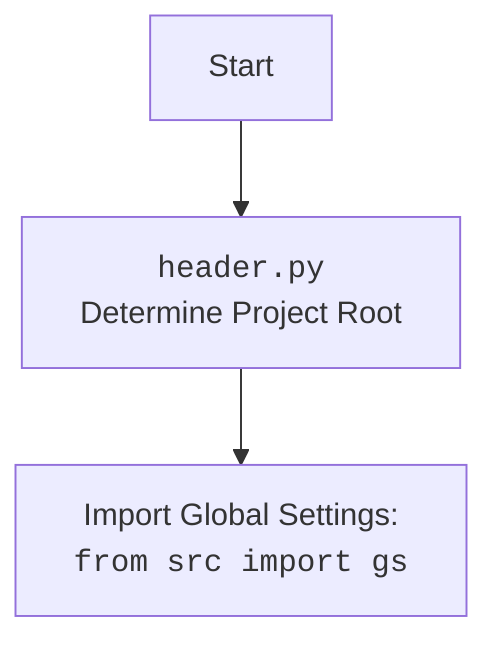

## Анализ кода модуля `executor.py` и `driver.py`

### 1. <алгоритм>

**Описание рабочего процесса:**

Этот ответ объединяет анализ двух модулей: `executor.py` и `driver.py`.

**Модуль `executor.py`**:

Предоставляет фреймворк для взаимодействия с веб-элементами через WebDriver, выполняя действия на основе конфигураций, называемых локаторами.

**Модуль `driver.py`**:

Предоставляет класс `Driver` для управления веб-драйверами Selenium, включая навигацию, взаимодействие с элементами, управление куками и другие общие действия.

**Блок-схема:**

1.  **Инициализация `Driver`**:
    *   Создается экземпляр класса `Driver` с указанием класса веб-драйвера (например, `Chrome`).
    *   **Пример**: `driver = Driver(Chrome, executable_path='/path/to/chromedriver')`
    *   Проверяется, является ли переданный класс валидным классом WebDriver.
    *   Создается экземпляр веб-драйвера.

2.  **Инициализация `ExecuteLocator`**:
    *   Создается экземпляр класса `ExecuteLocator` с передачей экземпляра WebDriver.
    *   **Пример**: `executor = ExecuteLocator(driver=driver)`
    *   Инициализируется `ActionChains`, если драйвер передан.

3.  **Навигация (`Driver.get_url`)**:
    *   Метод `get_url` переходит по указанному URL.
    *   **Пример**: `driver.get_url('https://example.com')`
    *   Сохраняет предыдущий URL, загружает новую страницу.
    *   Ждет завершения загрузки страницы и сохраняет куки.
    *   Обрабатывает исключения.

4. **Прокрутка страницы (`Driver.scroll`)**:
     * Метод `scroll` прокручивает страницу в заданном направлении.
     * **Пример:** `driver.scroll(scrolls=2, direction='down')`
     * Использует JavaScript для прокрутки.
     * Выполняет задержку между прокрутками.
     * Обрабатывает исключения.

5.  **Выполнение локатора (`ExecuteLocator.execute_locator`)**:
    *   Метод `execute_locator` принимает локатор (словарь или `SimpleNamespace`).
    *   **Пример**: `result = await executor.execute_locator(locator)`
    *   Преобразует локатор в `SimpleNamespace`, если это словарь.
    *    Определяет действия в зависимости от наличия полей `event`, `attribute` или `mandatory`.
    *   Вызывает соответствующие методы для получения элементов, атрибутов или выполнения событий.

6.  **Поиск элемента (`ExecuteLocator.get_webelement_by_locator`)**:
    *   Метод `get_webelement_by_locator` находит элементы на странице по локатору.
    *   **Пример**: `element = await executor.get_webelement_by_locator(locator)`
    *   Использует `by` (например, `XPATH`, `CSS_SELECTOR`) и `selector` для поиска.
    *    Возвращает элемент или список элементов.
    *  Использует ожидание, если `timeout` не равен нулю.

7.  **Получение атрибута (`ExecuteLocator.get_attribute_by_locator`)**:
    *   Метод `get_attribute_by_locator` извлекает значения атрибутов элемента(-ов).
    *   **Пример**: `attribute = await executor.get_attribute_by_locator(locator, attribute='src')`
    *   Получает элемент с помощью `get_webelement_by_locator`.
    *   Извлекает запрошенный атрибут элемента(-ов).

8.  **Скриншот элемента (`ExecuteLocator.get_webelement_as_screenshot`)**:
    *   Метод `get_webelement_as_screenshot` делает скриншот веб-элемента.
    *   **Пример**: `screenshot = await executor.get_webelement_as_screenshot(locator)`
    *   Получает элемент с помощью `get_webelement_by_locator`.
    *   Возвращает скриншот элемента в формате `png`.

9.  **Отправка сообщения (`ExecuteLocator.send_message`)**:
    *   Метод `send_message` отправляет текст в веб-элемент.
    *   **Пример**: `await executor.send_message(locator, 'hello', typing_speed=0.1)`
    *   Получает элемент с помощью `get_webelement_by_locator`.
    *    Отправляет текст, поддерживая скорость ввода и замены символов.

10. **Выполнение события (`ExecuteLocator.execute_event`)**:
    *   Метод `execute_event` выполняет события над веб-элементом.
    *   **Пример**: `await executor.execute_event(locator, event='click()')`
    *  Получает элемент с помощью  `get_webelement_by_locator`.
    *    Выполняет события, указанные в `locator.event`.
    *   Поддерживаются `click()`, `pause()`, `upload_media()`, `screenshot()`, `clear()`, `send_keys()`, `type()`.

### 2. <mermaid>

```mermaid
flowchart TD
    Start[Start] --> InitDriver[Initialize Driver: <br><code>Driver(webdriver_cls, *args, **kwargs)</code>]
    InitDriver --> DriverGetURL[Navigate to URL:<br><code>get_url(url)</code>]
    DriverGetURL --> SavePreviousURL[Save current URL]
     SavePreviousURL --> LoadNewURL[Load new URL]
     LoadNewURL --> WaitPageLoad[Wait for page load]
     WaitPageLoad --> SaveCookies[Save Cookies]
     SaveCookies --> DriverScroll[Scroll the page: <br><code>scroll(scrolls, direction, frame_size, delay)</code>]
     DriverScroll --> JSscroll[Execute JavaScript to scroll page]
    JSscroll -->  InitExecutor[Initialize ExecuteLocator: <br><code>ExecuteLocator(driver)</code>]
    InitExecutor --> ExecuteLocatorCall[Execute Locator: <br><code>execute_locator(locator, message, typing_speed, continue_on_error)</code>]
    ExecuteLocatorCall --> ParseLocator[Parse Locator]
    ParseLocator --> CheckLocatorType{Is locator SimpleNamespace?}
     CheckLocatorType -- Yes --> UseLocator[Use locator as is]
     CheckLocatorType -- No --> ConvertToSimpleNamespace[Convert to SimpleNamespace]
     ConvertToSimpleNamespace --> UseLocator
     UseLocator --> CheckLocatorAttributes{Check if locator has event, attribute, or mandatory}
     CheckLocatorAttributes -- Yes --> ExecuteActions[Execute Actions]
     CheckLocatorAttributes -- No --> ReturnNone[Return None]
     ExecuteActions --> EvaluateAttribute[Evaluate Attribute]
     EvaluateAttribute --> CheckEvent{Does locator has event?}
     CheckEvent -- Yes --> ExecuteEvent[Execute event:<br><code>execute_event(locator)</code>]
       ExecuteEvent --> ReturnEventResult[Return result of event]
       CheckEvent -- No --> CheckAttribute{Does locator has attribute?}
     CheckAttribute -- Yes --> GetAttribute[Get attribute:<br><code>get_attribute_by_locator(locator)</code>]
     GetAttribute --> ReturnAttributeResult[Return result of attribute]
       CheckAttribute -- No --> GetWebElement[Get web element:<br><code>get_webelement_by_locator(locator)</code>]
     GetWebElement --> ReturnWebElementResult[Return result of web element]
      ReturnEventResult --> ReturnFinalResult[Return final result of `_parse_locator`]
    ReturnAttributeResult --> ReturnFinalResult
    ReturnWebElementResult --> ReturnFinalResult
    ReturnFinalResult --> End[End]
```



**Объяснение зависимостей `mermaid`:**

*   **`selenium`**: Используется для управления веб-драйверами.
*   **`time`**: Используется для задержек в `Driver.wait`.
*   **`copy`**: Используется для копирования URL в `Driver.get_url`.
*   **`pickle`**: Используется для сохранения куки в `Driver._save_cookies_localy`.
*   **`re`**: Используется для парсинга URL и др.
*    **`pathlib`**: Используется для работы с путями к файлам.
*   **`asyncio`**: Используется для асинхронных операций в `ExecuteLocator`.
*   **`types`**: Используется для создания `SimpleNamespace` в `ExecuteLocator`.
*    **`header`**: Используется для определения корня проекта.
*   **`src`**: Используется для импорта глобальных настроек `gs`, логгера.
*  **`src.logger.logger`**: Используется для логирования.

### 3. <объяснение>

**Импорты:**

**`driver.py`:**
*   `selenium.webdriver`: Основной модуль для управления веб-драйверами.
*   `selenium.webdriver.common.by.By`: Используется для поиска элементов по селекторам.
*   `selenium.common.exceptions`: Используется для обработки исключений, связанных с Selenium.
*   `time`: Используется для задержек.
*   `copy`: Используется для создания копий объектов.
*   `pickle`: Используется для сериализации объектов (куки).
*   `pathlib`: Используется для работы с путями к файлам.
*    `re`: Используется для работы с регулярными выражениями.
*   `typing`: Используется для аннотаций типов.
*   `src`: Используется для импорта глобальных настроек `gs`.
*    `src.logger.logger`: Используется для логирования.

**`executor.py`:**
*   `asyncio`: Используется для асинхронного программирования.
*   `re`: Используется для работы с регулярными выражениями.
*   `types`: Используется для создания динамических пространств имен.
*    `pathlib`: Используется для работы с путями к файлам.
*   `typing`: Используется для аннотаций типов.
*   `selenium.webdriver.common.keys.Keys`: Используется для отправки специальных клавиш.
*   `selenium.webdriver.remote.webelement.WebElement`: Используется для представления веб-элементов.
*   `selenium.webdriver.support.ui.WebDriverWait`: Используется для ожидания загрузки страницы.
*   `selenium.webdriver.support.expected_conditions as EC`: Используется для задания условий ожидания.
*   `selenium.webdriver.common.action_chains.ActionChains`: Используется для выполнения сложных действий.
*    `selenium.common.exceptions`: Набор исключений, связанных с Selenium.
*   `src`: Используется для импорта глобальных настроек `gs`.
*   `src.utils.printer`: Используется для форматированного вывода.
*   `src.logger.logger`: Используется для логирования.
*   `src.logger.exceptions`:  Используется для кастомных исключений.

**Классы:**

**`driver.py`:**
*   `Driver`: Предоставляет интерфейс для управления веб-драйверами.
    *   **Атрибуты:**
        *   `driver`: Экземпляр веб-драйвера.
        *   `previous_url`: Предыдущий URL.
        *   `html_content`: HTML контент страницы.
    *   **Методы:**
        *   `__init__`: Инициализирует класс, создавая экземпляр веб-драйвера.
        *   `get_url`: Загружает URL.
        *  `scroll`: Прокрутка страницы.
        *   `locale`: Определение языка страницы.
        *   `_save_cookies_localy`: Сохранение куки.
        *   `page_refresh`: Обновление страницы.
        * `window_focus`: Фокусировка окна.
        *   `wait`: Ожидание.

**`executor.py`:**
*   `ExecuteLocator`: Выполняет действия над элементами на основе локаторов.
    *   **Атрибуты:**
        *   `driver`: Экземпляр веб-драйвера.
        *   `actions`: `ActionChains` для выполнения действий.
        *   `by_mapping`: Словарь типов локаторов.
        *    `mode`: Режим работы.
    *   **Методы:**
        *   `__init__`: Инициализирует класс.
        *   `execute_locator`: Выполняет действия по локатору.
        *   `get_webelement_by_locator`: Получает элемент по локатору.
        *   `get_attribute_by_locator`: Извлекает атрибут элемента.
        *  `get_webelement_as_screenshot`: Делает скриншот элемента.
        *   `send_message`: Отправляет текст в элемент.
        *    `evaluate_locator`: Оценивает атрибут локатора.
        *   `_evaluate`: Оценивает атрибут.

**Функции:**

**`driver.py`:**
*   `carousel`: Вспомогательная функция для `scroll`, реализующая прокрутку.

**`executor.py`:**
*   `_parse_locator`: Асинхронная функция для обработки локатора.
*   `_evaluate`: Асинхронная функция для оценки атрибута.
*  `_parse_dict_string`: Парсит строку в словарь
* `_get_attributes_from_dict`: Извлекает атрибуты из элемента.
*  `_parse_elements_list`: Фильтрует список элементов.

**Переменные:**

*   `driver`: Экземпляр WebDriver.
*   `locator`: Локатор веб-элемента.
*   `attribute`: Атрибут элемента.
*   `element`: Веб-элемент.
*    `url`: URL для навигации.
*  `scrolls`, `frame_size`, `direction`, `delay`: Параметры для прокрутки.
*  `message`: Сообщение для отправки.
*  `user_agent`: User agent для драйвера.

**Потенциальные ошибки и области для улучшения:**

**`driver.py`:**
*   Обработка исключений может быть более точной.
*   Метод `_save_cookies_localy` закомментирован.
*   Ожидание загрузки страницы через `ready_state` может быть ненадежным.
*   Отсутствует явная проверка на наличие элемента перед обращением к его атрибуту.

**`executor.py`:**
*   Обработка ошибок может быть более специфичной.
*  В методе `_evaluate` отсутствует обработка ошибок.
*  `get_webelement_by_locator` можно улучшить с добавлением явных ожиданий.
*  При работе с несколькими элементами можно добавить возможность выполнять действия последовательно.
*   Можно добавить поддержку для загрузки параметров локаторов из внешних источников.

**Взаимосвязи с другими частями проекта:**

*   Оба модуля (`driver.py` и `executor.py`) импортируют `header` для определения корня проекта и `src` для доступа к глобальным настройкам `gs`.
*   `driver.py` используется для управления веб-драйвером, а `executor.py` для выполнения действий с элементами, основываясь на локаторах.
*   Модули используют `src.logger.logger` для логирования.
*   Модули являются частью веб-драйверного фреймворка, предоставляя основные строительные блоки для автоматизации веб-задач.
*  `executor.py` использует `driver.py` для доступа к веб-драйверу.

Этот анализ предоставляет полное представление о функциональности, структуре и взаимодействиях модулей `executor.py` и `driver.py`.