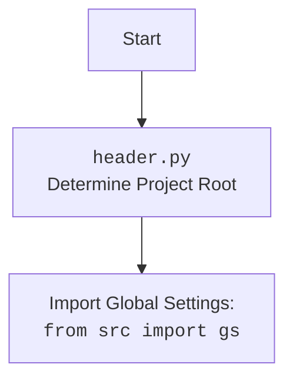

## Анализ кода модулей `executor.py`, `driver.py` и `locator.py`

### 1. <алгоритм>

**Описание рабочего процесса:**

Этот ответ объединяет анализ трех модулей: `executor.py`, `driver.py` и `locator.py`.

**Модуль `executor.py`:**

Предоставляет класс `ExecuteLocator` для выполнения действий над веб-элементами, основываясь на данных локаторов.

**Модуль `driver.py`:**

Предоставляет класс `Driver` для управления веб-драйверами, добавляя общие функции для навигации, взаимодействия с элементами и управления браузером.

**Модуль `locator.py`:**

Описывает формат и примеры локаторов, которые используются для взаимодействия с веб-элементами.

**Блок-схема:**

1.  **Инициализация `Driver`**:
    *   Создается экземпляр класса `Driver`, которому передается класс веб-драйвера (например, `Chrome`).
    *   **Пример**: `driver = Driver(Chrome, executable_path='/path/to/chromedriver')`
    *   Проверяется валидность переданного класса.
    *   Создается экземпляр веб-драйвера.

2.  **Инициализация `ExecuteLocator`**:
    *   Создается экземпляр класса `ExecuteLocator`, которому передается экземпляр веб-драйвера.
    *   **Пример**: `executor = ExecuteLocator(driver=driver)`
    *   Инициализируется объект `ActionChains`.

3.  **Навигация (`Driver.get_url`)**:
    *   Метод `get_url` в классе `Driver` используется для перехода по URL.
    *   **Пример**: `driver.get_url('https://example.com')`
    *   Сохраняет предыдущий URL, загружает новую страницу.
    *   Ожидает полной загрузки страницы и сохраняет cookies.

4.  **Прокрутка страницы (`Driver.scroll`)**:
    *   Метод `scroll` используется для прокрутки страницы.
    *   **Пример**: `driver.scroll(scrolls=2, direction='down')`
    *   Использует JavaScript для прокрутки страницы.
    *    Выполняет задержку между прокрутками.

5.  **Выполнение локатора (`ExecuteLocator.execute_locator`)**:
    *   Метод `execute_locator` в классе `ExecuteLocator` принимает локатор (словарь или `SimpleNamespace`).
    *   **Пример**: `result = await executor.execute_locator(locator)`
    *   Локатор преобразуется в `SimpleNamespace`, если он словарь.
    *    Вызывает `evaluate_locator` для обработки атрибута.
    *   Если у локатора есть событие, вызывается `execute_event`.
    *   Если есть атрибут, вызывается `get_attribute_by_locator`.
    *   Если нет ни события, ни атрибута, вызывается `get_webelement_by_locator`.

6.  **Поиск элемента (`ExecuteLocator.get_webelement_by_locator`)**:
    *   Метод `get_webelement_by_locator` ищет веб-элементы по локатору.
    *   **Пример**: `element = await executor.get_webelement_by_locator(locator)`
    *   Использует атрибуты `by` (например, `XPATH`, `CSS_SELECTOR`) и `selector` из локатора.
    *   Возвращает элемент или список элементов.
    *   Использует явные ожидания, если указан `timeout`.

7.  **Получение атрибута (`ExecuteLocator.get_attribute_by_locator`)**:
    *   Метод `get_attribute_by_locator` извлекает атрибуты элемента(-ов).
    *   **Пример**: `attribute = await executor.get_attribute_by_locator(locator, attribute='href')`
    *   Использует `get_webelement_by_locator` для поиска элемента(-ов).
    *   Извлекает значение атрибута.

8.  **Получение скриншота (`ExecuteLocator.get_webelement_as_screenshot`)**:
    *   Метод `get_webelement_as_screenshot` делает скриншот элемента.
    *   **Пример**: `screenshot = await executor.get_webelement_as_screenshot(locator)`
    *   Использует `get_webelement_by_locator` для поиска элемента.
    *   Возвращает скриншот в виде `png`.

9. **Отправка сообщения (`ExecuteLocator.send_message`)**:
    *   Метод `send_message` используется для отправки текста в веб-элемент.
    *    **Пример**: `await executor.send_message(locator, "test message")`
    *    Получает элемент с помощью `get_webelement_by_locator`.
    *   Отправляет сообщение, поддерживая задержку ввода и замены символов.

10. **Выполнение события (`ExecuteLocator.execute_event`)**:
     *   Метод `execute_event` используется для выполнения событий над элементом.
     *    **Пример**: `await executor.execute_event(locator, event='click()')`
     *   Получает элемент с помощью `get_webelement_by_locator`.
     *  Выполняет событие, указанное в локаторе (`click()`, `pause()`, `upload_media()`, `screenshot()`, `clear()`, `send_keys()`, `type()`).

11. **Примеры локаторов (`locator.py`)**:
    *   `close_banner`: Локатор для закрытия баннера (клик по кнопке).
    *   `id_manufacturer`: Локатор для возврата значения атрибута (не ищет элемент).
    *   `additional_images_urls`: Локатор для извлечения атрибутов `src` из списка элементов.
    *   `default_image_url`: Локатор для получения скриншота элемента.
    *   `id_supplier`: Локатор для извлечения текста элемента.

### 2. <mermaid>

```mermaid
flowchart TD
    Start[Start] --> InitDriver[Initialize Driver: <br><code>Driver(webdriver_cls, *args, **kwargs)</code>]
    InitDriver --> DriverGetURL[Navigate to URL:<br><code>get_url(url)</code>]
    DriverGetURL --> SavePreviousURL[Save current URL]
    SavePreviousURL --> LoadNewURL[Load new URL]
    LoadNewURL --> WaitPageLoad[Wait for page load]
    WaitPageLoad --> SaveCookies[Save Cookies]
    SaveCookies --> DriverScroll[Scroll the page: <br><code>scroll(scrolls, direction, frame_size, delay)</code>]
    DriverScroll --> JSscroll[Execute JavaScript to scroll page]
    JSscroll -->  InitExecutor[Initialize ExecuteLocator: <br><code>ExecuteLocator(driver)</code>]
    InitExecutor --> ExecuteLocatorCall[Execute Locator: <br><code>execute_locator(locator, message, typing_speed, continue_on_error)</code>]
    ExecuteLocatorCall --> ParseLocator[Parse Locator]
    ParseLocator --> CheckLocatorType{Is locator SimpleNamespace?}
    CheckLocatorType -- Yes --> UseLocator[Use locator as is]
    CheckLocatorType -- No --> ConvertToSimpleNamespace[Convert to SimpleNamespace]
    ConvertToSimpleNamespace --> UseLocator
    UseLocator --> CheckLocatorAttributes{Check if locator has event, attribute, or mandatory}
    CheckLocatorAttributes -- Yes --> ExecuteActions[Execute Actions]
    CheckLocatorAttributes -- No --> ReturnNone[Return None]
    ExecuteActions --> EvaluateAttribute[Evaluate Attribute]
    EvaluateAttribute --> CheckEvent{Does locator has event?}
    CheckEvent -- Yes --> ExecuteEvent[Execute event:<br><code>execute_event(locator)</code>]
    ExecuteEvent --> ReturnEventResult[Return result of event]
    CheckEvent -- No --> CheckAttribute{Does locator has attribute?}
    CheckAttribute -- Yes --> GetAttribute[Get attribute:<br><code>get_attribute_by_locator(locator)</code>]
    GetAttribute --> ReturnAttributeResult[Return result of attribute]
    CheckAttribute -- No --> GetWebElement[Get web element:<br><code>get_webelement_by_locator(locator)</code>]
    GetWebElement --> ReturnWebElementResult[Return result of web element]
    ReturnEventResult --> ReturnFinalResult[Return final result of `_parse_locator`]
    ReturnAttributeResult --> ReturnFinalResult
    ReturnWebElementResult --> ReturnFinalResult
    ReturnFinalResult --> End[End]
```



**Объяснение зависимостей `mermaid`:**

*   **`selenium`**: Используется для управления веб-браузерами через WebDriver.
*   **`time`**: Используется для реализации задержек в `Driver.wait`.
*   **`copy`**: Используется для копирования URL в методе `Driver.get_url`.
*   **`pickle`**: Используется для сохранения куки в методе `Driver._save_cookies_localy`.
*  **`re`**: Используется для работы с регулярными выражениями.
*  **`pathlib`**: Используется для работы с путями к файлам.
*   **`asyncio`**: Используется для асинхронных операций в `ExecuteLocator`.
*   **`types`**: Используется для создания `SimpleNamespace` объектов в `ExecuteLocator`.
*  **`src`**: Используется для импорта глобальных настроек `gs`, логирования.
*   **`src.logger.logger`**: Используется для логирования.
*  **`header`**: Используется для определения корня проекта.

### 3. <объяснение>

**Импорты:**

**`driver.py`**:
*   `selenium.webdriver`: Базовый модуль для управления веб-драйверами.
*   `selenium.webdriver.common.by.By`: Используется для выбора элементов на странице по селекторам.
*   `selenium.common.exceptions`: Содержит исключения, специфичные для Selenium.
*   `time`: Используется для управления временем (задержки).
*   `copy`: Используется для копирования объектов.
*   `pickle`: Используется для сериализации и десериализации объектов.
*   `pathlib`: Используется для работы с путями к файлам.
*   `re`: Используется для работы с регулярными выражениями.
*   `typing`: Используется для аннотации типов.
*  `src.logger.logger`: Используется для логирования.
*   `src import gs`: Используется для импорта глобальных настроек.

**`executor.py`**:
*   `asyncio`: Используется для асинхронного программирования.
*   `re`: Используется для работы с регулярными выражениями.
*    `types`: Используется для создания простых пространств имен `SimpleNamespace`.
*   `typing`: Используется для аннотаций типов.
*   `pathlib`: Используется для работы с путями к файлам.
*   `selenium.webdriver.common.keys.Keys`: Используется для отправки специальных клавиш.
*   `selenium.webdriver.remote.webelement.WebElement`: Используется для представления веб-элементов.
*   `selenium.webdriver.support.ui.WebDriverWait`: Используется для ожидания появления элементов.
*   `selenium.webdriver.support.expected_conditions as EC`: Используется для задания условий ожидания.
*   `selenium.webdriver.common.action_chains.ActionChains`: Используется для выполнения сложных действий.
*    `selenium.common.exceptions`: Содержит исключения, специфичные для Selenium.
*   `src.utils.printer`: Используется для форматированного вывода.
*  `src.logger.logger`: Используется для логирования.
*   `src.logger.exceptions`: Используется для кастомных исключений.
*   `src import gs`: Используется для импорта глобальных настроек.

**Классы:**

**`driver.py`**:
*   `Driver`: Класс, который оборачивает веб-драйвер, предоставляя более удобный интерфейс для управления браузером.
    *   **Атрибуты:**
        *   `driver`: Экземпляр веб-драйвера.
        *   `previous_url`: Предыдущий URL.
        *   `html_content`: HTML-содержимое текущей страницы.
    *   **Методы:**
        *    `__init__`: Конструктор класса, инициализирует веб-драйвер.
        *    `get_url`: Переходит по указанному URL.
        *    `scroll`: Прокручивает страницу.
        *    `locale`: Пытается определить язык страницы.
        *    `_save_cookies_localy`: Сохраняет куки в файл.
        *    `page_refresh`: Обновляет страницу.
        *   `window_focus`: Устанавливает фокус на окно браузера.
        *    `wait`: Делает задержку на заданное количество секунд.

**`executor.py`**:
*   `ExecuteLocator`: Класс, который выполняет действия над веб-элементами, основываясь на локаторах.
    *   **Атрибуты:**
        *   `driver`: Экземпляр веб-драйвера.
        *   `actions`: `ActionChains` для выполнения сложных действий.
        *   `by_mapping`: Словарь соответствия типов локаторов.
        *   `mode`: Режим работы.
    *   **Методы:**
        *   `__init__`: Конструктор класса, инициализирует драйвер и `ActionChains`.
        *   `execute_locator`: Выполняет действия по локатору.
        *   `get_webelement_by_locator`: Получает веб-элемент(-ы) по локатору.
        *   `get_attribute_by_locator`: Получает значение атрибута элемента.
        *   `get_webelement_as_screenshot`: Делает скриншот элемента.
        *   `send_message`: Отправляет сообщение в элемент.
         *   `evaluate_locator`: Оценивает атрибуты локатора.
         *   `_evaluate`: Вспомогательный метод для `evaluate_locator`.

**`locator.py`**:
*  Представляет собой описание локаторов в формате JSON (не класс).

**Функции:**

**`driver.py`**:
*   `carousel`: Вспомогательная функция для `scroll`, выполняющая прокрутку.

**`executor.py`**:
*    `_parse_locator`: Внутренняя асинхронная функция для разбора локатора.
*    `_evaluate`: Асинхронная функция для обработки атрибута.
*   `_get_element_attribute`: Вспомогательный метод для получения атрибута элемента.
*    `_parse_dict_string`: Вспомогательный метод для парсинга строки в словарь.
*   `_get_attributes_from_dict`: Вспомогательный метод для получения атрибутов из элемента.
*   `_parse_elements_list`: Вспомогательный метод для обработки списка элементов.

**Переменные:**

*   `driver`: Экземпляр веб-драйвера.
*   `locator`: Локатор элемента.
*    `attribute`: Атрибут элемента.
*   `element`: Веб-элемент.
*  `url`: URL страницы для навигации.
*   `scrolls`, `frame_size`, `direction`, `delay`: параметры для прокрутки страницы.
*  `message`: Сообщение для отправки в элемент.
*   `user_agent`: Кастомный User-Agent для драйвера.
*   `timeout`: Время ожидания.
*   `timeout_for_event`: Условие ожидания.
*  `typing_speed`: Скорость печати.
*   `webelement`: Веб-элемент, переданный в функцию.

**Потенциальные ошибки и области для улучшения:**

**`driver.py`:**
*   В методе `_save_cookies_localy` нет фактического сохранения куки (заглушка).
*   Метод `locale` может не всегда корректно определять язык страницы.
*   Ожидание загрузки страницы через проверку `ready_state` не надежно.
*   Нет явной проверки на наличие элемента перед обращением к его атрибуту.

**`executor.py`:**
*   Обработка ошибок может быть более детальной.
*    Метод `_evaluate` не обрабатывает ошибок.
*  В `send_message` не обрабатывается ситуации с несколькими элементами.
*   Метод `get_webelement_by_locator` можно оптимизировать.
*   Метод `_parse_elements_list` можно упростить.

**`locator.py`:**
*   Отсутствует валидация локаторов.
*   Локаторы не описывают явно возможные значения ключа `by`.
*  Нет обработки исключений.

**Взаимосвязи с другими частями проекта:**

*   Модули `executor.py` и `driver.py` импортируют `header`, для определения корня проекта, и `src` для доступа к глобальным настройкам `gs` и логирования.
*   `executor.py` использует методы из `driver.py` для взаимодействия с веб-драйвером.
*   `locator.py` описывает локаторы, используемые в `executor.py`.
*  Все модули используют общую систему логирования через `src.logger.logger`.
*   Модули являются частью веб-драйверного фреймворка, предоставляя основные строительные блоки для автоматизации веб-задач.

Этот анализ предоставляет подробное описание работы модулей `executor.py`, `driver.py`, `locator.py`, их взаимодействия и потенциальных улучшений.