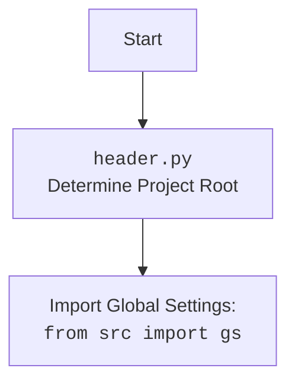

## Анализ конфигураций веб-драйверов

### 1. <алгоритм>

**Описание рабочего процесса:**

Этот документ описывает настройки различных веб-драйверов и парсеров, используемых в проекте. Каждый раздел соответствует отдельному инструменту и содержит описание его функциональности, основных настроек и пример конфигурации в формате JSON.

**Блок-схема:**

1.  **Firefox WebDriver**:
    *   Описывает настройки для работы с браузером Firefox.
    *   **Пример**:
        ```json
        {
          "options": ["--kiosk", "--headless"],
          "profile_directory": {
            "os": "%LOCALAPPDATA%\\\\Mozilla\\\\Firefox\\\\Profiles\\\\default",
            "internal": "webdriver\\\\firefox\\\\profiles\\\\default"
          },
          "executable_path": {
            "firefox_binary": "bin\\\\webdrivers\\\\firefox\\\\ff\\\\core-127.0.2\\\\firefox.exe",
            "geckodriver": "bin\\\\webdrivers\\\\firefox\\\\gecko\\\\33\\\\geckodriver.exe"
          },
          "headers": {
            "User-Agent": "Mozilla/5.0 (Windows NT 10.0; Win64; x64) AppleWebKit/537.36 (KHTML, like Gecko) Chrome/96.0.4664.110 Safari/537.36",
            "Accept": "text/html,application/xhtml+xml,application/xml;q=0.9,*/*;q=0.8"
          },
          "proxy_enabled": false
        }
        ```
    *   Описывает использование профилей, версий драйверов, пользовательского агента, прокси и опций запуска Firefox.

2.  **Chrome WebDriver**:
    *   Описывает настройки для работы с браузером Google Chrome.
    *   **Пример**:
        ```json
        {
          "options": ["--headless", "--disable-gpu"],
          "profile_directory": {
            "os": "%LOCALAPPDATA%\\\\Google\\\\Chrome\\\\User Data\\\\Default",
            "internal": "webdriver\\\\chrome\\\\profiles\\\\default"
          },
          "executable_path": {
            "chrome_binary": "bin\\\\webdrivers\\\\chrome\\\\125.0.6422.14\\\\chrome.exe",
            "chromedriver": "bin\\\\webdrivers\\\\chrome\\\\125.0.6422.14\\\\chromedriver.exe"
          },
          "headers": {
            "User-Agent": "Mozilla/5.0 (Windows NT 10.0; Win64; x64) AppleWebKit/537.36 (KHTML, like Gecko) Chrome/96.0.4664.110 Safari/537.36",
            "Accept": "text/html,application/xhtml+xml,application/xml;q=0.9,*/*;q=0.8"
          },
          "proxy_enabled": false
        }
        ```
    *   Описывает использование профилей, версий драйверов, пользовательского агента, прокси и опций запуска Chrome.

3.  **Edge WebDriver**:
    *   Описывает настройки для работы с браузером Microsoft Edge.
    *    **Пример**:
        ```json
        {
          "options": ["--headless", "--disable-gpu"],
          "profiles": {
            "os": "%LOCALAPPDATA%\\\\Microsoft\\\\Edge\\\\User Data\\\\Default",
            "internal": "webdriver\\\\edge\\\\profiles\\\\default"
          },
          "executable_path": {
            "edge_binary": "bin\\\\webdrivers\\\\edge\\\\123.0.2420.97\\\\edge.exe",
            "edgedriver": "bin\\\\webdrivers\\\\edge\\\\123.0.2420.97\\\\msedgedriver.exe"
          },
          "headers": {
            "User-Agent": "Mozilla/5.0 (Windows NT 10.0; Win64; x64) AppleWebKit/537.36 (KHTML, like Gecko) Chrome/96.0.4664.110 Safari/537.36 Edg/96.0.1054.62",
            "Accept": "text/html,application/xhtml+xml,application/xml;q=0.9,*/*;q=0.8"
          },
          "proxy_enabled": false
        }
        ```
    *   Описывает использование профилей, версий драйверов, пользовательского агента, прокси и опций запуска Edge.

4.  **Playwright Crawler**:
    *   Описывает настройки для работы с браузерами через библиотеку Playwright.
    *   **Пример**:
        ```json
        {
          "max_requests": 10,
          "headless": true,
          "browser_type": "chromium",
          "options": ["--disable-dev-shm-usage", "--no-sandbox"],
          "user_agent": "Mozilla/5.0 (Windows NT 10.0; Win64; x64) AppleWebKit/537.36 (KHTML, like Gecko) Chrome/96.0.4664.110 Safari/537.36",
          "proxy": {
            "enabled": false,
            "server": "http://proxy.example.com:8080",
            "username": "user",
            "password": "password"
          },
          "viewport": {
            "width": 1280,
            "height": 720
          },
          "timeout": 30000,
          "ignore_https_errors": false
        }
        ```
    *   Описывает использование типа браузера (`chromium`, `firefox`, `webkit`), опции запуска, пользовательский агент, прокси, размеры окна и другие параметры.

5.  **BeautifulSoup и XPath Parser**:
    *   Описывает настройки для парсинга HTML с использованием `BeautifulSoup` и `XPath`.
    *   **Пример**:
        ```json
        {
          "default_url": "https://example.com",
          "default_file_path": "file://path/to/your/file.html",
          "default_locator": {
            "by": "ID",
            "attribute": "element_id",
            "selector": "//*[@id='element_id']"
          },
          "logging": {
            "level": "INFO",
            "file": "logs/bs.log"
          },
          "proxy": {
            "enabled": false,
            "server": "http://proxy.example.com:8080",
            "username": "user",
            "password": "password"
          },
          "timeout": 10,
          "encoding": "utf-8"
        }
        ```
    *   Описывает параметры для загрузки HTML, локаторы для извлечения данных, настройки логирования, прокси и кодировки.

```mermaid
flowchart TD
    Start[Start] --> FirefoxConfig[Firefox WebDriver Configuration]
    FirefoxConfig --> ChromeConfig[Chrome WebDriver Configuration]
    ChromeConfig --> EdgeConfig[Edge WebDriver Configuration]
    EdgeConfig --> PlaywrightConfig[Playwright Crawler Configuration]
    PlaywrightConfig --> BeautifulSoupConfig[BeautifulSoup and XPath Parser Configuration]
     BeautifulSoupConfig --> End[End]
    
    subgraph Firefox WebDriver
        F1[profile_name]
        F2[geckodriver_version]
        F3[firefox_version]
        F4[user_agent]
        F5[proxy_file_path]
        F6[options]
         FirefoxConfig --> F1 & F2 & F3 & F4 & F5 & F6
    end
    
    subgraph Chrome WebDriver
        C1[profile_name]
        C2[chromedriver_version]
        C3[chrome_version]
        C4[user_agent]
        C5[proxy_file_path]
        C6[options]
         ChromeConfig --> C1 & C2 & C3 & C4 & C5 & C6
    end
    
    subgraph Edge WebDriver
        E1[profile_name]
        E2[edgedriver_version]
        E3[edge_version]
        E4[user_agent]
        E5[proxy_file_path]
         E6[options]
        EdgeConfig --> E1 & E2 & E3 & E4 & E5 & E6
    end
    
    subgraph Playwright Crawler
        P1[max_requests]
        P2[headless]
        P3[browser_type]
        P4[user_agent]
         P5[proxy]
        P6[viewport]
        P7[timeout]
         P8[ignore_https_errors]
        PlaywrightConfig --> P1 & P2 & P3 & P4 & P5 & P6 & P7 & P8
    end
    
    subgraph BeautifulSoup Parser
        B1[default_url]
        B2[default_file_path]
        B3[default_locator]
        B4[logging]
        B5[proxy]
         B6[timeout]
        B7[encoding]
        BeautifulSoupConfig --> B1 & B2 & B3 & B4 & B5 & B6 & B7
    end
    
```

### 2. <mermaid>





**Объяснение зависимостей `mermaid`:**

В данном коде нет импортов, так как он представляет собой описание настроек веб-драйверов в формате JSON.

### 3. <объяснение>

**Импорты:**

В коде импорты отсутствуют, поскольку документ является описанием JSON-конфигураций, а не исполняемым кодом.

**Классы:**

В данном коде нет классов.

**Функции:**

В данном коде нет функций.

**Переменные:**

Переменные в этом документе представляют собой ключи и значения JSON-объектов, определяющих настройки веб-драйверов и парсеров. Они описаны в каждом из разделов:

*   **Firefox WebDriver**:
    *   `options`: Список опций запуска Firefox (например, `"--kiosk"`, `"--headless"`).
    *   `profile_directory`: Словарь, содержащий пути к каталогу профиля Firefox.
        *   `os`: Путь для ОС.
        *   `internal`: Путь в рамках проекта.
    *   `executable_path`: Словарь, содержащий пути к исполняемым файлам Firefox и geckodriver.
         *   `firefox_binary`: Путь к бинарному файлу Firefox.
         *   `geckodriver`: Путь к бинарному файлу geckodriver.
    *   `headers`: Словарь HTTP-заголовков, включая `User-Agent` и `Accept`.
    *    `proxy_enabled`: Флаг, указывающий, включено ли использование прокси.

*   **Chrome WebDriver**:
    *   `options`: Список опций запуска Chrome (например, `"--headless"`, `"--disable-gpu"`).
    *   `profile_directory`: Словарь, содержащий пути к каталогу профиля Chrome.
        *   `os`: Путь для ОС.
        *   `internal`: Путь в рамках проекта.
    *  `executable_path`: Словарь, содержащий пути к исполняемым файлам Chrome и chromedriver.
         *   `chrome_binary`: Путь к бинарному файлу Chrome.
        *   `chromedriver`: Путь к бинарному файлу chromedriver.
    *  `headers`: Словарь HTTP-заголовков, включая `User-Agent` и `Accept`.
    *   `proxy_enabled`: Флаг, указывающий, включено ли использование прокси.

*   **Edge WebDriver**:
    *   `options`: Список опций запуска Edge (например, `"--headless"`, `"--disable-gpu"`).
    *  `profiles`: Словарь, содержащий пути к каталогу профиля Edge.
        *  `os`: Путь для ОС.
        *  `internal`: Путь в рамках проекта.
    *   `executable_path`: Словарь, содержащий пути к исполняемым файлам Edge и edgedriver.
         *   `edge_binary`: Путь к бинарному файлу Edge.
         *   `edgedriver`: Путь к бинарному файлу edgedriver.
    *   `headers`: Словарь HTTP-заголовков, включая `User-Agent` и `Accept`.
    *   `proxy_enabled`: Флаг, указывающий, включено ли использование прокси.

*   **Playwright Crawler**:
    *   `max_requests`: Максимальное количество запросов.
    *  `headless`: Режим безголового запуска браузера.
    *   `browser_type`: Тип браузера (`chromium`, `firefox`, `webkit`).
    *   `options`: Список опций запуска.
    *  `user_agent`: Пользовательский агент.
    *   `proxy`: Настройки прокси-сервера.
         *   `enabled`: Флаг, указывающий, включено ли использование прокси.
         *    `server`: Адрес прокси-сервера.
         *   `username`: Имя пользователя для прокси.
         *   `password`: Пароль для прокси.
    *   `viewport`: Размер окна браузера.
         *   `width`: Ширина окна.
         *    `height`: Высота окна.
    *   `timeout`: Тайм-аут для запросов.
    *  `ignore_https_errors`: Игнорировать ошибки HTTPS.

*   **BeautifulSoup и XPath Parser**:
    *   `default_url`: URL по умолчанию для загрузки HTML.
    *  `default_file_path`: Путь к файлу по умолчанию.
    *   `default_locator`: Локатор по умолчанию для извлечения элементов.
         *   `by`: Тип локатора (например, `ID`).
         *  `attribute`: Атрибут элемента.
        *   `selector`: Селектор для поиска элементов.
    *  `logging`: Настройки логирования.
        *    `level`: Уровень логирования.
        *    `file`: Путь к файлу логов.
    *  `proxy`: Настройки прокси-сервера.
         *    `enabled`: Флаг, указывающий, включено ли использование прокси.
         *   `server`: Адрес прокси-сервера.
         *    `username`: Имя пользователя для прокси.
         *    `password`: Пароль для прокси.
    *   `timeout`: Тайм-аут для запросов.
    *  `encoding`: Кодировка для чтения файлов или запросов.

**Потенциальные ошибки и области для улучшения:**

*   В документе отсутствуют конкретные инструкции по использованию этих конфигураций.
*   Нет обработки случаев, когда файл конфигурации отсутствует или имеет неверный формат.
*   Не описана валидация значений в конфигурациях.
*   Следует более четко описать взаимодействие конфигураций с кодом.
*   Следует добавить описание возможных типов `browser_type` для Playwright Crawler.
*   Можно добавить информацию о версиях библиотек и драйверов, которые могут быть использованы.
*   Можно добавить описание каждого ключа с вариантами использования (например, `options` и т.д.).

**Взаимосвязи с другими частями проекта:**

*   Данные конфигурации используются для инициализации веб-драйверов и парсеров в соответствующих модулях.
*   Конфигурации загружаются из файлов JSON и используются для настройки работы автоматизированных процессов.
*  Значения переменных из конфигураций передаются в `ExecuteLocator`, `Driver`, `Playwright` и другие классы.
*   Эти конфигурации являются неотъемлемой частью автоматизации, так как определяют параметры работы инструментов.

Этот анализ предоставляет детальное описание конфигураций веб-драйверов и парсеров, их параметров и назначения.