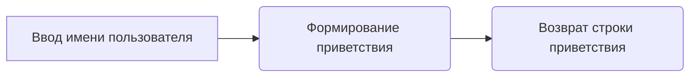

# Модуль для запуска Gradio-интерфейса
=================================================

Модуль содержит пример простого Gradio-интерфейса, который принимает текстовый ввод и возвращает приветствие.

## Обзор

Этот модуль демонстрирует создание и запуск простого Gradio-интерфейса для взаимодействия с пользователем. Он использует функцию `greet` для генерации приветствия на основе введенного имени.

## Подробней

Модуль `gradio.py` предоставляет базовый пример использования библиотеки Gradio для создания веб-интерфейса. Gradio позволяет быстро создавать интерактивные веб-приложения для машинного обучения и других задач. В данном случае, модуль создает интерфейс с текстовым полем для ввода имени и текстовым полем для вывода приветствия.

## Функции

### `greet`

```python
def greet(name: str) -> str:
    """
    Создает приветствие для заданного имени.

    Args:
        name (str): Имя, для которого нужно создать приветствие.

    Returns:
        str: Приветствие в формате "Hello " + name + "!".

    Example:
        >>> greet("World")
        'Hello World!'
    """
```

**Назначение**: Создание приветствия на основе введенного имени.

**Параметры**:
- `name` (str): Имя пользователя, которое будет использовано в приветствии.

**Возвращает**:
- `str`: Строка приветствия, содержащая "Hello " и имя пользователя.

**Как работает функция**:
1. Функция принимает имя пользователя в качестве входного параметра `name`.
2. Формирует строку приветствия, объединяя "Hello " с введенным именем и добавляя восклицательный знак.
3. Возвращает полученную строку приветствия.



**Примеры**:
```python
>>> greet("World")
'Hello World!'
>>> greet("Alice")
'Hello Alice!'
```

### `demo`

```python
demo = gr.Interface(fn=greet, inputs="text", outputs="text")
```

**Назначение**: Создание объекта `gr.Interface` для запуска Gradio-интерфейса.

**Параметры**:
- `fn`: Функция, которая будет вызываться при взаимодействии с интерфейсом (в данном случае, `greet`).
- `inputs`: Тип входных данных для интерфейса (в данном случае, "text").
- `outputs`: Тип выходных данных для интерфейса (в данном случае, "text").

**Как работает функция**:
1. Создается экземпляр класса `gr.Interface` с указанием функции `greet` в качестве обработчика входных данных.
2. Определяются типы входных и выходных данных как "text", что означает текстовое поле для ввода и вывода.

### `demo.launch()`

```python
demo.launch()
```

**Назначение**: Запуск Gradio-интерфейса.

**Как работает функция**:
1. Метод `launch()` запускает веб-сервер Gradio и открывает интерфейс в браузере.